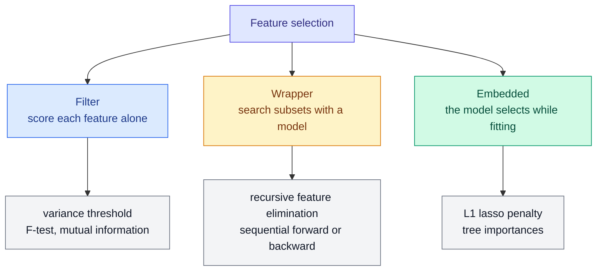

# Feature Selection: Filters, Wrappers, Embedded Methods and Importance

**Level:** 🟡 Intermediate → 🔴 Advanced &nbsp;|&nbsp; **Effort:** Detailed module &nbsp;|&nbsp; **Module:** [06 Feature Engineering](README.md)

---

## 🎯 Learning Objectives

By the end of this topic you will be able to:

- Demonstrate the most damaging selection mistake — selecting on all the data before cross-validating — and fix it
- Explain filter, wrapper and embedded selection methods, with scikit-learn examples of each
- Show why mutual information finds relationships that correlation and the F-test miss
- Compare selection methods on data where the true features are known, and measure how stable each choice is
- Decide when selecting features is worth it at all

## 📚 Prerequisites

- [Topic 1: Features and the Feature Pipeline](01-features-and-the-feature-pipeline.md)
- [Decision Trees and Random Forests](../05-machine-learning/05-decision-trees-and-random-forests.md) — impurity
  versus permutation importance, which this topic builds on rather than repeats
- [Regression](../05-machine-learning/03-regression.md) — lasso and why its zeros can be coincidental
- [Probability](../02-mathematics-for-ai/06-probability.md) — joint and marginal probability, which mutual information compares

```bash
pip install -r requirements.txt      # scikit-learn==1.5.2, numpy==2.1.3
```

---

## 🍰 1. The simple version

**Feature selection is deciding which questions not to ask.** Fewer features can mean a faster model, a
cheaper data pipeline, an explanation a person can follow, and — sometimes — better accuracy, because every
useless feature is another chance for the model to fit noise.

**It is also the easiest place in machine learning to fool yourself.** Search enough features and some will
look predictive by chance. If you pick them using the same data you then evaluate on, you will report
accuracy on pure noise — and this topic shows exactly how much.

## 🏠 2. Real-life analogy

> A detective with 5,000 facts about 100 suspects will always find 20 facts that happen to separate the
> guilty from the innocent — in *this* case. Build a theory from those 20 facts and it will "explain" the case
> perfectly and predict the next one no better than a coin.

**Where the analogy breaks down:** a good detective knows that is a danger. A selection algorithm does not; it
will cheerfully report its 20 features as the answer unless the evaluation around it is honest.

---

## ⚠️ 3. The mistake first: selecting before cross-validating

100 examples, 5,000 features of **pure random noise**, and **random labels**. Nothing can be predicted. The
honest accuracy is 50%.

```python
"""Selection on all the data, then cross-validation, reports skill on pure noise."""

import numpy as np
from sklearn.feature_selection import SelectKBest, f_classif
from sklearn.linear_model import LogisticRegression
from sklearn.model_selection import StratifiedKFold, cross_val_score
from sklearn.pipeline import make_pipeline

rng = np.random.default_rng(0)
X = rng.normal(size=(100, 5000))                          # 5,000 features of noise
y = rng.integers(0, 2, 100)                                # labels unrelated to anything
folds = StratifiedKFold(5, shuffle=True, random_state=0)

# WRONG: choose the 20 "best" features using every row, then cross-validate on those 20.
chosen = SelectKBest(f_classif, k=20).fit(X, y)
wrong = cross_val_score(LogisticRegression(), chosen.transform(X), y, cv=folds).mean()

# RIGHT: selection is a step inside the pipeline, redone on each training fold only.
right = cross_val_score(make_pipeline(SelectKBest(f_classif, k=20), LogisticRegression()), X, y, cv=folds).mean()

print(f"selection before cross-validation:  accuracy {wrong:.3f}")
print(f"selection inside cross-validation:  accuracy {right:.3f}")
print("the truth: labels are random, so 0.5 is the best any model can do")
```

**Output:**
```
selection before cross-validation:  accuracy 0.870
selection inside cross-validation:  accuracy 0.500
the truth: labels are random, so 0.5 is the best any model can do
```

**87% accuracy on data that contains no signal at all.** Among 5,000 random features, some correlate with 100
random labels by chance. Selecting them using all 100 rows means the validation folds helped choose the
features — the folds were no longer unseen. Inside the pipeline, selection is repeated on each training fold,
and the true answer, 50%, comes out.

This is the textbook example from *The Elements of Statistical Learning*, section 7.10.2, and it still appears
in published work. **The rule: any step that looks at the labels to choose features must run inside
cross-validation** — a `Pipeline` does it for you.

---

## ⚙️ 4. Three families of methods



| Family | How it works | Strength | Weakness | scikit-learn |
| --- | --- | --- | --- | --- |
| **Filter** | Scores each feature against the target, alone | Fast; model-independent | Blind to interactions and redundancy | `VarianceThreshold`, `SelectKBest` with `f_classif` or `mutual_info_classif` |
| **Wrapper** | Fits the model on candidate subsets, keeps the best | Accounts for the model and for redundancy | Slow; overfits the selection on small data | `RFE`, `RFECV`, `SequentialFeatureSelector` |
| **Embedded** | Selection happens during fitting | One fit; accounts for the model | Tied to one model family's view | `SelectFromModel` with lasso or a forest |

**Recursive feature elimination (RFE)** fits the model, drops the weakest feature (by coefficient size or
importance), refits, and repeats. **Sequential selection** adds (forward) or removes (backward) one feature at
a time, choosing by cross-validated score.

---

## 📐 5. Correlation misses what mutual information sees

The **F-test** and **Pearson correlation** measure *linear* association. **Mutual information** measures any
dependence at all:

$$
I(X; Y) = \sum_{x, y} p(x, y) \log \frac{p(x, y)}{p(x)\,p(y)}
$$

| Symbol | Means |
| --- | --- |
| $p(x, y)$ | How often feature value $x$ and target value $y$ occur together |
| $p(x)\,p(y)$ | How often they would occur together if they were independent |
| $I(X; Y)$ | 0 exactly when independent; larger when knowing $X$ tells you more about $Y$ |

For continuous features scikit-learn estimates it from nearest-neighbour distances, so it is noisy on small
samples — but it is not fooled by a curve.

```python
import numpy as np
from sklearn.feature_selection import f_regression, mutual_info_regression

rng = np.random.default_rng(0)
n = 2000
X = rng.uniform(-3, 3, size=(n, 4))
y = X[:, 0] + X[:, 1] ** 2 + np.sin(2 * X[:, 2]) + rng.normal(0, 0.5, n)

correlation = [np.corrcoef(X[:, j], y)[0, 1] for j in range(4)]
_, p_values = f_regression(X, y)
mutual_info = mutual_info_regression(X, y, random_state=0)

print(f"{'feature':<16}{'correlation':>12}{'F-test p':>12}{'mutual info':>13}")
for j, name in enumerate(["linear", "quadratic", "sine wave", "pure noise"]):
    print(f"{name:<16}{correlation[j]:>+12.3f}{p_values[j]:>12.2g}{mutual_info[j]:>13.3f}")
```

**Output:**
```
feature          correlation    F-test p  mutual info
linear                +0.546    4.1e-156        0.244
quadratic             -0.019        0.39        0.537
sine wave             -0.097     1.5e-05        0.066
pure noise            -0.008        0.73        0.000
```

**The quadratic feature is the strongest in the data** — mutual information ranks it first, at 0.537 — **and
the correlation filter would throw it away**: correlation −0.019, p-value 0.39. A U-shaped relationship has
no linear trend. Any correlation-based filter, including the F-test and `SelectKBest(f_regression)`, is blind
to it.

The sine feature is weak on both measures here, and the noise feature scores exactly zero mutual information.
**Use mutual information when relationships may be non-linear; use the F-test when you need speed and
expect linear effects.**

---

## 🔬 6. Six methods, one dataset with a known answer

Real data never tells you which features truly matter. This synthetic dataset does: five real features with
decreasing strength (1.5, 1.0, 0.7, 0.4, 0.2), **a near-copy of the strongest one**, and 24 noise features.
Each method is asked for five.

```python
"""Six selection methods, on data where the true features are known."""

import warnings
from functools import partial

import numpy as np
from sklearn.ensemble import RandomForestClassifier
from sklearn.feature_selection import (RFE, SelectFromModel, SelectKBest, SequentialFeatureSelector, f_classif,
                                       mutual_info_classif)
from sklearn.linear_model import LogisticRegression
from sklearn.model_selection import StratifiedKFold, cross_val_score
from sklearn.pipeline import make_pipeline
from sklearn.preprocessing import StandardScaler

warnings.filterwarnings("ignore")

rng = np.random.default_rng(0)
n = 300
real = rng.normal(size=(n, 5))
strength = np.array([1.5, 1.0, 0.7, 0.4, 0.2])
y = (rng.random(n) < 1 / (1 + np.exp(-(real @ strength)))).astype(int)
twin = real[:, [0]] + rng.normal(0, 0.3, (n, 1))                    # a near-copy of the strongest feature
X = np.column_stack([real, twin, rng.normal(size=(n, 24))])        # 0-4 real, 5 the twin, 6-29 noise

folds = StratifiedKFold(5, shuffle=True, random_state=0)
logistic = LogisticRegression(max_iter=2000)
selectors = {
    "filter: F-test": SelectKBest(f_classif, k=5),
    "filter: mutual info": SelectKBest(partial(mutual_info_classif, random_state=0), k=5),
    "wrapper: RFE": RFE(LogisticRegression(max_iter=2000), n_features_to_select=5),
    "wrapper: forward": SequentialFeatureSelector(LogisticRegression(max_iter=2000), n_features_to_select=5, cv=3),
    "embedded: L1 lasso": SelectFromModel(LogisticRegression(penalty="l1", C=0.05, solver="liblinear")),
    "embedded: forest": SelectFromModel(RandomForestClassifier(random_state=0), max_features=5, threshold=-np.inf),
}


def describe(columns):
    labels = {0: "r0", 1: "r1", 2: "r2", 3: "r3", 4: "r4", 5: "twin"}
    return " ".join(labels.get(c, "noise") for c in columns)


print(f"{'all 30 features':<22}{'':<34}{cross_val_score(make_pipeline(StandardScaler(), logistic), X, y, cv=folds).mean():.3f}")
print(f"{'the 5 true features':<22}{'r0 r1 r2 r3 r4':<34}"
      f"{cross_val_score(make_pipeline(StandardScaler(), logistic), X[:, :5], y, cv=folds).mean():.3f}")
for name, selector in selectors.items():
    kept = np.flatnonzero(selector.fit(StandardScaler().fit_transform(X), y).get_support())
    score = cross_val_score(make_pipeline(StandardScaler(), selector, logistic), X, y, cv=folds).mean()
    print(f"{name:<22}{describe(kept):<34}{score:.3f}")
```

**Output:**
```
all 30 features                                         0.777
the 5 true features   r0 r1 r2 r3 r4                    0.813
filter: F-test        r0 r1 r2 r3 twin                  0.770
filter: mutual info   r0 r2 r4 twin noise               0.733
wrapper: RFE          r0 r1 r2 r3 twin                  0.800
wrapper: forward      r0 r1 noise noise noise           0.783
embedded: L1 lasso    r0 r1 r2 r3 twin                  0.770
embedded: forest      r0 r1 r2 twin noise               0.773
```

The middle column shows what each method kept when fitted on all the data; the score is cross-validated with
selection inside the pipeline.

**Every method kept the twin over the weakest real feature, r4.** The twin carries r0's signal, so to a method
scoring features by association it looks strong — even though, next to r0, it adds almost nothing. Filters
cannot see redundancy at all.

**Forward selection kept three noise features.** With 300 rows and 3-fold scoring inside each step, adding a
noise feature sometimes improves the cross-validated score by luck, and a greedy search takes it. **Wrapper
methods overfit the selection itself on small data.**

**No method matched the true feature set (0.813), and only RFE clearly beat keeping all 30 (0.777).** With a
reasonably regularised linear model, 24 noise features cost only a few points. **Selection is often more
valuable for cost, speed and explanation than for accuracy.**

### How stable is the choice?

A selected feature set is a statistic computed from one sample, and it varies like one. Rerun RFE on 30
bootstrap resamples of the same data:

```python
import warnings

import numpy as np
from sklearn.feature_selection import RFE
from sklearn.linear_model import LogisticRegression
from sklearn.preprocessing import StandardScaler

warnings.filterwarnings("ignore")

rng = np.random.default_rng(0)
n = 300
real = rng.normal(size=(n, 5))
strength = np.array([1.5, 1.0, 0.7, 0.4, 0.2])
y = (rng.random(n) < 1 / (1 + np.exp(-(real @ strength)))).astype(int)
twin = real[:, [0]] + rng.normal(0, 0.3, (n, 1))
X = StandardScaler().fit_transform(np.column_stack([real, twin, rng.normal(size=(n, 24))]))

times_selected = np.zeros(30, dtype=int)
distinct_sets = set()
resample = np.random.default_rng(1)
for _ in range(30):
    rows = resample.integers(0, n, n)                             # a bootstrap sample
    kept = RFE(LogisticRegression(max_iter=2000), n_features_to_select=5).fit(X[rows], y[rows]).get_support()
    times_selected += kept
    distinct_sets.add(tuple(np.flatnonzero(kept)))

print("times selected in 30 resamples")
for index, name in enumerate(["r0 (strength 1.5)", "r1 (strength 1.0)", "r2 (strength 0.7)",
                              "r3 (strength 0.4)", "r4 (strength 0.2)", "twin of r0"]):
    print(f"  {name:<20}{times_selected[index]:>3}")
print(f"  {'any of 24 noise':<20}{times_selected[6:].sum():>3}  (across {(times_selected[6:] > 0).sum()} different noise features)")
print(f"\ndistinct feature sets chosen: {len(distinct_sets)} in 30 runs")
```

**Output:**
```
times selected in 30 resamples
  r0 (strength 1.5)    27
  r1 (strength 1.0)    30
  r2 (strength 0.7)    30
  r3 (strength 0.4)    27
  r4 (strength 0.2)    10
  twin of r0           20
  any of 24 noise       6  (across 5 different noise features)

distinct feature sets chosen: 8 in 30 runs
```

**Eight different "best five" sets from the same data.** Strong features are chosen almost every time. The
weak real feature is chosen a third of the time, and noise sneaks in occasionally. Even r0, the
strongest feature, was left out three times — its twin can stand in for it.

**Report selection frequency, not one selected set.** A feature chosen in 30 of 30 resamples is a robust
finding; one chosen in 10 of 30 is not, whether or not it happened to make today's list. Selecting on
bootstrap samples and keeping features above a frequency threshold is known as **stability selection**.

---

## 📏 7. Importance is not the same as selection

**Feature importance** ranks features by how much a fitted model relies on them. [Decision Trees and Random
Forests](../05-machine-learning/05-decision-trees-and-random-forests.md) showed its two main traps: impurity
importance credits noise, and permutation importance hides correlated features — 21 of 30 real tumour
measurements scored zero there because their near-duplicates covered for them.

For selection that has a direct consequence. **Dropping every feature with low permutation importance can
remove a whole correlated group at once**: each member looked unimportant only because the others were still
there. Two remedies:

- **Permute correlated groups together**, or cluster features by correlation and keep one per cluster — see
  scikit-learn's multicollinear permutation importance example in the references.
- **Drop, refit and measure.** After removing features, re-evaluate on held-out data. The score, not the
  importance ranking, is the evidence.

Explaining individual predictions — SHAP values and similar — belongs to
[27 Explainable AI](../27-explainable-ai/README.md).

---

## 🏭 8. Production: why selection pays off anyway

| Benefit | Why it matters in production |
| --- | --- |
| **Fewer upstream dependencies** | Every feature is a pipeline that can break, be delayed or change meaning |
| **Lower serving cost and latency** | Some features need a database lookup or an API call per request |
| **Smaller attack and privacy surface** | Each personal-data feature must be justified, protected and retained lawfully |
| **Easier monitoring** | Fewer distributions to watch for drift |
| **Explanation** | A model on 12 features can be reviewed; one on 400 cannot |

**Measure a feature's cost as well as its lift.** A feature that adds 0.2 points of accuracy but needs a
new real-time data feed is rarely worth it. Feature stores ([Topic 7](07-leakage-hunting-and-features-in-production.md))
make usage visible, which is how dead features get found and removed.

## ⚠️ 9. Common mistakes

| Mistake | Why it happens | Fix |
| --- | --- | --- |
| Selecting on all data, then cross-validating | Selection feels like "preprocessing" | Pure noise scored 87%; put selection in the `Pipeline` |
| Correlation filter for non-linear effects | Correlation is familiar | The strongest feature had correlation −0.019; use mutual information |
| Trusting one selected set | It is the output of the function | 8 different sets in 30 resamples; report frequencies |
| Forward selection on small data | It sounds thorough | It kept 3 noise features |
| Dropping all low-importance features at once | The ranking looks decisive | Correlated groups hide each other; drop, refit, measure |
| Expecting selection to raise accuracy | Intuition | Only one of six methods clearly beat using all features |

## 🔐 10. Security note

Feature selection is a good moment for **data minimisation**, a principle in many privacy regulations: collect
and keep only the personal data you need. If a feature derived from sensitive attributes contributes nothing
measurable, removing it lowers risk. Conversely, **removing a protected attribute does not remove its
influence** if correlated proxies remain — postcode, name, browsing patterns. That is a fairness question, not
a selection one; see [26 Responsible AI](../26-responsible-ai/README.md), and for regulatory obligations
consult current regulations and qualified counsel.

---

## 🎤 11. Interview questions

<details>
<summary><b>Q1: What goes wrong if you select features on the full dataset and then cross-validate?</b></summary>

The labels of the validation folds influenced which features were chosen, so the folds are no longer unseen and
the score is optimistic. With many candidate features and few rows it can be wildly so: in the example, 5,000
noise features and random labels scored 87% instead of the true 50%. The fix is to make selection a step in a
`Pipeline` so that it is refitted on each training fold, and to use nested cross-validation if the number of
features selected is itself tuned.
</details>

<details>
<summary><b>Q2: Compare filter, wrapper and embedded methods.</b></summary>

Filters score each feature against the target independently — variance, F-test, mutual information. They are
fast and model-agnostic but blind to redundancy and interactions. Wrappers such as recursive feature elimination
and sequential selection search subsets using the model's performance; they account for redundancy but are
expensive and can overfit the selection on small data — forward selection kept three noise features in the
example. Embedded methods select during training, such as lasso's zero coefficients or tree importances; they
are efficient but inherit the model's biases, for example lasso choosing arbitrarily between correlated
features.
</details>

<details>
<summary><b>Q3: When is mutual information better than correlation for feature screening?</b></summary>

When relationships may be non-linear or non-monotonic. Correlation and the F-test measure only linear
association: a quadratic feature, the strongest in the example, had correlation −0.019 and would have been
discarded, while mutual information ranked it first. The costs are that mutual information on continuous data
is estimated, so it is noisy with few samples and depends on the estimator's settings, and it still scores
features one at a time, so it cannot see redundancy.
</details>

<details>
<summary><b>Q4 (scenario): A stakeholder asks for "the ten features that drive churn" from your model. What do you give them?</b></summary>

A carefully caveated answer. Selection and importance rankings are unstable — in the example, eight different
top-five sets came from resampling the same data — so report how often each feature is selected across
bootstrap resamples, group correlated features rather than listing near-duplicates separately, and show held-out
evidence for the claimed importance. Most importantly, say that importance describes what the model uses, not
what causes churn; causal claims need the methods in [25 Causal AI](../25-causal-ai/README.md).
</details>

---

## ✅ Key takeaways

- **Selection belongs inside cross-validation.** Outside it, pure noise scored 87%.
- **Filters** are fast and blind to redundancy; **wrappers** see redundancy and overfit on small data;
  **embedded** methods inherit their model's view.
- **Mutual information catches non-linear relationships** that correlation misses entirely.
- **Every method preferred a redundant twin to a weak real feature**, and selected sets varied: 8 different sets
  in 30 resamples. Report selection frequency.
- Selection's biggest payoff is usually **cost, simplicity and monitoring**, not accuracy.

---

## 📚 Official References

- [scikit-learn: Feature selection — scikit-learn developers](https://scikit-learn.org/stable/modules/feature_selection.html) — verified 2026-09-18
- [scikit-learn: mutual_info_classif — scikit-learn developers](https://scikit-learn.org/stable/modules/generated/sklearn.feature_selection.mutual_info_classif.html) — verified 2026-09-18
- [scikit-learn: Recursive feature elimination with cross-validation, example — scikit-learn developers](https://scikit-learn.org/stable/auto_examples/feature_selection/plot_rfe_with_cross_validation.html) — verified 2026-09-18
- [scikit-learn: Permutation importance with multicollinear or correlated features, example — scikit-learn developers](https://scikit-learn.org/stable/auto_examples/inspection/plot_permutation_importance_multicollinear.html) — verified 2026-09-18
- [scikit-learn: Common pitfalls and recommended practices — scikit-learn developers](https://scikit-learn.org/stable/common_pitfalls.html) — verified 2026-09-18
- [The Elements of Statistical Learning, book site — Hastie, Tibshirani and Friedman](https://hastie.su.domains/ElemStatLearn/) — verified 2026-09-18; section 7.10.2 is "The Wrong and Right Way to Do Cross-validation"

---

## 🔗 Navigation

[← Topic 5: Text, Image and Domain Features](05-text-image-and-domain-features.md) &nbsp;|&nbsp;
[🏠 Module Home](README.md) &nbsp;|&nbsp;
[Topic 7: Leakage Hunting and Features in Production →](07-leakage-hunting-and-features-in-production.md)
