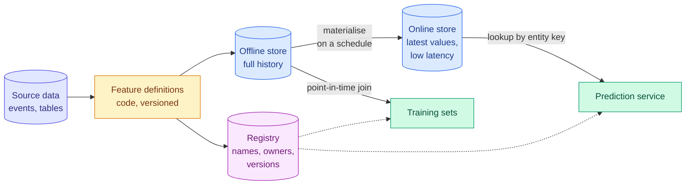

# Leakage Hunting and Features in Production

**Level:** 🔴 Advanced → 🟣 Production &nbsp;|&nbsp; **Effort:** Detailed module &nbsp;|&nbsp; **Module:** [06 Feature Engineering](README.md)

---

## 🎯 Learning Objectives

By the end of this topic you will be able to:

- Name the ways feature engineering itself creates leakage, beyond the leakage types you already know
- Run three automatic leak detectors: a single-feature scan, a future-perturbation test and adversarial validation
- Explain what each detector catches and — just as important — what it misses
- Describe the parts of a feature store: registry, offline store, online store and materialisation
- Monitor features in production with the population stability index (PSI), null rates and freshness

## 📚 Prerequisites

- [Lineage, Versioning, Privacy and Leakage](../03-data-foundations/05-lineage-versioning-privacy-and-leakage.md) — **read
  first**: the leakage taxonomy, target, group and temporal leakage, and the leakage checklist
- [Synthetic Data, Augmentation and Feature Stores](../03-data-foundations/07-synthetic-data-augmentation-and-feature-stores.md) —
  train/serve skew, point-in-time joins, and when you do not need a feature store
- Topics [3](03-encoding-categorical-features.md), [4](04-crosses-polynomial-and-date-time-features.md) and
  [6](06-feature-selection-and-importance.md) of this module — each showed one engineering leak

```bash
pip install -r requirements.txt      # scikit-learn==1.5.2, pandas==2.2.3, numpy==2.1.3
```

---

## 🍰 1. The simple version

**Module 03 taught you to ask of every feature: "would I know this at the moment I need the prediction?"**
That question is necessary, and not enough. Leaks are rarely typed in on purpose; they appear when a
reasonable-looking feature is computed in a way that quietly includes the answer. This module has already
produced four:

| Leak | Where it came from | What it did |
| --- | --- | --- |
| Target encoding with in-sample means | [Topic 3](03-encoding-categorical-features.md) | A noise ID dropped test AUC from 0.734 to 0.554 |
| `TargetEncoder.fit().transform()` | [Topic 3](03-encoding-categorical-features.md) | The same leak, from a correct-looking API call |
| A rolling window that includes today | [Topic 4](04-crosses-polynomial-and-date-time-features.md) | Backtest error 37% too low, undetected by the split |
| Selection before cross-validation | [Topic 6](06-feature-selection-and-importance.md) | Pure noise scored 87% |

**You cannot review your way out of this.** Features multiply, get reused and are rewritten by people who
never saw the original. What scales is **tests**: automatic checks that fail when a feature leaks, run every
time the feature pipeline changes. This topic builds three, then follows features into production.

## 🏠 2. Real-life analogy

> A school cannot stop cheating by asking every student whether they cheated. It uses procedures that make
> cheating detectable: separate exam versions, a comparison of answers that are suspiciously identical, a
> check of whether a student's score jumped implausibly. Each catches a different kind, and none catches all.

**Where the analogy breaks down:** a leaking feature is not trying to hide. That makes the detectors below
more reliable than a cheating check — but only for the leak types they were designed to see.

---

## 🔍 3. Detector 1: score every feature alone

**If one feature, by itself, predicts the target almost perfectly, it is far more likely a leak than a
discovery.** Fit a tiny model on each feature alone and flag any that score implausibly well.

```python
"""Detector 1: score every feature on its own. A single feature that predicts too well is a bug report."""

import numpy as np
import pandas as pd
from sklearn.metrics import roc_auc_score
from sklearn.model_selection import cross_val_score, train_test_split
from sklearn.tree import DecisionTreeClassifier

rng = np.random.default_rng(0)
n = 3000
frame = pd.DataFrame({
    "tenure_months": rng.integers(1, 72, n),
    "monthly_charge": rng.normal(60, 20, n).round(2),
    "support_calls_90d": rng.poisson(1.5, n),
    "plan_changes": rng.poisson(0.3, n),
    "postcode": rng.integers(0, 400, n),
})
logit = -1.0 - 0.03 * frame["tenure_months"] + 0.35 * frame["support_calls_90d"] + 0.01 * frame["monthly_charge"]
frame["churned"] = (rng.random(n) < 1 / (1 + np.exp(-logit))).astype(int)

# Two engineered features, each computed from a table that already contained the outcome.
frame["days_since_last_login"] = np.where(frame["churned"] == 1, rng.integers(20, 90, n), rng.integers(0, 30, n))
frame["postcode_churn_rate"] = frame.groupby("postcode")["churned"].transform("mean")

features = [c for c in frame.columns if c not in ("churned", "postcode")]
print(f"{'feature, alone':<24}{'cross-validated AUC':>20}")
for column in features:
    auc = cross_val_score(DecisionTreeClassifier(max_depth=3, random_state=0), frame[[column]],
                          frame["churned"], cv=5, scoring="roc_auc").mean()
    print(f"{column:<24}{auc:>20.3f}{'  <- investigate' if auc > 0.8 else ''}")

# The subtle one passed the scan. Recompute it honestly: rates from training rows only.
train, test = train_test_split(frame, test_size=0.3, random_state=0)
honest_rate = test["postcode"].map(train.groupby("postcode")["churned"].mean()).fillna(train["churned"].mean())
print(f"\npostcode_churn_rate on test rows, computed from all rows:      "
      f"AUC {roc_auc_score(test['churned'], test['postcode_churn_rate']):.3f}")
print(f"postcode_churn_rate on test rows, computed from training rows: "
      f"AUC {roc_auc_score(test['churned'], honest_rate):.3f}")
```

**Output:**
```
feature, alone           cross-validated AUC
tenure_months                          0.655
monthly_charge                         0.535
support_calls_90d                      0.589
plan_changes                           0.491
days_since_last_login                  0.974  <- investigate
postcode_churn_rate                    0.715

postcode_churn_rate on test rows, computed from all rows:      AUC 0.707
postcode_churn_rate on test rows, computed from training rows: AUC 0.489
```

ROC AUC is 0.5 for guessing and 1.0 for a perfect ranking.

**The scan caught the blatant leak.** `days_since_last_login` was extracted from an activity table after
customers had already left, so churned customers show long gaps. An AUC of 0.974 from one feature, when the
genuine drivers score 0.6, is a bug report.

**It missed the subtle one.** `postcode_churn_rate` — each postcode's churn rate, computed over a table that
included the rows being predicted — scored 0.715: plausible, better than tenure, exactly the kind of number
that gets celebrated. It is [Topic 3's](03-encoding-categorical-features.md) in-sample target encoding under a
different name. Recomputed honestly, from training rows only, it scores **0.489 — no signal at all.**

**What the scan is good for:** a fast first pass on every new dataset. **What it misses:** leaks that are
diluted, spread across features, or only moderately strong. Any feature computed with a `groupby` over data
that contains the target needs the honest recomputation, not just a scan.

---

## ⏩ 4. Detector 2: change the future, and check that the past does not move

For anything computed over time, there is a precise test: **a feature's value at time $t$ must not change when
you change any data after $t$** — and, for a feature used to predict the value at $t$, it must not change when
you change the value at $t$ itself.

```python
"""Detector 2: a feature at time t must not change when you change anything after t."""

import numpy as np
import pandas as pd


def centred_mean(series):
    return series.rolling(7, center=True, min_periods=1).mean()


def mean_ending_today(series):
    return series.rolling(7, min_periods=1).mean()


def mean_ending_yesterday(series):
    return series.shift(1).rolling(7, min_periods=1).mean()


def expanding_zscore(series):
    past = series.shift(1)
    return (past - past.expanding().mean()) / past.expanding().std()


def global_zscore(series):
    return (series - series.mean()) / series.std()


def reads_future(feature, series, cutoff, trials=20, seed=0):
    """True if the feature at or before `cutoff` changes when only values after `cutoff` change."""
    rng = np.random.default_rng(seed)
    before = feature(series).loc[:cutoff]
    later = series.index > cutoff
    for _ in range(trials):
        altered = series.copy()
        altered[later] = rng.normal(0, 100, int(later.sum()))
        if not np.allclose(before, feature(altered).loc[:cutoff], equal_nan=True):
            return True
    return False


def reads_target(feature, series, cutoff):
    """True if the feature AT `cutoff` changes when only the value at `cutoff` - the target - changes."""
    altered = series.copy()
    altered.loc[cutoff] += 1000.0
    return not np.isclose(feature(series).loc[cutoff], feature(altered).loc[cutoff], equal_nan=True)


rng = np.random.default_rng(1)
days = pd.date_range("2026-01-01", periods=200, freq="D")
sales = pd.Series(100 + rng.normal(0, 5, len(days)).cumsum(), index=days)
cutoff = days[150]

print(f"{'feature':<24}{'reads the future':>18}{'reads the target':>18}")
for feature in [centred_mean, mean_ending_today, mean_ending_yesterday, expanding_zscore, global_zscore]:
    print(f"{feature.__name__:<24}{str(reads_future(feature, sales, cutoff)):>18}"
          f"{str(reads_target(feature, sales, cutoff)):>18}")
```

**Output:**
```
feature                   reads the future  reads the target
centred_mean                          True              True
mean_ending_today                    False              True
mean_ending_yesterday                False             False
expanding_zscore                     False             False
global_zscore                         True              True
```

**Two features are safe, and the test proves it rather than trusting a code review.** It also caught the
subtlest leak in the list: `global_zscore` looks like harmless standardisation, but it uses the mean and
standard deviation of the **whole** series — including every future value. Normalising "by the dataset's
statistics" is one of the most common ways future information reaches a time-based feature. The honest
version, `expanding_zscore`, uses only statistics of the past.

**Make this a unit test.** Every time-based feature function gets a test that perturbs the future and asserts
the past is unchanged. It runs in milliseconds and catches the leak the moment someone "simplifies" a
feature. **What it misses:** leaks that are not about time — a target mean over groups, a feature from a
system that records outcomes.

---

## ⚖️ 5. Detector 3: adversarial validation

**Train a classifier to tell your training data apart from the data the model will actually see** — the test
set, or last week's production traffic. If it cannot (AUC near 0.5), the two look alike. If it can, something
differs, and the classifier's most useful features say what.

Paired with it, the **population stability index (PSI)** compares one feature's distribution between a
reference sample and a new one.

### 📐 The population stability index

$$
\text{PSI} = \sum_{i=1}^{B} (a_i - e_i) \ln\frac{a_i}{e_i}
$$

| Symbol | Means |
| --- | --- |
| $B$ | Number of bins, usually 10 quantile bins of the reference distribution |
| $e_i$ | Share of the **reference** (training) sample in bin $i$ |
| $a_i$ | Share of the **new** sample in bin $i$ |
| PSI | 0 when the shares match; grows as they diverge |

A widely used industry rule of thumb — a convention from credit scoring, not a statistical law — reads PSI
below 0.1 as stable, 0.1 to 0.25 as worth investigating, and above 0.25 as a significant shift. Set your own
thresholds from the history of your features.

```python
"""Detector 3: adversarial validation finds that something changed; PSI finds which feature."""

import numpy as np
import pandas as pd
from sklearn.ensemble import HistGradientBoostingClassifier
from sklearn.metrics import roc_auc_score
from sklearn.model_selection import cross_val_predict

rng = np.random.default_rng(0)


def customers(n, app_release=False):
    return pd.DataFrame({
        "age": rng.normal(40, 12, n),
        "monthly_spend": rng.lognormal(3.8, 0.5, n),
        "sessions_per_week": rng.poisson(6, n),
        # After an app release, pages are counted per screen view, not per page load.
        "pages_per_session": rng.normal(9.0 if app_release else 5.0, 1.5, n),
    })


def adversarial_auc(reference, candidate):
    """How well can a model tell the two samples apart? 0.5 means indistinguishable."""
    combined = pd.concat([reference, candidate], ignore_index=True)
    is_candidate = np.r_[np.zeros(len(reference)), np.ones(len(candidate))]
    scores = cross_val_predict(HistGradientBoostingClassifier(random_state=0), combined, is_candidate,
                               cv=5, method="predict_proba")[:, 1]
    return roc_auc_score(is_candidate, scores)


def psi(expected, actual, bins=10):
    """Population stability index over quantile bins of the reference distribution."""
    edges = np.unique(np.quantile(expected, np.linspace(0, 1, bins + 1)))
    edges[0], edges[-1] = -np.inf, np.inf
    e = np.clip(np.histogram(expected, edges)[0] / len(expected), 1e-6, None)
    a = np.clip(np.histogram(actual, edges)[0] / len(actual), 1e-6, None)
    return float(np.sum((a - e) * np.log(a / e)))


training = customers(4000)
next_month = customers(4000)
after_release = customers(4000, app_release=True)

print(f"adversarial AUC, training vs next month:     {adversarial_auc(training, next_month):.3f}")
print(f"adversarial AUC, training vs after release:  {adversarial_auc(training, after_release):.3f}")

print(f"\n{'PSI per feature':<22}{'next month':>12}{'after release':>15}")
for column in training.columns:
    print(f"{column:<22}{psi(training[column], next_month[column]):>12.3f}"
          f"{psi(training[column], after_release[column]):>15.3f}")
```

**Output:**
```
adversarial AUC, training vs next month:     0.505
adversarial AUC, training vs after release:  0.964

PSI per feature         next month  after release
age                          0.008          0.004
monthly_spend                0.009          0.004
sessions_per_week            0.002          0.005
pages_per_session            0.007          6.190
```

**Next month looked like training: adversarial AUC 0.505**, every PSI under 0.01. **After the app release, a
classifier told the two apart 96% of the time** — and PSI pinned it on one feature, `pages_per_session`, at
6.19. Nothing about customers changed; the *definition* of a page did. The model would have kept predicting,
confidently, from a feature whose meaning had shifted.

**The two tools answer different questions.** Adversarial validation asks "is anything different, including
combinations of features?" PSI asks "which single feature moved, and how far?" Use both.

**Adversarial validation also finds leaks.** If your training and test sets were supposed to come from the
same process and a classifier separates them easily, the split is not doing what you think — a time or group
structure leaked into one side, or preprocessing differed.

### What each detector catches

| Detector | Catches | Misses | When to run |
| --- | --- | --- | --- |
| Single-feature scan | Blatant target leaks | Diluted leaks; group-mean leaks of moderate strength | Every new dataset |
| Future-perturbation test | Any time-based feature reading the future or its own target | Leaks unrelated to time | Unit test for every time feature |
| Honest recomputation | Group statistics that include the row's own target | Nothing it is applied to — but only if you apply it | Every `groupby` over labelled data |
| Adversarial validation | Train/test mismatch, distribution shift, split bugs | Leaks present equally in both sets | Before training; on a schedule in production |
| Final check: a later time period | Almost everything above | Nothing, if it is truly untouched | Before any launch |

**The last row is the one that matters most.** Keep a genuinely untouched, later slice of data, compute its
features with the production code path, and evaluate once. Every leak in this module would have shown up there
as a gap between offline and "future" performance.

---

## 🏪 6. Features in production: the feature store

[Module 03](../03-data-foundations/07-synthetic-data-augmentation-and-feature-stores.md) explained the two
problems feature stores solve — **train/serve skew** and **point-in-time correctness** — and when a shared
Python module is enough. Here is what the platform version consists of, for when you outgrow the module.



| Component | What it does | Why it matters |
| --- | --- | --- |
| **Feature definition** | The code that computes a feature from source data, written once | One definition for training and serving removes skew |
| **Registry** | A catalogue: name, description, owner, version, entity key, source | Features are found and reused instead of rewritten; dead ones can be found |
| **Offline store** | Full history of feature values with timestamps, usually in a data warehouse or lake | Training sets are built with point-in-time joins |
| **Online store** | The latest value per entity, in a low-latency key-value store | Prediction services look features up in milliseconds |
| **Materialisation** | A scheduled job copying fresh values from offline to online | Defines **freshness** — how stale a served value can be |
| **Time to live (TTL)** | How long a served value stays valid | Stops a model silently using a value from last month when updates stop |

**Open-source and managed options exist** — Feast is a widely used open-source feature store, and the major
cloud machine learning platforms offer managed ones ([33 Cloud AI Platforms](../33-cloud-ai-platforms/README.md)).
Product capabilities change often; read the current documentation rather than relying on comparisons.
**Adopt one when several models share features or serving needs low-latency lookups — not before.**

### 🔢 Feature versioning

A feature definition changes: a bug fix, a new window length, a new data source. **Never change a feature's
meaning under the same name.** Models trained on the old definition would silently receive the new one — the
app-release example above, caused by your own team. Version it (`spend_30d_v2`), backfill history for
training, migrate models deliberately, and retire the old version when nothing reads it.

---

## 📈 7. Monitoring features in production

Labels usually arrive late — you learn whether a customer churned months after the prediction. **Feature
monitoring is the early warning**, and many model failures are visible in the inputs first.

| Signal | What it catches | Example alert |
| --- | --- | --- |
| **PSI or another distribution distance** per feature | Upstream definition changes, population shift | PSI above your threshold for a day |
| **Null rate** | A broken join, a dropped field, a failing source | Null share doubles relative to training |
| **Out-of-range and unseen-category rate** | Unit changes, new product lines, invalid input | Unseen categories exceed 5% of traffic |
| **Freshness** | A stalled materialisation job | Online values older than their TTL |
| **Training/serving parity** | Skew between the two code paths | Replayed requests differ from offline values |
| **Prediction distribution** | Everything above, aggregated | Share of positive predictions moves sharply |

**Monitoring is owned by the next modules:** alerting, dashboards and retraining pipelines are in
[29 MLOps](../29-mlops/README.md); metric choice in [07 Model Evaluation](../07-model-evaluation/README.md).

---

## ⚠️ 8. Common mistakes

| Mistake | Why it happens | Fix |
| --- | --- | --- |
| Treating a feature that scores 0.97 alone as a discovery | It looks like insight | Treat it as a leak until proven otherwise |
| Trusting the scan to catch all leaks | It caught the obvious one | The postcode rate passed at 0.715 and was worthless |
| Standardising time-series features with whole-series statistics | Standard preprocessing habit | Expanding statistics of the past only |
| Changing a feature's definition under the same name | Seems like a harmless fix | Version it; one release moved PSI to 6.19 |
| Monitoring only model accuracy | Accuracy is the goal | Labels arrive late; watch the features |
| Adopting a feature store for one batch model | It is best practice at large companies | A shared feature module is enough until it is not |

## 🔐 9. Security note

- **Feature stores concentrate sensitive data.** The online store holds current values for every customer,
  keyed by identifier, readable at high speed — an attractive target. Apply least-privilege access per feature,
  encrypt at rest and in transit, and audit reads.
- **Poisoned inputs become poisoned features.** If users can influence a source — reviews, clicks, reported
  values — they can shift aggregate features that many models consume. Monitor for sudden shifts from a small
  number of entities, and see [28 AI Security](../28-ai-security/README.md).
- **Retention applies to features too.** Deleting a person's raw data but keeping their derived features in
  the offline store may not satisfy a deletion request; include feature stores in data-deletion workflows. For
  the legal requirements that apply to you, consult current regulations and qualified counsel.

---

## 🧪 10. Hands-on lab: a leakage test suite

Build `tests/test_feature_leakage.py`-style checks for a small feature pipeline of your own:

1. Write four time-based feature functions over a daily series, including one you believe is safe and one
   deliberately leaky. Add the future-perturbation test for each, and confirm it fails exactly for the leaky one.
2. Add a group-mean feature (for example, average outcome per store) and a test that recomputes it from
   training rows only and asserts the held-out AUC does not drop by more than a tolerance.
3. Add an adversarial-validation check between a chronological train and test split, and make it fail when you
   deliberately shuffle before splitting.
4. Write down, for each test, one leak it would **not** catch.

**Done when** each test fails on its deliberately broken feature and passes on the fixed one, and your notes
name a gap in every test.

---

## 🎤 11. Interview questions

<details>
<summary><b>Q1: How would you systematically check a feature pipeline for leakage?</b></summary>

Several complementary checks, because each misses something. Scan single-feature predictive power and
investigate anything implausibly strong. For time-based features, test that perturbing future values does not
change past feature values. Recompute any group statistic of the target from training rows only and compare.
Run adversarial validation between training and evaluation data. Finally, evaluate once on a later, untouched
period with features computed by the production code path. Automate the first three as tests in the feature
pipeline's continuous integration.
</details>

<details>
<summary><b>Q2: What is adversarial validation?</b></summary>

Label training rows 0 and evaluation or production rows 1, and train a classifier to tell them apart. An AUC
near 0.5 means the two are indistinguishable; a high AUC means their distributions differ, and the classifier's
important features show where. It detects distribution shift and split problems, including multivariate shifts
that per-feature statistics miss. In the example, an app release changed how pages were counted: adversarial
AUC rose from 0.505 to 0.964, and PSI located the change in one feature.
</details>

<details>
<summary><b>Q3: What does a feature store provide, and when is it worth the cost?</b></summary>

One feature definition used for both training and serving, which removes train/serve skew; an offline store
with history for point-in-time-correct training sets; an online store for low-latency serving; a registry for
discovery, ownership and versioning; and materialisation with freshness guarantees. It is worth it when several
models share features, when serving needs real-time lookups, or when training and serving are built by different
teams. For a single batch model, a shared feature module and tests give most of the benefit.
</details>

<details>
<summary><b>Q4 (scenario): Model accuracy has not changed, but a feature's PSI jumped to 2.0 overnight. What do you do?</b></summary>

Treat it as an incident even though accuracy looks fine — labels arrive late, so accuracy may not have caught up.
Check whether the feature's definition, source or units changed — a deploy, a schema change, an upstream team's
release. Compare its raw values before and after, and see whether the shift is in all traffic or one segment. If
the meaning changed, the model is now reading a different feature: roll back the upstream change, or version the
feature and retrain. Then add an alert on this feature at an appropriate threshold if one did not exist.
</details>

---

## ✅ Key takeaways

- Feature engineering creates its own leaks — **group means, rolling windows, whole-series statistics,
  selection** — and review does not scale. **Tests do.**
- **Single-feature scan**: catches blatant leaks (0.974), missed a plausible one (0.715) that was pure leakage.
- **Future-perturbation test**: proves a time feature is safe; caught "harmless" global standardisation.
- **Adversarial validation** says *whether* data differs; **PSI** says *which feature*.
- A feature store is **one definition, two access paths**, plus a registry, materialisation and freshness.
- **Never change a feature's meaning under the same name**, and monitor features, not just accuracy.

---

## 📚 Official References

- [Feast: the Open Source Feature Store, introduction — Feast project](https://docs.feast.dev/) — verified 2026-09-18; community-maintained open-source project, and its documentation changes with each release
- [scikit-learn: Common pitfalls and recommended practices — scikit-learn developers](https://scikit-learn.org/stable/common_pitfalls.html) — verified 2026-09-18
- [Rules of Machine Learning — Google for Developers](https://developers.google.com/machine-learning/guides/rules-of-ml) — verified 2026-09-18; see the rules on training-serving skew and feature monitoring
- [pandas: Windowing operations — pandas developers](https://pandas.pydata.org/docs/user_guide/window.html) — verified 2026-09-18

---

## 🔗 Navigation

[← Topic 6: Feature Selection and Importance](06-feature-selection-and-importance.md) &nbsp;|&nbsp;
[🏠 Module Home](README.md) &nbsp;|&nbsp;
[Next module: 07 Model Evaluation →](../07-model-evaluation/README.md)
