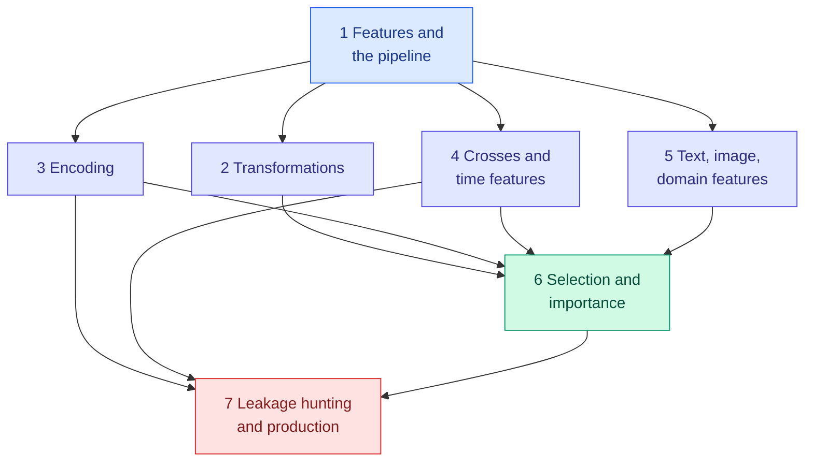

<!-- status: authored -->

# 06. Feature Engineering

**Level:** 🟡 Intermediate → 🔴 Advanced &nbsp;|&nbsp; **Effort:** Detailed module &nbsp;|&nbsp; **Status:** ✅ Complete

Turning raw columns into signal: transformation, encoding, construction, extraction and selection — and the
leakage traps that silently inflate your metrics.

> **The model is usually a well-understood algorithm; the advantage is in the features.** This module shows
> feature work paying off — a linear model going from chance to 93.5% with one product term — and shows it
> going wrong in ways that look like success: pure noise scoring 87%, a worthless feature scoring 0.715, a
> backtest 37% too optimistic. Every number is from code you can run.

---

## 🎯 Learning Objectives

By the end of this module you will be able to:

- Build a leakage-free feature pipeline for mixed column types with scikit-learn, and deploy it as one artefact
- Choose transformations and encodings from the model family and the feature's shape and cardinality
- Construct interactions, cyclical time features and lag features that do not read the future
- Extract features from text, images and domain knowledge, and know when learned representations win
- Select features honestly, measure how stable the choice is, and read importances without being misled
- Detect leakage with automatic tests, and monitor features in production

## 📚 Prerequisites

- [05 Machine Learning](../05-machine-learning/README.md) — the models these features feed
- [03 Data Foundations](../03-data-foundations/README.md) — especially
  [encoding](../03-data-foundations/04-encoding-and-data-validation.md),
  [leakage](../03-data-foundations/05-lineage-versioning-privacy-and-leakage.md) and
  [feature stores](../03-data-foundations/07-synthetic-data-augmentation-and-feature-stores.md), which this module
  builds on rather than repeats

```bash
pip install -r requirements.txt      # scikit-learn==1.5.2, pandas==2.2.3, numpy==2.1.3, scipy==1.14.1
```

Run the examples from the repository root — some read `datasets/samples/`.

---

## 📑 Topics

| # | Topic | Covers | Level |
| --- | --- | --- | --- |
| 1 | [Features and the Feature Pipeline](01-features-and-the-feature-pipeline.md) | Selection, extraction, transformation, construction; scaling by model family; `ColumnTransformer`; refitting at serve time | 🟡 |
| 2 | [Transformations: Log, Power, Quantile and Binning](02-transformations-log-power-and-binning.md) | Box-Cox, Yeo-Johnson, quantile, bins, splines; transforming the target and correcting its bias | 🟡 |
| 3 | [Encoding Categorical Features](03-encoding-categorical-features.md) | One-hot, ordinal, frequency, cross-fitted target encoding, hashing; the `TargetEncoder` trap | 🟡 → 🔴 |
| 4 | [Crosses, Polynomial and Date-Time Features](04-crosses-polynomial-and-date-time-features.md) | Interactions, the polynomial explosion, cyclical encodings, rolling windows that leak | 🟡 |
| 5 | [Text, Image and Domain Features](05-text-image-and-domain-features.md) | TF-IDF, n-grams and negation, shift-sensitive pixels, distance as a domain feature | 🟡 |
| 6 | [Feature Selection and Importance](06-feature-selection-and-importance.md) | Selection leakage, filters, wrappers, embedded methods, mutual information, stability | 🟡 → 🔴 |
| 7 | [Leakage Hunting and Features in Production](07-leakage-hunting-and-features-in-production.md) | Three automatic leak detectors, adversarial validation, PSI, feature stores, versioning, monitoring | 🔴 → 🟣 |

---

## 🗺️ How the pieces fit



**Topic 1 is the frame**: every later technique is a step in a fitted pipeline. **Topics 2–5 create
features**, each for a different kind of raw data. **Topic 6 removes them.** **Topic 7 collects the leaks the
earlier topics exposed** and turns catching them into automatic tests.

**What this module deliberately does not repeat:** one-hot versus label encoding, unseen categories and
leave-one-out target encoding are in [Encoding and Data Validation](../03-data-foundations/04-encoding-and-data-validation.md);
scalers and the log back-transform bias in [Cleaning](../03-data-foundations/03-cleaning-missing-duplicates-outliers.md);
impurity versus permutation importance in [Decision Trees and Random Forests](../05-machine-learning/05-decision-trees-and-random-forests.md);
evaluation metrics and cross-validation strategy are owned by [07 Model Evaluation](../07-model-evaluation/README.md).

---

## 🧭 Which topics do you actually need?

| If you are | Read |
| --- | --- |
| New to feature engineering | All seven, in order |
| Building a tabular model at work | 1, 3, 6, 7 |
| Working with time-stamped data | 1, 4, 7 |
| Working with text or images before deep learning | 5, then [10 NLP](../10-natural-language-processing/README.md) or [09 Computer Vision](../09-computer-vision/README.md) |
| Running models in production | 1, 7 |
| Preparing for interviews | 3, 6, 7 — the leakage questions come up constantly |

---

## 🧪 Every example is verified

Each code block was executed and shows its **real** output, enforced in continuous integration:

```bash
python scripts/check_examples.py --strict 06-feature-engineering/
```

Some of the results contradict common advice, and that is the point:

- **Scaling moved an SVM from 66% to 98% and left a random forest's score exactly unchanged.**
- **Refitting a scaler on each request made a classifier return the same class for every input.**
- **A log target fitted better — and forecast total spend 26% too low.**
- **Naive target encoding of a pure-noise ID dropped test AUC below having no ID at all**, and scikit-learn's
  `TargetEncoder` leaks the same way if you call `fit` then `transform`.
- **Sine and cosine hour features fell short on a two-peak day**; a periodic spline with 6 columns matched 24 one-hot columns.
- **Selecting features before cross-validation scored 87% on random labels.**
- **The strongest feature in a dataset had a correlation of −0.019.**

## 📝 Practice

- Quiz: [`quizzes/06-feature-engineering.md`](../quizzes/06-feature-engineering.md)
- Answers: [`quizzes/answers/06-feature-engineering.md`](../quizzes/answers/06-feature-engineering.md)
- Assignments: [`assignments/06-feature-engineering.md`](../assignments/06-feature-engineering.md)

---

## ⚠️ The five mistakes this module exists to prevent

1. **Fitting anything outside the pipeline.** Scalers, encoders, selectors and target means are fitted
   parameters; fitted on all the data, they leak.
2. **Applying the same feature recipe to every model.** Linear models need shape, scale and explicit
   interactions; trees need almost none of it.
3. **Computing features with information the prediction will not have** — the row's own target, the future,
   whole-dataset statistics.
4. **Believing one selected feature set or importance ranking.** They vary between resamples; report how often.
5. **Monitoring the model and not its features.** A feature's meaning can change overnight while accuracy,
   waiting on late labels, looks fine.

---

## 📚 Official References

- [scikit-learn: Preprocessing data — scikit-learn developers](https://scikit-learn.org/stable/modules/preprocessing.html) — verified 2026-09-18
- [scikit-learn: Pipelines and composite estimators — scikit-learn developers](https://scikit-learn.org/stable/modules/compose.html) — verified 2026-09-18
- [scikit-learn: Feature selection — scikit-learn developers](https://scikit-learn.org/stable/modules/feature_selection.html) — verified 2026-09-18
- [scikit-learn: Common pitfalls and recommended practices — scikit-learn developers](https://scikit-learn.org/stable/common_pitfalls.html) — verified 2026-09-18
- [Rules of Machine Learning — Google for Developers](https://developers.google.com/machine-learning/guides/rules-of-ml) — verified 2026-09-18

---

## 🔗 Navigation

[← 05 Machine Learning](../05-machine-learning/README.md) &nbsp;|&nbsp;
[🏠 Repository Home](../README.md) &nbsp;|&nbsp;
[Topic 1: Features and the Feature Pipeline →](01-features-and-the-feature-pipeline.md)

**Next module:** [07 Model Evaluation](../07-model-evaluation/README.md)
