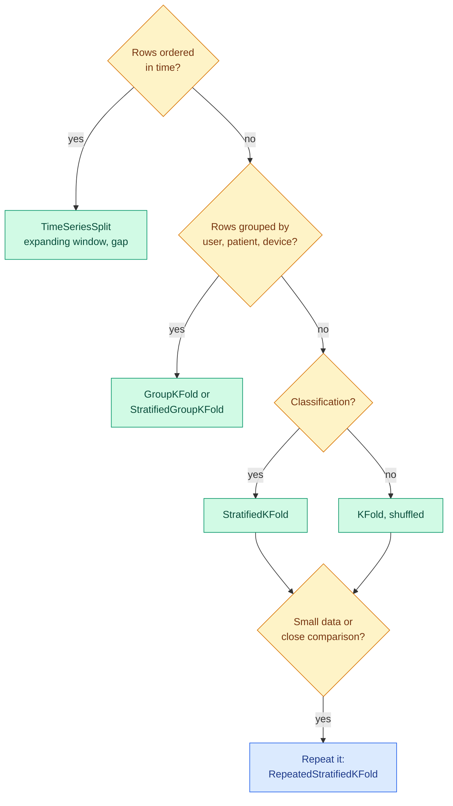

# Cross-Validation and Comparing Models

**Level:** 🟡 Intermediate → 🔴 Advanced &nbsp;|&nbsp; **Effort:** Detailed module &nbsp;|&nbsp; **Module:** [07 Model Training and Evaluation](README.md)

---

## 🎯 Learning Objectives

By the end of this topic you will be able to:

- Show how much a single train/test split's score varies, and why one split is not a measurement
- Run k-fold, stratified, repeated and time-series cross-validation, and pick the right one
- Report a cross-validated score with its uncertainty
- Compare two models on the same folds — and explain why an ordinary t-test on fold scores is badly overconfident
- Build time-series validation with expanding windows and a gap

## 📚 Prerequisites

- [Splits, Sampling and Class Imbalance](../03-data-foundations/06-splits-sampling-and-class-imbalance.md) — **read first**:
  train/validation/test roles, stratification, grouped and chronological splits, and test-set sizing. This
  topic does not repeat them.
- [Hypothesis Testing](../02-mathematics-for-ai/08-hypothesis-testing-and-ab-testing.md) — p-values and the t-test
- [Classification](../05-machine-learning/04-classification.md)

```bash
pip install -r requirements.txt      # scikit-learn==1.5.2, scipy==1.14.1, numpy==2.1.3
```

---

## 🍰 1. The simple version

**A score from one test set is one sample, not a fact.** Shuffle the data differently and the same model can
look noticeably better or worse. If you compare two models on one split, you may be comparing two lucky
draws.

**Cross-validation** takes several samples: split the data into $k$ parts, train on $k-1$, test on the one left
out, and rotate until every part has been the test set once. You get $k$ scores — and their spread tells you
how much to trust the average.

## 🏠 2. Real-life analogy

> Judging a restaurant from a single meal is a gamble: maybe the chef was off, maybe you ordered the one
> great dish. Five meals on five different nights tell you far more — including how *consistent* the
> kitchen is.

**Where the analogy breaks down:** the five cross-validation "meals" are not independent. Every training set
shares most of its rows with every other, which is why comparing models needs more care than averaging scores
(section 5).

---

## 🎲 3. One split is one sample

```python
"""The same model, the same data, 200 different random splits."""

import warnings

import numpy as np
from sklearn.datasets import load_breast_cancer
from sklearn.linear_model import LogisticRegression
from sklearn.model_selection import StratifiedKFold, cross_val_score, train_test_split
from sklearn.pipeline import make_pipeline
from sklearn.preprocessing import StandardScaler

warnings.filterwarnings("ignore")

X, y = load_breast_cancer(return_X_y=True)
model = make_pipeline(StandardScaler(), LogisticRegression())

split_scores = []
for seed in range(200):
    X_train, X_test, y_train, y_test = train_test_split(X, y, test_size=0.2, random_state=seed, stratify=y)
    split_scores.append(model.fit(X_train, y_train).score(X_test, y_test))
split_scores = np.array(split_scores)
print(f"200 single 80/20 splits:  lowest {split_scores.min():.3f}, highest {split_scores.max():.3f}, "
      f"standard deviation {split_scores.std():.3f}")

folds = cross_val_score(model, X, y, cv=StratifiedKFold(5, shuffle=True, random_state=0))
print(f"one 5-fold run:           folds {np.round(folds, 3)}, mean {folds.mean():.3f} +/- {folds.std():.3f}")

means = [cross_val_score(model, X, y, cv=StratifiedKFold(5, shuffle=True, random_state=s)).mean()
         for s in range(30)]
print(f"30 reshuffled 5-fold runs: means from {min(means):.3f} to {max(means):.3f}")
```

**Output:**
```
200 single 80/20 splits:  lowest 0.939, highest 1.000, standard deviation 0.013
one 5-fold run:           folds [0.956 0.974 0.982 1.    0.982], mean 0.979 +/- 0.014
30 reshuffled 5-fold runs: means from 0.972 to 0.984
```

**The same model scored anywhere from 93.9% to 100% depending only on which 114 rows landed in the test set.**
Report "100% accuracy" from the lucky split and you have reported noise. The five folds of one
cross-validation run spread from 95.6% to 100% — the same noise, now visible.

**Averaging folds narrows the uncertainty but does not remove it.** Thirty reshuffled 5-fold runs gave means
from 97.2% to 98.4%. A difference of one point between two models on this dataset is inside that range.

**Report the mean and the spread**, for example "0.979 ± 0.014 over 5 folds". For more stable estimates on
small data, **repeated cross-validation** (`RepeatedStratifiedKFold`) runs k-fold several times with different
shuffles and averages everything.

---

## ⚙️ 4. Choosing the cross-validation scheme



| Scheme | What each fold's test set is | Use when |
| --- | --- | --- |
| `KFold(shuffle=True)` | A random $1/k$ of rows | Independent rows, regression |
| `StratifiedKFold` | A random $1/k$ with class proportions kept | Classification — the default |
| `GroupKFold` | Whole groups, never split across train and test | Several rows per user, patient or device |
| `TimeSeriesSplit` | A later block; training is everything before it | Anything ordered in time |
| `RepeatedStratifiedKFold` | Several stratified k-folds with different shuffles | Small data; close comparisons |
| `LeaveOneOut` | One row | Tiny datasets only — high variance, expensive |

**How many folds?** 5 or 10 are the usual choices. More folds train on more data (less pessimistic) but cost
more and give noisier individual fold scores. The difference rarely matters as much as choosing the right
*kind* of split.

### ⏳ Time series: the future is not a random sample

A series with a trend and a weekly cycle, predicted from its own lags by a random forest.

```python
import numpy as np
import pandas as pd
from sklearn.ensemble import RandomForestRegressor
from sklearn.model_selection import KFold, TimeSeriesSplit, cross_val_score

rng = np.random.default_rng(0)
t = np.arange(1000)
series = 50 + 0.05 * t + 5 * np.sin(2 * np.pi * t / 7) + np.cumsum(rng.normal(0, 1, 1000)) * 0.3
frame = pd.DataFrame({"y": series})
for lag in (1, 2, 7):
    frame[f"lag_{lag}"] = frame["y"].shift(lag)
frame = frame.dropna()
X, y = frame.drop(columns="y"), frame["y"]

model = RandomForestRegressor(n_estimators=100, random_state=0)
print(f"{'scheme':<28}{'MAE per fold':<36}{'mean':>6}")
for name, cv in [("shuffled 5-fold", KFold(5, shuffle=True, random_state=0)),
                 ("time series split, gap 7", TimeSeriesSplit(5, gap=7))]:
    errors = -cross_val_score(model, X, y, cv=cv, scoring="neg_mean_absolute_error")
    print(f"{name:<28}{str(np.round(errors, 2)):<36}{errors.mean():>6.2f}")

print("\nfolds of TimeSeriesSplit(5, gap=7, test_size=100) - row ranges:")
for train, test in TimeSeriesSplit(5, gap=7, test_size=100).split(X):
    print(f"  train {train.min()}-{train.max():<4} gap  test {test.min()}-{test.max()}")
```

**Output:**
```
scheme                      MAE per fold                          mean
shuffled 5-fold             [0.56 0.55 0.53 0.64 0.62]            0.58
time series split, gap 7    [1.02 2.09 2.27 2.03 1.22]            1.73

folds of TimeSeriesSplit(5, gap=7, test_size=100) - row ranges:
  train 0-485  gap  test 493-592
  train 0-585  gap  test 593-692
  train 0-685  gap  test 693-792
  train 0-785  gap  test 793-892
  train 0-885  gap  test 893-992
```

MAE is the mean absolute error, in the series' units ([Topic 5](05-regression-metrics.md)).

**Shuffled k-fold reported an error three times too small.** With shuffling, every test row is surrounded
by training rows from just before and just after it, and the forest interpolates. Forecasting means
predicting *past the end* of what you have seen, where a forest cannot follow the trend
([Parametric and Instance-Based Models](../05-machine-learning/02-parametric-and-instance-based-models.md)).
Only the time-series split measured that.

**The gap** leaves 7 rows unused between each training block and its test block, so features built from recent
history cannot straddle the boundary. Set it to at least the longest lag or window you use.

---

## ⚖️ 5. Comparing two models honestly

The right comparison uses **the same folds for both models** and looks at the **per-fold differences**. The
trap is the next step: testing those differences with an ordinary paired t-test.

### 📐 Why fold scores are not independent

In 5-fold cross-validation, any two training sets share 75% of their rows. Fold scores are therefore
positively correlated, and the ordinary t-test — which assumes independent samples — underestimates the
variance of the mean difference. **Nadeau and Bengio's corrected resampled t-test** inflates the variance to
account for it:

$$
t = \frac{\bar{d}}{\sqrt{\left(\dfrac{1}{J} + \dfrac{n_{\text{test}}}{n_{\text{train}}}\right)\hat{\sigma}^2_d}}
$$

| Symbol | Means |
| --- | --- |
| $\bar{d}$ | Mean difference in score between the two models, over all folds |
| $\hat{\sigma}^2_d$ | Sample variance of the per-fold differences |
| $J$ | Number of folds evaluated in total (folds × repeats) |
| $n_{\text{test}} / n_{\text{train}}$ | Test-to-train size ratio — $1/4$ for 5-fold. The correction term |

The ordinary test uses only $1/J$. With many repeats $1/J$ shrinks towards zero — so the ordinary test becomes
ever more "certain" simply because you ran more repeats of the same data. The correction term does not shrink.

```python
"""Two models on the same 50 folds: the naive t-test and the corrected one disagree completely."""

import warnings

import numpy as np
from scipy import stats
from sklearn.datasets import load_breast_cancer
from sklearn.ensemble import RandomForestClassifier
from sklearn.linear_model import LogisticRegression
from sklearn.model_selection import RepeatedStratifiedKFold, cross_val_score
from sklearn.pipeline import make_pipeline
from sklearn.preprocessing import StandardScaler

warnings.filterwarnings("ignore")

X, y = load_breast_cancer(return_X_y=True)
folds = RepeatedStratifiedKFold(n_splits=5, n_repeats=10, random_state=0)      # 50 folds, identical for both
logistic = cross_val_score(make_pipeline(StandardScaler(), LogisticRegression()), X, y, cv=folds)
forest = cross_val_score(RandomForestClassifier(n_estimators=50, random_state=0), X, y, cv=folds)

differences = logistic - forest
J = len(differences)
naive_t = differences.mean() / np.sqrt(differences.var(ddof=1) / J)
corrected_t = differences.mean() / np.sqrt((1 / J + 1 / 4) * differences.var(ddof=1))

print(f"logistic regression {logistic.mean():.3f}, random forest {forest.mean():.3f}, "
      f"mean difference {differences.mean():+.3f}")
print(f"logistic ahead on {(differences > 0).sum()} folds, behind on {(differences < 0).sum()}, "
      f"tied on {(differences == 0).sum()}")
print(f"naive paired t-test:  p = {2 * stats.t.sf(abs(naive_t), J - 1):.1e}")
print(f"corrected t-test:     p = {2 * stats.t.sf(abs(corrected_t), J - 1):.3f}")
```

**Output:**
```
logistic regression 0.977, random forest 0.960, mean difference +0.017
logistic ahead on 38 folds, behind on 8, tied on 4
naive paired t-test:  p = 1.6e-08
corrected t-test:     p = 0.072
```

**The naive test claims near-certainty; the corrected test does not even reach the conventional 0.05.** Both
see logistic regression ahead — it won 38 of 50 folds, by 1.7 points on average. They disagree about *how sure*
you can be, by six orders of magnitude. The naive p-value is not a measurement of the evidence; it is an artefact of
treating 50 overlapping folds as 50 independent experiments.

**In practice:** report the mean difference with the per-fold spread, use the corrected test if you need a
p-value, and prefer an **effect size you care about** over a significance verdict — a 1.7-point accuracy gain
may or may not be worth a model that is harder to explain. If the comparison is close and data allows, confirm
on a fresh held-out set.

---

## 🏭 6. Production notes

- **Cross-validation estimates the modelling procedure**, not the final model. The model you ship is refitted
  on all training data; its performance is estimated by the cross-validated score of the *procedure*.
- **Test the split you will face.** If production scores new customers, validate on customers the model never
  saw (`GroupKFold`); if it forecasts, validate on the future (`TimeSeriesSplit`). The wrong scheme can report
  errors three times too small, as above.
- **Compute cost scales with folds × repeats × configurations.** For expensive models, a single well-designed
  validation split plus a final test can be the pragmatic choice — say so when you report it.
- **After launch, the real validation is online**: shadow deployment and A/B tests
  ([Hypothesis Testing](../02-mathematics-for-ai/08-hypothesis-testing-and-ab-testing.md), [29 MLOps](../29-mlops/README.md)).

## ⚠️ 7. Common mistakes

| Mistake | Why it happens | Fix |
| --- | --- | --- |
| Reporting one split's score | It is quick | The same model ranged from 93.9% to 100% |
| Reporting a mean with no spread | The spread looks untidy | "0.979 ± 0.014 over 5 folds" |
| Shuffled k-fold on time series | It is the default | Error was understated threefold; use `TimeSeriesSplit` with a gap |
| Different folds for the two models being compared | Separate scripts | Pass the same `cv` object to both |
| Naive t-test on fold scores | It is the textbook paired test | Folds overlap; p went from 1.6e-08 to 0.072 with the correction |
| Choosing hyperparameters with the same folds you report | Convenient | Nested cross-validation ([Topic 2](02-hyperparameter-search.md)) |

## 🔐 8. Security note

Evaluation data is a target. If an attacker or a careless process can write to the data used for validation,
they can make a bad model look good. Keep evaluation sets versioned and read-only, record their hashes with each
reported score, and keep them separate from any data collected from users who could influence it
([Lineage and Versioning](../03-data-foundations/05-lineage-versioning-privacy-and-leakage.md)).

---

## 🎤 9. Interview questions

<details>
<summary><b>Q1: Why use cross-validation instead of a single train/test split?</b></summary>

A single split's score depends heavily on which rows land in the test set — the same model ranged from 93.9% to
100% over 200 splits of the breast cancer data. Cross-validation evaluates on every row once, gives $k$ scores
whose spread shows the uncertainty, and uses the data more efficiently. It still needs the right scheme:
stratified for classification, grouped for repeated entities, time-series splits for ordered data. A final
untouched test set is still valuable for a last, unbiased check.
</details>

<details>
<summary><b>Q2: How do you compare two models' cross-validation results?</b></summary>

Evaluate both on exactly the same folds and look at the per-fold differences — their mean, spread, and how often
one wins. For a significance test, account for the overlap between training sets: a naive paired t-test on fold
scores is overconfident, because the folds are not independent. The corrected resampled t-test of Nadeau and
Bengio inflates the variance by $n_{\text{test}}/n_{\text{train}}$; in the example it moved p from 1.6e-08 to
0.072 — from "certain" to not significant. Then judge whether the difference is large enough to matter.
</details>

<details>
<summary><b>Q3: Why is shuffled k-fold wrong for time series?</b></summary>

It places test rows between training rows from just before and just after them, so the model interpolates rather
than forecasts, and features computed from recent history can overlap the test period. The estimate is
optimistic — threefold in the example (0.58 against 1.73). `TimeSeriesSplit` trains only on the past and tests on the following
block, and a gap stops lagged features straddling the boundary.
</details>

---

## ✅ Key takeaways

- **One split is one sample**: 93.9% to 100% for the same model.
- **Report mean ± spread** across folds; repeat cross-validation on small data.
- **Match the scheme to the data**: stratified, grouped, or time-series with a gap — shuffled k-fold understated a
  forecasting error threefold.
- **Compare models on the same folds**, and never trust a naive t-test on fold scores: the corrected test moved p
  from 1.6e-08 to 0.072.

---

## 📚 Official References

- [scikit-learn: Cross-validation, evaluating estimator performance — scikit-learn developers](https://scikit-learn.org/stable/modules/cross_validation.html) — verified 2026-09-18
- [scikit-learn: Statistical comparison of models using grid search, example — scikit-learn developers](https://scikit-learn.org/stable/auto_examples/model_selection/plot_grid_search_stats.html) — verified 2026-09-18; includes the corrected t-test
- [scikit-learn: TimeSeriesSplit — scikit-learn developers](https://scikit-learn.org/stable/modules/generated/sklearn.model_selection.TimeSeriesSplit.html) — verified 2026-09-18
- [Inference for the Generalization Error — Nadeau and Bengio, Machine Learning journal, Springer](https://link.springer.com/article/10.1023/A:1024068626366) — verified 2026-09-18

---

## 🔗 Navigation

[← Module home](README.md) &nbsp;|&nbsp;
[🏠 Repository Home](../README.md) &nbsp;|&nbsp;
[Topic 2: Hyperparameter Search →](02-hyperparameter-search.md)
