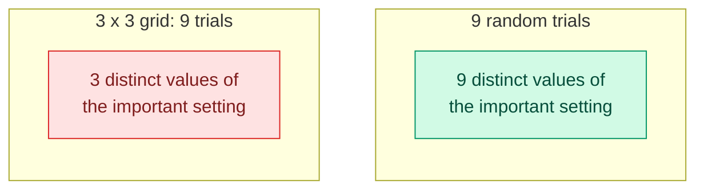
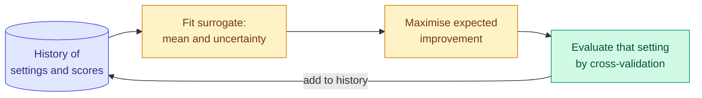
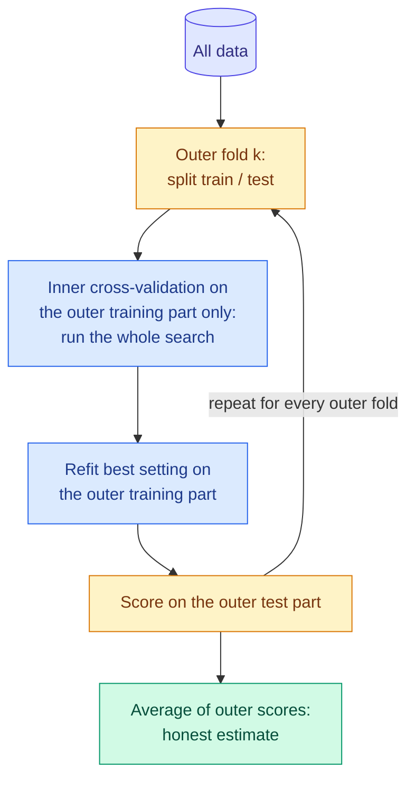

# Hyperparameter Search: Grid, Random, Bayesian and Nested Cross-Validation

**Level:** 🟡 Intermediate → 🔴 Advanced &nbsp;|&nbsp; **Effort:** Detailed module &nbsp;|&nbsp; **Module:** [07 Model Training and Evaluation](README.md)

---

## 🎯 Learning Objectives

By the end of this topic you will be able to:

- Distinguish parameters from hyperparameters, and say where each is chosen
- Explain why random search usually beats grid search for the same budget
- Explain Bayesian optimisation — a surrogate model plus an acquisition function — and build a small one
- Show that the best score from a search is optimistic, and estimate the real one with nested cross-validation
- Choose a search strategy from the budget and the number of hyperparameters

## 📚 Prerequisites

- [Topic 1: Cross-Validation and Comparing Models](01-cross-validation-and-comparing-models.md)
- [Boosting](../05-machine-learning/06-boosting.md) — the hyperparameters that matter for boosted trees
- [Probability](../02-mathematics-for-ai/06-probability.md) — normal distributions, for the acquisition function

```bash
pip install -r requirements.txt      # scikit-learn==1.5.2, scipy==1.14.1, numpy==2.1.3
```

---

## 🍰 1. The simple version

**Parameters** are learned from data by `fit`: a regression's coefficients, a tree's splits. **Hyperparameters**
are settings you choose before fitting: the learning rate, the tree depth, the regularisation strength.

**Hyperparameter search** tries settings, scores each one by cross-validation, and keeps the best. The three
questions are which settings to try, how many you can afford, and — the one most people skip — **how good the
winner really is**, given that you picked it for looking good.

## 🏠 2. Real-life analogy

> Tuning a guitar by trying every combination of peg positions on a fixed grid would take forever and still
> miss the right note between two grid points. A good musician turns the pegs that matter most, listens, and
> narrows in. That is the difference between grid search and a smarter search.

**Where the analogy breaks down:** a musician hears the true note. A search only hears a noisy
cross-validation score, and the setting that *sounds* best is partly best by luck — section 5.

---

## ⚙️ 3. Grid search and random search

**Grid search** tries every combination of listed values. **Random search** samples each hyperparameter from a
range, a fixed number of times.

**Why random usually wins:** in most models only a few hyperparameters matter much. A 3 × 3 grid spends nine
evaluations but tries only **three** values of the one that matters. Nine random draws try **nine**.



A validation-score surface where the learning rate matters a lot and a regularisation setting barely matters —
the shape Bergstra and Bengio found in practice. The surface is a formula, so the true best is known.

```python
"""Same budget of nine trials: a 3x3 grid against random search."""

import numpy as np


def validation_score(log_learning_rate, log_regularisation):
    """A known surface: the learning rate matters a lot, regularisation barely."""
    return 0.90 - 0.3 * (log_learning_rate + 1.1) ** 2 - 0.002 * (log_regularisation + 2) ** 2


grid = [(a, b) for a in np.linspace(-3, 0, 3) for b in np.linspace(-4, 0, 3)]
grid_best = max(validation_score(a, b) for a, b in grid)

rng = np.random.default_rng(0)
random_bests = np.array([
    max(validation_score(rng.uniform(-3, 0), rng.uniform(-4, 0)) for _ in range(9))
    for _ in range(1000)                                              # repeat random search 1,000 times
])

print(f"true best possible score:                 {validation_score(-1.1, -2):.3f}")
print(f"grid search, 9 trials:                    {grid_best:.3f}")
print(f"random search, 9 trials (average of 1000): {random_bests.mean():.3f}")
print(f"random search beat the grid in            {(random_bests > grid_best).mean():.1%} of runs")
print(f"learning-rate values the grid tried:      {sorted({float(a) for a, _ in grid})}")
```

**Output:**
```
true best possible score:                 0.900
grid search, 9 trials:                    0.852
random search, 9 trials (average of 1000): 0.886
random search beat the grid in            92.4% of runs
learning-rate values the grid tried:      [-3.0, -1.5, 0.0]
```

**The grid never tested a learning rate near the best one** (log value −1.1); its closest was −1.5. Six of
its nine trials were spent varying a setting that barely matters. Random search beat it in 92% of runs.

**Grid search still has a place:** one or two hyperparameters, a small discrete set of choices, or a need for a
reproducible, exhaustive table. Otherwise, start random — `RandomizedSearchCV` with distributions such as
`scipy.stats.loguniform` for scale-type settings like learning rates and regularisation strengths.

---

## 🧠 4. Bayesian optimisation

Random search ignores everything it has learned so far. **Bayesian optimisation** uses it:

1. Fit a **surrogate model** — usually a Gaussian process — to the (setting, score) pairs tried so far. It
   predicts a mean score *and an uncertainty* for every untried setting.
2. Choose the next setting with an **acquisition function** that balances trying where the predicted score is
   high (exploitation) against where the uncertainty is high (exploration).
3. Evaluate it, add it to the history, repeat.

### 📐 Expected improvement

The most common acquisition function asks: by how much do we expect this setting to beat the best score so far,
$f^*$?

$$
\text{EI}(x) = (\mu(x) - f^*)\,\Phi(z) + \sigma(x)\,\phi(z), \qquad z = \frac{\mu(x) - f^*}{\sigma(x)}
$$

| Symbol | Means |
| --- | --- |
| $\mu(x), \sigma(x)$ | The surrogate's predicted score and its uncertainty at setting $x$ |
| $f^*$ | The best score observed so far |
| $\Phi, \phi$ | The standard normal cumulative distribution and density |
| First term | Large where the prediction is already better than $f^*$ — exploitation |
| Second term | Large where the surrogate is unsure — exploration |



### 💻 Code example — Bayesian optimisation in 25 lines

Tuning the RBF kernel width `gamma` of a support vector machine (SVM). To keep the example fast, the real 5-fold
cross-validated accuracy is computed once at 61 values of `gamma` and interpolated in between; each search then
repeats 20 times from different random starts. **Teaching implementation** — see the production note below.

```python
"""Bayesian optimisation with a Gaussian process and expected improvement, against random search."""

import warnings

import numpy as np
from scipy.stats import norm
from sklearn.datasets import load_breast_cancer
from sklearn.gaussian_process import GaussianProcessRegressor
from sklearn.gaussian_process.kernels import ConstantKernel, Matern, WhiteKernel
from sklearn.model_selection import StratifiedKFold, cross_val_score
from sklearn.pipeline import make_pipeline
from sklearn.preprocessing import StandardScaler
from sklearn.svm import SVC

warnings.filterwarnings("ignore")

X, y = load_breast_cancer(return_X_y=True)
folds = StratifiedKFold(5, shuffle=True, random_state=0)
log_gammas = np.linspace(-5, 1, 61)
accuracies = np.array([cross_val_score(make_pipeline(StandardScaler(), SVC(C=10, gamma=10.0 ** g)), X, y,
                                       cv=folds).mean() for g in log_gammas])


def objective(log_gamma):
    return float(np.interp(log_gamma, log_gammas, accuracies))


def bayesian_search(budget, seed):
    rng = np.random.default_rng(seed)
    tried = list(rng.uniform(-5, 1, 3))                                  # three random starting points
    scores = [objective(g) for g in tried]
    candidates = np.linspace(-5, 1, 601).reshape(-1, 1)
    while len(tried) < budget:
        surrogate = GaussianProcessRegressor(ConstantKernel() * Matern(nu=2.5) + WhiteKernel(1e-4),
                                             normalize_y=True, random_state=0)
        surrogate.fit(np.array(tried).reshape(-1, 1), scores)
        mean, std = surrogate.predict(candidates, return_std=True)
        z = (mean - max(scores)) / np.maximum(std, 1e-9)
        expected_improvement = (mean - max(scores)) * norm.cdf(z) + std * norm.pdf(z)
        tried.append(float(candidates[expected_improvement.argmax(), 0]))
        scores.append(objective(tried[-1]))
    return max(scores)


def random_search(budget, seed):
    return max(objective(g) for g in np.random.default_rng(seed).uniform(-5, 1, budget))


print(f"best accuracy on the full curve: {accuracies.max():.4f}\n")
print(f"{'trials':>7}{'Bayesian: runs within 0.002':>30}{'random: runs within 0.002':>28}")
for budget in (5, 8, 12):
    bayes = np.array([bayesian_search(budget, s) for s in range(20)])
    rand = np.array([random_search(budget, s) for s in range(20)])
    print(f"{budget:>7}{(accuracies.max() - bayes < 0.002).sum():>24} of 20"
          f"{(accuracies.max() - rand < 0.002).sum():>22} of 20")
```

**Output:**
```
best accuracy on the full curve: 0.9842

 trials   Bayesian: runs within 0.002   random: runs within 0.002
      5                       2 of 20                     0 of 20
      8                      11 of 20                     1 of 20
     12                      18 of 20                     8 of 20
```

**With 8 trials, Bayesian optimisation got within 0.002 of the best in 11 of 20 runs; random search in 1.** At
12 trials it was 18 against 8. With only 5 trials — three of them random starting points — the method has barely
begun, and neither search usually gets there.

**What it costs:** fitting the surrogate after every trial, and trials that must run one after another rather
than all at once. It pays off when each trial is expensive — minutes or hours of training — and the number of
hyperparameters is modest. When trials are cheap and machines are many, running lots of random trials in
parallel can be as good in wall-clock time.

### Other strategies worth knowing

| Strategy | Idea | When |
| --- | --- | --- |
| **Successive halving / Hyperband** | Start many configurations on a small budget (few rows, few epochs); keep the best fraction; repeat with more budget | Many configurations, and early performance predicts final performance |
| **Tree-structured Parzen estimator (TPE)** | Model which settings produced good versus bad scores; sample from the good | Many hyperparameters, including conditional ones |
| **Early stopping inside each trial** | Stop training a configuration once validation stops improving | Iterative models: boosting, neural networks |

scikit-learn provides successive halving as `HalvingRandomSearchCV` (enabled through `sklearn.experimental`). For
TPE and more, the widely used open-source library Optuna is not pinned by this repository; its interface looks
like this.

<!-- check-examples: skip -->
```python
# Reference code - NOT executed by this repository (Optuna is not a pinned dependency).
import optuna
from sklearn.model_selection import cross_val_score


def objective(trial):
    params = {
        "learning_rate": trial.suggest_float("learning_rate", 1e-3, 0.3, log=True),
        "max_leaf_nodes": trial.suggest_int("max_leaf_nodes", 8, 128, log=True),
        "l2_regularization": trial.suggest_float("l2_regularization", 1e-6, 10.0, log=True),
    }
    return cross_val_score(HistGradientBoostingClassifier(**params), X, y, cv=5).mean()


study = optuna.create_study(direction="maximize")
study.optimize(objective, n_trials=50)
print(study.best_params)
```

---

## ⚠️ 5. The winner's score is optimistic: nested cross-validation

**Picking the best of many noisy scores selects for luck.** The best cross-validated score from a search is the
maximum of many estimates, and the maximum of noisy estimates is biased upwards — the same effect
[Splits and Sampling](../03-data-foundations/06-splits-sampling-and-class-imbalance.md) showed for test sets.

**Nested cross-validation** fixes it with two loops. The **inner** loop runs the whole search on the training part
of each outer fold. The **outer** loop scores the chosen model on data the search never saw. The outer average
estimates the performance of *the whole procedure, search included*.



```python
"""The best score from a search is optimistic. Nested cross-validation estimates what you will actually get."""

import warnings

import numpy as np
from sklearn.datasets import make_classification
from sklearn.model_selection import GridSearchCV, StratifiedKFold, cross_val_score
from sklearn.pipeline import make_pipeline
from sklearn.preprocessing import StandardScaler
from sklearn.svm import SVC

warnings.filterwarnings("ignore")

# 150 rows to work with, plus 5,000 more from the same process that play the role of "the future".
X_all, y_all = make_classification(n_samples=5150, n_features=40, n_informative=3, n_redundant=0,
                                   flip_y=0.2, class_sep=0.6, random_state=0)
X, y = X_all[:150], y_all[:150]
X_future, y_future = X_all[150:], y_all[150:]

grid = {"svc__C": np.logspace(-2, 3, 8), "svc__gamma": np.logspace(-4, 0, 6)}
pipeline = make_pipeline(StandardScaler(), SVC())
inner = StratifiedKFold(5, shuffle=True, random_state=0)
outer = StratifiedKFold(5, shuffle=True, random_state=1)

search = GridSearchCV(pipeline, grid, cv=inner).fit(X, y)
nested = cross_val_score(GridSearchCV(pipeline, grid, cv=inner), X, y, cv=outer).mean()

print(f"configurations tried:                         {len(search.cv_results_['params'])}")
print(f"best cross-validated score from the search:   {search.best_score_:.3f}")
print(f"nested cross-validation estimate:             {nested:.3f}")
print(f"the chosen model on 5,000 unseen rows:        {search.score(X_future, y_future):.3f}")
```

**Output:**
```
configurations tried:                         48
best cross-validated score from the search:   0.600
nested cross-validation estimate:             0.560
the chosen model on 5,000 unseen rows:        0.546
```

**The search reported 60.0%. The chosen model actually scored 54.6% on fresh data.** The nested estimate, 56.0%,
was far closer. Among 48 configurations on 150 noisy rows, the winner partly won by fitting the quirks of those
particular folds.

**The optimism grows with the number of configurations and shrinks with more data.** On large datasets with a
few hyperparameters it can be negligible; on small data with a big search it can be most of the reported gain.
Nested cross-validation costs outer folds × inner folds × configurations fits — use it when you need an honest
number for a small dataset, and a sealed final test set when data allows.

---

## 🏭 6. Production notes

- **Search on a representative split.** Tuning on shuffled folds and deploying on future data tunes for the wrong
  problem ([Topic 1](01-cross-validation-and-comparing-models.md)).
- **Log every trial**: settings, scores, seeds, data version and code version. A tuned model you cannot reproduce
  is a liability ([29 MLOps](../29-mlops/README.md)).
- **Tune what matters.** For gradient boosting, the learning rate with early stopping, tree size and leaf
  regularisation carry most of the gain ([Boosting](../05-machine-learning/06-boosting.md)); searching a dozen
  minor settings mostly buys optimism.
- **Budget the compute** before starting: trials × folds × fit time. A search that costs more than the value of
  its gain is a bad trade.

## 💰 7. Cost note

Hyperparameter search multiplies training cost by the number of trials times the number of folds, and nested
cross-validation multiplies again. Use early stopping, successive halving and smaller data subsets for early
rounds, and stop searching when improvements fall inside the fold-to-fold spread — past that point you are paying
to fit noise. For cloud costs, use the provider's own pricing calculator rather than estimates from articles.

## ⚠️ 8. Common mistakes

| Mistake | Why it happens | Fix |
| --- | --- | --- |
| Grid search over many settings | It feels systematic | The grid never tried a good learning rate; random beat it 92% of the time |
| Linear ranges for scale-type settings | `np.linspace` is familiar | Search learning rates and penalties on a log scale |
| Reporting `best_score_` as expected performance | It is right there | 0.600 reported, 0.546 real; use nested cross-validation or a sealed test set |
| Tuning on the test set | "Just one more check" | The test set is opened once ([Splits](../03-data-foundations/06-splits-sampling-and-class-imbalance.md)) |
| Preprocessing outside the searched pipeline | Faster to write | Put it in the `Pipeline`, and search its settings too |
| Searching until the score stops improving | Sunk cost | Gains inside the fold spread are noise |

## 🔐 9. Security note

Hyperparameter-search services and notebooks often hold credentials for data stores and compute. Read them from
environment variables or a secrets manager — never hard-code them in a search script or log them with trial
parameters. Trial logs themselves can contain data samples and paths; treat experiment-tracking stores as
sensitive.

---

## 🎤 10. Interview questions

<details>
<summary><b>Q1: Why does random search often beat grid search?</b></summary>

Typically only a few hyperparameters strongly affect performance. A grid spends its budget on every combination,
so it tests few distinct values of the important ones — three, for a 3 × 3 grid — while random search tests a new
value of every hyperparameter on every trial. In the example with nine trials, random search beat the grid in 92%
of runs, because the grid never tried a learning rate near the best. Grid search remains reasonable for one or two
hyperparameters with few discrete values.
</details>

<details>
<summary><b>Q2: How does Bayesian optimisation work?</b></summary>

It fits a surrogate model — often a Gaussian process — to the settings tried so far and their scores, predicting a
mean and an uncertainty everywhere. An acquisition function such as expected improvement picks the next setting,
trading off high predicted score against high uncertainty. The result is evaluated, added to the history, and the
loop repeats. It uses fewer evaluations than random search when each evaluation is expensive — 11 of 20 runs
near-optimal after 8 trials against 1 for random search in the example — at the cost of sequential trials and
surrogate fitting.
</details>

<details>
<summary><b>Q3: What is nested cross-validation and when do you need it?</b></summary>

An outer cross-validation loop whose training part runs the entire hyperparameter search in an inner loop; the
chosen model is scored on the outer test part. It estimates the performance of the whole procedure including the
search, removing the optimism of reporting the best inner score. You need it when data is too small to set aside a
separate test set and you want an honest estimate — in the example the search reported 0.600, nested
cross-validation 0.560, and fresh data gave 0.546.
</details>

---

## ✅ Key takeaways

- Hyperparameters are chosen, not learned; choose them by cross-validation, never on the test set.
- **Random beats grid** for the same budget whenever some hyperparameters matter more than others.
- **Bayesian optimisation** uses past trials to choose the next; it earns its overhead when trials are expensive.
- **The best search score is optimistic** — 0.600 reported, 0.546 real. Nested cross-validation estimated 0.560.
- Search on log scales, tune what matters, log every trial, and stop when gains fall inside the noise.

---

## 📚 Official References

- [scikit-learn: Tuning the hyper-parameters of an estimator — scikit-learn developers](https://scikit-learn.org/stable/modules/grid_search.html) — verified 2026-09-18
- [scikit-learn: Nested versus non-nested cross-validation, example — scikit-learn developers](https://scikit-learn.org/stable/auto_examples/model_selection/plot_nested_cross_validation_iris.html) — verified 2026-09-18
- [scikit-learn: Gaussian Processes — scikit-learn developers](https://scikit-learn.org/stable/modules/gaussian_process.html) — verified 2026-09-18
- [Random Search for Hyper-Parameter Optimization — Bergstra and Bengio, Journal of Machine Learning Research](https://jmlr.org/papers/v13/bergstra12a.html) — verified 2026-09-18
- [Optuna documentation — Optuna project](https://optuna.readthedocs.io/en/stable/) — verified 2026-09-18; community open-source project, not pinned here

---

## 🔗 Navigation

[← Topic 1: Cross-Validation and Comparing Models](01-cross-validation-and-comparing-models.md) &nbsp;|&nbsp;
[🏠 Module Home](README.md) &nbsp;|&nbsp;
[Topic 3: Bias, Variance and the Trade-Off →](03-bias-variance-and-the-trade-off.md)
