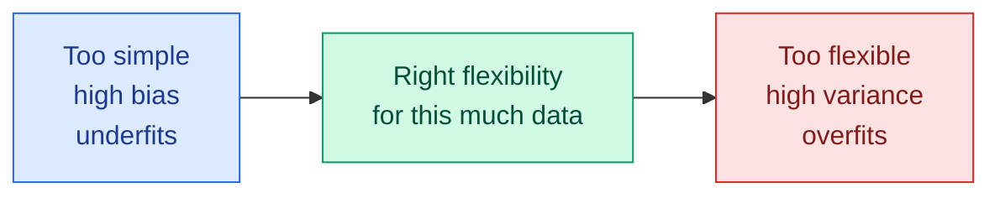

# Bias, Variance and the Trade-Off

**Level:** 🟡 Intermediate &nbsp;|&nbsp; **Effort:** Short module &nbsp;|&nbsp; **Module:** [07 Model Training and Evaluation](README.md)

---

## 🎯 Learning Objectives

By the end of this topic you will be able to:

- Define bias, variance and irreducible noise, and state how they add up to expected squared error
- Measure all three directly by refitting a model on many training sets from the same process
- Recognise underfitting and overfitting from the numbers, not just from a picture
- Explain which knobs move a model along the trade-off, and why "more data" fixes only one side
- Know where the classic U-shaped picture stops being the whole story

## 📚 Prerequisites

- [Regression](../05-machine-learning/03-regression.md) — polynomial regression and overfitting by degree
- [Parametric and Instance-Based Models](../05-machine-learning/02-parametric-and-instance-based-models.md) — k-NN, and an
  error that more data could not fix
- [Probability](../02-mathematics-for-ai/06-probability.md) — expectation and variance

```bash
pip install -r requirements.txt      # scikit-learn==1.5.2, numpy==2.1.3
```

---

## 🍰 1. The simple version

A model's error on new data comes from three places:

- **Bias** — the model is too simple to represent the truth, so it is wrong *in the same way* whatever data
  it is trained on. A straight line through a curve.
- **Variance** — the model is so flexible that it chases the particular training sample, so it is wrong *in
  a different way* every time it is retrained.
- **Noise** — randomness in the data itself. No model can remove it.

**Underfitting is high bias. Overfitting is high variance.** Making a model more flexible usually trades one
for the other — hence "the trade-off".

## 🏠 2. Real-life analogy

> Four archers each shoot many arrows. The first always hits the same spot, but a hand's width left of the
> bullseye: low variance, high bias. The second's arrows are centred on the bullseye but scattered all over
> the target: low bias, high variance. The third is both off-centre and scattered. The fourth is tight and
> centred — the goal.

**Where the analogy breaks down:** an archer's shots are repeated attempts. A model normally gets one training
set, so you never see its "scatter" directly. The code below creates the scatter on purpose, by retraining on
hundreds of fresh samples from a process whose truth is known.



---

## 📐 3. The decomposition

For a target $y = f(x) + \varepsilon$ with noise variance $\sigma^2$, and a model $\hat{f}$ trained on a random
training set, the expected squared error at a point $x$ splits exactly into three parts:

$$
\mathbb{E}\big[(y - \hat{f}(x))^2\big] =
\underbrace{\big(\mathbb{E}[\hat{f}(x)] - f(x)\big)^2}_{\text{bias}^2}
+ \underbrace{\mathbb{E}\big[(\hat{f}(x) - \mathbb{E}[\hat{f}(x)])^2\big]}_{\text{variance}}
+ \underbrace{\sigma^2}_{\text{noise}}
$$

| Term | Means | How to measure it in the code |
| --- | --- | --- |
| $\mathbb{E}[\hat{f}(x)]$ | The model's average prediction at $x$ over many possible training sets | Mean of 300 refitted models' predictions |
| **Bias²** | How far that average is from the truth $f(x)$ | Squared gap between average prediction and truth |
| **Variance** | How much individual models scatter around their own average | Variance of the 300 predictions |
| **Noise** $\sigma^2$ | Randomness in $y$ that no model can predict | Known here: $0.3^2 = 0.09$ |

**It solves a real problem:** "my model is bad" is not actionable. "My model's error is mostly bias" says make it
more flexible or give it better features; "mostly variance" says regularise, simplify, average, or get more data.

---

## 💻 4. Code example — measuring bias and variance directly

The truth is $f(x) = \sin(1.5x) + 0.3x$ with noise of standard deviation 0.3. Each model is refitted on **300
fresh training sets of 30 points**, and evaluated at 50 fixed points against the known truth. **Teaching use
only** — with real data the truth is unknown, which is why this measurement is only possible in simulation.

```python
"""Measure bias and variance directly: refit the same model on many training sets from the same process."""

import numpy as np
from sklearn.linear_model import LinearRegression
from sklearn.neighbors import KNeighborsRegressor
from sklearn.pipeline import make_pipeline
from sklearn.preprocessing import PolynomialFeatures

rng = np.random.default_rng(0)
noise_sd, n_train, n_repeats = 0.3, 30, 300


def truth(x):
    return np.sin(1.5 * x) + 0.3 * x


x_test = np.linspace(-3, 3, 50)


def decompose(make_model):
    predictions = np.empty((n_repeats, len(x_test)))
    squared_errors = np.empty(n_repeats)
    for r in range(n_repeats):
        x = rng.uniform(-3, 3, n_train)
        y = truth(x) + rng.normal(0, noise_sd, n_train)
        predictions[r] = make_model().fit(x.reshape(-1, 1), y).predict(x_test.reshape(-1, 1))
        y_new = truth(x_test) + rng.normal(0, noise_sd, len(x_test))    # fresh noisy test targets
        squared_errors[r] = np.mean((y_new - predictions[r]) ** 2)
    bias_squared = np.mean((predictions.mean(axis=0) - truth(x_test)) ** 2)
    variance = np.mean(predictions.var(axis=0))
    return bias_squared, variance, squared_errors.mean()


models = {
    "polynomial, degree 1": lambda: make_pipeline(PolynomialFeatures(1), LinearRegression()),
    "polynomial, degree 3": lambda: make_pipeline(PolynomialFeatures(3), LinearRegression()),
    "polynomial, degree 5": lambda: make_pipeline(PolynomialFeatures(5), LinearRegression()),
    "polynomial, degree 9": lambda: make_pipeline(PolynomialFeatures(9), LinearRegression()),
    "k-NN, k = 1": lambda: KNeighborsRegressor(1),
    "k-NN, k = 5": lambda: KNeighborsRegressor(5),
    "k-NN, k = 15": lambda: KNeighborsRegressor(15),
}
print(f"{'model':<24}{'bias^2':>8}{'variance':>10}{'noise':>8}{'sum':>8}{'measured MSE':>14}")
for name, make_model in models.items():
    bias_squared, variance, measured = decompose(make_model)
    total = bias_squared + variance + noise_sd ** 2
    print(f"{name:<24}{bias_squared:>8.3f}{variance:>10.3f}{noise_sd ** 2:>8.3f}{total:>8.3f}{measured:>14.3f}")
```

**Output:**
```
model                     bias^2  variance   noise     sum  measured MSE
polynomial, degree 1       0.487     0.040   0.090   0.617         0.615
polynomial, degree 3       0.085     0.036   0.090   0.212         0.211
polynomial, degree 5       0.003     0.051   0.090   0.143         0.146
polynomial, degree 9       0.223   134.096   0.090 134.409       134.402
k-NN, k = 1                0.001     0.111   0.090   0.202         0.205
k-NN, k = 5                0.024     0.055   0.090   0.169         0.169
k-NN, k = 15               0.251     0.058   0.090   0.399         0.400
```

MSE is the mean squared error ([Topic 5](05-regression-metrics.md)).

**The decomposition checks out.** In every row, bias² + variance + noise matches the separately measured test
error to within simulation noise. It is not a metaphor; it is arithmetic.

**Reading the polynomial rows:**

- **Degree 1 is almost all bias** (0.487 of 0.617). A straight line cannot bend, and retraining does not help:
  its variance is the lowest of all.
- **Degree 5 is the sweet spot here**: bias almost gone (0.003), variance still small. Its error, 0.143, is
  only 0.053 above the noise floor of 0.090 that no model can beat.
- **Degree 9 on 30 points is a variance catastrophe.** Most fits are reasonable, but a few training sets with
  sparse points near an edge produce polynomials that shoot off towards huge values, and those few dominate the
  average. Even its bias rose (0.223) — the *average* of wild fits is not the truth.

**The k-NN rows run the trade-off in reverse**, because for k-NN a *larger* k means a *simpler* model:

- **k = 1** has essentially zero bias and the highest k-NN variance — each prediction copies one noisy neighbour.
- **k = 15** averages over half the training set, flattening the curve: bias 0.251.
- **k = 5** balances the two and has the lowest k-NN error.

---

## 🎛️ 5. What moves a model along the trade-off

| To reduce **bias** (underfitting) | To reduce **variance** (overfitting) |
| --- | --- |
| A more flexible model family | A simpler model family |
| Better features — interactions, transformations ([06](../06-feature-engineering/README.md)) | Regularisation: ridge, lasso, weight decay ([Regression](../05-machine-learning/03-regression.md)) |
| Less regularisation | Stronger regularisation, fewer features |
| Deeper trees, more boosting rounds | Shallower trees, larger minimum leaf size, early stopping |
| Smaller k in k-NN | Larger k; bagging and forests ([Trees](../05-machine-learning/05-decision-trees-and-random-forests.md)) |
| — | **More training data** |

**More data only fixes variance.** With more rows, a flexible model's fits agree more closely; a straight line
stays exactly as wrong as before. [Parametric and Instance-Based Models](../05-machine-learning/02-parametric-and-instance-based-models.md)
showed a line's error unchanged from 50 to 20,000 rows. Before collecting more data, check which side of the
trade-off you are on — [Topic 4](04-learning-curves-and-baselines.md) shows how, from learning curves, on real data
where you cannot run this simulation.

### Where the U-shape stops being the whole story

The classic picture — test error falling then rising as flexibility grows — holds for the models in this topic.
Very large, heavily over-parameterised models such as modern neural networks can show **double descent**: error
rises near the point where the model can just fit the training data exactly, then falls again as capacity keeps
growing, helped by the implicit regularisation of the training procedure. The decomposition still holds; what
changes is how variance behaves at extreme capacity. See [08 Deep Learning](../08-deep-learning/README.md).

---

## 🏭 6. Production notes

- **Variance shows up as instability.** A high-variance model changes its predictions noticeably each time it is
  retrained on fresh data — customers see decisions flip between releases. Measure prediction churn between model
  versions on the same inputs.
- **Bias shows up as systematic error in segments.** Break errors down by segment; a consistent over- or
  under-prediction for one group is bias the global metric can hide ([26 Responsible AI](../26-responsible-ai/README.md)).
- **Ensembles are the industrial variance reducer.** Bagging, forests and averaging several models' predictions
  lower variance at a compute cost ([Trees](../05-machine-learning/05-decision-trees-and-random-forests.md)).

## ⚠️ 7. Common mistakes

| Mistake | Why it happens | Fix |
| --- | --- | --- |
| Collecting more data to fix underfitting | "More data always helps" | It helps variance only; degree 1 would stay wrong |
| Judging flexibility by training error | It keeps falling | Only held-out error shows the variance side |
| Assuming a larger k means a more complex k-NN | Bigger number, bigger model | Larger k is *simpler*: k = 15 had the highest bias |
| Reading one model's error as "bias" | Only one model was trained | Bias and variance are properties of the model *family and data size*; see learning curves |
| High-degree polynomials on small data | They fit the training points | Degree 9 on 30 points had variance of 134 |

---

## 🎤 8. Interview questions

<details>
<summary><b>Q1: Explain the bias-variance trade-off.</b></summary>

Expected squared test error splits into bias squared (how far the model's average prediction, over possible
training sets, is from the truth), variance (how much individual fitted models scatter around that average) and
irreducible noise. Simple models have high bias and low variance; flexible models the reverse. Increasing
flexibility lowers bias and raises variance, so test error is lowest at an intermediate flexibility that depends on
how much data you have. In the simulation, polynomial degree 1 was mostly bias, degree 9 on 30 points mostly
variance, and degree 5 lowest overall.
</details>

<details>
<summary><b>Q2: Your model underfits. Will more data help?</b></summary>

Usually not much. Underfitting is high bias — the model cannot represent the relationship — and bias does not
shrink with more rows. Increase flexibility, reduce regularisation or engineer better features. More data mainly
reduces variance, so it helps an overfitting model. A learning curve tells you which situation you are in: if
training and validation scores have converged at a poor level, more data will not help.
</details>

<details>
<summary><b>Q3: How does k in k-nearest neighbours relate to bias and variance?</b></summary>

Small k follows individual training points closely — low bias, high variance; k = 1 copies a single noisy
neighbour. Large k averages over many neighbours, smoothing away real structure — high bias, low variance. In the
simulation k = 1 had bias 0.001 and variance 0.111, k = 15 bias 0.251 and variance 0.058, and k = 5 the lowest
error. Choose k by cross-validation.
</details>

---

## ✅ Key takeaways

- **Expected squared error = bias² + variance + noise** — exactly, as the simulation confirmed row by row.
- **Underfitting is bias; overfitting is variance.** Degree 1 was 79% bias; degree 9 on 30 points had variance 134.
- **Flexibility trades one for the other**; for k-NN, *smaller* k is more flexible.
- **More data reduces variance only.** Diagnose the side before spending on data.
- The noise floor (0.09 here) is a hard limit — know roughly where it is before chasing the last decimal.

---

## 📚 Official References

- [An Introduction to Statistical Learning, book site — James, Witten, Hastie, Tibshirani and Taylor](https://www.statlearning.com/) — verified 2026-09-18; section 2.2.2 covers the trade-off
- [The Elements of Statistical Learning, book site — Hastie, Tibshirani and Friedman](https://hastie.su.domains/ElemStatLearn/) — verified 2026-09-18; chapter 7
- [scikit-learn: Underfitting vs. Overfitting, example — scikit-learn developers](https://scikit-learn.org/stable/auto_examples/model_selection/plot_underfitting_overfitting.html) — verified 2026-09-18
- [Reconciling modern machine learning practice and the bias-variance trade-off — Belkin et al., arXiv](https://arxiv.org/abs/1812.11118) — verified 2026-09-18; the double-descent paper

---

## 🔗 Navigation

[← Topic 2: Hyperparameter Search](02-hyperparameter-search.md) &nbsp;|&nbsp;
[🏠 Module Home](README.md) &nbsp;|&nbsp;
[Topic 4: Learning Curves, Validation Curves and Baselines →](04-learning-curves-and-baselines.md)
