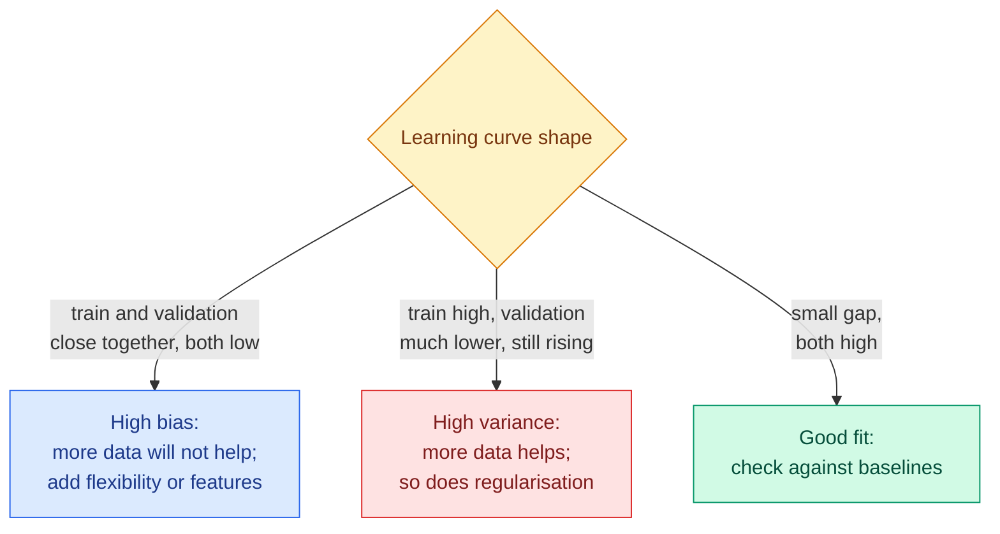

# Learning Curves, Validation Curves, Regularisation and Baselines

**Level:** 🟡 Intermediate &nbsp;|&nbsp; **Effort:** Detailed module &nbsp;|&nbsp; **Module:** [07 Model Training and Evaluation](README.md)

---

## 🎯 Learning Objectives

By the end of this topic you will be able to:

- Read a learning curve and say whether more data will help
- Read a validation curve and choose a regularisation strength from it
- Place regularisation and early stopping on the bias-variance map
- Build the baselines every model must beat — and recognise when a baseline wins
- Write a model comparison that a sceptical reviewer would accept

## 📚 Prerequisites

- [Topic 3: Bias, Variance and the Trade-Off](03-bias-variance-and-the-trade-off.md)
- [Regression](../05-machine-learning/03-regression.md) — ridge and lasso
- [Boosting](../05-machine-learning/06-boosting.md) — early stopping, shown there with its costs

```bash
pip install -r requirements.txt      # scikit-learn==1.5.2, numpy==2.1.3
```

---

## 🍰 1. The simple version

Topic 3 measured bias and variance in a simulation where the truth was known. With real data you cannot do that.
**Learning and validation curves are how you diagnose bias and variance from real data**:

- A **learning curve** plots training and validation scores against the amount of training data. It answers:
  *would more data help?*
- A **validation curve** plots them against one hyperparameter. It answers: *is this model too simple or too
  flexible?*

And before either, a **baseline**: the score of the simplest reasonable approach. A model's score means nothing
until you know what doing almost nothing scores.

## 🏠 2. Real-life analogy

> A student's marks on practice papers they have already seen, and on papers they have not, tell a tutor a lot.
> High on seen papers and low on new ones: memorising, not understanding. Low on both: the material has not
> landed yet, and more of the same practice will not fix it. And before praising a mark of 60%, the tutor asks
> what guessing would have scored.

**Where the analogy breaks down:** a tutor can ask the student why. A curve only shows the two scores; you still
have to supply the explanation.

---

## 📈 3. Learning curves: will more data help?

```python
"""Learning curves for three models on handwritten digits."""

import warnings

from sklearn.datasets import load_digits
from sklearn.linear_model import LogisticRegression
from sklearn.model_selection import StratifiedKFold, learning_curve
from sklearn.pipeline import make_pipeline
from sklearn.preprocessing import StandardScaler
from sklearn.tree import DecisionTreeClassifier

warnings.filterwarnings("ignore")

X, y = load_digits(return_X_y=True)
folds = StratifiedKFold(5, shuffle=True, random_state=0)
models = {
    "depth-3 tree": DecisionTreeClassifier(max_depth=3, random_state=0),
    "unlimited tree": DecisionTreeClassifier(random_state=0),
    "logistic regression": make_pipeline(StandardScaler(), LogisticRegression(max_iter=2000)),
}
for name, model in models.items():
    sizes, train, valid = learning_curve(model, X, y, train_sizes=[0.1, 0.25, 0.5, 1.0], cv=folds)
    print(f"{name}")
    print(f"  {'training rows':<16}" + "".join(f"{n:>8}" for n in sizes))
    print(f"  {'training score':<16}" + "".join(f"{s:>8.3f}" for s in train.mean(axis=1)))
    print(f"  {'validation':<16}" + "".join(f"{s:>8.3f}" for s in valid.mean(axis=1)))
```

**Output:**
```
depth-3 tree
  training rows        143     359     718    1437
  training score     0.607   0.484   0.472   0.482
  validation         0.392   0.380   0.432   0.465
unlimited tree
  training rows        143     359     718    1437
  training score     1.000   1.000   1.000   1.000
  validation         0.579   0.700   0.787   0.859
logistic regression
  training rows        143     359     718    1437
  training score     1.000   1.000   1.000   0.999
  validation         0.803   0.916   0.947   0.969
```

**Three different stories:**



- **The depth-3 tree has converged at a poor score.** Training and validation meet around 0.47–0.48 and stop
  improving. Ten classes cannot be separated with eight leaves. Ten times more data would not help — this is **high
  bias**, and the cure is a more flexible model.
- **The unlimited tree scores 100% on training data at every size**, and its validation score is still climbing
  steeply, from 0.579 to 0.859. That is **high variance**, and here more data genuinely helps — as would
  regularisation, or averaging trees into a forest.
- **Logistic regression** has a small, closing gap at a high level (0.969). It is the model to beat; more data
  would add a little.

**Note the depth-3 tree's training score fell as data grew** (0.607 to 0.482): with few rows, even a small tree
can fit much of the training set. Training scores falling towards validation scores as data grows is normal; the
question is where they meet.

---

## 🎚️ 4. Validation curves: choosing regularisation

Regularisation deliberately adds bias to cut variance. In scikit-learn's logistic regression, **smaller `C` means
stronger regularisation**.

```python
import warnings

import numpy as np
from sklearn.datasets import load_digits
from sklearn.linear_model import LogisticRegression
from sklearn.model_selection import StratifiedKFold, validation_curve
from sklearn.pipeline import make_pipeline
from sklearn.preprocessing import StandardScaler

warnings.filterwarnings("ignore")

X, y = load_digits(return_X_y=True)
C_values = np.logspace(-4, 2, 7)
train, valid = validation_curve(make_pipeline(StandardScaler(), LogisticRegression(max_iter=2000)), X, y,
                                param_name="logisticregression__C", param_range=C_values,
                                cv=StratifiedKFold(5, shuffle=True, random_state=0))
print(f"{'C':>8}{'training':>10}{'validation':>12}{'gap':>8}")
for C, t, v in zip(C_values, train.mean(axis=1), valid.mean(axis=1), strict=True):
    print(f"{C:>8g}{t:>10.3f}{v:>12.3f}{t - v:>8.3f}")
```

**Output:**
```
       C  training  validation     gap
  0.0001     0.851       0.838   0.013
   0.001     0.918       0.904   0.014
    0.01     0.960       0.947   0.012
     0.1     0.987       0.967   0.021
       1     0.999       0.969   0.029
      10     1.000       0.964   0.036
     100     1.000       0.960   0.040
```

**Read it from left to right.** At `C = 0.0001` the penalty dominates: training and validation are both low and
close together — high bias. As `C` grows, both rise. From `C = 1` onwards training accuracy is essentially perfect
and validation starts to fall while the gap widens — variance creeping in. **The best validation score is at
`C = 1`**, but 0.1 to 10 are all within half a point; choose within that plateau, preferring the simpler
(more regularised) end when scores tie.

### Regularisation, on one page

Every technique below trades a little bias for less variance. Each is taught where it belongs.

| Technique | What it penalises or limits | Where it is taught |
| --- | --- | --- |
| **L2 (ridge, weight decay)** | Large coefficients | [Regression](../05-machine-learning/03-regression.md) |
| **L1 (lasso)** | Number of non-zero coefficients | [Regression](../05-machine-learning/03-regression.md) |
| **Tree limits** | Depth, leaf size, number of leaves | [Trees](../05-machine-learning/05-decision-trees-and-random-forests.md) |
| **Early stopping** | Training iterations, chosen on a validation split | [Boosting](../05-machine-learning/06-boosting.md); neural networks in [08](../08-deep-learning/README.md) |
| **Averaging** | Variance directly, by combining models | [Trees](../05-machine-learning/05-decision-trees-and-random-forests.md) |
| **Data augmentation** | Sensitivity to irrelevant variation | [Augmentation](../03-data-foundations/07-synthetic-data-augmentation-and-feature-stores.md) |
| **Dropout** | Co-adaptation of neurons | [08 Deep Learning](../08-deep-learning/README.md) |

**Early stopping is a validation curve run during training**: the "hyperparameter" is the number of iterations,
and training stops where validation error turns up. [Boosting](../05-machine-learning/06-boosting.md) showed that
it can cost accuracy on small data, because it spends rows on the validation split.

---

## 🧱 5. Baselines: what does doing almost nothing score?

**A baseline is the simplest reasonable approach, evaluated exactly like your model.** It turns "0.42 R²" from a
number into a finding.

| Baseline | What it predicts | scikit-learn |
| --- | --- | --- |
| Majority class | The most common class, always | `DummyClassifier(strategy="most_frequent")` |
| Class prior | Random labels at training frequencies | `DummyClassifier(strategy="stratified")` |
| Mean or median | One constant number | `DummyRegressor(strategy="mean")` or `"median"` |
| One strong feature | A simple model on the best single input | Any model on one column |
| Simple model | Linear or logistic regression on all features | `LinearRegression`, `LogisticRegression` |
| Last value / same period last week | The recent past | For time series ([Crosses and Time Features](../06-feature-engineering/04-crosses-polynomial-and-date-time-features.md)) |
| The current process | Whatever decides today: a rule, a human, the existing model | Business data |

```python
"""Diabetes progression: a baseline ladder, from doing nothing to boosting."""

from sklearn.datasets import load_diabetes
from sklearn.dummy import DummyRegressor
from sklearn.ensemble import HistGradientBoostingRegressor, RandomForestRegressor
from sklearn.linear_model import LinearRegression
from sklearn.model_selection import KFold, cross_val_score

X, y = load_diabetes(return_X_y=True)
folds = KFold(5, shuffle=True, random_state=0)
ladder = [
    ("predict the mean", DummyRegressor(), X),
    ("linear, body mass index only", LinearRegression(), X[:, [2]]),
    ("linear, all 10 features", LinearRegression(), X),
    ("random forest", RandomForestRegressor(random_state=0), X),
    ("histogram gradient boosting", HistGradientBoostingRegressor(random_state=0), X),
]
print(f"{'model':<32}{'5-fold R2':>10}")
for name, model, features in ladder:
    print(f"{name:<32}{cross_val_score(model, features, y, cv=folds).mean():>10.3f}")
```

**Output:**
```
model                            5-fold R2
predict the mean                    -0.001
linear, body mass index only         0.333
linear, all 10 features              0.489
random forest                        0.419
histogram gradient boosting          0.390
```

R², the coefficient of determination, is 0 for predicting the mean and 1 for perfect predictions
([Topic 5](05-regression-metrics.md)).

**The simple linear model won.** With 442 patients and mostly linear effects, the forest and boosting had more
variance than they had signal to exploit. **A single feature, body mass index, captured two-thirds of the best
model's R²** — worth knowing if data collection is costly or the model must be explained to a clinician.

**Without the ladder, "boosting scored 0.39" sounds like a result.** With it, the result is that boosting is the
wrong tool for this dataset. Always put the simple rungs in the table.

---

## 🏭 6. Production notes

- **The most important baseline is the current process.** A model that beats a dummy but loses to the existing
  rule-based system should not ship. Measure the incumbent on the same data and metric.
- **Keep baselines running after launch.** If a simple baseline's live performance approaches the model's, the
  model has degraded or the problem has changed ([29 MLOps](../29-mlops/README.md)).
- **Learning curves price data collection.** Before paying for labels, extrapolate the validation curve: if it has
  flattened, the money is better spent on features or a different model.

## ⚠️ 7. Common mistakes

| Mistake | Why it happens | Fix |
| --- | --- | --- |
| No baseline in the results table | It looks unimpressive | Boosting lost to linear regression here; only the ladder shows it |
| Buying more data for a high-bias model | "More data always helps" | The depth-3 tree had converged; add flexibility |
| Choosing the exact validation maximum | It is the "best" | Choose within the plateau, preferring simpler settings |
| Reading training accuracy as evidence | It is high | The unlimited tree scored 100% on training data at every size |
| Comparing against a dummy only | It is easy to beat | Beat the simple model and the current process |

---

## 🎤 8. Interview questions

<details>
<summary><b>Q1: How do you use a learning curve?</b></summary>

Plot training and validation scores against training-set size. If both converge at a low score, the model has high
bias: more data will not help, so add flexibility or features. If training is much higher than validation and
validation is still rising, the model has high variance: more data, regularisation or averaging will help. In the
example a depth-3 tree converged at about 0.47, while an unlimited tree scored 1.0 on training data with validation
still climbing from 0.58 to 0.86.
</details>

<details>
<summary><b>Q2: What baselines would you build before a complex model?</b></summary>

A trivial one — majority class or mean prediction — to show the metric's floor; a simple model such as linear or
logistic regression on all features; possibly a strong single feature or rule; for time series, the last value or
the same period last season; and above all the current production process. All are evaluated on the same splits and
metric as the candidate. In the diabetes example, linear regression beat both a random forest and gradient boosting.
</details>

<details>
<summary><b>Q3: How does early stopping act as regularisation?</b></summary>

Iterative learners such as boosting and neural networks fit the training data more closely with every iteration.
Stopping when validation error stops improving limits how far they can fit noise, the same way a penalty limits
coefficient size. The number of iterations is effectively a hyperparameter chosen on a validation split, so the split
costs training data — which is why it can hurt on small datasets.
</details>

---

## ✅ Key takeaways

- **Learning curves tell you whether more data helps**: converged-and-low is bias, big-gap-and-rising is variance.
- **Validation curves choose regularisation**: pick within the plateau, favouring the simpler end.
- Every regulariser trades bias for variance; **early stopping** is a validation curve over iterations.
- **Baselines turn scores into findings**: linear regression beat a forest and boosting on diabetes, and one feature
  achieved two-thirds of the best R².
- The baseline that matters most is **what you do today**.

---

## 📚 Official References

- [scikit-learn: Validation curves, plotting scores to evaluate models — scikit-learn developers](https://scikit-learn.org/stable/modules/learning_curve.html) — verified 2026-09-18
- [scikit-learn: DummyClassifier — scikit-learn developers](https://scikit-learn.org/stable/modules/generated/sklearn.dummy.DummyClassifier.html) — verified 2026-09-18
- [scikit-learn: Diabetes dataset — scikit-learn developers](https://scikit-learn.org/stable/datasets/toy_dataset.html) — verified 2026-09-18
- [Rules of Machine Learning — Google for Developers](https://developers.google.com/machine-learning/guides/rules-of-ml) — verified 2026-09-18; rule 1 on launching without machine learning first

---

## 🔗 Navigation

[← Topic 3: Bias, Variance and the Trade-Off](03-bias-variance-and-the-trade-off.md) &nbsp;|&nbsp;
[🏠 Module Home](README.md) &nbsp;|&nbsp;
[Topic 5: Regression Metrics →](05-regression-metrics.md)
