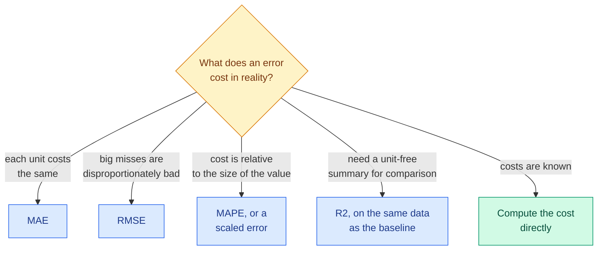

# Regression Metrics: MAE, MSE, RMSE, R², Adjusted R² and MAPE

**Level:** 🟡 Intermediate &nbsp;|&nbsp; **Effort:** Detailed module &nbsp;|&nbsp; **Module:** [07 Model Training and Evaluation](README.md)

---

## 🎯 Learning Objectives

By the end of this topic you will be able to:

- Compute MAE, MSE, RMSE, R², adjusted R² and MAPE, and say what question each one answers
- Explain which prediction each metric rewards — the median for MAE, the mean for MSE, something lower for MAPE
- Show, for every metric, a situation where it misleads
- Choose a regression metric from the cost of errors in the real problem

## 📚 Prerequisites

- [Topic 4: Learning Curves and Baselines](04-learning-curves-and-baselines.md)
- [Descriptive Statistics](../02-mathematics-for-ai/07-descriptive-statistics-and-sampling.md) — mean, median, variance
- [Regression](../05-machine-learning/03-regression.md)

```bash
pip install -r requirements.txt      # scikit-learn==1.5.2, numpy==2.1.3
```

---

## 🍰 1. The simple version

A regression model predicts a number. Its error on one example is **actual minus predicted**. A regression metric
turns thousands of those errors into one number — and **how it does that decides what "good" means**.

- Average the sizes of the errors: **MAE**. Every unit of error counts the same.
- Average the *squares* of the errors: **MSE**, or its square root **RMSE**. Big errors count far more.
- Compare the error with how much the target varies anyway: **R²**.
- Average the errors *as a percentage* of the actual value: **MAPE**.

**None of them is "the" accuracy of a regression model.** Each answers a different question, and each can make a
bad model look fine.

## 🏠 2. Real-life analogy

> Two delivery services are each late on average by 10 minutes. One is always about 10 minutes late. The other is
> usually on time but occasionally two hours late. MAE says they are equally good. RMSE says the second is much
> worse. Which is right depends on whether a two-hour delay costs you a little more or loses you the customer.

**Where the analogy breaks down:** real error costs are rarely as simple as "linear" or "squared". The metric is a
stand-in for cost; when possible, compute the cost itself.

---

## 📐 3. The definitions

For $n$ examples with actual values $y_i$, predictions $\hat{y}_i$ and mean actual value $\bar{y}$:

$$
\text{MAE} = \frac{1}{n}\sum_{i} |y_i - \hat{y}_i| \qquad
\text{MSE} = \frac{1}{n}\sum_{i} (y_i - \hat{y}_i)^2 \qquad
\text{RMSE} = \sqrt{\text{MSE}}
$$

$$
R^2 = 1 - \frac{\sum_i (y_i - \hat{y}_i)^2}{\sum_i (y_i - \bar{y})^2} \qquad
R^2_{\text{adj}} = 1 - (1 - R^2)\frac{n - 1}{n - p - 1} \qquad
\text{MAPE} = \frac{1}{n}\sum_{i} \left|\frac{y_i - \hat{y}_i}{y_i}\right|
$$

| Metric | Units | Perfect | Answers |
| --- | --- | --- | --- |
| **MAE** — mean absolute error | Target's units | 0 | How far off is a typical prediction? |
| **MSE** — mean squared error | Units squared | 0 | Mostly a training loss; hard to read directly |
| **RMSE** — root mean squared error | Target's units | 0 | Like MAE, but large misses weigh much more |
| **R²** — coefficient of determination | None | 1 | What fraction of the target's variance does the model explain, compared with predicting the mean? |
| **Adjusted R²** | None | 1 | R² with a penalty for the number of features $p$ |
| **MAPE** — mean absolute percentage error | Percent | 0 | How far off, relative to the actual value? |

**R² is 0 for a model that always predicts the mean of the evaluation data, and can be negative** — any model
worse than that constant scores below zero.



---

## 🎯 4. MAE, RMSE, and which prediction each rewards

```python
"""MAE and RMSE react very differently to one large miss, and reward different predictions."""

import numpy as np
from sklearn.metrics import mean_absolute_error, mean_absolute_percentage_error, mean_squared_error

rng = np.random.default_rng(0)

# 1. One large miss among 100 typical errors.
actual = rng.normal(100, 10, 100)
typical = actual + rng.normal(0, 5, 100)
one_miss = typical.copy()
one_miss[0] = actual[0] + 200
print(f"{'predictions':<24}{'MAE':>8}{'RMSE':>8}")
for name, predicted in [("typical errors", typical), ("plus one 200-unit miss", one_miss)]:
    print(f"{name:<24}{mean_absolute_error(actual, predicted):>8.2f}"
          f"{np.sqrt(mean_squared_error(actual, predicted)):>8.2f}")

# 2. The best single number to predict for a skewed target, such as order values.
orders = rng.lognormal(3, 1, 1000)
candidates = np.linspace(1, 100, 2000)


def best_constant(metric):
    return candidates[np.argmin([metric(orders, np.full_like(orders, c)) for c in candidates])]


print(f"\nskewed target: mean {orders.mean():.1f}, median {np.median(orders):.1f}")
print(f"constant that minimises MSE:   {best_constant(mean_squared_error):.1f}")
print(f"constant that minimises MAE:   {best_constant(mean_absolute_error):.1f}")
print(f"constant that minimises MAPE:  {best_constant(mean_absolute_percentage_error):.1f}")
```

**Output:**
```
predictions                  MAE    RMSE
typical errors              3.83    4.79
plus one 200-unit miss      5.81   20.56

skewed target: mean 31.2, median 19.0
constant that minimises MSE:   31.2
constant that minimises MAE:   19.0
constant that minimises MAPE:  7.1
```

**One bad prediction out of 100 quadrupled RMSE and raised MAE by half.** Squaring makes a 200-unit miss count
like 1,600 misses of 5 units. That is exactly right when a single large miss is catastrophic — an under-provisioned
server, a mis-dosed drug — and exactly wrong when your data contains recording errors you would rather ignore.

**The second part is the deeper point: each metric quietly chooses what your model should predict.** A model trained
or selected on **MSE** is pushed towards the **mean**; on **MAE**, towards the **median**; on **MAPE**, towards a value
**well below both**. For skewed targets — prices, order values, durations, claim sizes — those are very different
numbers, and switching the metric changes the forecast, not just its score.

### ⚠️ When MAE misleads

- **It hides rare large errors.** The model with one 200-unit miss still has an MAE close to the good model's. If
  large misses are what hurt, MAE will not show them.
- **It rewards the median.** If what you need is a total — revenue, demand, capacity — median-leaning forecasts sum
  to less than the true total ([Transformations](../06-feature-engineering/02-transformations-log-power-and-binning.md)).

### ⚠️ When RMSE misleads

- **One outlier can dominate it.** Above, a single row set most of the RMSE. A model can look much worse because
  of one corrupted label; check whether RMSE is driven by a few rows before trusting a comparison.
- **It is not "the typical error".** RMSE is always at least MAE and grows with the spread of errors, so reading it
  as "predictions are usually off by this much" overstates typical error.

---

## 📊 5. R² and adjusted R²

### ⚠️ When R² misleads: it depends on the test data's spread, not only the model

```python
"""The same model, the same error size, and very different R-squared."""

import numpy as np
from sklearn.linear_model import LinearRegression
from sklearn.metrics import mean_squared_error, r2_score

rng = np.random.default_rng(0)
x = rng.uniform(0, 10, 2000)
y = 2 * x + rng.normal(0, 2, 2000)
model = LinearRegression().fit(x[:1000].reshape(-1, 1), y[:1000])

x_test, y_test = x[1000:], y[1000:]
narrow = (x_test > 4) & (x_test < 6)                         # e.g. evaluating on one customer segment
for name, mask in [("full range of x", np.ones_like(narrow)), ("only 4 < x < 6", narrow)]:
    predicted = model.predict(x_test[mask].reshape(-1, 1))
    print(f"{name:<18} R2 {r2_score(y_test[mask], predicted):.3f}   "
          f"RMSE {np.sqrt(mean_squared_error(y_test[mask], predicted)):.3f}")

print(f"\nalways predicting 30:   R2 {r2_score(y_test, np.full_like(y_test, 30.0)):.3f}")
```

**Output:**
```
full range of x    R2 0.895   RMSE 2.038
only 4 < x < 6     R2 0.111   RMSE 2.047

always predicting 30:   R2 -10.372
```

**The model's errors are the same size on both subsets — RMSE 2.04 against 2.05 — but R² fell from 0.895 to
0.111.** R² compares the error with the variance of the target *in the evaluation data*. In a narrow segment the
target varies little, so the same error explains a smaller fraction of it. **R² is not comparable across datasets,
segments or time periods with different spreads.** Compare errors in units instead.

**And R² can be negative.** A model worse than predicting the evaluation mean scores below zero — a constant guess of 30 scored
−10.372. A negative R² on held-out data is not a bug; it is a verdict.

### ⚠️ When adjusted R² misleads: it is still an in-sample number

Training R² can only go up as features are added — even pure noise. **Adjusted R²** penalises the number of features
$p$. It is often presented as the fix. Here is how far it gets, with 50 rows, one real feature and a growing number
of noise features:

```python
import numpy as np
from sklearn.linear_model import LinearRegression
from sklearn.model_selection import KFold, cross_val_score

rng = np.random.default_rng(0)
n = 50
signal = rng.normal(size=n)
y = 3 * signal + rng.normal(0, 3, n)
noise = rng.normal(size=(n, 40))

print(f"{'noise features':>15}{'R2':>8}{'adjusted R2':>13}{'cross-validated R2':>20}")
for k in [0, 5, 10, 20, 40]:
    X = np.column_stack([signal, noise[:, :k]])
    p = X.shape[1]
    r2 = LinearRegression().fit(X, y).score(X, y)
    adjusted = 1 - (1 - r2) * (n - 1) / (n - p - 1)
    cross_validated = cross_val_score(LinearRegression(), X, y, cv=KFold(5, shuffle=True, random_state=0)).mean()
    print(f"{k:>15}{r2:>8.3f}{adjusted:>13.3f}{cross_validated:>20.3f}")
```

**Output:**
```
 noise features      R2  adjusted R2  cross-validated R2
              0   0.391        0.378               0.245
              5   0.484        0.412               0.192
             10   0.544        0.412               0.178
             20   0.569        0.246              -0.443
             40   0.975        0.849              -2.494
```

**With 40 noise features, adjusted R² reported 0.849 — the model is worthless on new data (−2.494).** The
correction assumes a situation far from this one, and when features approach the number of rows it breaks down
completely. **Held-out R² is the honest number**: it fell steadily with every noise feature added. Use adjusted R²
only as a rough in-sample check in classical statistics; for prediction, validate.

---

## 📉 6. MAPE and other percentage errors

MAPE is popular with business stakeholders because "we are off by 12% on average" is easy to understand. It has
three serious flaws.

### ⚠️ When MAPE misleads

```python
import numpy as np
from sklearn.metrics import mean_absolute_percentage_error

actual = np.array([100.0, 50.0, 10.0, 1.0, 0.1])
predicted = actual + 1                                     # every prediction off by exactly 1 unit
per_row = np.abs((actual - predicted) / actual)
print("percentage error per row:", [f"{e:.0%}" for e in per_row])
print(f"MAPE: {mean_absolute_percentage_error(actual, predicted):.0%}")

steady = np.full(1000, 100.0)
print(f"\npredict half the actual:  MAPE {mean_absolute_percentage_error(steady, steady * 0.5):.0%}")
print(f"predict zero:             MAPE {mean_absolute_percentage_error(steady, np.zeros(1000)):.0%}")
print(f"predict triple:           MAPE {mean_absolute_percentage_error(steady, steady * 3):.0%}")
```

**Output:**
```
percentage error per row: ['1%', '2%', '10%', '100%', '1000%']
MAPE: 223%

predict half the actual:  MAPE 50%
predict zero:             MAPE 100%
predict triple:           MAPE 200%
```

1. **Near-zero actual values explode it.** Every prediction was off by exactly one unit, yet the row with an
   actual value of 0.1 contributed a 1,000% error and dragged MAPE to 223%. With actual values of exactly zero —
   days with no sales — MAPE is undefined.
2. **It punishes over-prediction without limit but under-prediction at most 100%.** Predicting zero can never
   cost more than 100%; predicting triple costs 200%.
3. **So it rewards forecasting low.** Section 4 showed the constant that minimises MAPE, far below both the median
   and the mean. A team optimising MAPE is, often without knowing it, rewarded for under-forecasting — then runs out
   of stock.

**Alternatives:** weighted absolute percentage error — the sum of absolute errors divided by the sum of actual values
— avoids the per-row explosion; the **mean absolute scaled error (MASE)** divides by the error of a naive forecast
and is common in forecasting ([20 Time Series](../20-time-series/README.md)). Or report MAE alongside the average
level so people can see the percentage for themselves.

---

## 🏭 7. Production notes

- **Report two metrics and a baseline**: an average error in units (MAE or RMSE), and the same metric for a baseline
  on the same data ([Topic 4](04-learning-curves-and-baselines.md)).
- **Break errors down by segment and by size of target.** A global MAE can hide a model that is excellent on small
  orders and terrible on large ones.
- **Match training loss and evaluation metric** where you can. A model trained on squared error and judged on MAE is
  optimising for the mean and being scored on the median.
- **For decisions, prefer prediction intervals to point predictions**: quantile regression or conformal prediction
  give a range with a stated coverage, which is often what a planner actually needs.

## ⚠️ 8. Common mistakes

| Mistake | Why it happens | Fix |
| --- | --- | --- |
| Comparing R² across segments or datasets | It looks unit-free | Same errors gave R² of 0.895 and 0.111 |
| Trusting adjusted R² for model selection | It "penalises complexity" | It said 0.849 for a model scoring −2.494 on new data |
| MAPE with small or zero actual values | It is the business standard | One row at 0.1 made MAPE 223%; use weighted percentage error or MASE |
| Optimising MAPE for stock planning | Stakeholders like percentages | It rewards under-forecasting |
| Reading RMSE as the typical error | Both are "in units" | RMSE is inflated by a few large misses; also report MAE |
| Ignoring which prediction the metric rewards | Metrics seem neutral | MSE → mean, MAE → median, MAPE → lower still |

## 🔐 9. Security note

Metrics dominated by a few rows — RMSE especially — can be manipulated by a few poisoned labels in an evaluation
set, making a good model look bad or hiding a bad one. Keep evaluation data write-protected and versioned, and
report robust companions such as MAE or error percentiles that a handful of rows cannot swing
([28 AI Security](../28-ai-security/README.md)).

---

## 🎤 10. Interview questions

<details>
<summary><b>Q1: When would you choose MAE over RMSE?</b></summary>

When every unit of error costs about the same and occasional large errors should not dominate — for example when
the data contains outliers or recording errors you do not want to chase. RMSE squares errors, so it weights large
misses heavily: one 200-unit miss among 100 predictions quadrupled RMSE and raised MAE by half. Choose RMSE when a
large miss really is disproportionately costly. Also note that MSE-based training pushes predictions towards the
mean and MAE towards the median.
</details>

<details>
<summary><b>Q2: Can R² be negative? What does it mean?</b></summary>

Yes, on data the model was not fitted to. R² compares the model's squared error with that of always predicting the
evaluation data's mean; a negative value means the model is worse than that constant. It commonly appears when an
overfitted model is evaluated on held-out data — the example with 40 noise features scored −2.494 in
cross-validation. Also remember that R² depends on the target's variance in the evaluation data, so it is not
comparable across datasets.
</details>

<details>
<summary><b>Q3: What is wrong with MAPE?</b></summary>

It divides by the actual value, so small actual values produce enormous percentage errors and zeros make it
undefined; one row with an actual of 0.1 pushed MAPE to 223% when every prediction was off by one unit. It is
asymmetric: under-prediction is capped at 100% while over-prediction is unbounded, so optimising it rewards
forecasting low. Weighted absolute percentage error or the mean absolute scaled error avoid these problems.
</details>

---

## ✅ Key takeaways

- **MAE** treats all errors equally and rewards the median; **RMSE** punishes large misses and rewards the mean.
- **One bad row quadrupled RMSE.** Check what drives it before trusting a comparison.
- **R² depends on the evaluation data's spread** — 0.895 and 0.111 for the same errors — and can be negative.
- **Adjusted R² is not validation**: 0.849 for a model worth −2.494 on new data.
- **MAPE explodes near zero and rewards under-forecasting.**
- The best metric is the real cost of errors; the others are stand-ins for it.

---

## 📚 Official References

- [scikit-learn: Metrics and scoring, regression metrics — scikit-learn developers](https://scikit-learn.org/stable/modules/model_evaluation.html) — verified 2026-09-18
- [Forecasting: Principles and Practice, evaluating point forecast accuracy — Hyndman and Athanasopoulos, OTexts](https://otexts.com/fpp3/accuracy.html) — verified 2026-09-18; covers MAPE's flaws and MASE
- [An Introduction to Statistical Learning, book site — James, Witten, Hastie, Tibshirani and Taylor](https://www.statlearning.com/) — verified 2026-09-18

---

## 🔗 Navigation

[← Topic 4: Learning Curves and Baselines](04-learning-curves-and-baselines.md) &nbsp;|&nbsp;
[🏠 Module Home](README.md) &nbsp;|&nbsp;
[Topic 6: Classification Metrics →](06-classification-metrics.md)
