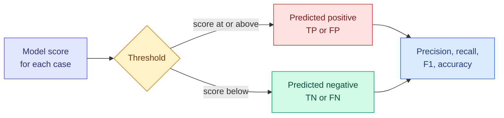

# Classification Metrics: The Confusion Matrix, Precision, Recall, F1 and Thresholds

**Level:** 🟡 Intermediate &nbsp;|&nbsp; **Effort:** Detailed module &nbsp;|&nbsp; **Module:** [07 Model Training and Evaluation](README.md)

---

## 🎯 Learning Objectives

By the end of this topic you will be able to:

- Build a confusion matrix and compute accuracy, precision, recall, specificity and F1 from it by hand
- Show that every one of these metrics depends on a decision threshold, and move it deliberately
- Choose a threshold from the real cost of each error type, and see why the textbook formula can be off
- Average metrics over several classes — micro, macro and weighted — and say what each hides
- State, for each metric, when it misleads

## 📚 Prerequisites

- [Splits, Sampling and Class Imbalance](../03-data-foundations/06-splits-sampling-and-class-imbalance.md) — the
  accuracy trap on imbalanced data, shown there with a do-nothing baseline
- [Hypothesis Testing](../02-mathematics-for-ai/08-hypothesis-testing-and-ab-testing.md) — Type I and Type II errors
- [Probability](../02-mathematics-for-ai/06-probability.md) — base rates and why precision collapses for rare events

```bash
pip install -r requirements.txt      # scikit-learn==1.5.2, numpy==2.1.3
```

---

## 🍰 1. The simple version

A classifier that flags fraud can be wrong in two ways: it can **flag a honest transaction** (a false alarm) or
**miss a fraudulent one**. Those mistakes rarely cost the same. Blocking a customer's card is annoying; missing a
large fraud is expensive.

**Accuracy counts both mistakes as equal and adds them up.** The other metrics in this topic separate them:

- **Precision** — of everything flagged, how much was really fraud?
- **Recall** — of all the real fraud, how much was flagged?

And almost every classifier outputs a *score*, not a decision. **Where you put the threshold decides the balance
between the two mistakes** — and that is a business decision, not a modelling one.

## 🏠 2. Real-life analogy

> A smoke alarm set very sensitively goes off every time you make toast: high recall, low precision. Set very
> insensitively, it stays quiet through toast and through a real fire: high precision, low recall. Nobody picks the
> setting by asking which one is "more accurate"; they ask what a false alarm costs and what a missed fire costs.

**Where the analogy breaks down:** with a smoke alarm the cost of a miss is so extreme that the answer is obvious.
In most business problems both costs are moderate and must actually be estimated.

---

## ⚙️ 3. The confusion matrix and everything built on it

|  | **Predicted positive** | **Predicted negative** |
| --- | --- | --- |
| **Actually positive** | True positive (TP) | False negative (FN) — a miss, Type II error |
| **Actually negative** | False positive (FP) — a false alarm, Type I error | True negative (TN) |

### 📐 The metrics

$$
\text{accuracy} = \frac{TP + TN}{\text{all}} \quad
\text{precision} = \frac{TP}{TP + FP} \quad
\text{recall} = \frac{TP}{TP + FN} \quad
\text{specificity} = \frac{TN}{TN + FP} \quad
F_1 = \frac{2 \cdot \text{precision} \cdot \text{recall}}{\text{precision} + \text{recall}}
$$

| Metric | Also called | Question it answers | Ignores |
| --- | --- | --- | --- |
| **Accuracy** | — | What fraction of decisions were right? | Which kind of mistake; class balance |
| **Precision** | Positive predictive value | When it says "positive", how often is it right? | Missed positives |
| **Recall** | Sensitivity, true positive rate | What fraction of real positives did it catch? | False alarms |
| **Specificity** | True negative rate | What fraction of real negatives did it clear? | Missed positives |
| **F1** | — | Harmonic mean of precision and recall | True negatives entirely |

**The harmonic mean punishes imbalance**: precision 1.0 with recall 0.1 gives F1 0.18, not the 0.55 an ordinary
average would. F1 is high only when both are.



---

## 🎚️ 4. Every metric here is a metric *at a threshold*

A fraud-like problem with 5.4% positives. The model outputs probabilities; `predict` silently uses 0.5.
**Teaching use only.**

```python
"""The confusion matrix at the default threshold, and what moving the threshold does."""

import warnings

from sklearn.datasets import make_classification
from sklearn.linear_model import LogisticRegression
from sklearn.metrics import confusion_matrix, f1_score, precision_score, recall_score
from sklearn.model_selection import train_test_split

warnings.filterwarnings("ignore")

X, y = make_classification(n_samples=20000, n_features=10, n_informative=4, weights=[0.95], flip_y=0.01,
                           class_sep=1.5, random_state=0)
X_train, X_rest, y_train, y_rest = train_test_split(X, y, test_size=0.5, random_state=0, stratify=y)
X_valid, X_test, y_valid, y_test = train_test_split(X_rest, y_rest, test_size=0.5, random_state=0, stratify=y_rest)
model = LogisticRegression().fit(X_train, y_train)
scores = model.predict_proba(X_test)[:, 1]

tn, fp, fn, tp = confusion_matrix(y_test, scores >= 0.5).ravel()
print(f"positives in the test set: {y_test.sum()} of {len(y_test)}")
print(f"at threshold 0.5:  TP {tp}  FN {fn}  FP {fp}  TN {tn}")
print(f"by hand:  precision {tp / (tp + fp):.3f}  recall {tp / (tp + fn):.3f}  "
      f"specificity {tn / (tn + fp):.3f}  accuracy {(tp + tn) / len(y_test):.3f}\n")

print(f"{'threshold':>9}{'accuracy':>10}{'precision':>11}{'recall':>8}{'F1':>7}{'flagged':>9}")
for threshold in [0.05, 0.1, 0.2, 0.3, 0.5, 0.7]:
    flagged = scores >= threshold
    print(f"{threshold:>9}{(flagged == y_test).mean():>10.3f}{precision_score(y_test, flagged):>11.3f}"
          f"{recall_score(y_test, flagged):>8.3f}{f1_score(y_test, flagged):>7.3f}{flagged.sum():>9}")
```

**Output:**
```
positives in the test set: 269 of 5000
at threshold 0.5:  TP 97  FN 172  FP 9  TN 4722
by hand:  precision 0.915  recall 0.361  specificity 0.998  accuracy 0.964

threshold  accuracy  precision  recall     F1  flagged
     0.05     0.781      0.149   0.654  0.243     1178
      0.1     0.899      0.283   0.576  0.380      547
      0.2     0.950      0.535   0.509  0.522      256
      0.3     0.963      0.738   0.472  0.576      172
      0.5     0.964      0.915   0.361  0.517      106
      0.7     0.951      0.929   0.097  0.175       28
```

**At the default threshold the model catches only 36% of positives** — 97 of 269 — while its precision is 91.5%.
Nobody chose that trade-off; it fell out of the number 0.5.

**Moving the threshold trades one error for the other:**

- Lower it to 0.05 and recall rises to 65%, but precision collapses to 15%: for every real case caught, about six
  false alarms.
- Raise it to 0.7 and precision edges up while recall falls below 10%.
- **Accuracy peaks at 0.5 (0.964) — the threshold that misses 64% of positives** — and barely moves between 0.2 and
  0.7, because 95% of cases are negative. It is the metric least connected to what the threshold is doing.

### ⚠️ When accuracy misleads

On imbalanced data a model that predicts "negative" for everything scores the negative rate — 94.6% here — while
catching nothing ([Splits and Imbalance](../03-data-foundations/06-splits-sampling-and-class-imbalance.md) shows it).
Accuracy is only informative when classes are roughly balanced **and** both errors cost about the same.

### ⚠️ When precision misleads

- **It ignores misses.** Flag only the single most certain case and precision can be 100% with recall near zero.
- **It depends on prevalence.** The same model has lower precision when positives are rarer — deploy a fraud model
  to a region with half the fraud rate and precision falls although the model is unchanged
  ([Probability](../02-mathematics-for-ai/06-probability.md)).

### ⚠️ When recall misleads

- **It ignores false alarms.** Flag everything and recall is 100%. A screening test reported by recall alone could
  be sending every patient for follow-up.
- Always report recall with precision, or with the number flagged — the `flagged` column above — because the
  number of alerts is what a review team actually has to handle.

---

## 💰 5. Choosing the threshold from costs

Suppose a missed positive costs 20 times as much as a false alarm. The total cost at a threshold is
$20 \times FN + 1 \times FP$. Choose the threshold that minimises it **on validation data**, then report its cost on
the test set.

### 📐 The textbook threshold

If the model's probabilities are **calibrated** — a score of 0.1 really means a 10% chance — the cost-minimising
rule is to flag when

$$
p > \frac{c_{FP}}{c_{FP} + c_{FN}} = \frac{1}{1 + 20} \approx 0.048
$$

because flagging costs $c_{FP}(1 - p)$ in expectation and not flagging costs $c_{FN}\,p$.

```python
import warnings

import numpy as np
from sklearn.datasets import make_classification
from sklearn.linear_model import LogisticRegression
from sklearn.metrics import f1_score, recall_score
from sklearn.model_selection import train_test_split

warnings.filterwarnings("ignore")

X, y = make_classification(n_samples=20000, n_features=10, n_informative=4, weights=[0.95], flip_y=0.01,
                           class_sep=1.5, random_state=0)
X_train, X_rest, y_train, y_rest = train_test_split(X, y, test_size=0.5, random_state=0, stratify=y)
X_valid, X_test, y_valid, y_test = train_test_split(X_rest, y_rest, test_size=0.5, random_state=0, stratify=y_rest)
model = LogisticRegression().fit(X_train, y_train)
valid_scores, test_scores = model.predict_proba(X_valid)[:, 1], model.predict_proba(X_test)[:, 1]

COST_FALSE_ALARM, COST_MISS = 1, 20


def total_cost(y_true, scores, threshold):
    flagged = scores >= threshold
    return COST_FALSE_ALARM * (flagged & (y_true == 0)).sum() + COST_MISS * (~flagged & (y_true == 1)).sum()


thresholds = np.linspace(0.01, 0.99, 99)
chosen = {
    "default 0.5": 0.5,
    "best F1 on validation": thresholds[np.argmax([f1_score(y_valid, valid_scores >= t) for t in thresholds])],
    "textbook 1 / (1 + 20)": COST_FALSE_ALARM / (COST_FALSE_ALARM + COST_MISS),
    "lowest cost on validation": thresholds[np.argmin([total_cost(y_valid, valid_scores, t) for t in thresholds])],
}
print(f"{'threshold rule':<28}{'threshold':>10}{'test cost':>11}{'recall':>8}{'F1':>7}")
for name, threshold in chosen.items():
    flagged = test_scores >= threshold
    print(f"{name:<28}{threshold:>10.3f}{total_cost(y_test, test_scores, threshold):>11}"
          f"{recall_score(y_test, flagged):>8.3f}{f1_score(y_test, flagged):>7.3f}")
```

**Output:**
```
threshold rule               threshold  test cost  recall     F1
default 0.5                      0.500       3449   0.361  0.517
best F1 on validation            0.330       2912   0.465  0.587
textbook 1 / (1 + 20)            0.048       2903   0.658  0.235
lowest cost on validation        0.160       2716   0.528  0.484
```

**The default threshold cost the most, by a wide margin.** Choosing the threshold by measured cost on validation
data saved about a fifth of the cost on the test set.

**The F1-optimal threshold was not the cost-optimal one.** F1 weighs precision and recall equally; the business
weighs a miss 20 times a false alarm. **Optimising F1 is optimising for costs you do not have.**

**The textbook threshold did better than 0.5 but worse than the measured one**, because the formula assumes
calibrated probabilities, and this model's are not perfectly calibrated ([Topic 7](07-roc-pr-and-probability-metrics.md)).
Use the formula for a first guess and as a check; choose the final threshold on validation data.

### ⚠️ When F1 misleads

- **It ignores true negatives.** Two models with very different false-alarm rates on a large negative class can have
  the same F1.
- **It weighs precision and recall equally**, which almost no real problem does. $F_\beta$ with $\beta > 1$ favours
  recall; but a cost calculation beats choosing $\beta$ by feel.
- **It depends on which class is called "positive".** Swap the labels and F1 changes completely.

---

## 🧮 6. More than two classes: micro, macro and weighted averages

Per-class precision, recall and F1 are computed one class against the rest; then they must be averaged.

| Average | How | Dominated by |
| --- | --- | --- |
| **Micro** | Pool every decision, then compute | Large classes — for single-label problems it equals accuracy |
| **Macro** | Compute per class, then take a plain mean | Every class equally — rare classes count as much as common ones |
| **Weighted** | Per class, weighted by class size | Large classes |

1,000 support tickets: 700 billing, 280 technical, and 20 **security incidents** — the rare class that matters most.

```python
import numpy as np
from sklearn.metrics import accuracy_score, balanced_accuracy_score, f1_score

rng = np.random.default_rng(0)
actual = np.array(["billing"] * 700 + ["technical"] * 280 + ["security"] * 20)
predicted = actual.copy()
confused = rng.random(1000) < 0.08                                           # 8% billing/technical mix-ups
predicted[confused & (actual == "billing")] = "technical"
predicted[confused & (actual == "technical")] = "billing"
predicted[actual == "security"] = rng.choice(["billing", "technical", "security"], 20, p=[0.5, 0.35, 0.15])

print(f"accuracy            {accuracy_score(actual, predicted):.3f}")
for average in ["micro", "weighted", "macro"]:
    print(f"F1, {average:<16}{f1_score(actual, predicted, average=average):.3f}")
print(f"balanced accuracy   {balanced_accuracy_score(actual, predicted):.3f}")
per_class = f1_score(actual, predicted, average=None, labels=["billing", "technical", "security"])
print("F1 per class        " + ", ".join(f"{c} {v:.3f}" for c, v in zip(["billing", "technical", "security"],
                                                                         per_class, strict=True)))
```

**Output:**
```
accuracy            0.916
F1, micro           0.916
F1, weighted        0.911
F1, macro           0.695
balanced accuracy   0.672
F1 per class        billing 0.942, technical 0.881, security 0.261
```

**Micro and weighted F1 both said about 0.91; the model misses most security incidents.** Only macro F1 and balanced
accuracy — the mean of per-class recall — reflected the rare class, and only the per-class line says *which* class
failed. **For any problem where a rare class matters, report per-class metrics.** A single averaged number is a
summary for a dashboard, not an evaluation.

---

## 🏭 7. Production notes

- **The threshold is a product setting, not a model setting.** Store it with the model version, review it with the
  business owner, and re-check it when costs, prevalence or model version change.
- **Capacity often sets the threshold.** If a fraud team can review 200 cases a day, the operating point is "the top
  200 scores" — evaluate precision at that volume ([Topic 8](08-ranking-metrics.md) covers precision@k).
- **Prevalence drifts.** Precision moves with the positive rate even when the model is unchanged; monitor both, and
  alert on the number flagged per day.
- **Segment the metrics.** Recall that differs sharply between groups of users is a fairness problem as well as a
  quality one ([26 Responsible AI](../26-responsible-ai/README.md)).

## ⚠️ 8. Common mistakes

| Mistake | Why it happens | Fix |
| --- | --- | --- |
| Using `predict` and its hidden 0.5 threshold | It is the default | Recall was 36% at 0.5; choose the threshold deliberately |
| Reporting accuracy on imbalanced data | It is the default score | Report precision, recall and the number flagged |
| Optimising F1 when costs are asymmetric | F1 is "the balanced metric" | The F1-best threshold cost more than the cost-best one |
| Using the textbook cost threshold without checking | It is a formula | It assumes calibrated probabilities; measure on validation |
| Choosing the threshold on the test set | It is the last data looked at | Validation for choosing, test for reporting |
| One averaged score for multi-class | Dashboards want one number | Micro F1 0.91 hid a security class F1 of 0.26 |

## 🔐 9. Security note

In security classifiers — malware, fraud, intrusion — the cost of a miss is set partly by an adversary, and attackers
probe for the threshold: submitting variations until one scores just below it. Do not expose raw scores to users,
rate-limit repeated submissions, monitor for clusters of cases just under the threshold, and consider a random
component in review selection ([28 AI Security](../28-ai-security/README.md)).

---

## 🎤 10. Interview questions

<details>
<summary><b>Q1: Explain precision and recall with an example.</b></summary>

For a fraud detector, precision is the fraction of flagged transactions that are really fraud; recall is the
fraction of all fraud that gets flagged. Raising the threshold usually increases precision and lowers recall. Which
matters more depends on costs: if investigating a false alarm is cheap and missing fraud is expensive, favour recall.
In the example, the default threshold gave 91.5% precision but only 36% recall.
</details>

<details>
<summary><b>Q2: How do you choose a classification threshold?</b></summary>

From the costs of each error type and any capacity limits, on validation data. Compute total cost — for example
20 × misses + 1 × false alarms — across thresholds and pick the minimum, then report the result on the test set. If
probabilities are calibrated, $c_{FP}/(c_{FP}+c_{FN})$ is a good starting point. Do not default to 0.5, and do not
optimise F1 unless precision and recall really are equally valuable; in the example the F1-optimal threshold cost more
than the cost-optimal one.
</details>

<details>
<summary><b>Q3: What is the difference between micro, macro and weighted averaging?</b></summary>

Micro averaging pools all decisions before computing the metric, so large classes dominate; for single-label
problems micro F1 equals accuracy. Macro averaging computes the metric per class and takes a plain mean, so every
class counts equally. Weighted averaging weights per-class scores by class size. With a rare but important class, micro
and weighted scores can look excellent while the rare class fails — 0.91 against a security-class F1 of 0.26 in the
example — so report per-class metrics.
</details>

---

## ✅ Key takeaways

- The confusion matrix has four cells; **accuracy adds two mistakes that rarely cost the same**.
- **Precision** asks how trustworthy a flag is; **recall** how much is caught. Report them together, with the number
  flagged.
- **Every threshold metric depends on the threshold.** The default 0.5 caught 36% of positives by accident.
- **Choose the threshold from costs on validation data** — not from F1, and not only from the textbook formula.
- **Macro averages and per-class metrics expose rare classes** that micro and weighted averages hide.

---

## 📚 Official References

- [scikit-learn: Metrics and scoring, classification metrics — scikit-learn developers](https://scikit-learn.org/stable/modules/model_evaluation.html) — verified 2026-09-18
- [scikit-learn: Tuning the decision threshold for class prediction — scikit-learn developers](https://scikit-learn.org/stable/modules/classification_threshold.html) — verified 2026-09-18
- [Classification: Accuracy, recall, precision, and related metrics, Machine Learning Crash Course — Google for Developers](https://developers.google.com/machine-learning/crash-course/classification/accuracy-precision-recall) — verified 2026-09-18

---

## 🔗 Navigation

[← Topic 5: Regression Metrics](05-regression-metrics.md) &nbsp;|&nbsp;
[🏠 Module Home](README.md) &nbsp;|&nbsp;
[Topic 7: ROC, Precision-Recall and Probability Metrics →](07-roc-pr-and-probability-metrics.md)
