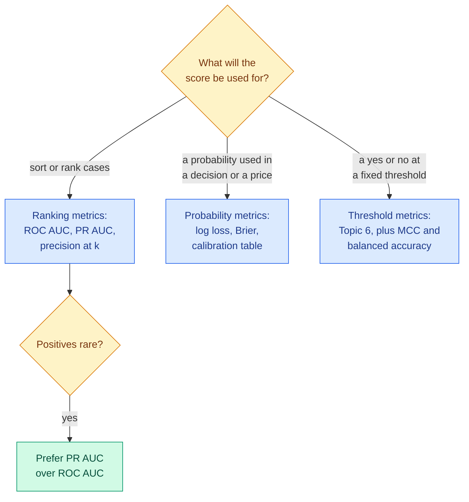

# ROC, Precision-Recall, Log Loss, Calibration, MCC and Top-k

**Level:** 🔴 Advanced &nbsp;|&nbsp; **Effort:** Detailed module &nbsp;|&nbsp; **Module:** [07 Model Training and Evaluation](README.md)

---

## 🎯 Learning Objectives

By the end of this topic you will be able to:

- Explain ROC AUC as a ranking probability, and verify that interpretation by counting pairs
- Show why ROC AUC stays flat while precision-recall collapses as positives become rarer
- Evaluate probabilities, not just rankings, with log loss, the Brier score and a calibration table — and fix
  miscalibration
- Use balanced accuracy and the Matthews correlation coefficient when classes are imbalanced
- Use top-k accuracy for many-class problems, and say when each metric misleads

## 📚 Prerequisites

- [Topic 6: Classification Metrics](06-classification-metrics.md) — the confusion matrix and thresholds
- [Probability](../02-mathematics-for-ai/06-probability.md) — base rates, likelihood and cross-entropy
- [Splits and Class Imbalance](../03-data-foundations/06-splits-sampling-and-class-imbalance.md) — where ROC AUC and
  PR AUC first disagreed

```bash
pip install -r requirements.txt      # scikit-learn==1.5.2, numpy==2.1.3
```

---

## 🍰 1. The simple version

Topic 6's metrics all needed a threshold. The metrics here judge the **scores themselves**, in two different ways:

- **Ranking metrics** — ROC AUC and precision-recall AUC — ask: *are positives given higher scores than negatives?*
  They do not care whether a score of 0.9 means 90%.
- **Probability metrics** — log loss and the Brier score — ask: *when the model says 90%, does it happen 90% of the
  time?* That property is called **calibration**.

A model can rank perfectly and be badly calibrated, or be calibrated and rank poorly. **Which one you need depends
on what the score is used for**: sorting a review queue needs ranking; pricing a risk, or combining a probability
with a cost, needs calibration.

## 🏠 2. Real-life analogy

> Two weather forecasters. The first always says "90% chance of rain" on rainy days and "80%" on dry days: they
> rank days perfectly, but you would carry an umbrella every day. The second says "30%" and means it: on days they
> say 30%, it rains three times in ten. The first is a good ranker; the second is well calibrated.

**Where the analogy breaks down:** a forecaster can be asked what they mean. A model's scores have exactly the
meaning its evaluation checked, and no more.



---

## 📈 3. ROC AUC — a ranking probability

The **receiver operating characteristic (ROC) curve** plots the true positive rate (recall) against the false
positive rate ($FP / (FP + TN)$, one minus specificity) at every threshold. The **area under it (AUC)** has a
cleaner meaning than the curve:

$$
\text{ROC AUC} = P(\text{score of a random positive} > \text{score of a random negative})
$$

0.5 is random ranking; 1.0 is every positive above every negative. You can check it by counting pairs.

```python
import numpy as np
from sklearn.metrics import roc_auc_score

rng = np.random.default_rng(0)
positive_scores = rng.normal(1.0, 1, 300)
negative_scores = rng.normal(0.0, 1, 700)
scores = np.r_[positive_scores, negative_scores]
labels = np.r_[np.ones(300), np.zeros(700)]

pairs_ranked_correctly = (positive_scores[:, None] > negative_scores[None, :]).mean()
print(f"roc_auc_score:                                   {roc_auc_score(labels, scores):.4f}")
print(f"share of 210,000 positive-negative pairs in order: {pairs_ranked_correctly:.4f}")
print(f"after squaring every score into (0, 1):          {roc_auc_score(labels, 1 / (1 + np.exp(-scores)) ** 2):.4f}")
```

**Output:**
```
roc_auc_score:                                   0.7667
share of 210,000 positive-negative pairs in order: 0.7667
after squaring every score into (0, 1):          0.7667
```

**The two numbers are identical** — AUC *is* the fraction of positive-negative pairs ranked in the right order. And
the third line shows the consequence: any strictly increasing transformation of the scores leaves AUC unchanged.
**ROC AUC knows nothing about whether the scores are sensible probabilities.**

### ⚠️ When ROC AUC misleads: rare positives

The false positive rate divides by the number of negatives. When negatives vastly outnumber positives, thousands of
false alarms are still a small *rate*, so the ROC curve looks excellent. Hold the model's quality fixed and make
positives rarer:

```python
import numpy as np
from sklearn.metrics import average_precision_score, precision_score, roc_auc_score

rng = np.random.default_rng(0)
print(f"{'positive rate':>14}{'ROC AUC':>9}{'PR AUC':>8}{'precision at 50% recall':>25}")
for prevalence in [0.5, 0.05, 0.005]:
    n_positive = 2000
    n_negative = int(n_positive * (1 - prevalence) / prevalence)
    scores = np.r_[rng.normal(1.5, 1, n_positive), rng.normal(0, 1, n_negative)]    # identical score distributions
    labels = np.r_[np.ones(n_positive), np.zeros(n_negative)]
    threshold = np.median(scores[:n_positive])                                      # catches half the positives
    print(f"{prevalence:>14}{roc_auc_score(labels, scores):>9.3f}{average_precision_score(labels, scores):>8.3f}"
          f"{precision_score(labels, scores >= threshold):>25.3f}")
```

**Output:**
```
 positive rate  ROC AUC  PR AUC  precision at 50% recall
           0.5    0.851   0.847                    0.862
          0.05    0.861   0.340                    0.277
         0.005    0.847   0.059                    0.031
```

**ROC AUC stayed at about 0.85 across a hundredfold change in prevalence.** Nothing about the model changed, so in
one sense that is correct. But **precision at the same recall fell from about 86% to about 3%** — at 0.5% prevalence,
around 30 false alarms for every real case. The **precision-recall (PR) AUC**, computed here as average precision,
fell with it.

**For rare events — fraud, disease screening, defects — report PR AUC or precision at the operating point.** ROC AUC
answers "how well does it rank?"; PR AUC answers "how useful are its alerts?", and for rare events that is usually
the question.

### ⚠️ When PR AUC misleads

- **It depends on prevalence.** PR AUC from a dataset with 5% positives cannot be compared with one from a dataset
  with 0.5%. Always state the positive rate next to it; its floor is the positive rate, not 0.5.
- **It summarises all thresholds.** You operate at one. If capacity fixes the alert volume, precision at that volume
  ([Topic 8](08-ranking-metrics.md)) is the more honest number.

---

## 🎯 4. Probability metrics and calibration

### 📐 Log loss and the Brier score

$$
\text{log loss} = -\frac{1}{n}\sum_i \big[y_i \ln p_i + (1 - y_i)\ln(1 - p_i)\big] \qquad
\text{Brier} = \frac{1}{n}\sum_i (p_i - y_i)^2
$$

| Metric | Perfect | Punishes | Note |
| --- | --- | --- | --- |
| **Log loss** (cross-entropy) | 0 | Confident mistakes, **without limit** — predicting 0.999 for an event that does not happen | The training loss of logistic regression and most classifiers |
| **Brier score** | 0 | Squared distance from the outcome — at most 1 per example | Bounded, so one confident mistake cannot dominate |

Both are **proper scoring rules**: they are minimised, in expectation, by reporting the true probability. That is
what makes them measure calibration as well as ranking.

### 💻 Code example — same ranking, different probabilities

Four sets of probabilities on the same test data: a logistic regression, the same logistic regression with its
probabilities pushed towards 0 and 1 ("sharpened"), Gaussian naive Bayes — known to be overconfident when features
are correlated ([Classification](../05-machine-learning/04-classification.md)) — and naive Bayes after **isotonic
calibration**.

```python
"""Ranking and calibration are different properties. AUC sees one; log loss and Brier see both."""

import warnings

import numpy as np
from sklearn.calibration import CalibratedClassifierCV, calibration_curve
from sklearn.datasets import make_classification
from sklearn.linear_model import LogisticRegression
from sklearn.metrics import brier_score_loss, log_loss, roc_auc_score
from sklearn.model_selection import train_test_split
from sklearn.naive_bayes import GaussianNB

warnings.filterwarnings("ignore")

X, y = make_classification(n_samples=6000, n_features=20, n_informative=5, n_redundant=10, random_state=0)
X_train, X_test, y_train, y_test = train_test_split(X, y, test_size=0.5, random_state=0)

logistic = LogisticRegression(max_iter=1000).fit(X_train, y_train).predict_proba(X_test)[:, 1]
sharpened = logistic ** 4 / (logistic ** 4 + (1 - logistic) ** 4)      # same order, more extreme
naive_bayes = GaussianNB().fit(X_train, y_train).predict_proba(X_test)[:, 1]
calibrated = CalibratedClassifierCV(GaussianNB(), method="isotonic", cv=5).fit(X_train, y_train).predict_proba(X_test)[:, 1]

print(f"{'probabilities':<26}{'ROC AUC':>8}{'log loss':>10}{'Brier':>7}   top bin: says -> happens")
for name, p in [("logistic regression", logistic), ("logistic, sharpened", sharpened),
                ("naive Bayes", naive_bayes), ("naive Bayes, calibrated", calibrated)]:
    observed, predicted = calibration_curve(y_test, p, n_bins=5)
    print(f"{name:<26}{roc_auc_score(y_test, p):>8.3f}{log_loss(y_test, p):>10.3f}"
          f"{brier_score_loss(y_test, p):>7.3f}   {predicted[-1]:.2f} -> {observed[-1]:.2f}")
```

**Output:**
```
probabilities              ROC AUC  log loss  Brier   top bin: says -> happens
logistic regression          0.901     0.404  0.124   0.93 -> 0.91
logistic, sharpened          0.901     0.887  0.143   0.99 -> 0.87
naive Bayes                  0.905     0.681  0.132   0.98 -> 0.89
naive Bayes, calibrated      0.905     0.393  0.119   0.94 -> 0.91
```

**Sharpening left ROC AUC exactly unchanged and more than doubled log loss.** The ranking is identical; the
probabilities are now overconfident — in the top bin they claim near-certainty that the outcome does not deliver.
Any model evaluated only by AUC could be doing this.

**Naive Bayes ranked slightly *better* than logistic regression and was much worse calibrated.** Its correlated
features were each counted as independent evidence, so it grew too confident. **Isotonic calibration fixed it**:
log loss fell below logistic regression's, with ranking unchanged. `CalibratedClassifierCV` learns a monotonic
mapping from scores to observed frequencies on held-out folds — so it needs enough data per fold, and `"sigmoid"`
calibration is the safer choice when data is small.

### ⚠️ When log loss misleads

- **One confident mistake can dominate it.** A single probability of 0.9999 on the wrong side adds about 9 to the sum;
  a mislabelled example can swing a comparison. Check the largest per-example losses.
- **It is hard to interpret alone.** Compare it with the log loss of predicting the base rate for everyone.

### ⚠️ When the Brier score misleads

- **With rare events, a useless model scores well.** Predicting the base rate of 1% for everyone gives a Brier score
  of about 0.0099 — which looks tiny. Compare against that baseline, or use a Brier skill score relative to it.

---

## ⚖️ 5. Threshold metrics for imbalance: balanced accuracy and MCC

$$
\text{balanced accuracy} = \frac{\text{recall} + \text{specificity}}{2} \qquad
\text{MCC} = \frac{TP \cdot TN - FP \cdot FN}{\sqrt{(TP+FP)(TP+FN)(TN+FP)(TN+FN)}}
$$

**Balanced accuracy** averages recall over the classes, so a class cannot be ignored. The **Matthews correlation
coefficient (MCC)** is the correlation between predicted and actual labels: 1 perfect, 0 no better than chance, −1
always wrong. It uses all four cells, and it stays low unless the model does well on *both* classes.

The case that exposes accuracy and F1: **the positive class is the majority**.

```python
import numpy as np
from sklearn.metrics import accuracy_score, balanced_accuracy_score, f1_score, matthews_corrcoef

actual = np.r_[np.ones(950), np.zeros(50)]            # e.g. 950 legitimate logins, 50 attacks
always_yes = np.ones(1000)                            # a "model" that approves everything

print(f"accuracy            {accuracy_score(actual, always_yes):.3f}")
print(f"F1                  {f1_score(actual, always_yes):.3f}")
print(f"balanced accuracy   {balanced_accuracy_score(actual, always_yes):.3f}")
print(f"MCC                 {matthews_corrcoef(actual, always_yes):.3f}")
```

**Output:**
```
accuracy            0.950
F1                  0.974
balanced accuracy   0.500
MCC                 0.000
```

**A model that approves every login — including all 50 attacks — scores 95% accuracy and an F1 of 0.974.** F1 treats
"legitimate" as the positive class and never looks at true negatives, so it cannot see that every attack got through.
**Balanced accuracy says 0.5 and MCC says 0: no skill at all.**

### ⚠️ When MCC and balanced accuracy mislead

- **They still need a threshold** and still weigh errors by a fixed rule, not by your costs.
- **MCC is undefined when a row or column of the confusion matrix is empty**; scikit-learn returns 0, which reads as
  "chance" when the real message is "the model never predicts one class".
- **Balanced accuracy assumes every class matters equally**, which is itself a cost assumption.

---

## 🔢 6. Top-k accuracy for many classes

With hundreds of classes — product categories, species, diagnoses to consider — a system often shows several
candidates. **Top-k accuracy** counts a prediction as right if the true class is among the model's $k$ highest scores.

```python
import warnings

from sklearn.datasets import load_digits
from sklearn.metrics import top_k_accuracy_score
from sklearn.model_selection import train_test_split
from sklearn.naive_bayes import GaussianNB

warnings.filterwarnings("ignore")

X, y = load_digits(return_X_y=True)
X_train, X_test, y_train, y_test = train_test_split(X, y, test_size=0.3, random_state=0, stratify=y)
scores = GaussianNB().fit(X_train, y_train).predict_proba(X_test)
for k in (1, 2, 3, 5):
    print(f"top-{k} accuracy: {top_k_accuracy_score(y_test, scores, k=k):.3f}")
```

**Output:**
```
top-1 accuracy: 0.848
top-2 accuracy: 0.935
top-3 accuracy: 0.969
top-5 accuracy: 0.987
```

Naive Bayes names the right digit first 84.8% of the time, and has it among its top three 96.9% of the time — the
difference between an auto-filled answer and a three-item suggestion list.

### ⚠️ When top-k accuracy misleads

- **k must match the product.** Top-5 accuracy is meaningless if the interface shows one answer.
- **It grows automatically with k** and reaches 1.0 at k equal to the number of classes. Always report top-1 alongside
  it, and compare models at the same k.
- It ignores *where* in the top k the right answer sits — ranking metrics such as MRR and NDCG do not
  ([Topic 8](08-ranking-metrics.md)).

---

## 🏭 7. Production notes

- **Calibration drifts.** A model calibrated at launch becomes miscalibrated as prevalence changes. Monitor the
  calibration table — predicted versus observed rate per score band — once labels arrive.
- **Recalibrate cheaply.** Refitting a calibrator on recent labelled data is far cheaper than retraining the model,
  and often restores most of the value.
- **Report the positive rate with every PR metric**, and the base-rate baseline with every log loss or Brier score.
- **Probabilities feed decisions**: expected-cost thresholds ([Topic 6](06-classification-metrics.md)), pricing and
  risk scores all assume calibration. Check it before using a score as a probability.

## ⚠️ 8. Common mistakes

| Mistake | Why it happens | Fix |
| --- | --- | --- |
| ROC AUC as the headline for rare events | It is the standard | It stayed near 0.85 while precision fell from 86% to 3% |
| Reading scores as probabilities without checking | They are between 0 and 1 | Sharpened scores: same AUC, log loss more than doubled |
| Assuming a better ranker is better calibrated | They feel like the same thing | Naive Bayes ranked better and was calibrated worse |
| F1 with a majority positive class | The label happened to be called "1" | "Approve everything" scored F1 0.974, MCC 0 |
| Comparing PR AUC across datasets | Same metric name | It depends on prevalence; state the positive rate |
| Top-k without top-1 | The number looks good | Report both, at a k the product actually uses |

## 🔐 9. Security note

Publishing calibrated probabilities makes a model easier to probe: an attacker can see exactly how each change to an
input moves the score, which helps both evasion and model-extraction attacks. Return decisions or coarse bands to
untrusted clients where possible, and rate-limit scoring endpoints ([28 AI Security](../28-ai-security/README.md)).

---

## 🎤 10. Interview questions

<details>
<summary><b>Q1: What does ROC AUC mean, precisely?</b></summary>

The probability that a randomly chosen positive example receives a higher score than a randomly chosen negative one —
the fraction of positive-negative pairs ranked correctly, which the example verified by counting 210,000 pairs. 0.5 is
random ranking and 1.0 perfect. Because it depends only on the order of scores, it is unchanged by any monotonic
transformation and says nothing about calibration.
</details>

<details>
<summary><b>Q2: When would you use PR AUC instead of ROC AUC?</b></summary>

When positives are rare and the cost of false alarms matters. The false positive rate in ROC divides by the large
number of negatives, so many false alarms still look like a small rate. In the example ROC AUC stayed around 0.85
from 50% to 0.5% prevalence, while precision at 50% recall fell from about 86% to 3%. PR AUC tracks that collapse. State
the positive rate with it, because PR AUC is not comparable across different prevalences.
</details>

<details>
<summary><b>Q3: What is calibration, and how do you measure and fix it?</b></summary>

A model is calibrated if, among cases it scores at 0.8, about 80% are positive. Measure it with a calibration table or
curve — predicted against observed frequency per score band — and with proper scoring rules such as log loss and the
Brier score. Fix it by fitting a monotonic mapping on held-out data: Platt (sigmoid) scaling or isotonic regression,
for example with `CalibratedClassifierCV`. In the example isotonic calibration cut naive Bayes' log loss from 0.681 to
0.393 without changing its ranking.
</details>

<details>
<summary><b>Q4: Why might MCC be preferred to F1?</b></summary>

MCC uses all four cells of the confusion matrix and is symmetric in the two classes, so it is only high when the model
does well on both. F1 ignores true negatives and depends on which class is labelled positive. A model that approved
all 1,000 logins including 50 attacks scored F1 0.974 but MCC 0.
</details>

---

## ✅ Key takeaways

- **ROC AUC is the probability a positive outranks a negative** — a pure ranking measure, blind to calibration.
- **For rare events ROC AUC flatters**: steady at 0.85 while precision fell to 3%. Use PR AUC, stating the positive rate.
- **Log loss and Brier measure probabilities.** Same ranking, sharpened probabilities: log loss more than doubled.
- **Calibrate** with isotonic or sigmoid scaling when scores will be used as probabilities.
- **MCC and balanced accuracy** exposed a do-nothing model that F1 scored 0.974.
- **Top-k accuracy** must match what the product shows, and always sits beside top-1.

---

## 📚 Official References

- [scikit-learn: Metrics and scoring, classification metrics — scikit-learn developers](https://scikit-learn.org/stable/modules/model_evaluation.html) — verified 2026-09-18
- [scikit-learn: Probability calibration — scikit-learn developers](https://scikit-learn.org/stable/modules/calibration.html) — verified 2026-09-18
- [Classification: ROC and AUC, Machine Learning Crash Course — Google for Developers](https://developers.google.com/machine-learning/crash-course/classification/roc-and-auc) — verified 2026-09-18
- [The Precision-Recall Plot Is More Informative than the ROC Plot When Evaluating Binary Classifiers on Imbalanced Datasets — Saito and Rehmsmeier, PLOS ONE](https://journals.plos.org/plosone/article?id=10.1371/journal.pone.0118432) — verified 2026-09-18

---

## 🔗 Navigation

[← Topic 6: Classification Metrics](06-classification-metrics.md) &nbsp;|&nbsp;
[🏠 Module Home](README.md) &nbsp;|&nbsp;
[Topic 8: Ranking Metrics →](08-ranking-metrics.md)
