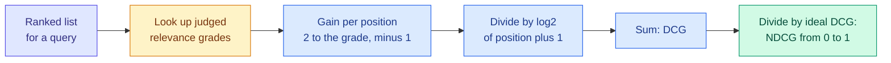

# Ranking Metrics: Precision@k, Recall@k, Hit Rate, MRR, MAP and NDCG

**Level:** 🟡 Intermediate → 🔴 Advanced &nbsp;|&nbsp; **Effort:** Detailed module &nbsp;|&nbsp; **Module:** [07 Model Training and Evaluation](README.md)

---

## 🎯 Learning Objectives

By the end of this topic you will be able to:

- Explain why search, recommendation and retrieval need their own metrics
- Compute precision@k, recall@k, hit rate, reciprocal rank, average precision and NDCG by hand and in code
- Check a from-scratch NDCG against scikit-learn's
- Show two systems swapping places depending on the metric, and say which metric matches which product
- Explain how unjudged documents, the choice of k and empty queries make ranking metrics mislead

## 📚 Prerequisites

- [Topic 6: Classification Metrics](06-classification-metrics.md) — precision and recall
- [Topic 7: ROC and Probability Metrics](07-roc-pr-and-probability-metrics.md) — ranking versus calibration

```bash
pip install -r requirements.txt      # scikit-learn==1.5.2, numpy==2.1.3
```

---

## 🍰 1. The simple version

A search engine, a recommender or the retrieval step of a retrieval-augmented generation (RAG) system does not
answer yes or no. It returns an **ordered list**, and people look mostly at the top. So the questions become:

- **Is anything useful near the top?** — hit rate, reciprocal rank
- **How much of the top is useful?** — precision@k
- **How much of everything useful made it into the top?** — recall@k
- **Are the *most* useful items first?** — NDCG, which also handles "somewhat relevant" versus "exactly right"

The "@k" means "looking only at the first $k$ results" — usually the number the product actually shows.

## 🏠 2. Real-life analogy

> Ask a librarian for books on sourdough baking. If the best book is on the bottom of a stack of twenty, you may
> never reach it. If the top three are all good, you are happy even if the other seventeen are poor. How good the
> librarian was depends on how far down the stack you would actually read.

**Where the analogy breaks down:** you can judge every book in the stack. In real systems nobody has judged most of
the documents — which, as section 6 shows, quietly changes the scores.

---

## ⚙️ 3. The metrics

For one query, with a ranked list and relevance judgements:

| Metric | Formula | Answers | Graded relevance? |
| --- | --- | --- | --- |
| **Precision@k** | relevant in top $k$ ÷ $k$ | How much of what I show is useful? | No |
| **Recall@k** | relevant in top $k$ ÷ all relevant | How much of what exists did I show? | No |
| **Hit rate@k** | 1 if any relevant item is in the top $k$, else 0 | Did I show *anything* useful? | No |
| **Reciprocal rank (RR)** | $1 / \text{rank of the first relevant item}$ | How far must the user scroll to the first useful item? | No |
| **Average precision (AP)** | Mean of precision@i at each rank $i$ holding a relevant item, divided over all relevant items | Are *all* relevant items near the top? | No |
| **NDCG@k** | DCG@k ÷ ideal DCG@k (below) | Are the *most* relevant items at the top? | **Yes** |

Averaged over queries: **MRR** is mean reciprocal rank and **MAP** is mean average precision.

### 📐 Normalised discounted cumulative gain (NDCG)

$$
\text{DCG@}k = \sum_{i=1}^{k} \frac{2^{g_i} - 1}{\log_2(i + 1)} \qquad
\text{NDCG@}k = \frac{\text{DCG@}k}{\text{IDCG@}k}
$$

| Symbol | Means |
| --- | --- |
| $g_i$ | Relevance grade of the item at rank $i$ — for example 0 irrelevant to 3 perfect |
| $2^{g_i} - 1$ | The gain: a grade-3 item is worth 7, a grade-1 item only 1 |
| $\log_2(i + 1)$ | The discount: rank 1 divides by 1, rank 3 by 2, rank 7 by 3 — lower positions count less |
| IDCG@k | The DCG of the best possible ordering of the judged items, so NDCG runs from 0 to 1 |



---

## 💻 4. Code example — two systems, six metrics

Three queries with graded judgements, and the top five results from two retrieval systems. **Teaching use only** —
real evaluation sets have hundreds or thousands of queries.

```python
"""Six ranking metrics from scratch - and two systems that swap places depending on which you read."""

import numpy as np
from sklearn.metrics import ndcg_score

# Relevance grades: 3 perfect, 2 good, 1 partial. Documents not listed are unjudged, and counted as 0.
judgements = {
    "q1": {"d1": 3, "d2": 2, "d5": 1},
    "q2": {"d7": 3, "d9": 1},
    "q3": {"d4": 2, "d6": 2, "d8": 1, "d10": 1},
}
system_a = {"q1": ["d1", "d3", "d4", "d2", "d5"], "q2": ["d7", "d1", "d2", "d3", "d4"],
            "q3": ["d1", "d2", "d4", "d6", "d8"]}
system_b = {"q1": ["d2", "d5", "d1", "d3", "d4"], "q2": ["d9", "d7", "d2", "d3", "d4"],
            "q3": ["d8", "d10", "d6", "d4", "d1"]}


def ranking_metrics(ranking, grades, k=5):
    rel = [grades.get(doc, 0) for doc in ranking[:k]]
    hits = [g > 0 for g in rel]
    n_relevant = sum(g > 0 for g in grades.values())
    precision = sum(hits) / k
    recall = sum(hits) / n_relevant
    hit_rate = float(any(hits))
    reciprocal_rank = next((1 / (i + 1) for i, hit in enumerate(hits) if hit), 0.0)
    average_precision = sum(sum(hits[: i + 1]) / (i + 1) for i, hit in enumerate(hits) if hit) / n_relevant
    dcg = sum((2 ** g - 1) / np.log2(i + 2) for i, g in enumerate(rel))
    ideal = sorted(grades.values(), reverse=True)[:k]
    idcg = sum((2 ** g - 1) / np.log2(i + 2) for i, g in enumerate(ideal))
    return precision, recall, hit_rate, reciprocal_rank, average_precision, dcg / idcg


names = ["P@5", "R@5", "hit@5", "MRR", "MAP", "NDCG@5"]
print(f"{'system':<10}" + "".join(f"{n:>8}" for n in names))
for label, system in [("A", system_a), ("B", system_b)]:
    per_query = np.array([ranking_metrics(system[q], judgements[q]) for q in judgements])
    print(f"{label:<10}" + "".join(f"{v:>8.3f}" for v in per_query.mean(axis=0)))

# Check the from-scratch NDCG against scikit-learn for one query. scikit-learn uses the grade itself as the
# gain, so pass 2**grade - 1 to match the formula above.
documents = sorted(set(judgements["q1"]) | set(system_a["q1"]))
gains = [[2 ** judgements["q1"].get(d, 0) - 1 for d in documents]]
scores = [[len(system_a["q1"]) - system_a["q1"].index(d) if d in system_a["q1"] else 0 for d in documents]]
print(f"\nquery q1, system A:  from scratch {ranking_metrics(system_a['q1'], judgements['q1'])[5]:.4f}, "
      f"scikit-learn {ndcg_score(gains, scores, k=5):.4f}")
```

**Output:**
```
system         P@5     R@5   hit@5     MRR     MAP  NDCG@5
A            0.467   0.750   1.000   0.778   0.519   0.796
B            0.600   1.000   1.000   1.000   1.000   0.743

query q1, system A:  from scratch 0.9240, scikit-learn 0.9240
```

**Both systems score a perfect hit rate** — every query had at least one relevant document in the top five — so hit
rate cannot tell them apart.

**System B wins on precision, recall, MRR and MAP.** It retrieved every relevant document for every query, and always
put a relevant one first.

**System A wins on NDCG.** On two of three queries it put the single *best* document — grade 3 — at rank 1, while B
put lower-graded but still relevant documents first. The binary metrics count "partial" and "perfect" alike; NDCG's
exponential gain does not.

**Which system is better depends on the product:**

| Product | Behaviour that matters | Metric |
| --- | --- | --- |
| Web search, question answering | The one best answer at the top | NDCG, MRR |
| Retrieval for RAG | Every relevant passage in the context window | Recall@k |
| Legal or patent discovery | Missing nothing | Recall@k at large k |
| Recommendations shown as a short row | How much of the row is worth clicking | Precision@k, hit rate |
| "Did we find anything at all?" | Coverage | Hit rate |

---

## ⚠️ 5. When each metric misleads

| Metric | Misleads when |
| --- | --- |
| **Precision@k** | A query has fewer than $k$ relevant items — a perfect system still scores below 1; the ceiling varies by query |
| **Recall@k** | The number of relevant items is unknown or incomplete — the denominator is only what was judged |
| **Hit rate@k** | Anything relevant anywhere in the top $k$ counts equally; it saturates at 1 for decent systems, as above |
| **MRR** | Only the first relevant item counts; a list with one good item then junk equals a list of all good items |
| **MAP** | Relevance is graded — it treats partial and perfect matches alike |
| **NDCG** | Grades are arbitrary or inconsistent between judges; the exponential gain amplifies small labelling differences |
| **All of them** | Queries with no relevant items: recall and AP are undefined, and whether they are dropped or scored 0 changes the average |

### ⚠️ The biggest trap: unjudged documents are not irrelevant documents

In real evaluation sets, only a small **pool** of documents per query is judged — usually those found by the systems
that existed when the judgements were made. **A new system that finds relevant documents nobody judged is scored as
if it found junk.**

```python
import numpy as np


def ndcg_at_k(ranking, grades, k=5):
    rel = [grades.get(doc, 0) for doc in ranking[:k]]
    dcg = sum((2 ** g - 1) / np.log2(i + 2) for i, g in enumerate(rel))
    ideal = sorted(grades.values(), reverse=True)[:k]
    return dcg / sum((2 ** g - 1) / np.log2(i + 2) for i, g in enumerate(ideal))


judged_by_old_systems = {"d1": 3, "d2": 2, "d5": 1}
new_system = ["d11", "d12", "d1", "d2", "d5"]            # finds two documents the old pool never contained
print(f"NDCG@5 with the old judgements:             {ndcg_at_k(new_system, judged_by_old_systems):.3f}")

after_judging_them = {**judged_by_old_systems, "d11": 3, "d12": 3}
print(f"NDCG@5 once d11 and d12 are judged:         {ndcg_at_k(new_system, after_judging_them):.3f}")
old_system = ["d1", "d2", "d5", "d3", "d4"]
print(f"the old system, same new judgements:        {ndcg_at_k(old_system, after_judging_them):.3f}")
```

**Output:**
```
NDCG@5 with the old judgements:             0.551
NDCG@5 once d11 and d12 are judged:         1.000
the old system, same new judgements:        0.566
```

**With the old judgements, the new system looks clearly worse than a perfect ranking; once its finds are judged, it
is the better system by a wide margin** — and the old system, which looked perfect, drops. The metric was measuring
agreement with the old systems as much as quality.

**Defences:** judge the top results of every new system before comparing (pooling), report how many of the top $k$
results were unjudged, and treat a large unjudged share as "unknown", not "irrelevant".

---

## 🏭 6. Production notes

- **Offline metrics predict online behaviour only partly.** Clicks, dwell time and conversions are the real outcome;
  run A/B tests before trusting an offline gain ([Hypothesis Testing](../02-mathematics-for-ai/08-hypothesis-testing-and-ab-testing.md)).
- **Click logs are biased by position.** Users click what they are shown, especially near the top, so treating clicks
  as relevance labels rewards the current ranking. Correcting for that is the subject of counterfactual evaluation in
  [21 Recommender Systems](../21-recommender-systems/README.md).
- **Evaluate retrieval separately from generation in RAG.** If recall@k of the retriever is low, no prompt can recover
  the missing passage ([16 RAG](../16-rag/README.md), [36 AI Evaluation](../36-ai-evaluation/README.md)).
- **Report per-query distributions**, not only means; a system can win on average while failing a whole class of
  queries badly.

## ⚠️ 7. Common mistakes

| Mistake | Why it happens | Fix |
| --- | --- | --- |
| Using hit rate to compare good systems | It is easy to explain | Both systems scored 1.000; it cannot separate them |
| Treating unjudged as irrelevant | It is the library default | Judge new systems' top results; report the unjudged share |
| Choosing k by convention | "Everyone reports @10" | Use the number of results the product shows |
| Binary metrics for graded relevance | Simpler labels | MAP and MRR preferred B; NDCG preferred A for its best-first ranking |
| scikit-learn `ndcg_score` with raw grades, expecting $2^g - 1$ gains | Different conventions | It uses the grade as the gain; pass $2^g - 1$ to match |
| Averaging over queries with no relevant items | They are in the query log | Decide and document whether they are dropped |

## 🔐 8. Security note

Ranking systems are targets for manipulation: spam pages and fake reviews exist to be ranked. A system can improve
on offline relevance metrics while becoming easier to game. Evaluate on query sets that include known manipulation
attempts, track the share of flagged content in the top $k$, and never let user-supplied content in a RAG corpus be
ranked highly without source checks — retrieved text can carry prompt-injection instructions
([28 AI Security](../28-ai-security/README.md)).

---

## 🎤 9. Interview questions

<details>
<summary><b>Q1: What is NDCG, and when would you use it instead of MAP?</b></summary>

Normalised discounted cumulative gain sums a gain for each result — $2^{g} - 1$ for relevance grade $g$ — discounted by
$\log_2$ of position plus one, and divides by the same sum for the ideal ordering, giving a score from 0 to 1. Use it
when relevance is graded and putting the best item first matters. MAP treats relevance as binary, so it cannot tell
a perfect answer at rank 1 from a partially relevant one. In the example, system B won on MAP and system A on NDCG,
because A put the grade-3 documents first.
</details>

<details>
<summary><b>Q2: What does MRR measure, and what does it miss?</b></summary>

Mean reciprocal rank averages $1/\text{rank}$ of the first relevant result per query — how far a user must scroll to
the first useful item. It suits tasks with one right answer, such as known-item search or question answering. It
ignores everything after the first relevant result, so a list with one good item followed by junk scores the same as a
list of all good items.
</details>

<details>
<summary><b>Q3: Why can offline ranking metrics mislead when comparing a new system to an old one?</b></summary>

Relevance judgements usually cover only the documents earlier systems retrieved. A new system that finds relevant
but unjudged documents is scored as if they were irrelevant. In the example, NDCG rose substantially once a new system's
finds were judged, and the old system's score fell. Pool and judge the new system's results, report the unjudged share,
and confirm with online tests.
</details>

---

## ✅ Key takeaways

- Ranked lists need **ranked metrics**, computed over the top $k$ the product actually shows.
- **Precision@k, recall@k, hit rate, MRR, MAP** treat relevance as yes or no; **NDCG** handles grades and position.
- **Two systems swapped places**: B won on MAP and MRR, A on NDCG. Choose the metric that matches the product.
- **Unjudged is not irrelevant**: judging a new system's finds reversed a comparison.
- Offline metrics are a filter; **online outcomes** are the verdict.

---

## 📚 Official References

- [scikit-learn: ndcg_score — scikit-learn developers](https://scikit-learn.org/stable/modules/generated/sklearn.metrics.ndcg_score.html) — verified 2026-09-18
- [Introduction to Information Retrieval, evaluation of ranked retrieval results — Manning, Raghavan and Schütze, Cambridge University Press](https://nlp.stanford.edu/IR-book/html/htmledition/evaluation-of-ranked-retrieval-results-1.html) — verified 2026-09-18; free online edition

---

## 🔗 Navigation

[← Topic 7: ROC, Precision-Recall and Probability Metrics](07-roc-pr-and-probability-metrics.md) &nbsp;|&nbsp;
[🏠 Module Home](README.md) &nbsp;|&nbsp;
[Next module: 08 Deep Learning →](../08-deep-learning/README.md)
