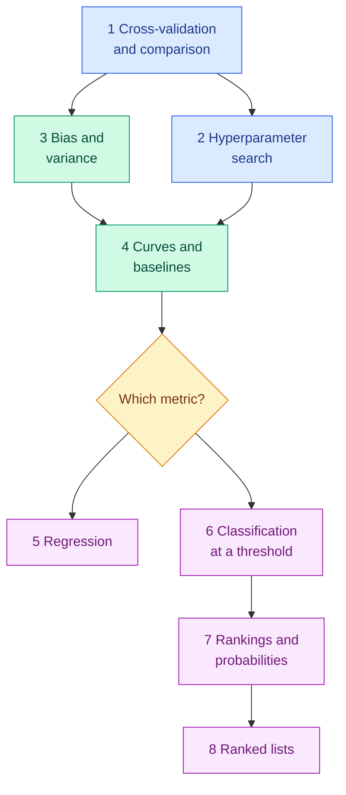

<!-- status: authored -->

# 07. Model Training and Evaluation

**Level:** 🟡 Intermediate → 🔴 Advanced &nbsp;|&nbsp; **Effort:** Detailed module &nbsp;|&nbsp; **Status:** ✅ Complete

How to know whether a model is actually good: validation design, hyperparameter search, the bias-variance
trade-off, baselines — and the metric families, each with the situations in which it lies to you.

> **Every number a model produces is an estimate, and every metric answers one narrow question.** This module shows
> a single split swinging from 93.9% to 100%, a search reporting 60% for a model that delivers 55%, adjusted R² of
> 0.849 for a model worth −2.494, and a do-nothing classifier scoring an F1 of 0.974. Each is real output from code
> you can run.

---

## 🎯 Learning Objectives

By the end of this module you will be able to:

- Design a validation strategy that matches the data — stratified, grouped or time-series — and report its uncertainty
- Compare models on the same folds without overconfident statistics
- Tune hyperparameters with random search or Bayesian optimisation, and estimate the tuned model honestly
- Diagnose bias and variance with learning and validation curves, and always beat a baseline first
- Select regression, classification, probability and ranking metrics that match the business cost of each error
- Explain precisely when accuracy, AUC, R², MAPE, F1 and the ranking metrics mislead

## 📚 Prerequisites

- [05 Machine Learning](../05-machine-learning/README.md)
- [Splits, Sampling and Class Imbalance](../03-data-foundations/06-splits-sampling-and-class-imbalance.md) — the split
  roles, stratification and imbalance basics this module builds on
- [Hypothesis Testing](../02-mathematics-for-ai/08-hypothesis-testing-and-ab-testing.md) and
  [Probability](../02-mathematics-for-ai/06-probability.md)

```bash
pip install -r requirements.txt      # scikit-learn==1.5.2, scipy==1.14.1, numpy==2.1.3, pandas==2.2.3
```

---

## 📑 Topics

| # | Topic | Covers | Level |
| --- | --- | --- | --- |
| 1 | [Cross-Validation and Comparing Models](01-cross-validation-and-comparing-models.md) | Split variance, k-fold schemes, time-series splits with a gap, the corrected t-test | 🟡 → 🔴 |
| 2 | [Hyperparameter Search](02-hyperparameter-search.md) | Grid versus random, Bayesian optimisation from scratch, successive halving, nested cross-validation | 🟡 → 🔴 |
| 3 | [Bias, Variance and the Trade-Off](03-bias-variance-and-the-trade-off.md) | The decomposition measured directly; underfitting, overfitting, double descent | 🟡 |
| 4 | [Learning Curves, Validation Curves and Baselines](04-learning-curves-and-baselines.md) | Diagnosing bias and variance on real data, regularisation, early stopping, the baseline ladder | 🟡 |
| 5 | [Regression Metrics](05-regression-metrics.md) | MAE, MSE, RMSE, R², adjusted R², MAPE — and what each rewards | 🟡 |
| 6 | [Classification Metrics](06-classification-metrics.md) | Confusion matrix, precision, recall, specificity, F1, cost-based thresholds, averaging | 🟡 |
| 7 | [ROC, Precision-Recall and Probability Metrics](07-roc-pr-and-probability-metrics.md) | ROC AUC, PR AUC, log loss, Brier, calibration, MCC, balanced accuracy, top-k | 🔴 |
| 8 | [Ranking Metrics](08-ranking-metrics.md) | Precision@k, recall@k, hit rate, MRR, MAP, NDCG, unjudged documents | 🟡 → 🔴 |

---

## 🗺️ How the pieces fit



**Topics 1–2 are how you estimate.** **Topics 3–4 are how you diagnose** what an estimate is telling you. **Topics 5–8
are what you measure**, one metric family each — and every metric section ends with *when this metric misleads*.

**What this module deliberately does not repeat:** train/validation/test roles, stratification, grouped splits and
imbalance handling are in [Splits and Imbalance](../03-data-foundations/06-splits-sampling-and-class-imbalance.md);
p-values and A/B tests in [Hypothesis Testing](../02-mathematics-for-ai/08-hypothesis-testing-and-ab-testing.md);
ridge, lasso and boosting's early stopping in [05 Machine Learning](../05-machine-learning/README.md). Evaluating
generative models and large language models is owned by [36 AI Evaluation](../36-ai-evaluation/README.md).

---

## 🧭 Which topics do you actually need?

| If you are | Read |
| --- | --- |
| New to model evaluation | All eight, in order |
| Tuning a model at work | 1, 2, 4 |
| Choosing a metric for a new product | 4, then whichever of 5–8 fits the output |
| Working on fraud, risk or medical screening | 6, 7 |
| Building search, recommendations or RAG retrieval | 8, then [16 RAG](../16-rag/README.md) |
| Preparing for interviews | 1, 3, 6, 7 — the most frequently asked |

---

## 🧪 Every example is verified

Each code block was executed and shows its **real** output, enforced in continuous integration:

```bash
python scripts/check_examples.py --strict 07-model-evaluation/
```

Some results contradict common practice:

- **A naive t-test on 50 folds gave p = 1.6e-08; the corrected test gave 0.072** — not significant.
- **Random search beat a grid of the same size in 92% of runs.**
- **Linear regression beat a random forest and gradient boosting** on the diabetes data.
- **The same errors produced R² of 0.895 and 0.111**, depending only on the spread of the test data.
- **The default 0.5 threshold caught 36% of positives** and cost more than any deliberately chosen threshold.
- **ROC AUC stayed at 0.85 while precision at the same recall fell from 86% to 3%.**
- **Judging a new retrieval system's unjudged finds reversed a comparison.**

## 📝 Practice

- Quiz: [`quizzes/07-model-evaluation.md`](../quizzes/07-model-evaluation.md)
- Answers: [`quizzes/answers/07-model-evaluation.md`](../quizzes/answers/07-model-evaluation.md)
- Assignments: [`assignments/07-model-evaluation.md`](../assignments/07-model-evaluation.md)

---

## ⚠️ The five mistakes this module exists to prevent

1. **Trusting one number.** A single split, a single threshold or a single metric is one sample of one question.
2. **Validating on the wrong split.** Shuffled folds on time series, or rows of one user on both sides, measure an
   easier problem than production.
3. **Reporting the winner's score.** The best of many searched configurations is optimistic; nested cross-validation
   or a sealed test set is not.
4. **Skipping the baseline.** A model's score means nothing until you know what the simple approach scores.
5. **Choosing metrics by habit.** Accuracy, ROC AUC, R² and MAPE each mislead in predictable situations. Start from
   what each kind of error costs.

---

## 📚 Official References

- [scikit-learn: Cross-validation, evaluating estimator performance — scikit-learn developers](https://scikit-learn.org/stable/modules/cross_validation.html) — verified 2026-09-18
- [scikit-learn: Metrics and scoring — scikit-learn developers](https://scikit-learn.org/stable/modules/model_evaluation.html) — verified 2026-09-18
- [scikit-learn: Tuning the hyper-parameters of an estimator — scikit-learn developers](https://scikit-learn.org/stable/modules/grid_search.html) — verified 2026-09-18
- [An Introduction to Statistical Learning, book site — James, Witten, Hastie, Tibshirani and Taylor](https://www.statlearning.com/) — verified 2026-09-18

---

## 🔗 Navigation

[← 06 Feature Engineering](../06-feature-engineering/README.md) &nbsp;|&nbsp;
[🏠 Repository Home](../README.md) &nbsp;|&nbsp;
[Topic 1: Cross-Validation and Comparing Models →](01-cross-validation-and-comparing-models.md)

**Next module:** [08 Deep Learning](../08-deep-learning/README.md)
