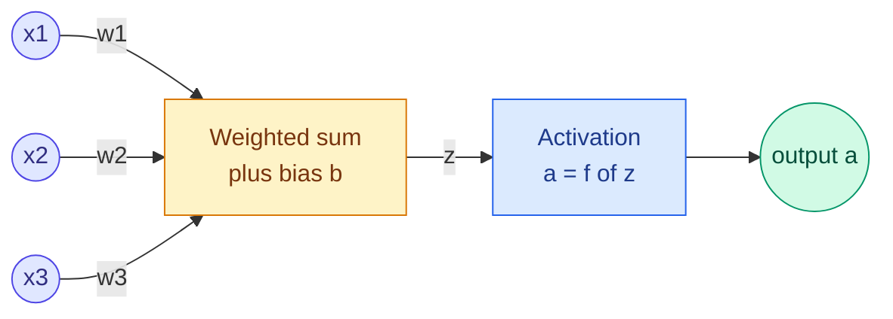

# Neurons, Perceptrons and Layers

**Level:** 🟢 Beginner → 🟡 Intermediate &nbsp;|&nbsp; **Effort:** Short module &nbsp;|&nbsp; **Module:** [08 Deep Learning](README.md)

---

## 🎯 Learning Objectives

By the end of this topic you will be able to:

- Compare a biological neuron with an artificial one, and say where the analogy stops
- Implement the perceptron learning rule and show it converging — and failing forever on XOR
- Describe a layer as a matrix multiplication plus a bias, and count a network's parameters
- Show that stacking layers without a non-linearity collapses to a single layer
- Build a small multilayer network in PyTorch and read its shapes

## 📚 Prerequisites

- [Linear Algebra](../02-mathematics-for-ai/02-linear-algebra-vectors-and-matrices.md) — matrix multiplication
- [Gradient Descent and Backpropagation](../02-mathematics-for-ai/05-gradient-descent-and-backpropagation.md) — its lab
  trains a two-layer network on XOR in NumPy; this topic explains why that network needed two layers
- [Classification](../05-machine-learning/04-classification.md) — logistic regression, which is a one-neuron network

```bash
pip install -r requirements.txt
pip install -r requirements-dl.txt --index-url https://download.pytorch.org/whl/cpu    # torch==2.14.0, CPU build
```

macOS: drop the `--index-url` part. See [the module overview](README.md) for why PyTorch is installed separately.

---

## 🍰 1. The simple version

**An artificial neuron is a weighted vote.** It takes some numbers in, multiplies each by a weight that says how
much it matters, adds them up with a bias, and passes the total through a simple function that decides how
strongly to "fire".

A **layer** is many neurons looking at the same inputs, each with its own weights. A **network** is layers feeding
into layers. **Deep learning** is training networks with many layers, so that early layers build simple features
and later layers combine them into complex ones.

**None of this is magic, and very little of it is biology.** A layer is one matrix multiplication; a network is a
chain of them with simple functions in between.

## 🏠 2. Real-life analogy

> A hiring panel. Each panellist weighs the candidate's CV differently — one cares about experience, another about
> education — and gives a score. A second round combines the panellists' scores into "technical fit" and "team fit".
> A final decision combines those. No single person sees the whole picture; the structure does.

**Where the analogy breaks down:** panellists can explain their reasoning. The "features" a network's hidden
layers learn are whatever reduced the training loss, and often have no human-readable meaning
([27 Explainable AI](../27-explainable-ai/README.md)).

---

## 🧠 3. Biological and artificial neurons

| | Biological neuron | Artificial neuron |
| --- | --- | --- |
| Inputs | Signals from thousands of other neurons at synapses | A vector of numbers $x_1 \dots x_n$ |
| Strength of a connection | Synaptic strength, changed by experience | A weight $w_i$, changed by gradient descent |
| Combination | Electrical charge accumulates in the cell | A weighted sum $z = \sum_i w_i x_i + b$ |
| Output | A spike when a threshold is crossed; timing matters | One number $a = f(z)$, no timing |
| Learning | Many local mechanisms, still not fully understood | One global rule: backpropagation of a loss |
| Scale | About 86 billion neurons in a human brain | Millions to trillions of weights |

**The name is historical.** Early researchers were inspired by neurons; modern networks are better understood as
differentiable functions built from matrix multiplications. Treat "neuron" as a label, not a claim about brains.



---

## ⚡ 4. The perceptron: the first learning neuron

Frank Rosenblatt's perceptron (1958) is one neuron with a step function: output 1 if $w \cdot x + b > 0$, else 0. Its
learning rule is simple enough to do by hand:

$$
\text{for each example: } \quad w \leftarrow w + (y - \hat{y})\,x, \qquad b \leftarrow b + (y - \hat{y})
$$

When the prediction $\hat{y}$ is right, nothing changes. When it is wrong, the weights move towards the example (if
it should have fired) or away from it (if it should not). **The perceptron convergence theorem** guarantees it
finds a separating line in a finite number of steps — **if one exists**.

```python
"""The perceptron learning rule on AND, OR and XOR."""

import numpy as np


def train_perceptron(X, y, epochs=20):
    w, b = np.zeros(X.shape[1]), 0.0
    mistakes_per_epoch = []
    for _ in range(epochs):
        mistakes = 0
        for x_i, y_i in zip(X, y, strict=True):
            prediction = 1 if x_i @ w + b > 0 else 0
            if prediction != y_i:
                w += (y_i - prediction) * x_i                   # nudge towards or away from this example
                b += y_i - prediction
                mistakes += 1
        mistakes_per_epoch.append(mistakes)
        if mistakes == 0:
            break
    return w, b, mistakes_per_epoch


inputs = np.array([[0, 0], [0, 1], [1, 0], [1, 1]], dtype=float)
for name, targets in [("AND", [0, 0, 0, 1]), ("OR", [0, 1, 1, 1]), ("XOR", [0, 1, 1, 0])]:
    w, b, history = train_perceptron(inputs, np.array(targets))
    status = f"learned in {len(history)} epochs" if history[-1] == 0 else f"still wrong after {len(history)} epochs"
    print(f"{name:<4} weights {w}, bias {b:+.0f}   mistakes per epoch {history[:8]}"
          f"{' ...' if len(history) > 8 else ''}   {status}")
```

**Output:**
```
AND  weights [2. 1.], bias -2   mistakes per epoch [1, 3, 3, 2, 1, 0]   learned in 6 epochs
OR   weights [1. 1.], bias +0   mistakes per epoch [1, 2, 1, 0]   learned in 4 epochs
XOR  weights [-1.  0.], bias +1   mistakes per epoch [2, 3, 4, 4, 4, 4, 4, 4] ...   still wrong after 20 epochs
```

**AND and OR were learned in a handful of passes. XOR never was** — from the third epoch on, it got all four
examples wrong in every pass, forever. XOR's positive cases, (0, 1) and (1, 0), sit on opposite corners of the square; no single straight line
separates them from (0, 0) and (1, 1). A single neuron draws exactly one straight line.

In 1969 Minsky and Papert's book *Perceptrons* made this limitation famous, and it contributed to the first "AI winter"
([Turing Test, History and AI Winters](../04-ai-foundations/06-turing-test-history-and-ai-winters.md)). The fix —
multiple layers trained by backpropagation — became practical in the 1980s.

---

## 🧱 5. Layers are matrix multiplications

A layer of $m$ neurons, each looking at the same $n$ inputs, computes all $m$ weighted sums at once:

$$
\mathbf{z} = W\mathbf{x} + \mathbf{b}, \qquad \mathbf{a} = f(\mathbf{z})
$$

| Symbol | Shape | Means |
| --- | --- | --- |
| $\mathbf{x}$ | $n$ | The input vector |
| $W$ | $m \times n$ | Row $j$ holds neuron $j$'s weights |
| $\mathbf{b}$ | $m$ | One bias per neuron |
| $f$ | — | The activation, applied to each element ([Topic 5](05-activation-functions.md)) |
| Parameters | $m \times n + m$ | Everything the layer learns |

With a batch of $B$ examples stacked as rows, the whole batch goes through in one multiplication — which is why
GPUs, built for large matrix multiplications, made deep learning practical.

### ⚠️ Without a non-linearity, depth is an illusion

Two linear layers in a row compute $W_2(W_1\mathbf{x} + \mathbf{b}_1) + \mathbf{b}_2 = (W_2W_1)\mathbf{x} + (W_2\mathbf{b}_1 + \mathbf{b}_2)$ —
**one** linear layer with different numbers. Stack a hundred and you still have one. The activation function between
layers is what makes depth add expressive power.

```python
"""A multilayer network in PyTorch: shapes, parameter counts, and the collapse without activations."""

import torch
from torch import nn

torch.manual_seed(0)

network = nn.Sequential(
    nn.Linear(64, 32),      # 64 inputs, e.g. the pixels of an 8x8 image -> 32 hidden neurons
    nn.ReLU(),
    nn.Linear(32, 16),
    nn.ReLU(),
    nn.Linear(16, 10),      # 10 outputs, one score per digit
)

batch = torch.randn(5, 64)                                   # a batch of 5 examples
print(f"input {tuple(batch.shape)}")
activation = batch
for layer in network:
    activation = layer(activation)
    print(f"  after {layer.__class__.__name__:<7} {tuple(activation.shape)}")

print("\nparameters per layer:")
for name, parameter in network.named_parameters():
    print(f"  {name:<10} {str(tuple(parameter.shape)):<10} {parameter.numel():>5}")
print(f"  total                 {sum(p.numel() for p in network.parameters()):>5}")

# Two linear layers with nothing between them are exactly one linear layer.
first, second = nn.Linear(64, 32), nn.Linear(32, 10)
merged = nn.Linear(64, 10)
with torch.no_grad():
    merged.weight.copy_(second.weight @ first.weight)
    merged.bias.copy_(second.weight @ first.bias + second.bias)
    largest_gap = (second(first(batch)) - merged(batch)).abs().max().item()
print(f"\ntwo stacked linear layers versus one merged layer: largest difference below 1e-5: {largest_gap < 1e-5}")
```

**Output:**
```
input (5, 64)
  after Linear  (5, 32)
  after ReLU    (5, 32)
  after Linear  (5, 16)
  after ReLU    (5, 16)
  after Linear  (5, 10)

parameters per layer:
  0.weight   (32, 64)    2048
  0.bias     (32,)         32
  2.weight   (16, 32)     512
  2.bias     (16,)         16
  4.weight   (10, 16)     160
  4.bias     (10,)         10
  total                  2778

two stacked linear layers versus one merged layer: largest difference below 1e-5: True
```

**Every shape follows from the layer sizes**: a `Linear(64, 32)` layer stores a 32 × 64 weight matrix and 32 biases —
2,080 numbers. PyTorch stores the weight as (outputs, inputs), so each row is one neuron. The whole network has
2,778 parameters, fewer than a single photo has pixels.

**The last line is the collapse, measured.** Two stacked linear layers and one merged layer give the same outputs to
within floating-point rounding. Without `nn.ReLU()` in between, the three-layer network above would be exactly as
expressive as logistic regression.

---

## 🔌 6. Why depth helps

With non-linearities, the **universal approximation theorem** says a network with a single hidden layer can
approximate any continuous function on a bounded region arbitrarily well — given enough neurons. So why go deep?

- **Efficiency.** Some functions need exponentially many neurons in one wide layer but only a modest number when
  spread over several layers.
- **Reusable features.** Early layers learn simple patterns (edges in images, character pairs in text) that later
  layers combine — the hierarchy the analogy describes.
- **What the theorem does not promise**: that gradient descent will *find* the right weights, or that they will
  generalise. Topics [3](03-training-loop-batches-and-initialisation.md) and
  [4](04-vanishing-gradients-normalisation-dropout-and-residuals.md) are about making training actually work.

---

## 🏭 7. Production notes

- **Parameter count drives memory and cost.** Each float32 parameter is 4 bytes to store, and training needs several
  times more for gradients and optimiser state ([32 Model Optimization](../32-model-optimization/README.md)).
- **Shapes are the first thing to check.** Most bugs in a new network are shape mismatches; print them as above
  before training anything.
- **A single neuron is already a production model**: logistic regression. Reach for depth when a simpler model has
  been shown to underfit ([07 Model Evaluation](../07-model-evaluation/04-learning-curves-and-baselines.md)).

## ⚠️ 8. Common mistakes

| Mistake | Why it happens | Fix |
| --- | --- | --- |
| Forgetting the activation between layers | `nn.Linear` layers stack neatly | Stacked linear layers collapse to one |
| Reading hidden neurons as human concepts | The biological metaphor | They are whatever lowered the loss |
| Confusing PyTorch's weight shape | Maths texts often write $n \times m$ | `nn.Linear(in, out).weight` is (out, in) |
| Expecting a perceptron to learn XOR | It learns AND and OR | One neuron draws one line |
| Using a deep network before a linear baseline | Deep learning is the headline | Try logistic regression first |

---

## 🎤 9. Interview questions

<details>
<summary><b>Q1: Why can a single perceptron not learn XOR?</b></summary>

A perceptron outputs a step function of a weighted sum, so its decision boundary is a single straight line (a
hyperplane in general). XOR's positive examples, (0, 1) and (1, 0), are on opposite corners, and no line separates
them from (0, 0) and (1, 1). The learning rule therefore never converges — in the example it got all four examples
wrong in every epoch from the third on. A hidden layer with a non-linear activation lets the network combine several lines.
</details>

<details>
<summary><b>Q2: Why do neural networks need non-linear activation functions?</b></summary>

A composition of linear maps is a linear map: $W_2(W_1x + b_1) + b_2 = (W_2W_1)x + (W_2b_1 + b_2)$. Without
non-linearities any depth of network is equivalent to a single linear layer, as the example verified numerically. The
activation between layers is what allows the network to represent curved decision boundaries and complex functions.
</details>

<details>
<summary><b>Q3: How many parameters does a fully connected layer with 64 inputs and 32 outputs have?</b></summary>

$64 \times 32$ weights plus 32 biases: 2,080. In general a dense layer from $n$ to $m$ units has $nm + m$ parameters.
</details>

---

## ✅ Key takeaways

- An artificial neuron is a **weighted sum plus bias through an activation**; the biology is inspiration, not
  mechanism.
- The **perceptron** learns any linearly separable problem and **never** learns XOR — all four wrong, epoch after epoch.
- A **layer is a matrix multiplication**: $nm + m$ parameters, weight stored as (outputs, inputs) in PyTorch.
- **Without activations, depth collapses** to a single linear layer — verified numerically.
- Depth helps through efficiency and reusable features; making it *trainable* is the rest of this module.

---

## 📚 Official References

- [PyTorch: Build the Neural Network, tutorial — PyTorch Foundation](https://pytorch.org/tutorials/beginner/basics/buildmodel_tutorial.html) — verified 2026-09-18
- [PyTorch: torch.nn.Linear — PyTorch Foundation](https://pytorch.org/docs/stable/generated/torch.nn.Linear.html) — verified 2026-09-18
- [Deep Learning, book site — Goodfellow, Bengio and Courville, MIT Press](https://www.deeplearningbook.org/) — verified 2026-09-18; chapter 6, deep feedforward networks
- [Dive into Deep Learning, multilayer perceptrons — Zhang, Lipton, Li and Smola](https://d2l.ai/chapter_multilayer-perceptrons/index.html) — verified 2026-09-18; community-maintained open textbook

---

## 🔗 Navigation

[← Module home](README.md) &nbsp;|&nbsp;
[🏠 Repository Home](../README.md) &nbsp;|&nbsp;
[Topic 2: Loss Functions, Computational Graphs and Autograd →](02-loss-functions-computational-graphs-and-autograd.md)
