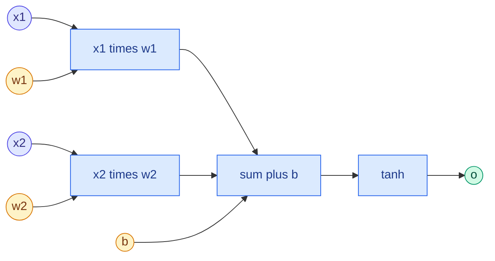

# Loss Functions, Computational Graphs and Autograd

**Level:** 🟡 Intermediate &nbsp;|&nbsp; **Effort:** Detailed module &nbsp;|&nbsp; **Module:** [08 Deep Learning](README.md)

---

## 🎯 Learning Objectives

By the end of this topic you will be able to:

- Describe forward propagation as building a computational graph, and backpropagation as walking it backwards
- Build a working reverse-mode automatic differentiation engine in about 50 lines, and check it against PyTorch
- Explain why gradients must be *accumulated* when a value is used more than once
- Choose a loss function for regression and classification — and show why sigmoid with squared error trains badly
- Use PyTorch's numerically stable losses, and avoid the most common autograd bugs

## 📚 Prerequisites

- [Gradient Descent and Backpropagation](../02-mathematics-for-ai/05-gradient-descent-and-backpropagation.md) — **read
  first**: backpropagation written out by hand for a two-layer network. This topic automates it.
- [Calculus: Derivatives and Gradients](../02-mathematics-for-ai/04-calculus-derivatives-and-gradients.md) — the chain rule
- [Topic 1: Neurons, Perceptrons and Layers](01-neurons-perceptrons-and-layers.md)

```bash
pip install -r requirements.txt
pip install -r requirements-dl.txt --index-url https://download.pytorch.org/whl/cpu    # macOS: omit --index-url
```

---

## 🍰 1. The simple version

Training a network means repeating three steps:

1. **Forward**: push inputs through the layers to get a prediction.
2. **Loss**: measure how wrong the prediction is, as one number.
3. **Backward**: work out, for every weight, which direction to nudge it to make the loss smaller — then nudge.

The backward step is the hard one: a network has thousands or billions of weights. **Automatic differentiation**
("autograd") does it by remembering every operation of the forward pass, then applying the chain rule to each one
in reverse. You write only the forward pass; the gradients come free.

## 🏠 2. Real-life analogy

> A factory ships a faulty product. To find out which station caused it, the inspector walks the assembly line
> **backwards**, from the finished product to the raw materials, asking at each station: "how much did your step
> change the fault?" A station feeding two later stations gets blamed through both.

**Where the analogy breaks down:** a real inspector assigns blame once. Backpropagation computes an exact share of
blame for every parameter, for every training step, millions of times.

---

## 🕸️ 3. Computational graphs

Every expression is a graph: values are nodes, operations are edges. For a single neuron with a tanh activation:

$$
o = \tanh(x_1 w_1 + x_2 w_2 + b)
$$



**Reverse-mode differentiation** starts at the output with $\partial o / \partial o = 1$ and visits the graph in reverse
order. Each operation needs only one local rule:

| Operation | Forward | Backward: gradient passed to each input |
| --- | --- | --- |
| $c = a + b$ | Sum | $\bar{a} \mathrel{+}= \bar{c}$, $\;\bar{b} \mathrel{+}= \bar{c}$ — copies the gradient |
| $c = a \times b$ | Product | $\bar{a} \mathrel{+}= b\,\bar{c}$, $\;\bar{b} \mathrel{+}= a\,\bar{c}$ — swaps the inputs |
| $c = \tanh(a)$ | Squash | $\bar{a} \mathrel{+}= (1 - c^2)\,\bar{c}$ |

Here $\bar{v}$ means $\partial o / \partial v$, the gradient of the final output with respect to $v$. **Note the
`+=`.** When a value feeds several operations, its gradient is the *sum* of the gradients arriving from each — the
multivariable chain rule.

---

## 💻 4. Code example — an autograd engine in 50 lines

A minimal reverse-mode engine for scalars, in the spirit of Andrej Karpathy's micrograd. **Teaching implementation**:
PyTorch does the same thing for tensors, on GPUs, for hundreds of operations.

```python
"""A tiny reverse-mode autograd engine, checked against PyTorch."""

import math

import torch


class Value:
    """A scalar that remembers how it was computed, so it can pass gradients back."""

    def __init__(self, data, parents=()):
        self.data, self.grad, self._parents = data, 0.0, parents
        self._backward = lambda: None

    def __add__(self, other):
        other = other if isinstance(other, Value) else Value(other)
        out = Value(self.data + other.data, (self, other))

        def backward():
            self.grad += out.grad                                 # addition copies the gradient
            other.grad += out.grad

        out._backward = backward
        return out

    def __mul__(self, other):
        other = other if isinstance(other, Value) else Value(other)
        out = Value(self.data * other.data, (self, other))

        def backward():
            self.grad += other.data * out.grad                    # multiplication swaps the inputs
            other.grad += self.data * out.grad

        out._backward = backward
        return out

    def tanh(self):
        t = math.tanh(self.data)
        out = Value(t, (self,))

        def backward():
            self.grad += (1 - t * t) * out.grad

        out._backward = backward
        return out

    def backward(self):
        order, seen = [], set()

        def visit(node):                                          # topological order: parents before children
            if node not in seen:
                seen.add(node)
                for parent in node._parents:
                    visit(parent)
                order.append(node)

        visit(self)
        self.grad = 1.0
        for node in reversed(order):
            node._backward()


# The neuron from the diagram.
x1, x2, w1, w2, b = Value(2.0), Value(-1.0), Value(-3.0), Value(1.0), Value(4.0)
o = (x1 * w1 + x2 * w2 + b).tanh()
o.backward()
ours = [x1.grad, x2.grad, w1.grad, w2.grad, b.grad]

# The same computation in PyTorch.
t = {k: torch.tensor(v, dtype=torch.float64, requires_grad=True)
     for k, v in {"x1": 2.0, "x2": -1.0, "w1": -3.0, "w2": 1.0, "b": 4.0}.items()}
torch.tanh(t["x1"] * t["w1"] + t["x2"] * t["w2"] + t["b"]).backward()
theirs = [t[k].grad.item() for k in ("x1", "x2", "w1", "w2", "b")]

print(f"output o = {o.data:.6f}")
print(f"{'':<6}{'x1':>10}{'x2':>10}{'w1':>10}{'w2':>10}{'b':>10}")
print("ours  " + "".join(f"{g:>10.6f}" for g in ours))
print("torch " + "".join(f"{g:>10.6f}" for g in theirs))

# A value used twice: y = x * x + x, so dy/dx = 2x + 1 = 7 at x = 3. Needs the += accumulation.
x = Value(3.0)
y = x * x + x
y.backward()
print(f"\ny = x*x + x at x = 3:  dy/dx = {x.grad}  (expected 2x + 1 = 7)")
```

**Output:**
```
output o = -0.995055
              x1        x2        w1        w2         b
ours   -0.029598  0.009866  0.019732 -0.009866  0.009866
torch  -0.029598  0.009866  0.019732 -0.009866  0.009866

y = x*x + x at x = 3:  dy/dx = 7.0  (expected 2x + 1 = 7)
```

**Every gradient matches PyTorch.** The engine has no knowledge of neural networks — it knows three local derivative
rules and the order to apply them in. That is the entire idea behind every deep-learning framework.

**The last line is why the `+=` matters.** `x` feeds the multiplication twice and the addition once. Replace `+=`
with `=` in the engine and each later contribution overwrites the earlier ones; the result would be wrong, silently.
The same accumulation causes the most common PyTorch bug — section 7.

---

## 🎯 5. Loss functions

The loss turns "how wrong" into one number whose gradient training can follow.

| Task | Output layer | Loss | PyTorch |
| --- | --- | --- | --- |
| Regression | Linear, no activation | Mean squared error | `nn.MSELoss` |
| Regression with outliers | Linear | Mean absolute error, or Huber (squared near zero, absolute further out) | `nn.L1Loss`, `nn.HuberLoss` |
| Binary classification | One logit, no activation | Binary cross-entropy **with logits** | `nn.BCEWithLogitsLoss` |
| Multi-class classification | One logit per class, no activation | Cross-entropy, which applies softmax internally | `nn.CrossEntropyLoss` |
| Multi-label classification | One logit per label | Binary cross-entropy with logits, per label | `nn.BCEWithLogitsLoss` |

### 📐 Why cross-entropy, not squared error, for classification

With a sigmoid output $p = \sigma(z)$ and target $y$, the gradient with respect to the logit $z$ is:

$$
\text{squared error: } \frac{\partial}{\partial z}(p - y)^2 = 2(p - y)\,p(1 - p) \qquad
\text{cross-entropy: } \frac{\partial}{\partial z}\big[-y\ln p - (1-y)\ln(1-p)\big] = p - y
$$

The factor $p(1 - p)$ is nearly zero whenever the sigmoid is saturated — **including when the model is confidently
wrong**. Squared error then gives almost no signal exactly when a correction is most needed. Cross-entropy's gradient
is simply "prediction minus target".

```python
"""Squared error versus cross-entropy for a sigmoid output: the gradient, and training from a bad start."""

import torch
from torch import nn
from torch.nn.functional import binary_cross_entropy_with_logits

torch.set_default_dtype(torch.float64)     # reproducible digits across CPUs - see the module overview

print(f"{'logit':>6}{'p':>8}{'grad, squared error':>21}{'grad, cross-entropy':>21}   (target is 1)")
for value in [-6.0, -2.0, 0.0, 2.0]:
    z1, z2 = torch.tensor([value], requires_grad=True), torch.tensor([value], requires_grad=True)
    target = torch.tensor([1.0])
    ((torch.sigmoid(z1) - target) ** 2).mean().backward()
    binary_cross_entropy_with_logits(z2, target).backward()
    print(f"{value:>6.1f}{torch.sigmoid(z1).item():>8.4f}{z1.grad.item():>21.4f}{z2.grad.item():>21.4f}")

# One neuron, started confidently wrong, trained 200 steps with each loss.
torch.manual_seed(0)
X = torch.randn(500, 2)
y = (X[:, 0] + X[:, 1] > 0).float()
print(f"\n{'loss':<16}{'step':>6}{'accuracy':>10}")
for name in ["squared error", "cross-entropy"]:
    neuron = nn.Linear(2, 1)
    with torch.no_grad():
        neuron.weight.copy_(torch.tensor([[-8.0, -8.0]]))                 # confidently backwards
        neuron.bias.zero_()
    optimiser = torch.optim.SGD(neuron.parameters(), lr=0.5)
    for step in range(201):
        z = neuron(X).squeeze(1)
        if name == "squared error":
            loss = ((torch.sigmoid(z) - y) ** 2).mean()
        else:
            loss = binary_cross_entropy_with_logits(z, y)
        optimiser.zero_grad()
        loss.backward()
        optimiser.step()
        if step in (0, 50, 200):
            print(f"{name:<16}{step:>6}{((z > 0).float() == y).float().mean().item():>10.3f}")
```

**Output:**
```
 logit       p  grad, squared error  grad, cross-entropy   (target is 1)
  -6.0  0.0025              -0.0049              -0.9975
  -2.0  0.1192              -0.1850              -0.8808
   0.0  0.5000              -0.2500              -0.5000
   2.0  0.8808              -0.0250              -0.1192

loss              step  accuracy
squared error        0     0.000
squared error       50     0.012
squared error      200     0.088
cross-entropy        0     0.000
cross-entropy       50     0.976
cross-entropy      200     0.990
```

**At a logit of −6 with target 1 — confidently wrong — squared error's gradient is about 200 times smaller than
cross-entropy's.** The model is maximally wrong and barely told so.

**Training shows the consequence.** Started with backwards weights, the squared-error neuron was still almost
completely wrong after 200 steps. Cross-entropy corrected it within 50. Same model, same data, same learning rate —
only the loss differed.

### ⚠️ Compute losses from logits, not probabilities

```python
import torch
from torch.nn.functional import binary_cross_entropy_with_logits

logits = torch.tensor([30.0, -30.0])                      # two confidently wrong predictions
targets = torch.tensor([0.0, 1.0])

probabilities = torch.sigmoid(logits)
by_hand = -(targets * torch.log(probabilities) + (1 - targets) * torch.log(1 - probabilities))
print(f"sigmoid, then log by hand:     {by_hand.tolist()}")
print(f"binary_cross_entropy_with_logits: {binary_cross_entropy_with_logits(logits, targets, reduction='none').tolist()}")
```

**Output:**
```
sigmoid, then log by hand:     [inf, 30.0]
binary_cross_entropy_with_logits: [30.0, 30.0]
```

**In float32, `sigmoid(30)` rounds to exactly 1.0, so `log(1 - p)` is `log(0)` — infinity.** One such example turns the
whole batch's loss into `inf`, and the gradients into `nan`. The "with logits" losses combine the sigmoid (or softmax)
and the log into one formula that never computes the rounded probability. **Output raw logits from your model and pass
them to `BCEWithLogitsLoss` or `CrossEntropyLoss`** — never add a sigmoid or softmax layer before those losses.

---

## 🏭 6. Production notes

- **Match the loss to the decision.** The loss decides what "good" means during training, just as the metric does
  during evaluation ([07 Model Evaluation](../07-model-evaluation/README.md)): squared error pulls towards the mean,
  absolute error towards the median, cross-entropy towards calibrated probabilities.
- **Class weights and label smoothing** are loss-level controls for imbalance and over-confidence; both change what
  the model's outputs mean, so re-check calibration afterwards.
- **Watch for `nan` early.** Add a check that stops training when the loss is not finite, and log which batch caused
  it — it is almost always a numerically unstable loss, a learning rate too high, or bad input data.

## ⚠️ 7. Common mistakes

| Mistake | Why it happens | Fix |
| --- | --- | --- |
| Forgetting `optimiser.zero_grad()` | Gradients look like fresh values | PyTorch **accumulates** into `.grad` — the same `+=` as the engine; zero it every step |
| Sigmoid or softmax layer before `BCEWithLogitsLoss` or `CrossEntropyLoss` | Wanting probabilities out | The loss applies it; doing both squashes twice and trains badly |
| Squared error for classification | It is the first loss people learn | Its gradient vanishes when confidently wrong |
| Computing `log(sigmoid(z))` by hand | Following the formula literally | `inf` in float32 at logit 30; use the "with logits" losses |
| Calling `.item()` or `.numpy()` on values needed for backward | Wanting to print them | Those leave the graph; compute the loss as a tensor |
| Evaluating without `torch.no_grad()` | It works anyway | It builds a graph and wastes memory; wrap inference in `torch.no_grad()` |

---

## 🎤 8. Interview questions

<details>
<summary><b>Q1: How does reverse-mode automatic differentiation work?</b></summary>

The forward pass records every operation and its inputs as a graph. The backward pass sets the output's gradient to 1
and visits nodes in reverse topological order; each operation applies its local derivative rule to pass gradients to
its inputs — addition copies the gradient, multiplication multiplies by the other input, and so on. Gradients arriving
at a node from several uses are summed. One backward pass gives the gradient of one output with respect to every input,
which is why it suits neural networks: one scalar loss, many parameters.
</details>

<details>
<summary><b>Q2: Why is cross-entropy preferred to squared error for classification?</b></summary>

With a sigmoid or softmax output, squared error's gradient includes the activation's derivative $p(1-p)$, which is
near zero when the output saturates — including when the model is confidently wrong. Cross-entropy's gradient with
respect to the logit is simply $p - y$, large exactly when the model is badly wrong. In the example a neuron started
with backwards weights stayed wrong for 200 steps under squared error and was corrected within 50 under cross-entropy.
It is also the negative log-likelihood, so it produces calibrated probabilities.
</details>

<details>
<summary><b>Q3: What happens if you forget to call `zero_grad()` in PyTorch?</b></summary>

`backward()` adds new gradients to whatever is already in each parameter's `.grad`, because accumulation is how
autograd correctly handles values used more than once. Without zeroing, each step uses the sum of all previous
gradients, so updates grow and training behaves erratically. Intentional accumulation over several small batches is a
legitimate technique for simulating a larger batch — but then you zero after the update, deliberately.
</details>

---

## ✅ Key takeaways

- The forward pass builds a **computational graph**; backpropagation walks it in reverse applying **local rules**.
- A working autograd engine is **about 50 lines** and matched PyTorch's gradients exactly.
- Gradients **accumulate** where a value is reused — the reason for `zero_grad()`.
- **Cross-entropy for classification**: squared error's gradient was ~200 times smaller when confidently wrong, and it
  failed to train from a bad start.
- **Pass logits to "with logits" losses**; computing `log(sigmoid(z))` by hand returned infinity.

---

## 📚 Official References

- [PyTorch: A Gentle Introduction to torch.autograd — PyTorch Foundation](https://pytorch.org/tutorials/beginner/blitz/autograd_tutorial.html) — verified 2026-09-18
- [PyTorch: Loss functions in torch.nn — PyTorch Foundation](https://pytorch.org/docs/stable/nn.html#loss-functions) — verified 2026-09-18
- [PyTorch: BCEWithLogitsLoss — PyTorch Foundation](https://pytorch.org/docs/stable/generated/torch.nn.BCEWithLogitsLoss.html) — verified 2026-09-18
- [micrograd — Andrej Karpathy, GitHub](https://github.com/karpathy/micrograd) — verified 2026-09-18; community resource, the inspiration for section 4
- [Deep Learning, book site — Goodfellow, Bengio and Courville, MIT Press](https://www.deeplearningbook.org/) — verified 2026-09-18; section 6.5, back-propagation

---

## 🔗 Navigation

[← Topic 1: Neurons, Perceptrons and Layers](01-neurons-perceptrons-and-layers.md) &nbsp;|&nbsp;
[🏠 Module Home](README.md) &nbsp;|&nbsp;
[Topic 3: The Training Loop, Batches and Initialisation →](03-training-loop-batches-and-initialisation.md)
