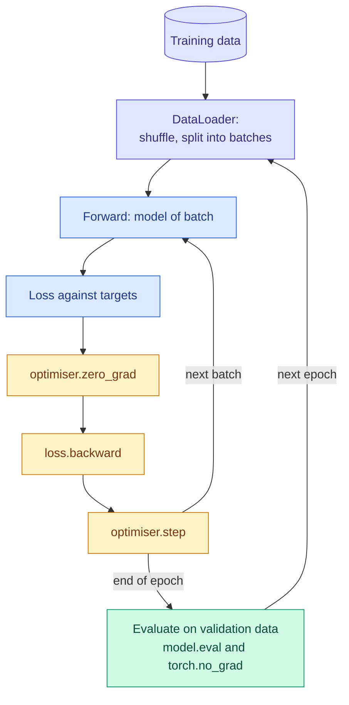

# The Training Loop: Epochs, Batches, Learning Rate and Initialisation

**Level:** 🟡 Intermediate &nbsp;|&nbsp; **Effort:** Detailed module &nbsp;|&nbsp; **Module:** [08 Deep Learning](README.md)

---

## 🎯 Learning Objectives

By the end of this topic you will be able to:

- Write the standard PyTorch training loop — data loader, forward, loss, backward, step, evaluate — from memory
- Explain epochs, batches and steps, and show how batch size changes what a fixed number of epochs achieves
- Recognise a learning rate that is too small or too large from the numbers
- Explain why weights must not start at zero, and why their starting scale matters
- Choose Xavier or He initialisation to match the activation function

## 📚 Prerequisites

- [Topic 2: Loss Functions, Computational Graphs and Autograd](02-loss-functions-computational-graphs-and-autograd.md)
- [Optimisation Algorithms](../02-mathematics-for-ai/09-optimisation-algorithms.md) — SGD, momentum, Adam, AdamW and
  learning-rate schedules are taught there; this topic uses them
- [Gradient Descent](../02-mathematics-for-ai/05-gradient-descent-and-backpropagation.md) — batch versus mini-batch

```bash
pip install -r requirements.txt
pip install -r requirements-dl.txt --index-url https://download.pytorch.org/whl/cpu    # macOS: omit --index-url
```

---

## 🍰 1. The simple version

Training repeats one small step thousands of times: take a handful of examples, see how wrong the network is, and
nudge every weight a little in the direction that would have made it less wrong.

- A **batch** is the handful of examples used for one step.
- A **step** (or iteration) is one nudge.
- An **epoch** is one full pass over the training data — as many steps as there are batches.
- The **learning rate** is the size of the nudge.
- **Initialisation** is where the weights start before the first nudge.

Each of these can quietly ruin training, and each leaves a recognisable fingerprint in the numbers.

## 🏠 2. Real-life analogy

> Learning to throw darts. Each throw is a step; after each one you adjust your aim a little. Adjust too little and
> you improve painfully slowly; adjust too much and you overcorrect wildly. Judging from one throw at a time is noisy;
> waiting to see a hundred throws before adjusting at all is slow. And if you start facing the wrong wall, no amount
> of small adjustments gets you to the board quickly.

**Where the analogy breaks down:** you adjust one arm. A network adjusts every weight at once, and weights that start
identical stay identical — something a dart thrower never has to worry about (section 6).

---

## 🔁 3. The training loop



The data is scikit-learn's handwritten digits — 1,797 8×8 images — so everything runs on a laptop CPU in seconds.
**Teaching use only.**

```python
"""The standard PyTorch training loop, and what batch size and learning rate do to it."""

import torch
from sklearn.datasets import load_digits
from sklearn.model_selection import train_test_split
from torch import nn
from torch.utils.data import DataLoader, TensorDataset

torch.set_default_dtype(torch.float64)     # reproducible digits across CPUs - see the module overview

X, y = load_digits(return_X_y=True)
X_train, X_valid, y_train, y_valid = train_test_split(X / 16.0, y, test_size=0.25, random_state=0, stratify=y)
X_train, X_valid = torch.tensor(X_train, dtype=torch.float64), torch.tensor(X_valid, dtype=torch.float64)
y_train, y_valid = torch.tensor(y_train), torch.tensor(y_valid)


def train(batch_size, learning_rate, epochs=20, seed=0):
    torch.manual_seed(seed)
    model = nn.Sequential(nn.Linear(64, 64), nn.ReLU(), nn.Linear(64, 10))
    optimiser = torch.optim.SGD(model.parameters(), lr=learning_rate)
    loader = DataLoader(TensorDataset(X_train, y_train), batch_size=batch_size, shuffle=True,
                        generator=torch.Generator().manual_seed(seed))
    steps, accuracy_by_epoch = 0, []
    for _ in range(epochs):
        model.train()                                         # training mode (matters for dropout, batch norm)
        for inputs, targets in loader:
            loss = nn.functional.cross_entropy(model(inputs), targets)
            optimiser.zero_grad()                             # gradients accumulate unless cleared
            loss.backward()
            optimiser.step()
            steps += 1
        model.eval()                                          # evaluation mode
        with torch.no_grad():                                 # no graph needed to evaluate
            logits = model(X_valid)
            accuracy_by_epoch.append((logits.argmax(dim=1) == y_valid).float().mean().item())
        final_loss = nn.functional.cross_entropy(logits, y_valid).item()
    return steps, accuracy_by_epoch, final_loss


print("Same 20 epochs, same learning rate 0.1, different batch sizes")
print(f"{'batch size':>10}{'steps':>7}   validation accuracy after epochs 1, 6, 11, 16, 20")
for batch_size in [8, 64, len(X_train)]:
    steps, accuracy, _ = train(batch_size, 0.1)
    print(f"{batch_size:>10}{steps:>7}   " + "  ".join(f"{a:.3f}" for a in accuracy[::5] + accuracy[-1:]))

print("\nSame batch size 64, different learning rates")
print(f"{'learning rate':>13}{'validation loss':>17}{'accuracy':>10}")
for learning_rate in [0.001, 0.1, 1.0, 10.0]:
    _, accuracy, loss = train(64, learning_rate)
    print(f"{learning_rate:>13}{loss:>17.4f}{accuracy[-1]:>10.3f}")
```

**Output:**
```
Same 20 epochs, same learning rate 0.1, different batch sizes
batch size  steps   validation accuracy after epochs 1, 6, 11, 16, 20
         8   3380   0.838  0.967  0.971  0.962  0.971
        64    440   0.367  0.844  0.913  0.942  0.951
      1347     20   0.109  0.180  0.264  0.358  0.438

Same batch size 64, different learning rates
learning rate  validation loss  accuracy
        0.001           2.2940     0.153
          0.1           0.2291     0.951
          1.0           0.0971     0.971
         10.0           3.4923     0.100
```

---

## 📦 4. Epochs, batches and steps

**The first table is about steps, not epochs.** Every run saw each training example 20 times. But batch size 8 took
3,380 small steps, while the full batch — all 1,347 examples at once — took just 20. With the same learning rate,
**the full-batch run still got more than half the digits wrong after 20 epochs.**

| Batch size | Gradient per step | Steps per epoch | Hardware |
| --- | --- | --- | --- |
| Small (8–32) | Noisy estimate | Many | Under-uses a GPU; noise can help escape poor regions |
| Medium (32–512) | Reasonable estimate | Moderate | The common default |
| Full batch | Exact | One | Only for small data; fewest updates per epoch |

**Two practical rules follow:**

- **Compare training runs by steps and by data seen, not by epochs alone.** "20 epochs" means very different amounts
  of learning at different batch sizes.
- **If you change the batch size, revisit the learning rate.** Larger batches give more reliable gradients and
  usually tolerate a proportionally larger learning rate — the "linear scaling" heuristic, which holds only up to a
  point and usually needs a warm-up ([Optimisation Algorithms](../02-mathematics-for-ai/09-optimisation-algorithms.md)).

**Shuffle every epoch.** If the data arrives sorted — all the zeros, then all the ones — consecutive batches pull the
weights in consistent wrong directions. `shuffle=True` with a seeded generator gives a new, reproducible order each
epoch.

---

## 🎚️ 5. The learning rate

**The second table shows all three failure regions:**

- **0.001 is too small.** After 20 epochs the loss has barely moved from its starting value of about 2.3 (which is
  $\ln 10$ — the loss of guessing uniformly among 10 classes) and accuracy is near chance.
- **0.1 and 1.0 train well** here; 1.0 was better within this budget.
- **10.0 diverged.** Each step overshot so far that the network ended worse than guessing.

| Symptom in the loss | Diagnosis |
| --- | --- |
| Stays near its starting value | Learning rate too small — or no gradient at all (sections 6, and [Topic 4](04-vanishing-gradients-normalisation-dropout-and-residuals.md)) |
| Falls steadily | Reasonable |
| Falls fast then plateaus high | Slightly too large; try a schedule that lowers it over time |
| Oscillates or climbs | Too large |
| Becomes `nan` | Much too large, or a numerically unstable loss ([Topic 2](02-loss-functions-computational-graphs-and-autograd.md)) |

**Find it with a sweep on a log scale** — 1e-4, 1e-3, 1e-2, 1e-1, 1 — for a few epochs each, then refine. Adam and
AdamW are less sensitive than plain SGD, which is part of why they are common defaults; their typical starting
learning rates are much smaller, around 1e-3 ([Optimisation Algorithms](../02-mathematics-for-ai/09-optimisation-algorithms.md)).

---

## 🌱 6. Initialisation

### ⚠️ Never start every weight at the same value

If every weight in a layer starts equal, every neuron in it computes the same output, receives the same gradient and
makes the same update. They stay identical forever — a layer of 32 neurons behaves like a layer of one. Random
initialisation **breaks the symmetry**.

### 📐 Scale: keep the signal's size stable through the layers

Each layer multiplies its input by a weight matrix. If the weights are too small, activations shrink layer after
layer towards zero; too large, and they grow — or, with tanh, saturate at ±1 where the gradient is zero. The standard
schemes choose the weights' variance so the signal's size stays roughly constant:

| Scheme | Weight variance | Designed for |
| --- | --- | --- |
| **Xavier / Glorot** | $\dfrac{2}{n_{\text{in}} + n_{\text{out}}}$ (times a gain for the activation) | tanh, sigmoid, linear |
| **He / Kaiming** | $\dfrac{2}{n_{\text{in}}}$ | ReLU and its variants — the factor 2 compensates for ReLU zeroing half its inputs |

PyTorch's `nn.Linear` uses a Kaiming-uniform scheme by default, which works reasonably for most cases.

```python
"""Initialisation: symmetry, and the size of the signal through 10 layers."""

import torch
from sklearn.datasets import load_digits
from torch import nn

torch.set_default_dtype(torch.float64)     # reproducible digits across CPUs - see the module overview

inputs = torch.randn(1000, 256, generator=torch.Generator().manual_seed(0))


def signal_through_layers(activation, scheme, depth=10):
    torch.manual_seed(0)
    h, sizes = inputs, []
    for _ in range(depth):
        layer = nn.Linear(256, 256)
        with torch.no_grad():
            nn.init.zeros_(layer.bias)
            if scheme == "normal, std 0.01":
                nn.init.normal_(layer.weight, std=0.01)
            elif scheme == "normal, std 1.0":
                nn.init.normal_(layer.weight, std=1.0)
            elif scheme == "Xavier":
                gain = nn.init.calculate_gain("tanh") if activation is torch.tanh else 1.0
                nn.init.xavier_normal_(layer.weight, gain=gain)
            elif scheme == "He":
                nn.init.kaiming_normal_(layer.weight, nonlinearity="relu")
            h = activation(layer(h))
        sizes.append(h.std().item())
    saturated = (h.abs() > 0.99).float().mean().item()
    return sizes, saturated


print(f"{'activation':<11}{'initialisation':<18}standard deviation after layers 1, 4, 7, 10")
for name, activation, schemes in [("tanh", torch.tanh, ["normal, std 0.01", "normal, std 1.0", "Xavier"]),
                                  ("ReLU", torch.relu, ["normal, std 0.01", "Xavier", "He"])]:
    for scheme in schemes:
        sizes, saturated = signal_through_layers(activation, scheme)
        note = f"   {saturated:.0%} of units saturated" if name == "tanh" and saturated > 0.5 else ""
        print(f"{name:<11}{scheme:<18}" + "  ".join(f"{s:>8.2g}" for s in sizes[::3]) + note)

# Symmetry: train a small network on digits from identical starting weights.
X, y = load_digits(return_X_y=True)
X, y = torch.tensor(X / 16.0, dtype=torch.float64), torch.tensor(y)
print(f"\n{'starting weights':<22}{'distinct hidden neurons':>24}{'training accuracy':>19}")
for start in ["all zero", "all 0.1", "random (default)"]:
    torch.manual_seed(0)
    model = nn.Sequential(nn.Linear(64, 32), nn.Tanh(), nn.Linear(32, 10))
    if start != "random (default)":
        for parameter in model.parameters():
            nn.init.constant_(parameter, 0.0 if start == "all zero" else 0.1)
    optimiser = torch.optim.SGD(model.parameters(), lr=0.5)
    for _ in range(300):
        loss = nn.functional.cross_entropy(model(X), y)
        optimiser.zero_grad()
        loss.backward()
        optimiser.step()
    distinct = torch.unique(model[0].weight.detach().round(decimals=5), dim=0).shape[0]
    accuracy = (model(X).argmax(dim=1) == y).float().mean().item()
    print(f"{start:<22}{distinct:>24}{accuracy:>19.3f}")
```

**Output:**
```
activation initialisation    standard deviation after layers 1, 4, 7, 10
tanh       normal, std 0.01      0.16   0.00064   2.6e-06   1.1e-08
tanh       normal, std 1.0       0.97      0.97      0.97      0.97   87% of units saturated
tanh       Xavier                0.76      0.66      0.65      0.65
ReLU       normal, std 0.01      0.12   0.00017   2.4e-07   3.3e-10
ReLU       Xavier                0.77      0.26     0.091      0.03
ReLU       He                     1.1         1         1      0.97

starting weights       distinct hidden neurons  training accuracy
all zero                                     1              0.102
all 0.1                                      1              0.102
random (default)                            32              0.985
```

**Too small, and the signal vanishes.** With a standard deviation of 0.01 the activations shrank about sixfold per
layer, to around one hundred-millionth after ten; the output no longer depends on the input in any usable way.

**Too large, and tanh saturates.** Most units sit at ±1, where tanh's slope is almost zero, so almost no gradient flows
back.

**The matched schemes hold the size steady** — Xavier for tanh, He for ReLU. Note that Xavier's variance, correct for
tanh, still lets a ReLU network's signal shrink layer by layer; He's extra factor of 2 is what fixes it.

**Symmetry is fatal.** Starting from all-equal weights — zero or 0.1 — the 32 hidden neurons ended training as **one**
distinct neuron repeated 32 times, and the network scored about 10%, the rate of guessing. The randomly initialised
network reached over 98% on the same data with the same settings.

---

## 🏭 7. Production notes

- **Seed everything you can** — `torch.manual_seed`, the data loader's generator, NumPy — and record the seeds. Exact
  reproducibility across different hardware is not guaranteed even then; record library versions and hardware too
  ([PyTorch reproducibility notes](https://pytorch.org/docs/stable/notes/randomness.html)).
- **Log the loss every few steps, not only per epoch**, and plot it. Every row of the symptom table is visible in a plot
  long before the run finishes, which saves compute.
- **Checkpoint regularly** — model and optimiser state — so a crashed or diverged run can resume from the last good
  point ([29 MLOps](../29-mlops/README.md)).
- **Batch size is bounded by memory.** On a GPU the largest batch that fits is often chosen for speed; gradient
  accumulation over several small batches simulates a larger one.

## 💰 8. Cost note

Training cost is roughly steps × cost per step. A learning-rate sweep over a few short runs is cheap insurance against
one long run that diverges at hour ten. Use small models and data subsets to find settings, then scale up. For cloud
costs, use the provider's pricing calculator rather than figures from articles.

## ⚠️ 9. Common mistakes

| Mistake | Why it happens | Fix |
| --- | --- | --- |
| Comparing runs by epochs at different batch sizes | "20 epochs" sounds like a fixed budget | Batch 8 took 3,380 steps, full batch 20 |
| Forgetting `model.eval()` and `torch.no_grad()` for validation | The loop works without them | Dropout and batch norm behave differently in training mode ([Topic 4](04-vanishing-gradients-normalisation-dropout-and-residuals.md)) |
| Not shuffling | Data loaded in order | `shuffle=True`, seeded |
| Initialising weights to zero or a constant | It looks "neutral" | Symmetric neurons stay identical: 10% accuracy |
| Xavier initialisation for a deep ReLU network | Xavier is well known | Use He for ReLU |
| One learning rate, no sweep | The tutorial used it | Sweep on a log scale for a few epochs |

---

## 🎤 10. Interview questions

<details>
<summary><b>Q1: What is the difference between an epoch, a batch and an iteration?</b></summary>

A batch is the set of examples used for one gradient update; an iteration or step is one such update; an epoch is one
full pass over the training data, so it contains (training size ÷ batch size) steps. The same number of epochs can mean
very different amounts of training: in the example, batch size 8 took 3,380 steps in 20 epochs and reached 97.1%
accuracy, while full-batch training took 20 steps and reached 43.8%.
</details>

<details>
<summary><b>Q2: Why can weights not be initialised to zero?</b></summary>

All neurons in a layer would compute the same function, receive the same gradient and make the same update, so they
would remain identical and the layer would act like a single neuron. In the example, a 32-neuron hidden layer started
from constant weights ended with one distinct neuron and 10% accuracy. Random initialisation breaks the symmetry. Biases
can start at zero, because random weights already break it.
</details>

<details>
<summary><b>Q3: What are Xavier and He initialisation, and when do you use each?</b></summary>

Both set the variance of the initial weights so that activations and gradients keep a roughly constant size across
layers. Xavier (Glorot) uses a variance of $2/(n_{\text{in}} + n_{\text{out}})$ and suits tanh or sigmoid. He (Kaiming)
uses $2/n_{\text{in}}$ and suits ReLU, whose zeroing of negative inputs halves the variance each layer. In the example,
Xavier let a 10-layer ReLU network's signal shrink about twenty-five-fold, while He kept it close to 1.
</details>

---

## ✅ Key takeaways

- The loop is **zero_grad → forward → loss → backward → step**, with `model.eval()` and `torch.no_grad()` to evaluate.
- **Steps, not epochs, measure training**: batch 8 took 3,380 steps to full batch's 20 — and learned far more.
- **Learning rate**: too small barely moves from $\ln 10 \approx 2.3$; too large diverges. Sweep on a log scale.
- **Break symmetry**: constant starting weights left 32 neurons acting as one.
- **Match the initialisation to the activation**: Xavier for tanh, He for ReLU.

---

## 📚 Official References

- [PyTorch: Optimizing Model Parameters, tutorial — PyTorch Foundation](https://pytorch.org/tutorials/beginner/basics/optimization_tutorial.html) — verified 2026-09-18
- [PyTorch: Datasets and DataLoaders, tutorial — PyTorch Foundation](https://pytorch.org/tutorials/beginner/basics/data_tutorial.html) — verified 2026-09-18
- [PyTorch: torch.nn.init — PyTorch Foundation](https://pytorch.org/docs/stable/nn.init.html) — verified 2026-09-18
- [PyTorch: Reproducibility — PyTorch Foundation](https://pytorch.org/docs/stable/notes/randomness.html) — verified 2026-09-18
- [Understanding the difficulty of training deep feedforward neural networks — Glorot and Bengio, PMLR](https://proceedings.mlr.press/v9/glorot10a.html) — verified 2026-09-18
- [Delving Deep into Rectifiers — He, Zhang, Ren and Sun, arXiv](https://arxiv.org/abs/1502.01852) — verified 2026-09-18

---

## 🔗 Navigation

[← Topic 2: Loss Functions, Computational Graphs and Autograd](02-loss-functions-computational-graphs-and-autograd.md) &nbsp;|&nbsp;
[🏠 Module Home](README.md) &nbsp;|&nbsp;
[Topic 4: Vanishing Gradients, Normalisation, Dropout and Residuals →](04-vanishing-gradients-normalisation-dropout-and-residuals.md)
