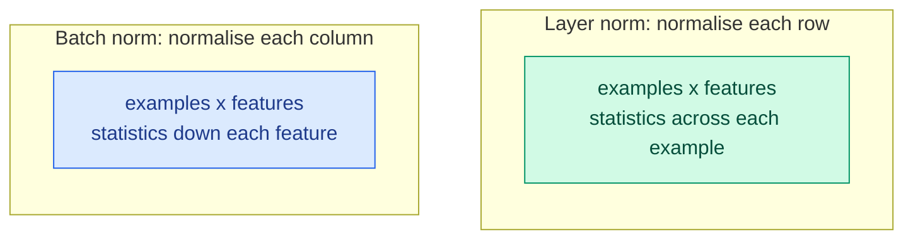
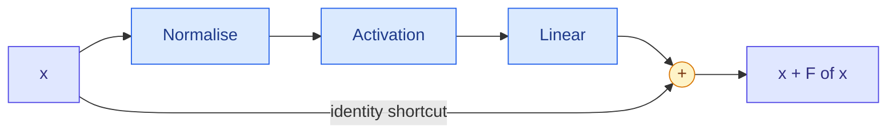

# Vanishing and Exploding Gradients, Normalisation, Dropout and Residual Connections

**Level:** 🔴 Advanced &nbsp;|&nbsp; **Effort:** Detailed module &nbsp;|&nbsp; **Module:** [08 Deep Learning](README.md)

---

## 🎯 Learning Objectives

By the end of this topic you will be able to:

- Measure vanishing gradients layer by layer, and explain why the sigmoid causes them
- Recognise exploding gradients, and know the fixes
- Explain batch normalisation and layer normalisation, and why modern language models use layer normalisation
- Use dropout correctly — including the difference between training and evaluation mode
- Explain why residual connections made very deep networks trainable, and show it

## 📚 Prerequisites

- [Topic 3: The Training Loop, Batches and Initialisation](03-training-loop-batches-and-initialisation.md)
- [Gradient Descent and Backpropagation](../02-mathematics-for-ai/05-gradient-descent-and-backpropagation.md) — gradient
  clipping is taught there
- [Bias, Variance and the Trade-Off](../07-model-evaluation/03-bias-variance-and-the-trade-off.md) — dropout is a variance reducer

```bash
pip install -r requirements.txt
pip install -r requirements-dl.txt --index-url https://download.pytorch.org/whl/cpu    # macOS: omit --index-url
```

---

## 🍰 1. The simple version

**Backpropagation multiplies.** The gradient reaching the first layer is a product of one factor per layer above
it. Multiply thirty numbers smaller than one and you get almost nothing: the early layers stop learning — **vanishing
gradients**. Multiply thirty numbers larger than one and you get an overflow — **exploding gradients**.

Three ideas, each simple, made deep networks trainable:

- **Normalisation** keeps each layer's inputs at a sensible scale.
- **Residual connections** give the gradient a shortcut past every layer.
- **Dropout** is different — it fights overfitting, not the gradient problem, by randomly silencing neurons during
  training.

## 🏠 2. Real-life analogy

> A message passed along thirty people in a whispering game arrives garbled or not at all. Two fixes: have each
> person repeat it at a standard volume (normalisation), or run a direct line from the first person to every
> later one alongside the chain (residual connections).

**Where the analogy breaks down:** in the game the message travels one way. In training, the error signal has to
travel back through the same chain — and the fixes are chosen as much for that backward trip as for the forward one.

---

## 📉 3. Vanishing gradients, measured

### 📐 Why the sigmoid vanishes

The sigmoid's derivative is $\sigma(z)(1 - \sigma(z))$, **at most 0.25**, reached at $z = 0$. Backpropagating through
$L$ sigmoid layers multiplies the gradient by at least $L$ such factors (and by the weights):

$$
\frac{\partial \text{loss}}{\partial W_1} \;\propto\; \prod_{l=1}^{L} \sigma'(z_l)\,W_l \qquad\text{with } \sigma'(z) \le 0.25
$$

With 20 layers, $0.25^{20} \approx 10^{-12}$. ReLU's derivative is exactly 1 for positive inputs, so it does not shrink
the product — one reason ReLU replaced the sigmoid in hidden layers ([Topic 5](05-activation-functions.md)).

```python
"""Gradient size per layer in a 20-layer network, at initialisation."""

import torch
from sklearn.datasets import load_digits
from torch import nn

torch.set_default_dtype(torch.float64)     # reproducible digits across CPUs - see the module overview

X, y = load_digits(return_X_y=True)
X, y = torch.tensor(X / 16.0, dtype=torch.float64), torch.tensor(y)


def deep_network(activation, he_init=False, depth=20, width=64):
    layers = [nn.Linear(64, width)]
    for _ in range(depth):
        layers += [activation(), nn.Linear(width, width)]
    model = nn.Sequential(*layers, activation(), nn.Linear(width, 10))
    if he_init:
        for module in model.modules():
            if isinstance(module, nn.Linear):
                nn.init.kaiming_normal_(module.weight, nonlinearity="relu")
                nn.init.zeros_(module.bias)
    return model


print(f"{'network':<22}gradient size at hidden layers 1, 6, 11, 16, 20     last / first")
for name, activation, he_init in [("sigmoid", nn.Sigmoid, False), ("ReLU, default init", nn.ReLU, False),
                                  ("ReLU, He init", nn.ReLU, True)]:
    torch.manual_seed(0)
    model = deep_network(activation, he_init)
    nn.functional.cross_entropy(model(X), y).backward()
    hidden = [m for m in model if isinstance(m, nn.Linear)][1:-1]         # the 20 hidden-to-hidden layers
    sizes = [layer.weight.grad.norm().item() for layer in hidden]
    print(f"{name:<22}" + "".join(f"{s:>9.1e}" for s in sizes[::5] + sizes[-1:]) + f"{sizes[-1] / sizes[0]:>14.1e}")
```

**Output:**
```
network               gradient size at hidden layers 1, 6, 11, 16, 20     last / first
sigmoid                 3.4e-18  5.7e-14  7.4e-10  2.0e-05  5.4e-02       1.6e+16
ReLU, default init      3.4e-09  7.7e-09  7.0e-07  7.8e-05  2.6e-03       7.5e+05
ReLU, He init           2.1e-01  3.0e-01  4.5e-01  3.5e-01  2.2e-01       1.0e+00
```

**In the sigmoid network, the gradient at the first hidden layer is many orders of magnitude smaller than at the
last.** An optimiser step that moves the last layer sensibly moves the first layer by essentially nothing: the early
layers are frozen at their random starting values, and the network behaves like a shallow one on top of random
features.

**ReLU with PyTorch's default initialisation vanishes too**, more slowly — the default scale is tuned for general use,
not for 20 ReLU layers. **With He initialisation ([Topic 3](03-training-loop-batches-and-initialisation.md)) the
gradient size stays within a small factor across all 20 layers.** Activation and initialisation together decide
whether gradients survive the trip.

### Exploding gradients

The mirror image: factors larger than one multiply to enormous values, the loss jumps to `inf` and the weights to
`nan`. It is most common in recurrent networks, which multiply by the same weight matrix at every time step
([Topic 6](06-cnns-rnns-and-sequence-models.md)). The fixes are **gradient clipping** — rescaling the gradient when its
norm exceeds a limit, shown in [Gradient Descent](../02-mathematics-for-ai/05-gradient-descent-and-backpropagation.md) —
careful initialisation, normalisation and a lower learning rate.

---

## ⚖️ 4. Normalisation

A normalisation layer rescales its inputs to mean 0 and standard deviation 1, then applies a learned scale $\gamma$
and shift $\beta$ so the network can undo it where useful:

$$
\hat{x} = \frac{x - \mu}{\sqrt{\sigma^2 + \epsilon}}, \qquad y = \gamma\,\hat{x} + \beta
$$

**The two main kinds differ only in what $\mu$ and $\sigma$ are computed over:**

| | Batch normalisation | Layer normalisation |
| --- | --- | --- |
| Statistics over | Each feature, **across the examples in the batch** | Each example, **across its features** |
| Depends on the rest of the batch | Yes | No |
| Training versus evaluation | Batch statistics in training; stored running averages in evaluation | Identical |
| Batch size of 1 | Fails in training mode | Works |
| Typical home | Convolutional networks for images | Transformers and recurrent networks |



```python
"""Batch norm's output for an example depends on the rest of the batch; layer norm's does not."""

import torch
from torch import nn

torch.manual_seed(0)
batch_norm, layer_norm = nn.BatchNorm1d(4), nn.LayerNorm(4)
example = torch.randn(1, 4)
ordinary_batch = torch.cat([example, torch.randn(7, 4)])
shifted_batch = torch.cat([example, torch.randn(7, 4) + 5])          # same example, different neighbours

with torch.no_grad():
    print("batch norm, same example, two batches:")
    print(f"  {batch_norm(ordinary_batch)[0].numpy().round(3)}")
    print(f"  {batch_norm(shifted_batch)[0].numpy().round(3)}")
    print("layer norm, same example, two batches:")
    print(f"  {layer_norm(ordinary_batch)[0].numpy().round(3)}")
    print(f"  {layer_norm(shifted_batch)[0].numpy().round(3)}")

try:
    batch_norm(example)                                             # one example, training mode
except ValueError as error:
    print(f"\nbatch norm on a batch of one: {error}")
```

**Output:**
```
batch norm, same example, two batches:
  [ 1.623 -0.426 -1.676  0.53 ]
  [-2.219 -2.266 -2.411 -2.543]
layer norm, same example, two batches:
  [ 1.192 -0.148 -1.525  0.481]
  [ 1.192 -0.148 -1.525  0.481]

batch norm on a batch of one: Expected more than 1 value per channel when training, got input size torch.Size([1, 4])
```

**The same input produced two different batch-norm outputs**, because its neighbours in the batch changed the mean and
variance it was normalised with. In training that noise is harmless — even mildly regularising — but it is why batch
norm must switch to stored running statistics at evaluation time, and why it breaks with a batch of one. **Layer norm
gave identical results**, which is why transformers, which process variable-length sequences one token at a time
during generation, use it ([11 Transformers](../11-transformers/README.md)).

---

## 🎲 5. Dropout

**Dropout** zeroes each neuron's output with probability $p$ during training, and scales the survivors by
$1/(1-p)$ so the expected total is unchanged. Each step trains a different random sub-network, so no neuron can rely on
one particular partner — it discourages memorising, like averaging many thinned networks. At evaluation it does
nothing.

```python
"""Dropout: training mode versus evaluation mode, and its effect on a small, overfitting problem."""

import torch
from sklearn.datasets import load_digits
from sklearn.model_selection import train_test_split
from torch import nn

torch.set_default_dtype(torch.float64)     # reproducible digits across CPUs - see the module overview

torch.manual_seed(0)
dropout = nn.Dropout(p=0.5)
ones = torch.ones(8)
dropout.train()
print(f"training mode, call 1: {dropout(ones).tolist()}")
print(f"training mode, call 2: {dropout(ones).tolist()}")
dropout.eval()
print(f"evaluation mode:       {dropout(ones).tolist()}")

# Only 150 training images and a large network: a recipe for overfitting.
X, y = load_digits(return_X_y=True)
X_train, X_valid, y_train, y_valid = train_test_split(X / 16.0, y, train_size=150, random_state=0, stratify=y)
X_train, X_valid = torch.tensor(X_train, dtype=torch.float64), torch.tensor(X_valid, dtype=torch.float64)
y_train, y_valid = torch.tensor(y_train), torch.tensor(y_valid)

print(f"\n{'dropout':>8}{'train accuracy':>16}{'valid accuracy':>16}{'valid loss':>12}")
for p in [0.0, 0.3, 0.5]:
    torch.manual_seed(0)
    model = nn.Sequential(nn.Linear(64, 512), nn.ReLU(), nn.Dropout(p),
                          nn.Linear(512, 512), nn.ReLU(), nn.Dropout(p), nn.Linear(512, 10))
    optimiser = torch.optim.Adam(model.parameters(), lr=1e-3)
    for _ in range(300):
        model.train()
        loss = nn.functional.cross_entropy(model(X_train), y_train)
        optimiser.zero_grad()
        loss.backward()
        optimiser.step()
    model.eval()
    with torch.no_grad():
        train_accuracy = (model(X_train).argmax(dim=1) == y_train).float().mean().item()
        valid_accuracy = (model(X_valid).argmax(dim=1) == y_valid).float().mean().item()
        valid_loss = nn.functional.cross_entropy(model(X_valid), y_valid).item()
    print(f"{p:>8}{train_accuracy:>16.3f}{valid_accuracy:>16.3f}{valid_loss:>12.3f}")
```

**Output:**
```
training mode, call 1: [0.0, 0.0, 2.0, 0.0, 0.0, 0.0, 2.0, 2.0]
training mode, call 2: [0.0, 2.0, 2.0, 2.0, 2.0, 0.0, 2.0, 2.0]
evaluation mode:       [1.0, 1.0, 1.0, 1.0, 1.0, 1.0, 1.0, 1.0]

 dropout  train accuracy  valid accuracy  valid loss
     0.0           1.000           0.917       0.506
     0.3           1.000           0.917       0.463
     0.5           1.000           0.920       0.401
```

**Two calls in training mode gave two different outputs; evaluation mode passed the input through untouched.** Forget
`model.eval()` before evaluating and predictions become random — a common and silent bug.

**The honest result: dropout helped, modestly.** Every network memorised all 150 training images. Dropout barely moved
validation accuracy but cut validation loss from 0.506 to 0.401 — the predictions became less overconfidently wrong.
Dropout is one regulariser among several, and on small problems its gain is often small; more data, weight decay and
early stopping ([Learning Curves](../07-model-evaluation/04-learning-curves-and-baselines.md)) compete with it.

---

## 🛤️ 6. Residual connections

A residual block adds its input to its output: $\mathbf{x}_{l+1} = \mathbf{x}_l + F(\mathbf{x}_l)$. The layers only
have to learn a *change* to their input, and — the crucial part — the gradient flows back through the $+$ unchanged:

$$
\frac{\partial \mathbf{x}_{l+1}}{\partial \mathbf{x}_l} = I + \frac{\partial F}{\partial \mathbf{x}_l}
$$

The identity term $I$ gives every layer a direct path to the loss, however deep the network. Residual networks
(ResNets, 2015) trained networks with over a hundred layers; every transformer uses the same idea.



```python
"""A 30-layer network: plain, normalised, residual - which ones train?"""

import torch
from sklearn.datasets import load_digits
from sklearn.model_selection import train_test_split
from torch import nn

torch.set_default_dtype(torch.float64)     # reproducible digits across CPUs - see the module overview

X, y = load_digits(return_X_y=True)
X_train, X_valid, y_train, y_valid = train_test_split(X / 16.0, y, test_size=0.25, random_state=0, stratify=y)
X_train, X_valid = torch.tensor(X_train, dtype=torch.float64), torch.tensor(X_valid, dtype=torch.float64)
y_train, y_valid = torch.tensor(y_train), torch.tensor(y_valid)


class Block(nn.Module):
    """Normalise, activate, transform - with an optional residual shortcut around all three."""

    def __init__(self, width, norm, residual):
        super().__init__()
        self.norm = {"none": nn.Identity(), "batch": nn.BatchNorm1d(width), "layer": nn.LayerNorm(width)}[norm]
        self.linear, self.residual = nn.Linear(width, width), residual

    def forward(self, x):
        h = self.linear(torch.relu(self.norm(x)))
        return x + h if self.residual else h


print(f"{'30-layer ReLU network':<34}{'valid accuracy after 10 epochs':>31}")
for label, norm, residual in [("plain", "none", False), ("batch norm", "batch", False), ("layer norm", "layer", False),
                              ("residual", "none", True), ("residual + layer norm", "layer", True)]:
    torch.manual_seed(0)
    model = nn.Sequential(nn.Linear(64, 64), *[Block(64, norm, residual) for _ in range(30)], nn.Linear(64, 10))
    optimiser = torch.optim.Adam(model.parameters(), lr=1e-3)
    order = torch.Generator().manual_seed(0)
    for _ in range(10):
        model.train()
        permutation = torch.randperm(len(X_train), generator=order)
        for start in range(0, len(X_train), 64):
            batch = permutation[start:start + 64]
            loss = nn.functional.cross_entropy(model(X_train[batch]), y_train[batch])
            optimiser.zero_grad()
            loss.backward()
            optimiser.step()
    model.eval()
    with torch.no_grad():
        accuracy = (model(X_valid).argmax(dim=1) == y_valid).float().mean().item()
    # Runs that fail to learn wander chaotically near chance, and their exact digits differ between CPUs.
    print(f"{label:<34}{f'{accuracy:.3f}' if accuracy >= 0.25 else 'did not learn (below 0.25)':>31}")
```

**Output:**
```
30-layer ReLU network              valid accuracy after 10 epochs
plain                                  did not learn (below 0.25)
batch norm                             did not learn (below 0.25)
layer norm                             did not learn (below 0.25)
residual                                                    0.940
residual + layer norm                                       0.976
```

**At 30 layers, only the residual networks learned.** The plain network did not learn, and
normalisation alone did not rescue it within this budget. Adding the shortcut took the same depth to 94%, and
residual plus layer normalisation — the pattern inside every transformer block — did best.

Runs that fail print a band instead of a number: a network that is not learning wanders near chance, and the exact
digits it lands on differ from one CPU to another — the same reason this repository never prints roundoff.

**Do not over-read one run on a small dataset**: with more epochs, careful initialisation and a tuned learning rate,
a normalised plain network can train too. The point is robustness — residual networks train at depths where plain
ones need everything to go right.

---

## 🏭 7. Production notes

- **Monitor gradient norms per layer** during training, not only the loss. A layer whose gradient norm sits orders of
  magnitude below the others is not learning.
- **Batch norm and small batches do not mix.** With per-device batches of a few examples — common when large models
  fill GPU memory — batch statistics are too noisy; use layer or group normalisation.
- **Batch norm's running statistics are part of the model.** Save and load them with the weights; a model evaluated
  with fresh statistics behaves differently.
- **Evaluation mode is a deployment requirement.** Serving a model in training mode silently applies dropout and batch
  statistics to live traffic ([31 Model Deployment](../31-model-deployment/README.md)).

## ⚠️ 8. Common mistakes

| Mistake | Why it happens | Fix |
| --- | --- | --- |
| Sigmoid in every hidden layer of a deep network | Classic textbooks | Its derivative is at most 0.25; use ReLU-family activations |
| Forgetting `model.eval()` | The code runs either way | Dropout randomises outputs; batch norm uses batch statistics |
| Batch norm with batch size 1 or tiny batches | Memory limits | Layer or group normalisation |
| Expecting dropout to fix every overfitting problem | It is the famous regulariser | Its gain here was small; compare with weight decay, data and early stopping |
| Building very deep plain networks | Depth is assumed to help | Add residual connections |

---

## 🎤 9. Interview questions

<details>
<summary><b>Q1: What causes vanishing gradients, and how do you fix them?</b></summary>

Backpropagation multiplies one factor per layer; if the factors are below one — as with sigmoid, whose derivative is at
most 0.25, or with weights initialised too small — the gradient shrinks exponentially with depth and early layers stop
learning. In the example the sigmoid network's first-layer gradient was many orders of magnitude smaller than its last.
Fixes: ReLU-family activations, initialisation matched to the activation (He for ReLU), normalisation layers, and
residual connections, which provide an identity path for the gradient.
</details>

<details>
<summary><b>Q2: What is the difference between batch normalisation and layer normalisation?</b></summary>

Batch normalisation computes the mean and variance of each feature across the examples in a batch; layer normalisation
computes them across the features of each single example. So batch norm's output for one example depends on the rest
of the batch — verified in the example — needs running averages at evaluation time, and fails with a batch of one.
Layer norm behaves identically in training and evaluation, which suits variable-length sequences and small batches,
and is what transformers use.
</details>

<details>
<summary><b>Q3: Why do residual connections help?</b></summary>

A residual block outputs $x + F(x)$, so its Jacobian is $I + \partial F/\partial x$: the identity term lets gradients
pass through unchanged, giving every layer a direct path to the loss however deep the network. Layers also only need
to learn a correction to their input, and a block can easily approximate the identity if it is not useful. In the
example, a 30-layer plain network stayed at chance while the residual version reached 94%.
</details>

<details>
<summary><b>Q4: How does dropout behave at training and at inference time?</b></summary>

In training it zeroes each unit with probability $p$ and scales the survivors by $1/(1-p)$, so each step trains a
random sub-network and the expected activation is unchanged. At inference it is switched off, which in PyTorch means
calling `model.eval()`; forgetting it makes predictions random, as two calls in training mode showed.
</details>

---

## ✅ Key takeaways

- **Backpropagation multiplies**; factors below one vanish, above one explode.
- **Sigmoid vanishes** (derivative at most 0.25); **ReLU with He initialisation** kept gradient sizes steady over 20 layers.
- **Batch norm** depends on the batch and needs evaluation mode; **layer norm** does not — hence transformers use it.
- **Dropout** needs `model.eval()` at inference; here it cut validation loss more than it raised accuracy.
- **Residual connections** let a 30-layer network train where the plain one stayed at chance.

---

## 📚 Official References

- [PyTorch: BatchNorm1d — PyTorch Foundation](https://pytorch.org/docs/stable/generated/torch.nn.BatchNorm1d.html) — verified 2026-09-18
- [PyTorch: LayerNorm — PyTorch Foundation](https://pytorch.org/docs/stable/generated/torch.nn.LayerNorm.html) — verified 2026-09-18
- [PyTorch: Dropout — PyTorch Foundation](https://pytorch.org/docs/stable/generated/torch.nn.Dropout.html) — verified 2026-09-18
- [Deep Residual Learning for Image Recognition — He, Zhang, Ren and Sun, arXiv](https://arxiv.org/abs/1512.03385) — verified 2026-09-18
- [Batch Normalization — Ioffe and Szegedy, arXiv](https://arxiv.org/abs/1502.03167) — verified 2026-09-18
- [Layer Normalization — Ba, Kiros and Hinton, arXiv](https://arxiv.org/abs/1607.06450) — verified 2026-09-18
- [Dropout: A Simple Way to Prevent Neural Networks from Overfitting — Srivastava et al., Journal of Machine Learning Research](https://jmlr.org/papers/v15/srivastava14a.html) — verified 2026-09-18

---

## 🔗 Navigation

[← Topic 3: The Training Loop, Batches and Initialisation](03-training-loop-batches-and-initialisation.md) &nbsp;|&nbsp;
[🏠 Module Home](README.md) &nbsp;|&nbsp;
[Topic 5: Activation Functions →](05-activation-functions.md)
