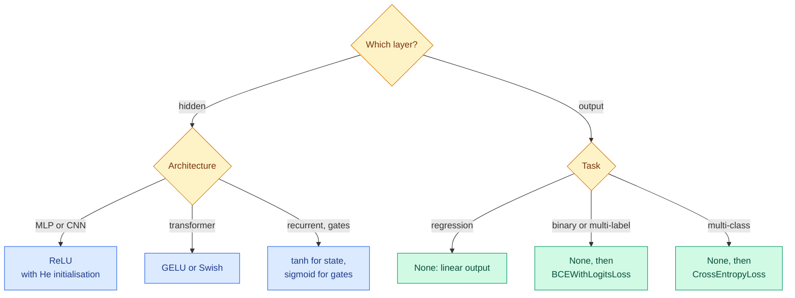

# Activation Functions: Sigmoid, Tanh, ReLU and Its Family, GELU, Swish and Softmax

**Level:** 🟡 Intermediate &nbsp;|&nbsp; **Effort:** Short module &nbsp;|&nbsp; **Module:** [08 Deep Learning](README.md)

---

## 🎯 Learning Objectives

By the end of this topic you will be able to:

- Compare the common activation functions by their outputs and, more importantly, their gradients
- Explain why ReLU replaced sigmoid and tanh in hidden layers, and what "dead" ReLU units are
- Say where leaky ReLU, parametric ReLU, ELU, GELU and Swish fit, and what each changes
- Use softmax for multi-class outputs, and compute it without overflow
- Choose an activation for hidden layers and for the output layer of a given task

## 📚 Prerequisites

- [Topic 4: Vanishing Gradients, Normalisation, Dropout and Residuals](04-vanishing-gradients-normalisation-dropout-and-residuals.md)
- [Basic Mathematics](../02-mathematics-for-ai/01-basic-mathematics.md) — exponentials and logarithms

```bash
pip install -r requirements.txt
pip install -r requirements-dl.txt --index-url https://download.pytorch.org/whl/cpu    # macOS: omit --index-url
```

---

## 🍰 1. The simple version

An activation function bends the output of each neuron. Without it, a network of any depth is a single straight-line
model ([Topic 1](01-neurons-perceptrons-and-layers.md)). **The choice matters less for what the function outputs than
for the gradient it passes back**: an activation whose slope is nearly zero over much of its range starves the layers
beneath it of learning signal.

Two roles, two different choices:

- **Hidden layers** need a bend that keeps gradients flowing — today almost always ReLU or a smooth relative of it.
- **The output layer** must produce the right *kind* of number — any real value, a probability, or a distribution
  over classes.

## 🏠 2. Real-life analogy

> A dimmer switch versus a light switch. A light switch (a step function) is either off or on — you cannot tell how
> close you are to flipping it, so you cannot adjust gradually. A dimmer responds smoothly, so small turns make small,
> useful changes. Training needs dimmers: small changes in weights must make small, measurable changes in output.

**Where the analogy breaks down:** ReLU is a dimmer that is completely off below zero. That is usually fine — until a
neuron is stuck in the off region for every input, and no turn of the knob reaches it (section 4).

---

## 📊 3. The functions and their gradients

| Activation | Formula | Output range | Gradient | Typical use |
| --- | --- | --- | --- | --- |
| **Sigmoid** | $\sigma(z) = 1/(1 + e^{-z})$ | (0, 1) | At most 0.25; vanishes for large $\lvert z \rvert$ | Binary output layer; gates in LSTMs |
| **Tanh** | $(e^{z} - e^{-z})/(e^{z} + e^{-z})$ | (−1, 1) | At most 1; vanishes for large $\lvert z \rvert$ | Recurrent networks; zero-centred hidden units |
| **ReLU** | $\max(0, z)$ | [0, ∞) | 1 if $z > 0$, else 0 | Default hidden layer |
| **Leaky ReLU** | $z$ if $z > 0$, else $0.01z$ | (−∞, ∞) | 1 or 0.01 — never exactly 0 | When dead units are a concern |
| **Parametric ReLU (PReLU)** | Leaky ReLU with the negative slope **learned** | (−∞, ∞) | 1 or a learned $a$ | Image models |
| **ELU** | $z$ if $z > 0$, else $e^{z} - 1$ | (−1, ∞) | Smooth; negative outputs push the mean towards 0 | Some image models |
| **GELU** | $z\,\Phi(z)$, with $\Phi$ the normal CDF | ≈(−0.17, ∞) | Smooth, slightly negative for small negative $z$ | Transformers (BERT, GPT family) |
| **Swish / SiLU** | $z\,\sigma(z)$ | ≈(−0.28, ∞) | Smooth, non-monotonic | Some image and language models |
| **Softmax** | $e^{z_i} / \sum_j e^{z_j}$, over a vector | (0, 1), summing to 1 | — | Multi-class output layer |

```python
"""Outputs and gradients of seven activations at the same inputs."""

import torch
from torch import nn

torch.set_default_dtype(torch.float64)

inputs = torch.linspace(-4, 4, 9)
activations = {
    "sigmoid": torch.sigmoid, "tanh": torch.tanh, "ReLU": torch.relu,
    "leaky ReLU": nn.functional.leaky_relu, "ELU": nn.functional.elu,
    "GELU": nn.functional.gelu, "Swish / SiLU": nn.functional.silu,
}
print(f"{'input':<14}" + "".join(f"{v:>7.0f}" for v in inputs))
for name, function in activations.items():
    z = inputs.clone().requires_grad_(True)
    function(z).sum().backward()                   # each output depends on one input, so this gives each slope
    print(f"{name:<14}" + "".join(f"{g:>7.2f}" for g in z.grad))
print("\n(rows show the GRADIENT at each input, not the output)")
```

**Output:**
```
input              -4     -3     -2     -1      0      1      2      3      4
sigmoid          0.02   0.05   0.10   0.20   0.25   0.20   0.10   0.05   0.02
tanh             0.00   0.01   0.07   0.42   1.00   0.42   0.07   0.01   0.00
ReLU             0.00   0.00   0.00   0.00   0.00   1.00   1.00   1.00   1.00
leaky ReLU       0.01   0.01   0.01   0.01   0.01   1.00   1.00   1.00   1.00
ELU              0.02   0.05   0.14   0.37   1.00   1.00   1.00   1.00   1.00
GELU            -0.00  -0.01  -0.09  -0.08   0.50   1.08   1.09   1.01   1.00
Swish / SiLU    -0.05  -0.09  -0.09   0.07   0.50   0.93   1.09   1.09   1.05

(rows show the GRADIENT at each input, not the output)
```

**Read the table as "how much learning signal passes through".** The sigmoid never passes more than 0.25 and almost
none beyond ±3. Tanh passes up to 1 but also dies at the edges. **ReLU passes exactly 1 for every positive input** —
no shrinking, however many layers — and exactly 0 for every negative one. The smooth variants (ELU, GELU, Swish) round
off ReLU's corner and let a little gradient through for negative inputs; GELU and Swish even have slightly *negative*
slopes there.

---

## ⚰️ 4. Dead ReLU units

A ReLU unit whose input is negative **for every training example** outputs zero everywhere, receives zero gradient
everywhere, and never changes again. It is dead. The usual cause is a single large update — a learning rate spike —
that pushes its bias far negative.

```python
"""Kill ReLU units with a burst of learning rate 5, then try to train them back."""

import torch
from sklearn.datasets import load_digits
from torch import nn

torch.set_default_dtype(torch.float64)

X, y = load_digits(return_X_y=True)
X, y = torch.tensor(X / 16.0), torch.tensor(y)


def dead_share(model):
    """Hidden units whose input is negative for every training example."""
    with torch.no_grad():
        return ((model[0](X) > 0).sum(dim=0) == 0).double().mean().item()


def train(model, learning_rate, steps):
    optimiser = torch.optim.SGD(model.parameters(), lr=learning_rate)
    for _ in range(steps):
        loss = nn.functional.cross_entropy(model(X), y)
        optimiser.zero_grad()
        loss.backward()
        optimiser.step()


print(f"{'hidden activation':<20}{'dead at start':>14}{'after lr 5':>12}{'after recovery':>16}{'accuracy':>10}")
for name, activation, burst in [("ReLU", nn.ReLU(), True), ("leaky ReLU", nn.LeakyReLU(0.01), True),
                                ("ReLU, no burst", nn.ReLU(), False)]:
    torch.manual_seed(0)
    model = nn.Sequential(nn.Linear(64, 128), activation, nn.Linear(128, 10))
    at_start = dead_share(model)
    if burst:
        train(model, learning_rate=5.0, steps=20)                  # the damaging burst
    after_burst = dead_share(model)
    train(model, learning_rate=0.1, steps=500 if burst else 520)   # then a sensible rate
    with torch.no_grad():
        accuracy = (model(X).argmax(dim=1) == y).double().mean().item()
    print(f"{name:<20}{at_start:>14.1%}{after_burst:>12.1%}{dead_share(model):>16.1%}{accuracy:>10.3f}")
```

**Output:**
```
hidden activation    dead at start  after lr 5  after recovery  accuracy
ReLU                          4.7%       86.7%           86.7%     0.703
leaky ReLU                    4.7%       88.3%           89.1%     0.708
ReLU, no burst                4.7%        4.7%            5.5%     0.966
```

**Twenty steps at a learning rate of 5 killed most of the hidden layer — and 500 steps at a sensible rate did not bring
a single unit back.** The surviving units carried on, so the network still learned something, but it was far below the
same network trained sensibly from the start.

**Leaky ReLU did not rescue it either.** Its negative slope of 0.01 means dead units still receive *some* gradient in
theory, but a gradient 100 times smaller did not revive them within 500 steps. **Prevention beats cure:** a sensible
learning rate, a warm-up at the start of training, gradient clipping and He initialisation. Monitor the share of units
that never activate — it is cheap to compute and an early warning.

---

## 🎲 5. Softmax, and why you rarely compute it yourself

Softmax turns a vector of logits into probabilities that sum to 1:

$$
\text{softmax}(\mathbf{z})_i = \frac{e^{z_i}}{\sum_j e^{z_j}} = \frac{e^{z_i - m}}{\sum_j e^{z_j - m}} \quad \text{for any constant } m
$$

**The second form is the one that works on a computer.** Subtracting the largest logit $m$ changes nothing
mathematically but keeps every exponent at or below zero, so nothing overflows.

```python
import torch

logits = torch.tensor([1000.0, 1001.0, 1002.0])
by_hand = torch.exp(logits) / torch.exp(logits).sum()
print(f"exp, then divide:        {by_hand.tolist()}")
print(f"torch.softmax:           {[round(v, 4) for v in torch.softmax(logits, dim=0).tolist()]}")
print(f"subtract the max first:  {[round(v, 4) for v in (torch.exp(logits - logits.max()) / torch.exp(logits - logits.max()).sum()).tolist()]}")
```

**Output:**
```
exp, then divide:        [nan, nan, nan]
torch.softmax:           [0.09, 0.2447, 0.6652]
subtract the max first:  [0.09, 0.2447, 0.6652]
```

**`exp(1000)` overflows to infinity, and infinity divided by infinity is `nan`.** `torch.softmax` subtracts the maximum
internally. In practice you usually do not call softmax at all during training: `nn.CrossEntropyLoss` takes raw logits
and combines the softmax and the log in one stable step ([Topic 2](02-loss-functions-computational-graphs-and-autograd.md)).

---

## 🧭 6. Choosing



**Output layers get no activation during training** — the losses apply sigmoid or softmax internally. Apply
`torch.sigmoid` or `torch.softmax` only at prediction time, when you want probabilities to show or threshold.

**Hidden-layer choice rarely decides success.** ReLU, GELU and Swish usually land within a small margin of each other;
initialisation, normalisation and the learning rate matter more. Change the activation last.

---

## ⚠️ 7. Common mistakes

| Mistake | Why it happens | Fix |
| --- | --- | --- |
| Sigmoid or tanh in deep hidden layers | Older tutorials | ReLU-family; they pass gradient 1 for positive inputs |
| Softmax before `CrossEntropyLoss` | Wanting probabilities | The loss applies it; output raw logits |
| Computing softmax as `exp(z) / exp(z).sum()` | Following the formula | Overflowed to `nan` at logit 1000; use `torch.softmax` |
| Ignoring dead units | The loss still falls | 87% of units died after a learning-rate burst and never recovered |
| Expecting leaky ReLU to repair dead units | Its gradient is non-zero | A slope of 0.01 revived none; prevent with learning rate, warm-up, clipping |
| ReLU on a regression output | Copying the hidden layers | ReLU cannot output negatives; leave regression outputs linear |

---

## 🎤 8. Interview questions

<details>
<summary><b>Q1: Why did ReLU replace sigmoid and tanh in hidden layers?</b></summary>

ReLU's gradient is exactly 1 for positive inputs, so it does not shrink the gradient as it passes back through many
layers; the sigmoid's is at most 0.25 and near zero for large inputs, and tanh also saturates. ReLU is also cheap to
compute and produces sparse activations. Its weakness is dead units: with zero gradient for negative inputs, a unit
pushed negative for every example never recovers.
</details>

<details>
<summary><b>Q2: What is a dying ReLU, and how do you prevent it?</b></summary>

A unit whose input is negative for all training examples outputs zero, receives zero gradient and stops learning
permanently. It is usually caused by a large update — too high a learning rate — driving its bias far negative. In the
example, 20 steps at learning rate 5 killed most of a hidden layer, and neither further training nor a leaky ReLU with
slope 0.01 revived the units. Prevent it with a sensible learning rate and warm-up, gradient clipping, He
initialisation, and monitor the share of units that never activate.
</details>

<details>
<summary><b>Q3: Why subtract the maximum logit before computing softmax?</b></summary>

Softmax is unchanged by subtracting the same constant from every logit, and subtracting the maximum makes every
exponent at most zero, so `exp` cannot overflow. Without it, logits around 1000 produce `inf / inf = nan`. Library
softmax and cross-entropy functions do this internally, which is why you pass them raw logits.
</details>

---

## ✅ Key takeaways

- An activation's **gradient** matters more than its output: sigmoid passes at most 0.25; ReLU passes exactly 1.
- **ReLU** is the default hidden activation; **GELU and Swish** are its smooth relatives, standard in transformers.
- **Dead ReLUs are permanent**: a learning-rate burst killed most units, and neither training nor leaky ReLU revived them.
- **Softmax must subtract the maximum**; better, let `CrossEntropyLoss` handle it from raw logits.
- **Output layers stay linear during training**; the loss supplies the sigmoid or softmax.

---

## 📚 Official References

- [PyTorch: Non-linear activations in torch.nn — PyTorch Foundation](https://pytorch.org/docs/stable/nn.html#non-linear-activations-weighted-sum-nonlinearity) — verified 2026-09-18
- [PyTorch: GELU — PyTorch Foundation](https://pytorch.org/docs/stable/generated/torch.nn.GELU.html) — verified 2026-09-18
- [Gaussian Error Linear Units (GELUs) — Hendrycks and Gimpel, arXiv](https://arxiv.org/abs/1606.08415) — verified 2026-09-18
- [Searching for Activation Functions — Ramachandran, Zoph and Le, arXiv](https://arxiv.org/abs/1710.05941) — verified 2026-09-18; the Swish paper

---

## 🔗 Navigation

[← Topic 4: Vanishing Gradients, Normalisation, Dropout and Residuals](04-vanishing-gradients-normalisation-dropout-and-residuals.md) &nbsp;|&nbsp;
[🏠 Module Home](README.md) &nbsp;|&nbsp;
[Topic 6: CNNs, RNNs and Sequence Models →](06-cnns-rnns-and-sequence-models.md)
