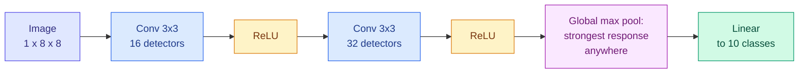
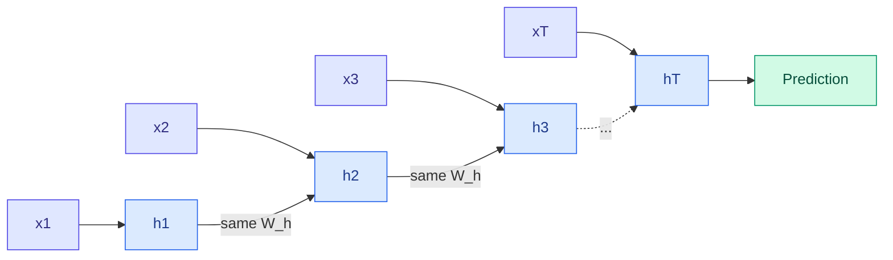

# MLPs, Convolutional Networks and Recurrent Networks

**Level:** 🟡 Intermediate → 🔴 Advanced &nbsp;|&nbsp; **Effort:** Detailed module &nbsp;|&nbsp; **Module:** [08 Deep Learning](README.md)

---

## 🎯 Learning Objectives

By the end of this topic you will be able to:

- Say what assumption each architecture builds in: none (MLP), local patterns anywhere (CNN), order in time (RNN)
- Explain convolution, weight sharing and pooling, and count a convolutional layer's parameters
- Show a CNN staying accurate on shifted images where an MLP with the same number of parameters collapses
- Explain how recurrent networks process sequences, and why plain RNNs struggle with long-range dependencies
- Describe how LSTM and GRU gates help — and measure the gradient they let through time

## 📚 Prerequisites

- [Topic 4: Vanishing Gradients, Normalisation, Dropout and Residuals](04-vanishing-gradients-normalisation-dropout-and-residuals.md)
- [Text, Image and Domain Features](../06-feature-engineering/05-text-image-and-domain-features.md) — the one-pixel
  shift that broke hand-made image features

```bash
pip install -r requirements.txt
pip install -r requirements-dl.txt --index-url https://download.pytorch.org/whl/cpu    # macOS: omit --index-url
```

---

## 🍰 1. The simple version

Every architecture is a **bet about the structure of the data**, built into the network so it does not have to be
learned from examples:

- A **multilayer perceptron (MLP)**, or feedforward network, bets on nothing. Every input connects to every neuron.
  Flexible, and wasteful when the data has structure.
- A **convolutional neural network (CNN)** bets that useful patterns are **local** and can appear **anywhere** — an
  edge is an edge wherever it sits in a photo. It slides one small detector across the whole image.
- A **recurrent neural network (RNN)** bets that data arrives **in order** and the past matters for the present. It
  reads a sequence one step at a time, carrying a memory forward.

When the bet matches the data, the network learns faster from less data and generalises better. When it does not,
the built-in assumption gets in the way.

## 🏠 2. Real-life analogy

> Proofreading a page. An MLP would memorise what every letter at every position on the page should look like. A CNN
> learns what a misspelled word looks like once and scans for it everywhere. An RNN reads left to right, remembering
> the sentence so far, so it can notice that "their" should have been "there".

**Where the analogy breaks down:** a human reader remembers the start of a long paragraph easily. A plain RNN, as
section 4 measures, loses track of it — which is why gated RNNs, and later transformers, were invented.

---

## 🖼️ 3. Convolutional networks

### ⚙️ How convolution works

A **convolutional layer** slides a small grid of weights — a **kernel** or **filter**, often 3×3 — across the image.
At each position it computes a weighted sum of the pixels underneath, producing a **feature map** that is large
wherever the pattern appears.

| Idea | What it means | Why it helps |
| --- | --- | --- |
| **Local connectivity** | Each output looks at a small patch | Patterns in images are local |
| **Weight sharing** | The same kernel is used at every position | A pattern learned once is detected everywhere; far fewer parameters |
| **Multiple channels** | Many kernels per layer, each a different detector | Edges, corners, textures in parallel |
| **Pooling** | Summarise a neighbourhood — its maximum or average | Tolerance to small shifts; smaller maps |
| **Stacking** | Later layers see combinations of earlier features | Edges → shapes → objects |

### 📐 Parameters of a convolutional layer

$$
\text{parameters} = (k_h \times k_w \times C_{\text{in}} + 1) \times C_{\text{out}}
$$

A 3×3 layer from 16 to 32 channels has $(3 \times 3 \times 16 + 1) \times 32 = 4{,}640$ parameters — **independent of
the image size**. A fully connected layer from a 224×224×3 image to just 32 units would need over 4.8 million.



### 💻 Code example — the shift test, revisited

[Text, Image and Domain Features](../06-feature-engineering/05-text-image-and-domain-features.md) showed a linear model
on raw pixels collapsing when digits moved one pixel to the right. Here an MLP and a CNN with **almost the same number
of parameters** take the same test.

```python
"""An MLP and a CNN of similar size, tested on digits shifted right by 0, 1 and 2 pixels."""

import torch
from sklearn.datasets import load_digits
from sklearn.model_selection import train_test_split
from torch import nn

torch.set_default_dtype(torch.float64)

X, y = load_digits(return_X_y=True)
X_train, X_test, y_train, y_test = train_test_split(X / 16.0, y, test_size=0.3, random_state=0, stratify=y)
X_train, X_test = torch.tensor(X_train).reshape(-1, 1, 8, 8), torch.tensor(X_test).reshape(-1, 1, 8, 8)
y_train, y_test = torch.tensor(y_train), torch.tensor(y_test)


def shift_right(images, pixels):
    if pixels == 0:
        return images
    moved = torch.zeros_like(images)
    moved[..., pixels:] = images[..., :-pixels]
    return moved


architectures = {
    "MLP": lambda: nn.Sequential(nn.Flatten(), nn.Linear(64, 64), nn.ReLU(), nn.Linear(64, 10)),
    "CNN": lambda: nn.Sequential(
        nn.Conv2d(1, 16, kernel_size=3, padding=1), nn.ReLU(),
        nn.Conv2d(16, 32, kernel_size=3, padding=1), nn.ReLU(),
        nn.AdaptiveMaxPool2d(1),                # strongest response of each detector, wherever it is
        nn.Flatten(), nn.Linear(32, 10)),
}
print(f"{'model':<6}{'parameters':>11}{'no shift':>10}{'1 pixel':>9}{'2 pixels':>10}")
for name, build in architectures.items():
    torch.manual_seed(0)
    model = build()
    optimiser = torch.optim.Adam(model.parameters(), lr=1e-2)
    order = torch.Generator().manual_seed(0)
    for _ in range(15):
        permutation = torch.randperm(len(X_train), generator=order)
        for start in range(0, len(X_train), 64):
            batch = permutation[start:start + 64]
            loss = nn.functional.cross_entropy(model(X_train[batch]), y_train[batch])
            optimiser.zero_grad()
            loss.backward()
            optimiser.step()
    with torch.no_grad():
        scores = [(model(shift_right(X_test, k)).argmax(dim=1) == y_test).double().mean().item() for k in (0, 1, 2)]
    parameters = sum(p.numel() for p in model.parameters())
    print(f"{name:<6}{parameters:>11,}" + "".join(f"{s:>{w}.3f}" for s, w in zip(scores, (10, 9, 10), strict=True)))
```

**Output:**
```
model  parameters  no shift  1 pixel  2 pixels
MLP         4,810     0.974    0.500     0.137
CNN         5,130     0.972    0.965     0.913
```

**Unshifted, the two are equally accurate. Shifted, they are not remotely comparable.** The MLP learned "ink at
position 37 means a 7"; move the ink and that evidence is gone. The CNN's detectors slide across the image, and the
global max pool keeps each detector's strongest response *wherever it occurred* — so a shifted digit produces nearly
the same features. That property, **translation invariance**, was built in; nobody trained it.

**This is the bet paying off.** The same number of parameters buys far more when the architecture's assumption
matches the data. [09 Computer Vision](../09-computer-vision/README.md) builds real image models on this foundation.

---

## 🔁 4. Recurrent networks

A **recurrent network** reads a sequence $x_1, x_2, \dots, x_T$ one element at a time, updating a **hidden state**
$h_t$ that summarises everything so far:

$$
h_t = \tanh(W_x x_t + W_h h_{t-1} + b)
$$

The **same** weights $W_x$ and $W_h$ are used at every step — weight sharing across time, as a CNN shares weights
across space. Training unrolls the loop into a deep network, one layer per time step, and backpropagates through it:
**backpropagation through time**.



**The catch is the same one as in [Topic 4](04-vanishing-gradients-normalisation-dropout-and-residuals.md)**, now
across time: the gradient reaching step 1 passes through $T$ copies of $W_h$ and $T$ tanh derivatives. Over long
sequences it vanishes — the network cannot learn that something early matters later — or, if $W_h$ is large, explodes,
which is why gradient clipping is standard for RNNs.

### 🚪 LSTM and GRU: gates that decide what to keep

The **long short-term memory (LSTM)** adds a separate **cell state** $c_t$ updated mostly by *addition*, with learned
**gates** — sigmoid outputs between 0 and 1 — deciding what to forget, what to write and what to reveal:

$$
c_t = f_t \odot c_{t-1} + i_t \odot \tilde{c}_t, \qquad h_t = o_t \odot \tanh(c_t)
$$

| Symbol | Gate | Role |
| --- | --- | --- |
| $f_t$ | Forget | How much of the old cell state to keep — 1 keeps everything |
| $i_t$ | Input | How much of the new candidate $\tilde{c}_t$ to write |
| $o_t$ | Output | How much of the cell state to expose as $h_t$ |
| $\odot$ | — | Element-wise multiplication |

When the forget gate is near 1, $c_t \approx c_{t-1} + \dots$ — **an additive path through time**, like a residual
connection, along which gradients survive. The **gated recurrent unit (GRU)** merges the forget and input gates into
one "update" gate and has no separate cell state: fewer parameters, often similar results.

### 💻 Code example — how much gradient reaches the first step?

A clean way to see the difference is to measure it: build each cell, run it over random sequences of increasing
length, and compare the gradient of the final hidden state with respect to the **first** input and the **last**.

```python
"""Gradient reaching the first time step, relative to the last, at initialisation."""

import torch
from torch import nn

torch.set_default_dtype(torch.float64)


def gradient_to_first_step(kind, length, forget_bias=None, repeats=5):
    ratios = []
    for seed in range(repeats):
        torch.manual_seed(seed)
        cell = {"RNN": nn.RNN, "LSTM": nn.LSTM, "GRU": nn.GRU}[kind](1, 32, batch_first=True)
        if forget_bias is not None:
            with torch.no_grad():
                for name, parameter in cell.named_parameters():
                    if "bias" in name:                           # PyTorch gate order: input, forget, cell, output
                        parameter[32:64].fill_(forget_bias / 2)  # two bias vectors add up to forget_bias
        sequence = torch.randn(16, length, 1, generator=torch.Generator().manual_seed(100 + seed), requires_grad=True)
        states, _ = cell(sequence)
        states[:, -1].sum().backward()
        ratios.append((sequence.grad[:, 0].norm() / sequence.grad[:, -1].norm()).item())
    return sum(ratios) / len(ratios)


print(f"{'length':>6}{'plain RNN':>12}{'LSTM':>12}{'LSTM, forget bias 2':>22}{'GRU':>12}")
for length in [10, 50, 100, 200]:
    print(f"{length:>6}{gradient_to_first_step('RNN', length):>12.1e}{gradient_to_first_step('LSTM', length):>12.1e}"
          f"{gradient_to_first_step('LSTM', length, forget_bias=2.0):>22.1e}{gradient_to_first_step('GRU', length):>12.1e}")
```

**Output:**
```
length   plain RNN        LSTM   LSTM, forget bias 2         GRU
    10     7.9e-03     3.1e-02               2.1e+00     4.9e-02
    50     1.1e-11     1.9e-10               1.4e-01     1.9e-09
   100     5.2e-21     2.8e-20               1.7e-02     1.7e-18
   200     1.6e-40     9.1e-40               9.8e-04     1.9e-36
```

**For the plain RNN, the first step's influence falls exponentially with length** — by 100 steps it is gone for any
practical purpose. That is the vanishing gradient through time, measured.

**The surprise: a freshly initialised LSTM and GRU vanish almost as fast.** Gates only help when they are *open*.
PyTorch initialises the forget gate's bias near zero, so the gate starts around 0.5 and halves the signal every step.
**Set the forget-gate bias to a positive value** — a long-standing practical recommendation — and the LSTM keeps a
usable gradient after 100 and even 200 steps, many orders of magnitude more than the others. Training can then learn
to open or close the gate as the task needs.

**Do not read this as "RNNs cannot remember".** On short or simple memory tasks a plain RNN can do well; the difference
shows over long ranges and hard tasks. And for most sequence problems today — language above all — **transformers
have replaced RNNs**: attention connects every position to every other directly, with no chain of multiplications to
vanish through ([11 Transformers](../11-transformers/README.md)). RNNs remain useful for streaming data and small
devices, where processing one step at a time with a fixed-size memory is an advantage.

---

## 🧭 5. Choosing an architecture

| Data | First choice | Why | Taught in |
| --- | --- | --- | --- |
| Tabular features | Gradient-boosted trees, then an MLP | Trees usually win on tables | [05 Machine Learning](../05-machine-learning/06-boosting.md) |
| Images, spectrograms, grids | CNN, or a vision transformer at scale | Local patterns, translation invariance | [09 Computer Vision](../09-computer-vision/README.md) |
| Text, long sequences | Transformer | Direct long-range connections, parallel training | [11 Transformers](../11-transformers/README.md) |
| Streaming or on-device sequences | GRU or LSTM | One step at a time, fixed memory | [20 Time Series](../20-time-series/README.md) |
| Audio | CNNs over spectrograms, or transformers | Local structure in time and frequency | [24 Speech and Audio](../24-speech-and-audio-ai/README.md) |
| Graphs | Graph neural networks | Structure is the connections | [Topic 8](08-other-architectures.md) |

---

## 🏭 6. Production notes

- **Invariance you did not build in must be trained in** — with augmentation — or it will be missing when production
  data differs from training data, as the MLP showed.
- **RNNs cannot be parallelised across time steps** during training, which limits their speed on long sequences — a
  major reason transformers took over.
- **Clip gradients** when training any recurrent network ([Gradient Descent](../02-mathematics-for-ai/05-gradient-descent-and-backpropagation.md)).
- **Convolutional models are efficient to serve** and run well on mobile hardware; pruning and quantisation are covered
  in [32 Model Optimization](../32-model-optimization/README.md).

## ⚠️ 7. Common mistakes

| Mistake | Why it happens | Fix |
| --- | --- | --- |
| An MLP on raw images | It works on the test set | A one-pixel shift halved its accuracy; use a CNN or augment |
| Trusting LSTM gates to fix long-range memory by default | "LSTMs solve vanishing gradients" | At default initialisation they vanished nearly as fast; raise the forget-gate bias |
| Choosing an RNN for text today | Older tutorials | Transformers dominate language tasks |
| No gradient clipping in RNN training | Loss looks fine at first | Clip; recurrent gradients can explode suddenly |
| Wrong tensor layout | `nn.RNN` defaults to (time, batch, features) | Pass `batch_first=True` or reorder |

---

## 🎤 8. Interview questions

<details>
<summary><b>Q1: What makes CNNs well suited to images?</b></summary>

Local connectivity — each unit sees a small patch, matching the local nature of image patterns — and weight sharing —
the same kernel is applied at every position, so a pattern learned once is detected anywhere and the parameter count is
independent of image size. Pooling adds tolerance to small shifts, and stacking builds complex features from simple
ones. In the example, a CNN and an MLP with similar parameter counts were equally accurate on aligned digits, but on
digits shifted one pixel the CNN kept 96.5% accuracy and the MLP dropped to 50%.
</details>

<details>
<summary><b>Q2: Why do plain RNNs struggle with long sequences?</b></summary>

Backpropagation through time multiplies the gradient by the recurrent weight matrix and the activation derivative once
per step, so over long sequences it vanishes (or explodes). The network cannot learn that an early input matters to a
later output. In the example the gradient reaching the first step fell exponentially with sequence length. Gated
architectures, gradient clipping and — for most tasks now — attention-based transformers address it.
</details>

<details>
<summary><b>Q3: How does an LSTM help with vanishing gradients, and what is the forget-gate bias trick?</b></summary>

An LSTM's cell state is updated by adding new information and multiplying by a forget gate; when that gate is near 1,
the cell state — and its gradient — passes through time almost unchanged, like a residual connection. But the gate must
actually be open: with the forget-gate bias near zero, it starts around 0.5 and the gradient still decays. Initialising
the forget-gate bias to a positive value makes the gate start open; in the example this kept a usable gradient after 200
steps where default LSTMs, GRUs and plain RNNs had none.
</details>

---

## ✅ Key takeaways

- Each architecture is **a bet about the data**: none (MLP), local-and-anywhere (CNN), ordered (RNN).
- **Weight sharing and pooling** gave a CNN translation invariance: it kept its accuracy on shifted digits while an
  equal-sized MLP collapsed.
- A CNN layer's parameter count is **independent of image size**.
- **Plain RNNs lose gradient exponentially through time**; LSTM and GRU gates help **only when open** — raise the
  forget-gate bias.
- **Transformers** now handle most sequence tasks; RNNs remain for streaming and small devices.

---

## 📚 Official References

- [PyTorch: Conv2d — PyTorch Foundation](https://pytorch.org/docs/stable/generated/torch.nn.Conv2d.html) — verified 2026-09-18
- [PyTorch: LSTM — PyTorch Foundation](https://pytorch.org/docs/stable/generated/torch.nn.LSTM.html) — verified 2026-09-18
- [Dive into Deep Learning, convolutional neural networks — Zhang, Lipton, Li and Smola](https://d2l.ai/chapter_convolutional-neural-networks/index.html) — verified 2026-09-18; community-maintained open textbook
- [An Empirical Exploration of Recurrent Network Architectures — Jozefowicz, Zaremba and Sutskever, PMLR](https://proceedings.mlr.press/v37/jozefowicz15.html) — verified 2026-09-18; source of the forget-gate bias recommendation

---

## 🔗 Navigation

[← Topic 5: Activation Functions](05-activation-functions.md) &nbsp;|&nbsp;
[🏠 Module Home](README.md) &nbsp;|&nbsp;
[Topic 7: Autoencoders, VAEs and GANs →](07-autoencoders-vaes-and-gans.md)
