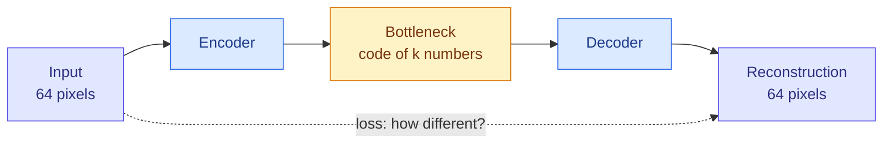
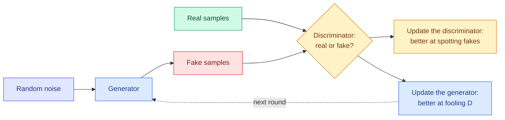

# Autoencoders, Variational Autoencoders and Generative Adversarial Networks

**Level:** 🔴 Advanced &nbsp;|&nbsp; **Effort:** Detailed module &nbsp;|&nbsp; **Module:** [08 Deep Learning](README.md)

---

## 🎯 Learning Objectives

By the end of this topic you will be able to:

- Explain an autoencoder as compression and reconstruction, and compare it with principal component analysis
- Explain what a variational autoencoder adds — a latent space you can sample from — and its two-part loss
- Generate new digits from a trained variational autoencoder, and evaluate them without fooling yourself
- Explain a generative adversarial network as a two-player game, and recognise mode collapse
- Place these three in the history that led to today's diffusion models and large generative models

## 📚 Prerequisites

- [Topic 6: MLPs, CNNs and Recurrent Networks](06-cnns-rnns-and-sequence-models.md)
- [Dimensionality Reduction](../05-machine-learning/08-dimensionality-reduction.md) — principal component analysis
- [Probability](../02-mathematics-for-ai/06-probability.md) — normal distributions and the Kullback–Leibler divergence

```bash
pip install -r requirements.txt
pip install -r requirements-dl.txt --index-url https://download.pytorch.org/whl/cpu    # macOS: omit --index-url
```

---

## 🍰 1. The simple version

Every model so far *predicted* something about its input. These three *produce* data:

- An **autoencoder** squeezes each input through a narrow bottleneck and tries to rebuild it. Whatever survives the
  squeeze is a compact summary — useful for compression, denoising and spotting inputs that do not rebuild well.
- A **variational autoencoder (VAE)** organises that bottleneck so that *any* point in it decodes to something
  plausible. Pick a random point, decode it, and you have generated a new example.
- A **generative adversarial network (GAN)** trains two networks against each other: a **generator** that forges
  examples and a **discriminator** that tries to tell forgeries from real data. Each improves by beating the other.

## 🏠 2. Real-life analogy

> An autoencoder is summarising a film in one sentence and asking a friend to retell the whole film from it. A VAE
> is agreeing on a structured summary format so that *any* sentence in that format describes some plausible film. A
> GAN is a forger and an art expert in an arms race — the forger improves until the expert can no longer tell.

**Where the analogy breaks down:** a forger who finds one painting the expert always accepts may paint only that
one, forever. GANs do exactly this — mode collapse, section 5.

---

## 🗜️ 3. Autoencoders



The training target is the input itself, so no labels are needed — it is **self-supervised**
([Semi- and Self-Supervised Learning](../05-machine-learning/10-semi-and-self-supervised-learning.md)). A **linear**
autoencoder trained with squared error learns the same subspace as principal component analysis (PCA). With
non-linear layers it can do better.

```python
"""An autoencoder against PCA: reconstruction error on unseen digits, with the same code size."""

import torch
from sklearn.datasets import load_digits
from sklearn.decomposition import PCA
from sklearn.model_selection import train_test_split
from torch import nn

torch.set_default_dtype(torch.float64)

X, _ = load_digits(return_X_y=True)
X_train, X_test = train_test_split(X / 16.0, test_size=0.3, random_state=0)
train, test = torch.tensor(X_train), torch.tensor(X_test)

print(f"{'code size':>9}{'PCA error':>11}{'autoencoder error':>19}")
for code_size in [2, 8]:
    pca = PCA(code_size).fit(X_train)
    pca_error = ((pca.inverse_transform(pca.transform(X_test)) - X_test) ** 2).mean()

    torch.manual_seed(0)
    encoder = nn.Sequential(nn.Linear(64, 128), nn.ReLU(), nn.Linear(128, code_size))
    decoder = nn.Sequential(nn.Linear(code_size, 128), nn.ReLU(), nn.Linear(128, 64), nn.Sigmoid())
    optimiser = torch.optim.Adam([*encoder.parameters(), *decoder.parameters()], lr=1e-3)
    order = torch.Generator().manual_seed(0)
    for _ in range(150):
        permutation = torch.randperm(len(train), generator=order)
        for start in range(0, len(train), 64):
            batch = train[permutation[start:start + 64]]
            loss = ((decoder(encoder(batch)) - batch) ** 2).mean()        # the target is the input itself
            optimiser.zero_grad()
            loss.backward()
            optimiser.step()
    with torch.no_grad():
        autoencoder_error = ((decoder(encoder(test)) - test) ** 2).mean().item()
    print(f"{code_size:>9}{pca_error:>11.4f}{autoencoder_error:>19.4f}")
```

**Output:**
```
code size  PCA error  autoencoder error
        2     0.0537             0.0375
        8     0.0249             0.0134
```

**The non-linear autoencoder reconstructed unseen digits with noticeably less error than PCA at both code sizes.** PCA
can only project onto a flat subspace; the autoencoder can learn a curved one. The price is training, tuning, and a
code whose dimensions have no ordering or meaning — PCA's components are ranked by variance explained; an
autoencoder's are not.

| Use | How |
| --- | --- |
| Compression and features | Use the code as a compact input to another model |
| Denoising | Train to reconstruct clean inputs from corrupted ones |
| Anomaly detection | Inputs unlike the training data reconstruct poorly — flag high error ([Anomaly Detection](../05-machine-learning/09-anomaly-detection-and-association-rules.md)) |

**But an ordinary autoencoder is a poor generator.** Its codes form scattered clusters with gaps between them; decode a
point from a gap and you get something that looks like no digit.

---

## 🎲 4. Variational autoencoders

A VAE makes the code space smooth and fillable. Its encoder outputs a **distribution** for each input — a mean
$\boldsymbol{\mu}$ and a variance $\boldsymbol{\sigma}^2$ — and the decoder reconstructs from a random sample of it. The
loss has two parts:

### 📐 The VAE loss

$$
\mathcal{L} = \underbrace{\text{reconstruction error}}_{\text{rebuild the input}} +
\underbrace{D_{\text{KL}}\big(\mathcal{N}(\boldsymbol{\mu}, \boldsymbol{\sigma}^2)\,\|\,\mathcal{N}(0, I)\big)}_{\text{stay close to a standard normal}}
$$

$$
D_{\text{KL}} = -\tfrac{1}{2}\sum_j \big(1 + \log\sigma_j^2 - \mu_j^2 - \sigma_j^2\big)
$$

| Term | Pushes the model to |
| --- | --- |
| Reconstruction | Encode enough information to rebuild the input |
| KL divergence | Keep every input's code distribution close to a standard normal — so codes overlap and fill the space with no gaps |

The two pull against each other. The result is a code space in which **a random draw from a standard normal decodes to
something plausible** — which is what generation needs.

**The reparameterisation trick** makes it trainable. Sampling is not differentiable, so the sample is written as
$\mathbf{z} = \boldsymbol{\mu} + \boldsymbol{\sigma} \odot \boldsymbol{\epsilon}$ with $\boldsymbol{\epsilon}$ drawn from a
standard normal. The randomness sits in $\boldsymbol{\epsilon}$, and gradients flow through $\boldsymbol{\mu}$ and
$\boldsymbol{\sigma}$.

### 💻 Code example — generate new digits, and judge them honestly

```python
"""A small VAE on 8x8 digits: train, sample from the prior, and judge the samples."""

import numpy as np
import torch
from sklearn.datasets import load_digits
from sklearn.linear_model import LogisticRegression
from torch import nn

torch.set_default_dtype(torch.float64)

X, y = load_digits(return_X_y=True)
X = X / 16.0


class VAE(nn.Module):
    def __init__(self, code_size=8):
        super().__init__()
        self.encoder = nn.Sequential(nn.Linear(64, 128), nn.ReLU())
        self.mean, self.log_variance = nn.Linear(128, code_size), nn.Linear(128, code_size)
        self.decoder = nn.Sequential(nn.Linear(code_size, 128), nn.ReLU(), nn.Linear(128, 64))

    def forward(self, x):
        hidden = self.encoder(x)
        mean, log_variance = self.mean(hidden), self.log_variance(hidden)
        code = mean + torch.randn_like(mean) * torch.exp(0.5 * log_variance)     # the reparameterisation trick
        return self.decoder(code), mean, log_variance


torch.manual_seed(0)
vae = VAE()
optimiser = torch.optim.Adam(vae.parameters(), lr=1e-3)
data, order = torch.tensor(X), torch.Generator().manual_seed(0)
for _ in range(200):
    permutation = torch.randperm(len(data), generator=order)
    for start in range(0, len(data), 64):
        batch = data[permutation[start:start + 64]]
        logits, mean, log_variance = vae(batch)
        reconstruction = nn.functional.binary_cross_entropy_with_logits(logits, batch, reduction="sum") / len(batch)
        kl = -0.5 * torch.sum(1 + log_variance - mean ** 2 - log_variance.exp()) / len(batch)
        optimiser.zero_grad()
        (reconstruction + kl).backward()
        optimiser.step()

with torch.no_grad():
    samples = torch.sigmoid(vae.decoder(torch.randn(1000, 8))).numpy()      # decode random points: new digits


def draw(image):
    shades = ".,:-=+*#%@"
    return ["".join(shades[min(9, int(value * 10))] for value in row) for row in image.reshape(8, 8)]


print("three generated digits:")
for line in zip(*(draw(samples[i]) for i in range(3)), strict=True):
    print("   ".join(line))

# Judge the samples with a classifier trained on real digits - and calibrate the judge against noise.
judge = LogisticRegression(max_iter=3000).fit(X, y)
noise = np.random.default_rng(0).uniform(0, 1, (1000, 64))
print(f"\n{'1,000 images':<16}{'judge confidence':>17}   predicted digit counts 0-9")
for name, images in [("real digits", X[:1000]), ("VAE samples", samples), ("uniform noise", noise)]:
    probabilities = judge.predict_proba(images)
    counts = np.bincount(probabilities.argmax(axis=1), minlength=10)
    print(f"{name:<16}{probabilities.max(axis=1).mean():>17.2f}   {counts.tolist()}")
```

**Output:**
```
three generated digits:
..:##:..   ..,##,..   ..=%#-..
..##+*..   ..*%+-..   .:%***..
.,%-:*,.   .,%-.=..   .:*-*+..
.:#++=,.   .:%+=*:.   ..=#%-..
.:#*+=,.   .:%*=#-.   ..:##+..
.,%=-#:.   .,*:.*+.   ..-:-*:.
..#++#,.   ..++:#=.   ..*-=#:.
..:%%=..   ..,*%*,.   ..+%%=..

1,000 images     judge confidence   predicted digit counts 0-9
real digits                  0.92   [99, 105, 100, 104, 97, 100, 99, 99, 97, 100]
VAE samples                  0.71   [99, 102, 89, 106, 104, 93, 87, 92, 136, 92]
uniform noise                0.59   [13, 44, 163, 61, 500, 36, 7, 128, 23, 25]
```

**The samples are recognisable digits** — blurry, as VAE samples typically are, because averaging over the code
distribution smooths detail. Every one came from a random point that no training image was encoded to.

**The judging rows are the more important lesson.** The VAE's samples spread over all ten digits — no digit is missing,
which is exactly what section 5's GAN fails at — and the judge is more confident about them than about noise, less than
about real digits. **But look at the noise row: a classifier gave uniform random pixels substantial confidence, and
piled half of them into one class.** A classifier's confidence is a weak measure of whether something looks real.
Evaluating generative models properly is hard; [36 AI Evaluation](../36-ai-evaluation/README.md) covers the measures
used in practice.

---

## ⚔️ 5. Generative adversarial networks



### 📐 The two-player game

$$
\min_G \max_D \; \mathbb{E}_{x \sim \text{data}}\big[\log D(x)\big] + \mathbb{E}_{z}\big[\log\big(1 - D(G(z))\big)\big]
$$

The discriminator $D$ maximises its ability to label real data 1 and fakes 0; the generator $G$ minimises it. In
practice the generator is trained to *maximise* $\log D(G(z))$ instead, which gives stronger gradients early on —
the code below does this. There is no single loss going down; **training is an equilibrium, and equilibria can be
unstable.**

### ⚠️ Mode collapse

The real data here has **two modes** — values near −4 and near +4, half each. A generator can fool the discriminator
by producing only one of them. Three training runs, identical except for the seed:

```python
"""A GAN on a two-mode distribution: watch for mode collapse."""

import torch
from torch import nn

torch.set_default_dtype(torch.float64)
bce = nn.functional.binary_cross_entropy_with_logits


def real_data(n, generator):
    """Half the values near -4, half near +4."""
    mode = torch.randint(0, 2, (n, 1), generator=generator).double()
    return torch.where(mode == 1, 4.0, -4.0) + 0.5 * torch.randn(n, 1, generator=generator)


def describe(samples):
    above = (samples > 0).double().mean().item()
    if above > 0.95:
        return "only the +4 mode"
    if above < 0.05:
        return "only the -4 mode"
    return "both modes" if 0.3 < above < 0.7 else "both, unbalanced"


print(f"{'run':>3}   {'after step 500':<20}{'after step 1500':<20}{'after step 3000'}")
for seed in [0, 1, 2]:
    torch.manual_seed(seed)
    randomness = torch.Generator().manual_seed(seed)
    generator = nn.Sequential(nn.Linear(4, 32), nn.ReLU(), nn.Linear(32, 32), nn.ReLU(), nn.Linear(32, 1))
    discriminator = nn.Sequential(nn.Linear(1, 32), nn.ReLU(), nn.Linear(32, 32), nn.ReLU(), nn.Linear(32, 1))
    optimise_g = torch.optim.Adam(generator.parameters(), lr=1e-3, betas=(0.5, 0.999))
    optimise_d = torch.optim.Adam(discriminator.parameters(), lr=1e-3, betas=(0.5, 0.999))
    ones, zeros, states = torch.ones(128, 1), torch.zeros(128, 1), []
    for step in range(1, 3001):
        fake = generator(torch.randn(128, 4, generator=randomness))
        d_loss = bce(discriminator(real_data(128, randomness)), ones) + bce(discriminator(fake.detach()), zeros)
        optimise_d.zero_grad()
        d_loss.backward()
        optimise_d.step()
        g_loss = bce(discriminator(fake), ones)                     # the generator wants its fakes called real
        optimise_g.zero_grad()
        g_loss.backward()
        optimise_g.step()
        if step in (500, 1500, 3000):
            with torch.no_grad():
                states.append(describe(generator(torch.randn(4000, 4, generator=randomness))))
    print((f"{seed:>3}   " + "".join(f"{s:<20}" for s in states)).rstrip())
```

**Output:**
```
run   after step 500      after step 1500     after step 3000
  0   only the +4 mode    only the +4 mode    both modes
  1   only the -4 mode    only the -4 mode    both modes
  2   only the -4 mode    only the -4 mode    only the -4 mode
```

**Every run first collapsed onto a single mode**, producing convincing values near one peak and none near the other.
Some later escaped and covered both; at least one was still stuck after 3,000 steps. Nothing in a loss curve would
have told you — the generator was successfully fooling its discriminator the whole time. **You only see mode collapse
by looking at the diversity of what is generated.**

**Why it happens:** the generator is rewarded for any output the discriminator currently accepts. Producing one
convincing mode is a local win; when the discriminator adapts, the generator may hop to the other mode rather than
spread over both. Remedies include changed losses (Wasserstein GANs), minibatch-level diversity terms, careful
architecture and learning-rate choices — and, in practice, the field moving to diffusion models.

---

## 🧭 6. Where these sit today

| Model | Strength | Weakness | Status |
| --- | --- | --- | --- |
| Autoencoder | Simple compression, denoising, anomaly detection | Not a generator | Widely used as a component |
| VAE | Stable training; smooth latent space; likelihood-based | Blurry samples | Used as the image compressor inside latent diffusion models |
| GAN | Sharp samples, fast generation | Unstable training, mode collapse, hard to evaluate | Largely replaced for images; still used for some tasks |
| Diffusion | High quality and diversity, stable training | Slow, many-step generation | The dominant image and video generators ([Topic 8](08-other-architectures.md)) |

The ideas carry forward: the **VAE's latent space** is where most image diffusion models do their work, and the
**adversarial idea** survives inside many training recipes. Generative AI as a field is [12 Generative AI](../12-generative-ai/README.md).

---

## 🏭 7. Production notes

- **Autoencoder anomaly detectors need a threshold on reconstruction error**, chosen on validation data from the cost of
  false alarms ([Classification Metrics](../07-model-evaluation/06-classification-metrics.md)).
- **Generated data is not real data.** Synthetic samples used for training or testing inherit the generator's gaps —
  mode collapse is invisible in individual samples ([Synthetic Data](../03-data-foundations/07-synthetic-data-augmentation-and-feature-stores.md)).
- **Monitor diversity, not only quality**, for any generator in production.

## 🔐 8. Security note

Generative models can **memorise and reproduce training examples**, including personal data; test for near-duplicates
of training records in generated output before release. Generated media can be used to impersonate real people —
provenance and watermarking are covered in [26 Responsible AI](../26-responsible-ai/README.md) and
[28 AI Security](../28-ai-security/README.md). This repository teaches detection and defence, not evasion.

---

## 🎤 9. Interview questions

<details>
<summary><b>Q1: How does a VAE differ from an ordinary autoencoder?</b></summary>

An autoencoder maps each input to one code point and learns only to reconstruct, so its code space has gaps that decode
to nonsense. A VAE's encoder outputs a distribution per input, the decoder reconstructs from a sample of it, and a KL
divergence term pulls every distribution towards a standard normal. That makes the code space continuous and fillable,
so decoding a random draw from a standard normal produces a plausible new example. The reparameterisation trick,
$z = \mu + \sigma\epsilon$, keeps sampling differentiable.
</details>

<details>
<summary><b>Q2: What is mode collapse in GANs, and how would you detect it?</b></summary>

The generator produces only a subset of the data's variety — one mode of a two-mode distribution, or a few kinds of
face — because anything the discriminator currently accepts is rewarded. The losses can look healthy throughout.
Detect it by measuring the diversity of generated samples: coverage of known classes or modes, or distribution-level
metrics comparing generated and real data. In the example every run first collapsed to one mode and at least one never
recovered within 3,000 steps.
</details>

<details>
<summary><b>Q3: Why would you use an autoencoder for anomaly detection, and what can go wrong?</b></summary>

Trained on normal data only, it reconstructs normal inputs well and unusual ones poorly, so reconstruction error is an
anomaly score that needs no labelled anomalies. Risks: a flexible autoencoder may reconstruct anomalies well too; if
anomalies are in the training data it learns them; and the threshold must be chosen from the cost of false alarms and
misses on validation data.
</details>

---

## ✅ Key takeaways

- An **autoencoder** compresses and rebuilds; non-linear, it beat PCA's reconstruction error on unseen digits.
- A **VAE** adds a KL term and sampling so its latent space can be **sampled from**: random codes decoded to digits.
- **Judging generated data is hard** — a classifier gave pure noise substantial confidence.
- A **GAN** is a forger-versus-expert game with no single loss to watch; **mode collapse** was visible only in the
  samples' diversity.
- VAEs live on inside latent diffusion; **diffusion models** replaced GANs for most image generation.

---

## 📚 Official References

- [Auto-Encoding Variational Bayes — Kingma and Welling, arXiv](https://arxiv.org/abs/1312.6114) — verified 2026-09-18
- [Generative Adversarial Networks — Goodfellow et al., arXiv](https://arxiv.org/abs/1406.2661) — verified 2026-09-18
- [PyTorch: DCGAN Tutorial — PyTorch Foundation](https://pytorch.org/tutorials/beginner/dcgan_faces_tutorial.html) — verified 2026-09-18
- [Deep Learning, book site — Goodfellow, Bengio and Courville, MIT Press](https://www.deeplearningbook.org/) — verified 2026-09-18; chapters 14 and 20

---

## 🔗 Navigation

[← Topic 6: MLPs, CNNs and Recurrent Networks](06-cnns-rnns-and-sequence-models.md) &nbsp;|&nbsp;
[🏠 Module Home](README.md) &nbsp;|&nbsp;
[Topic 8: Transformers, Diffusion, GNNs and Other Architectures →](08-other-architectures.md)
