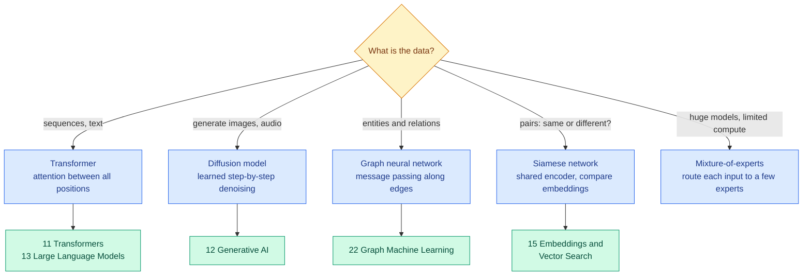

# Transformers, Diffusion Models, Graph Networks and Other Architectures

**Level:** 🔴 Advanced &nbsp;|&nbsp; **Effort:** Detailed module &nbsp;|&nbsp; **Module:** [08 Deep Learning](README.md)

---

## 🎯 Learning Objectives

By the end of this topic you will be able to:

- Place transformers, diffusion models, graph neural networks, Siamese networks, capsule networks and
  mixture-of-experts on one map: the data each suits and the idea each adds
- Train a tiny diffusion model and show it covering both modes of a distribution where a GAN collapsed
- Show a graph neural network classifying nodes from two labels per class, where the same model without the graph cannot
- Explain sparse mixture-of-experts: many parameters, few used per input — and its load-balancing problem
- Know which later module teaches each architecture in depth

## 📚 Prerequisites

- [Topic 7: Autoencoders, VAEs and GANs](07-autoencoders-vaes-and-gans.md) — the GAN whose mode collapse section 5 revisits
- [Topic 6: MLPs, CNNs and Recurrent Networks](06-cnns-rnns-and-sequence-models.md)

```bash
pip install -r requirements.txt
pip install -r requirements-dl.txt --index-url https://download.pytorch.org/whl/cpu    # macOS: omit --index-url
```

---

## 🍰 1. The simple version

Topic 6 said each architecture is a bet about the data. This topic is a tour of the bets made since:

- **Transformers** bet that any part of the input may matter to any other part, and let every position look directly
  at every other.
- **Diffusion models** generate by learning to *remove noise*, one small step at a time.
- **Graph neural networks** bet that the connections between things carry the signal.
- **Siamese networks** learn a notion of *similarity* rather than a fixed list of classes.
- **Mixture-of-experts** bets that different inputs need different specialists, and uses only a few per input.
- **Capsule networks** bet that parts and their spatial relationships should be represented explicitly — an idea
  that did not win.

Several have whole modules of their own later. **This topic gives each one's core idea, a demonstration where one
fits in a few seconds on a CPU, and a pointer to where it is taught properly.**

## 🏠 2. Real-life analogy

> A hospital. A transformer is a case conference where every specialist hears everyone else at once. Diffusion is a
> restorer cleaning a painting in many gentle passes. A graph network is diagnosing a patient partly from who they have
> been in contact with. A Siamese network is "does this X-ray look like that one?". Mixture-of-experts is triage:
> each patient sees only the one or two specialists they need.

**Where the analogy breaks down:** real specialists were trained separately. Every component of these architectures is
trained together, end to end, by the same gradient descent.

---

## 🔭 3. The map



| Architecture | Core idea | Built-in bet | Main weakness |
| --- | --- | --- | --- |
| **Transformer** | Self-attention: each position computes a weighted mix of all positions | Any part of the input may matter to any other | Cost grows with the square of sequence length |
| **Diffusion model** | Learn to predict the noise added to data; generate by denoising from pure noise | Generation is easier as many small steps | Slow sampling — many network evaluations per sample |
| **Graph neural network (GNN)** | Each node repeatedly aggregates its neighbours' features | Connected things are related | Deep stacks blur all nodes together ("over-smoothing") |
| **Siamese network** | One encoder applied to two inputs; compare the embeddings | Similarity is learnable and transferable | Needs well-chosen pairs or triplets to train |
| **Capsule network** | Groups of neurons encode an entity and its pose; "routing by agreement" | Part–whole geometry matters | Slow, hard to scale; not adopted widely |
| **Mixture-of-experts (MoE)** | A router sends each input to a few of many expert sub-networks | Specialists beat one generalist | Uneven routing; more parameters to store |

---

## 🧠 4. Transformers — pointer only

Transformers are the architecture behind modern language models, and increasingly vision, audio and more. Their core,
**self-attention**, lets every position in a sequence build its representation from every other position, weighted by
learned relevance — with no chain of multiplications through time, so the long-range problem of RNNs
([Topic 6](06-cnns-rnns-and-sequence-models.md)) disappears. Combined with residual connections and layer
normalisation ([Topic 4](04-vanishing-gradients-normalisation-dropout-and-residuals.md)), they train stably at very
large scale.

**This repository teaches attention once, in [11 Transformers](../11-transformers/README.md)**, from the mathematics to a
working implementation, and large language models in [13 Large Language Models](../13-large-language-models/README.md).

---

## 🌫️ 5. Diffusion models

**The idea:** destroying data is easy — add a little Gaussian noise, many times, until only noise remains. A diffusion
model learns to **undo one small step of that destruction**. To generate, start from pure noise and apply the learned
undo step many times.

### 📐 The forward process and the training objective

With a noise schedule $\beta_1 \dots \beta_T$ and $\bar{\alpha}_t = \prod_{s \le t}(1 - \beta_s)$, a noisy version of a
data point $x_0$ at step $t$ can be produced in one go:

$$
x_t = \sqrt{\bar{\alpha}_t}\,x_0 + \sqrt{1 - \bar{\alpha}_t}\,\epsilon, \qquad \epsilon \sim \mathcal{N}(0, 1)
$$

A network $\epsilon_\theta(x_t, t)$ is trained to **predict the noise** $\epsilon$ from the noisy point and the step
number, with plain squared error: $\lVert \epsilon - \epsilon_\theta(x_t, t)\rVert^2$. No adversary, no game — just
regression, which is why training is stable.

| Symbol | Means |
| --- | --- |
| $\beta_t$ | How much noise step $t$ adds — small, growing over the schedule |
| $\bar{\alpha}_t$ | How much of the original signal survives at step $t$: near 1 at the start, near 0 at the end |
| $\epsilon_\theta$ | The denoising network — here a small MLP; for images, a U-Net or a transformer |

### 💻 Code example — the two-mode problem again

The same data on which [Topic 7's GAN](07-autoencoders-vaes-and-gans.md) collapsed to one mode, three seeds.

```python
"""A tiny diffusion model on the two-mode data that made a GAN collapse."""

import torch
from torch import nn

torch.set_default_dtype(torch.float64)

T = 100
betas = torch.linspace(1e-4, 0.1, T)
alphas = 1 - betas
alpha_bar = torch.cumprod(alphas, dim=0)
print(f"signal surviving at steps 1, 25, 50, 100: {[round(v, 3) for v in alpha_bar[[0, 24, 49, 99]].tolist()]}\n")


def real_data(n, generator):
    mode = torch.randint(0, 2, (n, 1), generator=generator).double()
    return torch.where(mode == 1, 4.0, -4.0) + 0.5 * torch.randn(n, 1, generator=generator)


def describe(samples):
    above = (samples > 0).double().mean().item()
    modes = "both modes" if 0.3 < above < 0.7 else "one mode" if above < 0.05 or above > 0.95 else "unbalanced"
    centred = (abs(samples[samples > 0].mean().item() - 4) < 0.5 and abs(samples[samples < 0].mean().item() + 4) < 0.5)
    return f"{modes}, {'centred near -4 and +4' if centred else 'off-centre'}"


for seed in [0, 1, 2]:
    torch.manual_seed(seed)
    randomness = torch.Generator().manual_seed(seed)
    denoiser = nn.Sequential(nn.Linear(2, 64), nn.ReLU(), nn.Linear(64, 64), nn.ReLU(), nn.Linear(64, 1))
    optimiser = torch.optim.Adam(denoiser.parameters(), lr=1e-3)
    for _ in range(3000):
        x0 = real_data(256, randomness)
        t = torch.randint(0, T, (256,), generator=randomness)
        noise = torch.randn(256, 1, generator=randomness)
        x_t = alpha_bar[t].sqrt()[:, None] * x0 + (1 - alpha_bar[t]).sqrt()[:, None] * noise
        predicted_noise = denoiser(torch.cat([x_t, t[:, None] / T], dim=1))
        loss = ((predicted_noise - noise) ** 2).mean()                   # plain regression: predict the noise
        optimiser.zero_grad()
        loss.backward()
        optimiser.step()

    with torch.no_grad():                                                 # generate: denoise from pure noise
        x = torch.randn(4000, 1, generator=randomness)
        for t in reversed(range(T)):
            predicted_noise = denoiser(torch.cat([x, torch.full((4000, 1), t / T)], dim=1))
            x = (x - betas[t] / (1 - alpha_bar[t]).sqrt() * predicted_noise) / alphas[t].sqrt()
            if t > 0:
                x = x + betas[t].sqrt() * torch.randn(4000, 1, generator=randomness)
    print(f"run {seed}: {describe(x)}")
```

**Output:**
```
signal surviving at steps 1, 25, 50, 100: [1.0, 0.735, 0.283, 0.006]

run 0: both modes, centred near -4 and +4
run 1: both modes, centred near -4 and +4
run 2: both modes, centred near -4 and +4
```

**Every run covered both modes, centred in the right places** — the same data on which the GAN spent its early
training producing one mode, and in one run never recovered. The difference is the objective: the denoiser is trained
by regression on noisy copies of *all* the data, so it cannot ignore half of it the way a generator can while it keeps
fooling its discriminator.

**The price is visible in the sampling loop**: 100 network evaluations for every batch of samples, where a GAN needs one.
Much research — fewer steps, working in a compressed latent space produced by a VAE ([Topic 7](07-autoencoders-vaes-and-gans.md)) —
has gone into reducing that cost. Diffusion for images, audio and video is taught in [12 Generative AI](../12-generative-ai/README.md).

---

## 🕸️ 6. Graph neural networks

Many datasets are **graphs**: people and friendships, molecules and bonds, papers and citations, accounts and
transactions. A graph neural network updates each node's representation from its neighbours' — **message passing**.
The simplest version, the graph convolutional network (GCN), averages over each node's neighbourhood with a
normalisation:

$$
H^{(l+1)} = \text{ReLU}\big(\hat{D}^{-1/2}\hat{A}\hat{D}^{-1/2}\,H^{(l)}\,W^{(l)}\big), \qquad \hat{A} = A + I
$$

| Symbol | Means |
| --- | --- |
| $A$ | The adjacency matrix: 1 where two nodes are connected |
| $\hat{A} = A + I$ | Add self-loops, so a node keeps its own features |
| $\hat{D}$ | The degree matrix of $\hat{A}$; the normalisation stops busy nodes dominating |
| $H^{(l)}, W^{(l)}$ | Node features at layer $l$, and the layer's learned weights — shared by every node |

```python
"""Node classification with two labelled nodes per class: with and without the graph."""

import torch
from torch import nn

torch.set_default_dtype(torch.float64)

# Two communities of 30 nodes: dense links inside each, sparse links between. Node features are only weakly informative.
randomness = torch.Generator().manual_seed(0)
n = 60
labels = torch.tensor([0] * 30 + [1] * 30)
same_community = labels[:, None] == labels[None, :]
adjacency = (torch.rand(n, n, generator=randomness) < torch.where(same_community, 0.25, 0.02)).double()
adjacency = torch.triu(adjacency, diagonal=1)
adjacency = adjacency + adjacency.T
features = torch.randn(n, 8, generator=randomness) + 0.3 * labels[:, None].double()

with_self_loops = adjacency + torch.eye(n)
degree = with_self_loops.sum(dim=1)
propagate = with_self_loops / torch.sqrt(degree[:, None] * degree[None, :])        # D^-1/2 (A + I) D^-1/2

labelled = torch.tensor([0, 1, 30, 31])                                            # just 2 labels per class
unlabelled = torch.ones(n, dtype=torch.bool)
unlabelled[labelled] = False
edges = int(adjacency.sum().item() / 2)
inside = int((adjacency * same_community).sum().item() / 2)
print(f"{n} nodes, {edges} edges ({inside} inside a community), {len(labelled)} labelled nodes\n")


class TwoLayerNetwork(nn.Module):
    def __init__(self, use_graph):
        super().__init__()
        self.first, self.second = nn.Linear(8, 16), nn.Linear(16, 2)
        self.mix = propagate if use_graph else torch.eye(n)            # identity = ignore the graph: an ordinary MLP

    def forward(self, x):
        return self.mix @ self.second(torch.relu(self.mix @ self.first(x)))


print(f"{'model':<26}{'accuracy on the 56 unlabelled nodes, 5 seeds':>46}")
for name, use_graph in [("MLP, features only", False), ("GCN, features + graph", True)]:
    scores = []
    for seed in range(5):
        torch.manual_seed(seed)
        model = TwoLayerNetwork(use_graph)
        optimiser = torch.optim.Adam(model.parameters(), lr=0.01, weight_decay=5e-4)
        for _ in range(200):
            loss = nn.functional.cross_entropy(model(features)[labelled], labels[labelled])
            optimiser.zero_grad()
            loss.backward()
            optimiser.step()
        with torch.no_grad():
            scores.append((model(features).argmax(dim=1)[unlabelled] == labels[unlabelled]).double().mean().item())
    print(f"{name:<26}{'  '.join(f'{s:.3f}' for s in scores):>46}")
```

**Output:**
```
60 nodes, 243 edges (225 inside a community), 4 labelled nodes

model                       accuracy on the 56 unlabelled nodes, 5 seeds
MLP, features only                     0.446  0.518  0.464  0.536  0.446
GCN, features + graph                  0.982  0.982  0.982  0.982  0.982
```

**From four labelled nodes, the GCN labelled almost every other node correctly; the MLP was at chance.** The features
barely separate the classes, so a model that sees each node alone cannot tell them apart. The GCN's two rounds of
message passing let each node absorb its neighbourhood — and a node's neighbours are mostly in its own community. The
labels spread along the edges, as in label spreading ([Semi- and Self-Supervised Learning](../05-machine-learning/10-semi-and-self-supervised-learning.md)).

**The bet can lose**: on graphs where connected nodes tend to *differ* — fraudsters transacting with honest accounts,
say — naive neighbourhood averaging hurts. Heterophily, over-smoothing and scaling to millions of nodes are covered in
[22 Graph Machine Learning](../22-graph-machine-learning/README.md).

---

## 👯 7. Siamese networks and learned similarity

A Siamese network applies **one shared encoder** to two inputs and compares the resulting embeddings, usually by
distance. It is trained on pairs — "same" or "different" — or triplets (anchor, positive, negative) so that similar
inputs end up close together.

**What it buys you:** the model learns *similarity*, not a fixed list of classes. A face-verification system can then
recognise a person it never saw in training from a single reference photo — **one-shot learning** — by comparing
embeddings. The same idea underlies semantic search, deduplication and the contrastive pretraining in
[Self-Supervised Learning](../05-machine-learning/10-semi-and-self-supervised-learning.md); embeddings and vector search
are [15 Embeddings and Vector Search](../15-embeddings-and-vector-search/README.md).

---

## 🔀 8. Mixture-of-experts

A sparse mixture-of-experts layer holds many expert sub-networks and a small **router** that sends each input to only
the top-$k$ of them. Total parameters grow with the number of experts; **compute per input grows only with $k$.** That
is how some very large language models keep inference affordable.

```python
"""A sparse mixture-of-experts layer: parameters stored versus parameters used, and uneven routing."""

import torch
from torch import nn

torch.set_default_dtype(torch.float64)
torch.manual_seed(0)

width, experts, top_k = 64, 8, 1
router = nn.Linear(width, experts)
expert_layers = nn.ModuleList([nn.Sequential(nn.Linear(width, 4 * width), nn.GELU(), nn.Linear(4 * width, width))
                               for _ in range(experts)])

tokens = torch.randn(1000, width) + 0.5 * torch.randn(1, width)             # 1,000 inputs with a shared tendency
with torch.no_grad():
    chosen = router(tokens).topk(top_k, dim=1).indices[:, 0]               # each input goes to one expert
    counts = torch.bincount(chosen, minlength=experts)

per_expert = sum(p.numel() for p in expert_layers[0].parameters())
print(f"parameters stored in the experts:   {experts * per_expert:,}")
print(f"parameters used for each input:     {top_k * per_expert:,}  ({top_k} of {experts} experts)")
print(f"inputs routed to each expert:       {counts.tolist()}")
print(f"busiest expert handles {counts.max().item() / counts.sum().item():.0%} of inputs; "
      f"{(counts == 0).sum().item()} expert(s) get none")
```

**Output:**
```
parameters stored in the experts:   264,704
parameters used for each input:     33,088  (1 of 8 experts)
inputs routed to each expert:       [87, 243, 108, 156, 135, 60, 198, 13]
busiest expert handles 24% of inputs; 0 expert(s) get none
```

**Eight times the parameters, one-eighth of them used per input.** But look at the routing: **even an untrained
router sends inputs unevenly**, because inputs that share a tendency all score highest on the same few experts. In
training this compounds — busy experts improve and attract more inputs, idle experts never learn. Real MoE models add
a **load-balancing loss** that penalises uneven routing, and a capacity limit per expert. Storing every expert also
still costs memory, even though each input uses few ([35 Distributed Training](../35-distributed-training-and-infrastructure/README.md)).

---

## 💊 9. Capsule networks: an idea that did not win

Capsule networks (2017) replaced single neurons with groups — capsules — whose output vector encodes both whether an
entity is present and its pose, and passed information between layers by "routing by agreement". The aim was to capture
part–whole relationships that pooling in CNNs discards. They showed promising results on small benchmarks but were slow
and hard to scale, and CNNs and then vision transformers kept winning at scale. **They are worth knowing as an example
that a principled idea is not enough**: architectures win by scaling well on real hardware and data.

---

## 🏭 10. Production notes

| Architecture | Production concern |
| --- | --- |
| Transformer | Memory and latency grow with sequence length; caching and batching dominate serving cost ([30 LLMOps](../30-llmops/README.md)) |
| Diffusion | Many steps per sample; step reduction and distillation matter more than model size |
| GNN | Graphs change over time and do not fit on one machine; sampling neighbourhoods is the usual answer |
| Siamese / embeddings | The embedding index must be rebuilt when the encoder changes — version them together |
| Mixture-of-experts | All experts must be held in memory; routing imbalance wastes hardware |

## ⚠️ 11. Common mistakes

| Mistake | Why it happens | Fix |
| --- | --- | --- |
| A transformer for every problem | It is the headline architecture | Tables still favour boosted trees; small images still suit CNNs |
| Judging a generator by sample quality alone | Samples look good | Check diversity; the GAN collapsed while each sample looked fine |
| Ignoring the graph in relational data | Tabular habits | Two labels per class sufficed with the graph; the features alone were at chance |
| Assuming neighbourhood averaging always helps | It did here | It hurts when connected nodes tend to differ |
| Counting MoE compute by total parameters | The headline number | Compute follows active experts; memory follows total experts |

---

## 🎤 12. Interview questions

<details>
<summary><b>Q1: How does a diffusion model generate data, and why is it easier to train than a GAN?</b></summary>

Training takes real data, adds a known amount of Gaussian noise at a random step of a fixed schedule, and trains a
network to predict that noise — ordinary regression. Generation starts from pure noise and repeatedly applies the
network to remove a little noise at a time. Because the objective is a plain loss over noisy versions of all the
training data, there is no adversarial game to destabilise and no incentive to ignore part of the data; in the example
every diffusion run covered both modes of a distribution on which a GAN had collapsed. The cost is many network
evaluations per sample.
</details>

<details>
<summary><b>Q2: What is message passing in a graph neural network?</b></summary>

Each layer updates every node's representation from an aggregation — often a normalised average — of its neighbours'
representations and its own, followed by a shared learned transformation. After $k$ layers, a node's representation
reflects its $k$-hop neighbourhood. In the example, two layers let a GCN classify 56 unlabelled nodes almost perfectly
from 4 labels, where an MLP using only node features was at chance. Too many layers over-smooth nodes into similar
representations.
</details>

<details>
<summary><b>Q3: What is a mixture-of-experts model, and what is its main training difficulty?</b></summary>

A layer containing many expert sub-networks and a router that sends each input to the top-$k$ experts, so the model
stores many parameters but uses only a fraction per input — compute scales with $k$, not with the number of experts. The
main difficulty is load balancing: the router tends to favour a few experts, which then improve and attract even more
inputs while others go unused. An auxiliary load-balancing loss and per-expert capacity limits counter it.
</details>

---

## ✅ Key takeaways

- **Transformers** connect every position to every other; they are taught in [11](../11-transformers/README.md).
- **Diffusion** generates by learned denoising; trained by plain regression, it covered both modes where a GAN collapsed —
  at the cost of 100 network calls per sample.
- **GNNs** pass messages along edges: two labels per class sufficed with the graph; features alone were at chance.
- **Siamese networks** learn similarity, enabling one-shot recognition and search.
- **Mixture-of-experts** stores many parameters and uses few — and must be kept from routing everything to a few experts.
- **Capsule networks** show that a principled idea still has to scale to win.

---

## 📚 Official References

- [Denoising Diffusion Probabilistic Models — Ho, Jain and Abbeel, arXiv](https://arxiv.org/abs/2006.11239) — verified 2026-09-18
- [Semi-Supervised Classification with Graph Convolutional Networks — Kipf and Welling, arXiv](https://arxiv.org/abs/1609.02907) — verified 2026-09-18
- [Attention Is All You Need — Vaswani et al., arXiv](https://arxiv.org/abs/1706.03762) — verified 2026-09-18
- [Outrageously Large Neural Networks: The Sparsely-Gated Mixture-of-Experts Layer — Shazeer et al., arXiv](https://arxiv.org/abs/1701.06538) — verified 2026-09-18
- [Dynamic Routing Between Capsules — Sabour, Frosst and Hinton, arXiv](https://arxiv.org/abs/1710.09829) — verified 2026-09-18
- [Signature Verification using a "Siamese" Time Delay Neural Network — Bromley et al., NeurIPS proceedings](https://proceedings.neurips.cc/paper/1993/hash/288cc0ff022877bd3df94bc9360b9c5d-Abstract.html) — verified 2026-09-18

---

## 🔗 Navigation

[← Topic 7: Autoencoders, VAEs and GANs](07-autoencoders-vaes-and-gans.md) &nbsp;|&nbsp;
[🏠 Module Home](README.md) &nbsp;|&nbsp;
[Next module: 09 Computer Vision →](../09-computer-vision/README.md)
