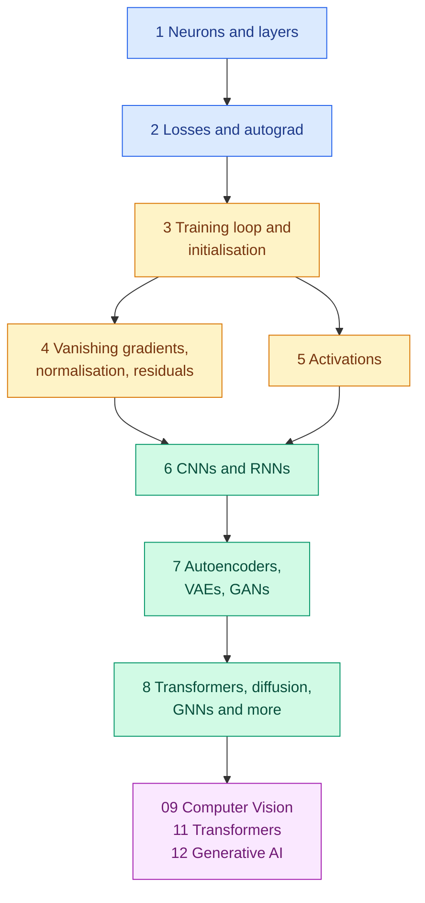

<!-- status: authored -->

# 08. Deep Learning

**Level:** 🟡 Intermediate → 🔴 Advanced &nbsp;|&nbsp; **Effort:** Detailed module &nbsp;|&nbsp; **Status:** ✅ Complete

Neural networks from the single perceptron to modern architectures, taught with PyTorch — and with every failure
mode measured: vanishing gradients, dead units, symmetric weights, mode collapse.

> **Deep learning is a handful of simple ideas that only work together.** This module shows each one failing on its own
> terms first: a perceptron that can never learn XOR, a 30-layer network stuck at chance until residual connections are
> added, a network whose 32 neurons act as one because they started equal, a GAN that generates only half of what it
> saw. Every result is real output from code that runs on a laptop CPU in seconds.

---

## 🎯 Learning Objectives

By the end of this module you will be able to:

- Explain neurons, layers and depth — and why a network without non-linearities is a single linear model
- Build an autograd engine from scratch, and train, debug and regularise networks in PyTorch
- Choose losses, activations, initialisation, normalisation and learning rates deliberately
- Recognise vanishing and exploding gradients, dead units and symmetry from the numbers
- Explain what each major architecture — MLP, CNN, RNN, LSTM, GRU, autoencoder, VAE, GAN, transformer, diffusion, GNN,
  Siamese, mixture-of-experts — assumes about the data, and where each is taught in depth

## 📚 Prerequisites

- [02 Mathematics for AI](../02-mathematics-for-ai/README.md) — especially
  [Gradient Descent and Backpropagation](../02-mathematics-for-ai/05-gradient-descent-and-backpropagation.md), which
  trains a network by hand in NumPy, and [Optimisation Algorithms](../02-mathematics-for-ai/09-optimisation-algorithms.md),
  which covers SGD, momentum, Adam and schedules
- [05 Machine Learning](../05-machine-learning/README.md) and [07 Model Evaluation](../07-model-evaluation/README.md)

### Installing PyTorch

PyTorch is installed separately from the core requirements, so learners on modules 00–07 never download it:

```bash
pip install -r requirements.txt
pip install -r requirements-dl.txt --index-url https://download.pytorch.org/whl/cpu    # Linux and Windows
pip install -r requirements-dl.txt                                                      # macOS
```

`requirements-dl.txt` pins `torch==2.14.0`. The CPU index avoids several gigabytes of GPU libraries — every example in
this module runs on a CPU in seconds. With an NVIDIA GPU, use the selector on the
[PyTorch installation page](https://pytorch.org/get-started/locally/) for the same version.

### Why the examples use `float64`

Real training uses 32-bit floats or less. The training examples here call `torch.set_default_dtype(torch.float64)`
for one reason: **so the numbers you get match the numbers printed, on any CPU.** Different processors use different
arithmetic kernels, and in 32-bit precision the tiny rounding differences are amplified by hundreds of training steps
into different final digits. In 64-bit they stay too small to matter. Where a run is chaotic even so — a network that
is failing to learn — the example prints a band ("did not learn") instead of digits. This is a teaching choice, not a
production recommendation.

---

## 📑 Topics

| # | Topic | Covers | Level |
| --- | --- | --- | --- |
| 1 | [Neurons, Perceptrons and Layers](01-neurons-perceptrons-and-layers.md) | Biological and artificial neurons, the perceptron and XOR, layers as matrices, depth | 🟢 → 🟡 |
| 2 | [Loss Functions, Computational Graphs and Autograd](02-loss-functions-computational-graphs-and-autograd.md) | An autograd engine from scratch, loss choice, numerically stable losses | 🟡 |
| 3 | [The Training Loop, Batches and Initialisation](03-training-loop-batches-and-initialisation.md) | Epochs and steps, batch size, learning rate, symmetry, Xavier and He | 🟡 |
| 4 | [Vanishing Gradients, Normalisation, Dropout and Residuals](04-vanishing-gradients-normalisation-dropout-and-residuals.md) | Gradients measured per layer, batch and layer norm, dropout, residual connections | 🔴 |
| 5 | [Activation Functions](05-activation-functions.md) | Sigmoid to GELU and Swish, dead ReLUs, stable softmax | 🟡 |
| 6 | [MLPs, CNNs and Recurrent Networks](06-cnns-rnns-and-sequence-models.md) | Convolution and weight sharing, the shift test, RNNs, LSTM and GRU gates | 🟡 → 🔴 |
| 7 | [Autoencoders, VAEs and GANs](07-autoencoders-vaes-and-gans.md) | Autoencoder against PCA, generating digits with a VAE, GAN mode collapse | 🔴 |
| 8 | [Transformers, Diffusion, GNNs and Other Architectures](08-other-architectures.md) | Diffusion from scratch, a graph network, mixture-of-experts, Siamese and capsule networks | 🔴 |

---

## 🗺️ How the pieces fit



**Topics 1–2 are the machinery**: what a network computes and how its gradients are found. **Topics 3–5 are what makes
training work.** **Topics 6–8 are the architectures**, each a bet about the structure of the data.

**What this module deliberately does not repeat:** backpropagation by hand in NumPy, the optimisers and learning-rate
schedules, and gradient clipping are in [02 Mathematics for AI](../02-mathematics-for-ai/README.md); attention and the
transformer are taught once, in [11 Transformers](../11-transformers/README.md).

---

## 🧭 Which topics do you actually need?

| If you are | Read |
| --- | --- |
| New to neural networks | All eight, in order |
| Debugging a network that will not train | 3, 4, 5 |
| Starting on images | 6, then [09 Computer Vision](../09-computer-vision/README.md) |
| Heading for language models | 2, 4, 8, then [11 Transformers](../11-transformers/README.md) |
| Interested in generative models | 7, 8, then [12 Generative AI](../12-generative-ai/README.md) |
| Preparing for interviews | 2, 3, 4, 5 — the questions come up constantly |

---

## 🧪 Every example is verified

Each code block was executed and shows its **real** output, enforced in continuous integration:

```bash
python scripts/check_examples.py --strict 08-deep-learning/
```

Every example was also checked to produce identical output under three different CPU arithmetic kernels. Some results
contradict common assumptions:

- **Squared error failed to train a neuron started confidently wrong; cross-entropy fixed it within 50 steps.**
- **Weights started at a constant left 32 hidden neurons acting as one** — 10% accuracy.
- **At 30 layers, only the residual networks learned.** Normalisation alone did not rescue a plain one.
- **Leaky ReLU did not revive dead units** — prevention, not repair.
- **A freshly initialised LSTM loses gradient through time almost as fast as a plain RNN** — until its forget-gate bias
  is raised.
- **A diffusion model covered both modes of a distribution that made a GAN collapse.**

## 📝 Practice

- Quiz: [`quizzes/08-deep-learning.md`](../quizzes/08-deep-learning.md)
- Answers: [`quizzes/answers/08-deep-learning.md`](../quizzes/answers/08-deep-learning.md)
- Assignments: [`assignments/08-deep-learning.md`](../assignments/08-deep-learning.md)

---

## ⚠️ The five mistakes this module exists to prevent

1. **Treating training as a black box.** Every failure here — vanishing gradients, dead units, symmetry, divergence —
   is visible in numbers you can print. Print them.
2. **Mismatching pieces.** The loss must match the output, the initialisation must match the activation, and the
   normalisation must match the batch size.
3. **Forgetting evaluation mode.** `model.eval()` and `torch.no_grad()` change dropout and batch norm; serving a model
   in training mode silently randomises it.
4. **Judging a generator by how good its samples look.** Check diversity: mode collapse hides behind convincing samples.
5. **Reaching for depth first.** A linear or boosted baseline ([07 Model Evaluation](../07-model-evaluation/04-learning-curves-and-baselines.md))
   decides whether a network has earned its cost.

---

## 📚 Official References

- [PyTorch: Learn the Basics, tutorials — PyTorch Foundation](https://pytorch.org/tutorials/beginner/basics/intro.html) — verified 2026-09-18
- [PyTorch: Get Started, installation selector — PyTorch Foundation](https://pytorch.org/get-started/locally/) — verified 2026-09-18
- [Deep Learning, book site — Goodfellow, Bengio and Courville, MIT Press](https://www.deeplearningbook.org/) — verified 2026-09-18
- [Dive into Deep Learning — Zhang, Lipton, Li and Smola](https://d2l.ai/) — verified 2026-09-18; community-maintained open textbook

TensorFlow and Keras are the main alternative frameworks; the concepts in this module transfer directly, and only the
API differs. See the [TensorFlow tutorials — Google](https://www.tensorflow.org/tutorials) — verified 2026-09-18.

---

## 🔗 Navigation

[← 07 Model Evaluation](../07-model-evaluation/README.md) &nbsp;|&nbsp;
[🏠 Repository Home](../README.md) &nbsp;|&nbsp;
[Topic 1: Neurons, Perceptrons and Layers →](01-neurons-perceptrons-and-layers.md)

**Next module:** [09 Computer Vision](../09-computer-vision/README.md)
