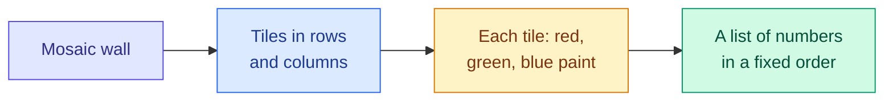
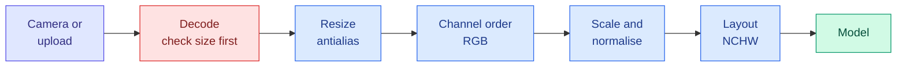

# Images as Tensors: Pixels, Channels, Colour and Preprocessing

**Level:** 🟢 Beginner → 🟡 Intermediate &nbsp;|&nbsp; **Effort:** Detailed module &nbsp;|&nbsp; **Module:** [09 Computer Vision](README.md)

---

## 🎯 Learning Objectives

By the end of this topic you will be able to:

- Describe an image as an array of numbers, and state its shape in both the height-width-channels and the
  channels-height-width layout
- Estimate how much memory an image or a batch of images needs, in 8-bit and in 32-bit form
- Avoid the three classic pixel bugs: 8-bit overflow, swapped colour channels and the wrong memory layout
- Explain the RGB (red, green, blue), grayscale and HSV (hue, saturation, value) colour spaces, and when each is useful
- Resize without inventing patterns (aliasing), and keep preprocessing identical between training and serving
- Handle untrusted uploaded images safely: size limits before decoding, and stripping location metadata

## 📚 Prerequisites

- [NumPy](../01-python-foundations/11-numpy-essentials.md) — arrays, shapes and `dtype`
- [Data Types](../03-data-foundations/01-data-types.md) — images as unstructured data
- [MLPs, CNNs and Recurrent Networks](../08-deep-learning/06-cnns-rnns-and-sequence-models.md) — the convolutional
  neural network (CNN) used in section 7

```bash
pip install -r requirements.txt
pip install -r requirements-dl.txt --index-url https://download.pytorch.org/whl/cpu    # macOS: omit --index-url
```

---

## 🍰 1. The simple version

A digital photo is a **grid of tiny coloured squares called pixels**. Each pixel stores how much red, green and blue
light to show, as three numbers from 0 (none) to 255 (full). A computer never "sees" a cat — it sees a few hundred
thousand of those numbers in a block.

Everything in computer vision starts by turning that block of numbers into the exact shape and scale a model expects.
**Most real-world vision bugs happen here**, before any model runs: numbers that overflow, colours in the wrong order,
or an image prepared one way in training and another way in production.

## 🏠 2. Real-life analogy

> A mosaic made of coloured tiles. Stand close and you see only tiles, each one a single colour. Step back and a face
> appears. Each tile is a pixel; the colour of each tile is written down as three numbers — how much red, green and
> blue paint to mix. Hand someone the list of numbers and the size of the wall, and they can rebuild the mosaic.

**Where the analogy breaks down:** mosaic tiles are all equally important to a viewer. To a model, the *order* in which
the numbers are written down — row by row, colour by colour — matters enormously. Write the same mosaic down in a
different order and a model sees a completely different picture.



---

## ⚙️ 3. An image is an array

| Term | Meaning |
| --- | --- |
| **Pixel** | One cell of the grid — a *picture element* |
| **Resolution** | Width × height in pixels, such as 640 × 427 |
| **Channel** | One layer of values per colour: 3 for RGB (red, green, blue), 1 for grayscale, 4 when an alpha (transparency) channel is added |
| **Bit depth** | Bits per value. Standard photos use 8 bits per channel: 256 levels, 0–255, stored as `uint8` (unsigned 8-bit integer) |
| **HWC / CHW** | The memory layout: height-width-channels (image libraries, NumPy) or channels-height-width (PyTorch) |
| **NCHW** | A batch: number of images, then channels, height, width — what a PyTorch vision model takes as input |

### 💻 Code example — a real photograph, as numbers

scikit-learn ships two small photographs, so this runs without downloading anything.

```python
"""A photograph as an array: shape, type, memory and the two memory layouts."""

import torch
from sklearn.datasets import load_sample_images

photo = load_sample_images().images[0]           # china.jpg, bundled with scikit-learn
print("shape (height, width, channels):", photo.shape)
print("dtype:", photo.dtype, "  range:", photo.min(), "to", photo.max())
print(f"memory: {photo.nbytes:,} bytes = height x width x channels x 1 byte")

tensor = torch.tensor(photo).permute(2, 0, 1).float() / 255.0     # HWC uint8 -> CHW float in [0, 1]
print("\nPyTorch layout (channels, height, width):", tuple(tensor.shape))
print(f"as float32: {tensor.nelement() * tensor.element_size():,} bytes - four times as much")
batch = tensor.unsqueeze(0)
print("a batch of one (N, C, H, W):", tuple(batch.shape))

print(f"\n{'resolution':<12}{'pixels':>12}{'uint8 RGB':>12}{'float32 RGB':>13}")
for name, h, w in [("224 x 224", 224, 224), ("512 x 512", 512, 512), ("1080p", 1080, 1920), ("4K", 2160, 3840)]:
    pixels = h * w
    print(f"{name:<12}{pixels:>12,}{pixels * 3 / 2**20:>10.1f} MB{pixels * 3 * 4 / 2**20:>11.1f} MB")
```

**Output:**
```
shape (height, width, channels): (427, 640, 3)
dtype: uint8   range: 0 to 255
memory: 819,840 bytes = height x width x channels x 1 byte

PyTorch layout (channels, height, width): (3, 427, 640)
as float32: 3,279,360 bytes - four times as much
a batch of one (N, C, H, W): (1, 3, 427, 640)

resolution        pixels   uint8 RGB  float32 RGB
224 x 224         50,176       0.1 MB        0.6 MB
512 x 512        262,144       0.8 MB        3.0 MB
1080p          2,073,600       5.9 MB       23.7 MB
4K             8,294,400      23.7 MB       94.9 MB
```

**Read the last table as a budget.** A single 4K frame as 32-bit floats is almost 95 MB before any model runs. A
batch of 32 of them is 3 GB — which is why vision models almost always work on images resized to a few hundred pixels
a side, and why video systems decode, resize and discard frames as early as possible.

`permute(2, 0, 1)` reorders the axes from HWC to CHW. It does not move a single pixel value — only the order in which
they are read. **Getting the layout wrong does not raise an error** when the sizes happen to line up: a 3 × 224 × 224
array read as 224 × 224 × 3 is still a valid array, just nonsense.

---

## ⚠️ 4. Eight-bit arithmetic wraps around

A `uint8` value cannot go above 255. NumPy does not stop you — it silently wraps around, the way a car's odometer
rolls from 999,999 to 000,000.

```python
"""uint8 arithmetic wraps around silently."""

import numpy as np

pixels = np.array([100, 200, 250], dtype=np.uint8)
print("original:          ", pixels)
print("brightened + 100:  ", pixels + np.uint8(100))                                     # wraps modulo 256
print("safe (widen, clip):", np.clip(pixels.astype(np.int16) + 100, 0, 255).astype(np.uint8))

frame_a = np.array([200, 250], dtype=np.uint8)
frame_b = np.array([250, 250], dtype=np.uint8)
print("\naverage of two frames in uint8:", (frame_a + frame_b) // 2)
print("average of two frames in float:", (frame_a.astype(float) + frame_b) / 2)
```

**Output:**
```
original:           [100 200 250]
brightened + 100:   [200  44  94]
safe (widen, clip): [200 255 255]

average of two frames in uint8: [ 97 122]
average of two frames in float: [225. 250.]
```

**Brightening made the brightest pixels dark**, and averaging two bright frames produced a dark one. Neither raised a
warning. The fix is always the same: **convert to a wider type (or float) before arithmetic**, and clip back to 0–255
only when saving.

---

## 🎨 5. Colour spaces

A **colour space** is a way of describing a colour with numbers. The same orange can be written in several of them.

| Colour space | Channels | Use it when |
| --- | --- | --- |
| **RGB** | Red, green, blue | The default for cameras, screens and almost every model |
| **BGR** | Blue, green, red | The same numbers in reverse order — OpenCV's default. A notorious source of bugs |
| **Grayscale** | Brightness only | Colour carries no information: documents, many medical scans, X-rays |
| **HSV** | Hue, saturation, value | Finding objects *by colour* under changing light |
| **YCbCr / YUV** | Brightness plus two colour-difference channels | Video and JPEG (Joint Photographic Experts Group) compression, which keep brightness sharp and store colour at lower resolution |

### 📐 Grayscale is a weighted sum

$$
Y = 0.299\,R + 0.587\,G + 0.114\,B
$$

| Symbol | Means | Why it is there |
| --- | --- | --- |
| $Y$ | Perceived brightness (luma) | One number per pixel instead of three |
| 0.299, 0.587, 0.114 | Weights from the BT.601 standard of the International Telecommunication Union (ITU-R) | The human eye is most sensitive to green and least to blue |

**In words:** a pure green looks far brighter to a person than a pure blue with the same number, so a plain average
of the three channels gives the wrong brightness.

```python
"""Grayscale weights, and why hue survives a change in lighting."""

import numpy as np
from matplotlib.colors import rgb_to_hsv

colours = {"pure red": [255, 0, 0], "pure green": [0, 255, 0], "pure blue": [0, 0, 255], "orange": [255, 140, 0]}
luma = np.array([0.299, 0.587, 0.114])       # ITU-R BT.601 weights: the eye is most sensitive to green
print(f"{'colour':<12}{'plain average':>14}{'weighted luma':>15}")
for name, rgb in colours.items():
    print(f"{name:<12}{np.mean(rgb):>14.1f}{np.dot(luma, rgb):>15.1f}")

orange = np.array([[255, 140, 0]], dtype=float) / 255
print(f"\n{'orange lit at':<14}{'R':>6}{'G':>6}{'B':>6}{'hue':>7}{'saturation':>12}{'value':>7}")
for brightness in (1.0, 0.5, 0.2):
    rgb = orange * brightness
    h, s, v = rgb_to_hsv(rgb)[0]
    r, g, b = (rgb[0] * 255).round().astype(int)
    print(f"{brightness:<14.0%}{r:>6}{g:>6}{b:>6}{h * 360:>6.0f}°{s:>12.2f}{v:>7.2f}")
```

**Output:**
```
colour       plain average  weighted luma
pure red              85.0           76.2
pure green            85.0          149.7
pure blue             85.0           29.1
orange               131.7          158.4

orange lit at      R     G     B    hue  saturation  value
100%             255   140     0    33°        1.00   1.00
50%              128    70     0    33°        1.00   0.50
20%               51    28     0    33°        1.00   0.20
```

**The plain average says red, green and blue are equally bright; the eye strongly disagrees.** And when the orange
object moves into shadow, **every RGB number changes but the hue stays at 33°** — only "value" drops. A rule such as
"orange is R > 200" fails at dusk; a rule on hue does not. That is why classical colour-based tracking, such as finding
a ball or a traffic cone, works in HSV.

**For learned models it matters less.** A convolutional network trained on RGB can learn any of these conversions
itself, given varied lighting in its training data. The conversions that remain essential are the ones that **must
match between training and serving** — section 7.

---

## 📏 6. Resizing without inventing patterns

Models expect a fixed input size, so images are resized. Shrinking an image **discards detail**, and discarding it
carelessly creates detail that was never there — **aliasing**. You have seen it as the shimmering moiré on a striped
shirt in a video call.

```python
"""Downsampling a striped pattern: skipping pixels invents a pattern that is not there."""

import torch
from torch.nn import functional as F

torch.set_default_dtype(torch.float64)

columns = torch.arange(48)
stripes = ((columns // 2) % 2).double()          # 2 pixels dark, 2 pixels light, repeating: 12 stripes
image = stripes.repeat(8, 1)[None, None]         # (N, C, H, W) = (1, 1, 8, 48)
print("original row :", "".join("#" if v > 0.5 else "." for v in image[0, 0, 0]))

for mode, kwargs in [("nearest", {}), ("bilinear", {"align_corners": False}),
                     ("bilinear + antialias", {"align_corners": False, "antialias": True})]:
    small = F.interpolate(image, size=(2, 16), mode=mode.split(" ")[0], **kwargs)
    print(f"{mode:<21}:", " ".join(f"{v:.2f}" for v in small[0, 0, 0]))
```

**Output:**
```
original row : ..##..##..##..##..##..##..##..##..##..##..##..##
nearest              : 0.00 1.00 1.00 0.00 0.00 1.00 1.00 0.00 0.00 1.00 1.00 0.00 0.00 1.00 1.00 0.00
bilinear             : 0.00 0.00 1.00 1.00 0.00 0.00 1.00 1.00 0.00 0.00 1.00 1.00 0.00 0.00 1.00 1.00
bilinear + antialias : 0.37 0.44 0.56 0.56 0.44 0.44 0.56 0.56 0.44 0.44 0.56 0.56 0.44 0.44 0.56 0.62
```

**The original has 12 stripes. At 16 pixels wide it cannot hold 12 stripes, so the honest answer is roughly uniform
grey.** Nearest-neighbour and plain bilinear resizing instead produced **4 bold stripes** — a pattern that does not
exist in the image, at a different frequency. Only the antialiased resize, which averages over every pixel it
replaces, gave the grey.

### 📐 Why: the sampling limit

A row of $n$ pixels can represent at most $n/2$ light–dark cycles (the **Nyquist limit**). Here 16 pixels can hold 8
cycles; the image has 12. Sampling it anyway folds the excess back as $16 - 12 = 4$ false cycles — exactly what nearest
and bilinear printed. Antialiasing blurs the fine detail away *before* sampling, so there is nothing left to fold.

**Resizing choices that matter:**

- **Antialias when shrinking.** Different libraries have different defaults — torchvision, Pillow and OpenCV do not
  resize identically — which is one more reason section 7 matters.
- **Aspect ratio.** Squashing a 640 × 427 photo to 224 × 224 stretches every object. The alternatives are a **centre
  crop** (can cut off the object) or **letterboxing** (pad to a square with a plain border, used by most detectors).
  Pick one and use it everywhere.

---

## 🔁 7. Preprocessing must be identical in training and serving

Models are trained on images prepared in a precise way: resized a certain way, scaled to a certain range, and
**normalised** — each channel shifted by a mean and divided by a standard deviation, so inputs sit around zero:

$$
x' = \frac{x - \mu}{\sigma}
$$

| Symbol | Means |
| --- | --- |
| $x$ | A pixel value in one channel |
| $\mu$, $\sigma$ | That channel's mean and standard deviation, **computed on the training set** |
| $x'$ | The value the model actually sees |

A model trained on normalised pixels has learned numbers that only make sense in that scale. Here one small CNN is
trained once, then served with four different preprocessing pipelines.

```python
"""Train on one preprocessing, serve with another."""

import torch
from sklearn.datasets import load_digits
from sklearn.model_selection import train_test_split
from torch import nn

torch.set_default_dtype(torch.float64)

X, y = load_digits(return_X_y=True)                      # pixel intensities 0..16
X_train, X_test, y_train, y_test = train_test_split(X, y, test_size=0.3, random_state=0, stratify=y)
mean, std = X_train.mean(), X_train.std()                # statistics from the TRAINING set only


def to_tensor(pixels, preprocess):
    return torch.tensor(preprocess(pixels)).reshape(-1, 1, 8, 8)


def normalise(pixels):
    return (pixels - mean) / std


torch.manual_seed(0)
model = nn.Sequential(nn.Conv2d(1, 16, 3, padding=1), nn.ReLU(), nn.Conv2d(16, 32, 3, padding=1), nn.ReLU(),
                      nn.AdaptiveMaxPool2d(1), nn.Flatten(), nn.Linear(32, 10))
optimiser = torch.optim.Adam(model.parameters(), lr=1e-2)
inputs, targets = to_tensor(X_train, normalise), torch.tensor(y_train)
order = torch.Generator().manual_seed(0)
for _ in range(15):
    permutation = torch.randperm(len(inputs), generator=order)
    for start in range(0, len(inputs), 64):
        batch = permutation[start:start + 64]
        loss = nn.functional.cross_entropy(model(inputs[batch]), targets[batch])
        optimiser.zero_grad()
        loss.backward()
        optimiser.step()

serving = {
    "same as training": normalise,
    "forgot to normalise": lambda p: p,
    "scaled to 0..1 instead": lambda p: p / 16.0,
    "inverted (white background)": lambda p: normalise(16 - p),
}
print(f"{'serving-time preprocessing':<34}{'accuracy':>9}")
with torch.no_grad():
    for name, preprocess in serving.items():
        accuracy = (model(to_tensor(X_test, preprocess)).argmax(dim=1) == torch.tensor(y_test)).double().mean().item()
        print(f"{name:<34}{accuracy:>9.3f}")
```

**Output:**
```
serving-time preprocessing         accuracy
same as training                      0.985
forgot to normalise                   0.844
scaled to 0..1 instead                0.839
inverted (white background)           0.131
```

**The model did not change; only the numbers going into it did.** Forgetting normalisation or scaling differently
cost 14 points of accuracy, and neither raised an error — the output was always a confident-looking prediction.
Inverting the image — a scanner that produces dark ink on white where training had white ink on black — reduced it to
barely better than guessing. (The same inversion broke a classifier in
[Narrow, General and Superintelligence](../04-ai-foundations/03-narrow-general-and-superintelligence.md).)

**This is train/serve skew**, and in vision it hides in places that are easy to miss: a different resize library, BGR
instead of RGB, a phone camera's automatic sharpening, a JPEG re-compression step in an upload service. **Ship the
preprocessing with the model** — as one versioned function or as part of the exported model — never as a separate
reimplementation.



**Every blue box must be the same function in training and in production.**

---

## 🔐 8. Security note: images are untrusted input

An uploaded image is a file written by someone else, parsed by complex decoding code. Treat it like any other untrusted
input.

### Refuse enormous images before decoding them

A compressed file can declare an image far larger than itself. Decoding it can exhaust memory — a **decompression
bomb**. Pillow, the imaging library used by torchvision, checks the declared size when the file is opened, before
decoding any pixels. Set a limit that fits your service:

```python
"""A small file can declare an enormous image; refuse it before decoding."""

import io
import warnings

from PIL import Image

compressed = io.BytesIO()
Image.new("L", (8000, 8000), 0).save(compressed, format="PNG")        # 64 million identical pixels
print("file under 100 KB:", compressed.getbuffer().nbytes < 100_000, f"  decoded: {8000 * 8000:,} bytes")

Image.MAX_IMAGE_PIXELS = 10_000_000               # this service's own limit, well below Pillow's default
warnings.simplefilter("error", Image.DecompressionBombWarning)   # treat the warning band as a refusal too
try:
    Image.open(io.BytesIO(compressed.getvalue()))                  # reads only the header, so this is cheap
    print("accepted")
except (Image.DecompressionBombError, Image.DecompressionBombWarning) as error:
    print("rejected before decoding:", type(error).__name__)
```

**Output:**
```
file under 100 KB: True   decoded: 64,000,000 bytes
rejected before decoding: DecompressionBombError
```

**A file of a few tens of kilobytes described a 64-megapixel image.** Pillow's default limit is generous and, above a
lower threshold, only *warns*; the example turns warnings into refusals too. Also cap the upload's size in bytes at the
web server, and keep the imaging library patched — image decoders are a long-standing source of security
vulnerabilities.

### Strip metadata before storing uploads

Photos carry **EXIF** (Exchangeable Image File Format) metadata: camera model, timestamp and often the **GPS (Global
Positioning System) location where the photo was taken**. Storing or re-publishing uploads as-is can leak where a user
lives.

```python
"""Metadata that travels inside a photo, and removing it before storing uploads."""

import io

from PIL import Image
from PIL.ExifTags import Base, IFD

photo = Image.new("RGB", (64, 48), (200, 120, 40))
exif = Image.Exif()
exif[Base.Make] = "ExampleCam"
exif[Base.DateTime] = "2026:09:19 08:15:00"
exif.get_ifd(IFD.GPSInfo).update({1: "N", 2: (51.0, 30.0, 26.0), 3: "W", 4: (0.0, 7.0, 39.0)})   # latitude, longitude
upload = io.BytesIO()
photo.save(upload, format="JPEG", exif=exif)

received = Image.open(io.BytesIO(upload.getvalue()))
tags = received.getexif()
print("tags in the upload:    ", sorted(Base(t).name for t in tags))
print("GPS block present:     ", bool(tags.get_ifd(IFD.GPSInfo)))

clean = io.BytesIO()
Image.frombytes(received.mode, received.size, received.tobytes()).save(clean, format="JPEG")   # pixels only
stored = Image.open(io.BytesIO(clean.getvalue()))
print("tags after re-encoding:", sorted(Base(t).name for t in stored.getexif()))
print("GPS block present:     ", bool(stored.getexif().get_ifd(IFD.GPSInfo)))
```

**Output:**
```
tags in the upload:     ['DateTime', 'GPSInfo', 'Make']
GPS block present:      True
tags after re-encoding: []
GPS block present:      False
```

Rebuilding the image from its pixels alone drops every tag. One tag is worth reading *before* you strip it: the
**orientation** flag, which tells you whether the phone was held sideways. Apply it first
(`PIL.ImageOps.exif_transpose`), or portrait photos arrive rotated by 90°.

**Also:** images of people are personal data in many jurisdictions. Collect only what the task needs, and see
[Topic 4](04-faces-text-captions-and-restoration.md) for face data specifically.

---

## 🏭 9. Production notes

- **Decode once, early, at the edge.** Validate size and type, apply the orientation flag, strip metadata, resize —
  then pass compact tensors onwards. Moving full-resolution images between services is the usual bottleneck.
- **Log input statistics.** The mean and spread of each channel for incoming images is a cheap drift monitor: a new
  camera model, a firmware update that changes colour processing, or a switch to night mode all show up there before
  they show up in accuracy.
- **Keep an input sample.** A small, privacy-reviewed sample of real production inputs is the only way to check that
  serving preprocessing matches training.
- **Cost scales with pixels.** Halving each side of an input image quarters the work of every convolutional layer. The
  input resolution is often the cheapest accuracy–cost dial there is.

## ⚠️ 10. Common mistakes

| Mistake | Why it happens | Fix |
| --- | --- | --- |
| Brightness arithmetic on `uint8` | NumPy keeps the input type | Convert to float or a wider integer first; clip only when saving |
| BGR fed to an RGB model | OpenCV's `imread` returns BGR | Convert explicitly, and test with an image whose colour matters |
| HWC tensor given to a PyTorch model | Image libraries use HWC | `permute(2, 0, 1)`; assert the shape at the model's entry |
| Squashed aspect ratio | Resizing straight to a square | Centre-crop or letterbox, identically in training and serving |
| Normalisation statistics from the test set | Convenience | Compute them on the training set only ([Leakage](../03-data-foundations/05-lineage-versioning-privacy-and-leakage.md)) |
| Preprocessing reimplemented for serving | Different team, different library | Ship one versioned preprocessing function with the model |
| Portrait photos arrive sideways | EXIF orientation ignored | `ImageOps.exif_transpose` before anything else |

---

## 🎤 11. Interview questions

<details>
<summary><b>Q1: What shape is a batch of 32 RGB images of 224 × 224 in PyTorch, and how much memory does it take as float32?</b></summary>

(32, 3, 224, 224) — NCHW: batch, channels, height, width. That is 32 × 3 × 224 × 224 = 4,816,896 values; at 4 bytes
each, about 18.4 MiB. The same batch as `uint8` is a quarter of that. Image libraries such as Pillow and NumPy use
height-width-channels, so a `permute` is needed when converting.
</details>

<details>
<summary><b>Q2: Why is grayscale not the plain average of R, G and B?</b></summary>

Because the human eye is far more sensitive to green than to blue. The ITU-R BT.601 luma weights are 0.299, 0.587 and
0.114; with a plain average, pure red, green and blue all come out at 85, although green looks much brighter. For a
learned model the choice matters less than using the same conversion in training and serving.
</details>

<details>
<summary><b>Q3: What is aliasing, and how do you avoid it when resizing?</b></summary>

Downsampling below the Nyquist limit — half a cycle per pixel — folds fine detail back as a false, coarser pattern. In
the example, 12 stripes resized to 16 pixels became 4 bold stripes with nearest and plain bilinear resizing.
Antialiasing low-pass filters (blurs) before sampling, producing the correct near-uniform grey. Enable it when
shrinking, and use the same resize implementation everywhere.
</details>

<details>
<summary><b>Q4: A model is 98% accurate offline and much worse in production. What do you check first?</b></summary>

The preprocessing path, before the model. Compare a production input tensor with the training pipeline's output for the
same image: channel order, value range, normalisation constants, resize method and aspect-ratio handling, EXIF
orientation, and any re-compression. In the example the same trained model scored 0.985 with matching preprocessing,
0.844 without normalisation and 0.131 on inverted images — with no error raised in any case.
</details>

<details>
<summary><b>Q5: What security checks belong in an image upload path?</b></summary>

A byte-size limit, a pixel-count limit checked from the header before decoding (to stop decompression bombs), a
patched decoding library, a check that the file really is an allowed image type, stripping of EXIF metadata such as
GPS location after applying the orientation flag, and privacy review when images contain people.
</details>

---

## ✅ Key takeaways

- An image is an array: **HWC** in image libraries, **CHW / NCHW** in PyTorch. A wrong layout rarely raises an error.
- Memory grows with pixels: a 4K frame as float32 is about 95 MB. Resolution is the main cost dial.
- **`uint8` arithmetic wraps around silently** — convert before computing.
- **Colour spaces** describe the same colour differently; hue survived a lighting change that altered every RGB value.
- **Antialias when shrinking**: without it, 12 stripes became 4 invented ones.
- **Preprocessing must be identical in training and serving.** The same model went from 0.985 to 0.131 on the same
  test images with a different pipeline.
- Uploaded images are untrusted input: **limit pixels before decoding, strip location metadata.**

---

## 📚 Official References

- [load_sample_images — scikit-learn](https://scikit-learn.org/stable/modules/generated/sklearn.datasets.load_sample_images.html) — verified 2026-09-19
- [torch.nn.functional.interpolate — PyTorch Foundation](https://pytorch.org/docs/stable/generated/torch.nn.functional.interpolate.html) — verified 2026-09-19
- [Transforming images, videos, boxes and more — torchvision, PyTorch Foundation](https://pytorch.org/vision/stable/transforms.html) — verified 2026-09-19
- [Image module, including MAX_IMAGE_PIXELS — Pillow](https://pillow.readthedocs.io/en/stable/reference/Image.html) — verified 2026-09-19
- [ExifTags module — Pillow](https://pillow.readthedocs.io/en/stable/reference/ExifTags.html) — verified 2026-09-19
- [File Upload Cheat Sheet — OWASP](https://cheatsheetseries.owasp.org/cheatsheets/File_Upload_Cheat_Sheet.html) — verified 2026-09-19

---

## 🔗 Navigation

[← Module home](README.md) &nbsp;|&nbsp;
[🏠 Repository Home](../README.md) &nbsp;|&nbsp;
[Topic 2: Convolution, Pooling and Augmentation →](02-convolution-pooling-and-augmentation.md)
