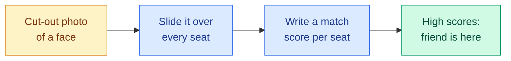
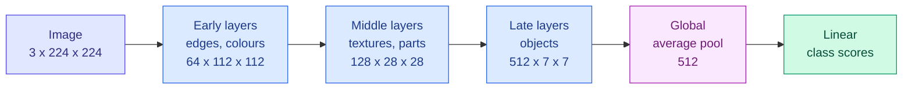

# Convolution, Stride, Padding, Pooling and Augmentation

**Level:** 🟡 Intermediate &nbsp;|&nbsp; **Effort:** Detailed module &nbsp;|&nbsp; **Module:** [09 Computer Vision](README.md)

---

## 🎯 Learning Objectives

By the end of this topic you will be able to:

- Compute a convolution by hand, and explain what a filter responds to
- **Compute a convolutional layer's output size** from its kernel size, stride, padding and dilation
- Compute a network's **receptive field**, and explain why stacks of 3×3 layers replaced large kernels
- Choose between max pooling, average pooling, strided convolution and global pooling
- Choose augmentations that preserve the label, and measure what they buy

## 📚 Prerequisites

- [Topic 1: Images as Tensors](01-images-as-tensors-and-preprocessing.md)
- [MLPs, CNNs and Recurrent Networks](../08-deep-learning/06-cnns-rnns-and-sequence-models.md) — weight sharing,
  pooling, the parameter count of a convolutional layer, and the shift test. This topic builds on them rather than
  repeating them.
- [Synthetic Data, Augmentation and Feature Stores](../03-data-foundations/07-synthetic-data-augmentation-and-feature-stores.md)
  — augmentation that destroys the label

```bash
pip install -r requirements.txt
pip install -r requirements-dl.txt --index-url https://download.pytorch.org/whl/cpu    # macOS: omit --index-url
```

---

## 🍰 1. The simple version

A **filter** is a tiny picture of a pattern — a 3×3 grid of numbers that describes, say, "dark on the left, bright on
the right". Convolution slides that tiny picture over every position of the image and asks, at each spot, **"how much
does this patch look like my pattern?"** The answers form a new image, a **feature map**, that is bright wherever the
pattern appears.

A convolutional neural network (CNN) learns its filters from data. Early layers end up detecting edges and colour
blobs; later layers combine those into textures, parts and whole objects.

## 🏠 2. Real-life analogy

> Looking for a friend in a stadium crowd with a cut-out photo of their face. You hold the cut-out against one patch
> of the crowd, compare, move it along a little, compare again — row by row across the whole stand. You write down a
> score for every spot. Where the score is high, your friend is probably there.

**Where the analogy breaks down:** you would use one cut-out. A convolutional layer uses dozens or hundreds of filters
at once, each looking for a different pattern, and the next layer looks for patterns *in the scores*, not in the
original crowd.



---

## ⚙️ 3. Convolution by hand

At each position, multiply the filter element-wise with the patch under it and add the results:

$$
\text{out}[i, j] = \sum_{u=0}^{k-1} \sum_{v=0}^{k-1} \text{image}[i \cdot s + u,\; j \cdot s + v] \cdot \text{kernel}[u, v]
$$

| Symbol | Means |
| --- | --- |
| $i, j$ | The output row and column |
| $k$ | Kernel size, such as 3 |
| $s$ | Stride — how far the filter moves between positions |
| $u, v$ | Position inside the kernel |

**Strictly, this is cross-correlation.** Mathematical convolution flips the kernel first. Deep-learning libraries skip
the flip — it makes no difference when the kernel is learned, but it does when you copy a hand-designed filter from a
signal-processing textbook.

```python
"""A 3x3 vertical-edge kernel slid over a 6x6 image, by hand and by PyTorch."""

import numpy as np
import torch
from torch.nn import functional as F

image = np.array([[0, 0, 0, 9, 9, 9]] * 6, dtype=float)          # dark left half, bright right half
kernel = np.array([[-1, 0, 1],
                   [-2, 0, 2],
                   [-1, 0, 1]], dtype=float)                          # Sobel: responds to left-to-right increase


def convolve(image, kernel, stride=1, padding=0):
    image = np.pad(image, padding)
    k = kernel.shape[0]
    size = (image.shape[0] - k) // stride + 1
    out = np.zeros((size, size))
    for row in range(size):
        for col in range(size):
            patch = image[row * stride:row * stride + k, col * stride:col * stride + k]
            out[row, col] = (patch * kernel).sum()                    # multiply element-wise, then add up
    return out


print("output at row 0, column 1 = sum of patch * kernel:")
print((image[:3, 1:4] * kernel).astype(int), "->", (image[:3, 1:4] * kernel).sum())
by_hand = convolve(image, kernel)
print("\nfeature map by hand (4 x 4):\n", by_hand.astype(int))
by_torch = F.conv2d(torch.tensor(image)[None, None], torch.tensor(kernel)[None, None])[0, 0].numpy()
print("PyTorch agrees:", np.array_equal(by_hand, by_torch))
print("\nstride 2, padding 1 (3 x 3):\n", convolve(image, kernel, stride=2, padding=1).astype(int))
```

**Output:**
```
output at row 0, column 1 = sum of patch * kernel:
[[ 0  0  9]
 [ 0  0 18]
 [ 0  0  9]] -> 36.0

feature map by hand (4 x 4):
 [[ 0 36 36  0]
 [ 0 36 36  0]
 [ 0 36 36  0]
 [ 0 36 36  0]]
PyTorch agrees: True

stride 2, padding 1 (3 x 3):
 [[ 0 27  0]
 [ 0 36  0]
 [ 0 36  0]]
```

**Read the feature map:** zero over the flat regions, 36 exactly where dark meets bright. The filter is an edge
detector, and it found the edge in every row. Rotate the kernel 90° and it finds horizontal edges instead.

**Look at the top of the padded result: 27, not 36.** Padding adds a border of zeros, and near the top the filter saw
part of that artificial border instead of image. Zero padding keeps the output size up, at the cost of slightly
distorted values at the edges; alternatives such as reflect padding copy real pixels outwards instead.

**One layer has many filters, over many channels.** A real layer's weight has shape
$(C_{\text{out}}, C_{\text{in}}, k, k)$: each of $C_{\text{out}}$ filters spans *all* input channels and sums over
them. The parameter count, $(k \cdot k \cdot C_{\text{in}} + 1) \cdot C_{\text{out}}$, is derived in
[module 08](../08-deep-learning/06-cnns-rnns-and-sequence-models.md).

---

## 📐 4. The output size formula

Every architecture diagram, and every "shape mismatch" error, comes back to one formula:

$$
n_{\text{out}} = \left\lfloor \frac{n + 2p - d(k - 1) - 1}{s} \right\rfloor + 1
$$

| Symbol | Means | Typical value |
| --- | --- | --- |
| $n$ | Input height or width | 224 |
| $k$ | Kernel size | 3, 5, 7 |
| $p$ | Padding added to **each** side | $k // 2$ to keep the size |
| $s$ | Stride | 1, or 2 to halve the size |
| $d$ | Dilation — gaps between kernel taps | 1 (no gaps) |
| $\lfloor \cdot \rfloor$ | Round down | Leftover pixels at the edge are dropped |

**Worked example** — the first layer of ResNet: a 7×7 kernel, stride 2, padding 3, on a 224-pixel image:
$\lfloor (224 + 6 - 6 - 1) / 2 \rfloor + 1 = \lfloor 223 / 2 \rfloor + 1 = 111 + 1 = 112$.

```python
"""The output-size formula, checked against PyTorch for several layer settings."""

import torch
from torch import nn


def output_size(n, kernel, stride=1, padding=0, dilation=1):
    return (n + 2 * padding - dilation * (kernel - 1) - 1) // stride + 1


settings = [(3, 1, 0, 1), (3, 1, 1, 1), (3, 2, 1, 1), (5, 1, 2, 1), (7, 2, 3, 1), (3, 1, 2, 2), (2, 2, 0, 1)]
print(f"{'kernel':>6}{'stride':>7}{'padding':>8}{'dilation':>9}{'formula':>9}{'PyTorch':>8}")
for kernel, stride, padding, dilation in settings:
    layer = nn.Conv2d(1, 1, kernel, stride=stride, padding=padding, dilation=dilation)
    actual = layer(torch.zeros(1, 1, 224, 224)).shape[-1]
    print(f"{kernel:>6}{stride:>7}{padding:>8}{dilation:>9}{output_size(224, kernel, stride, padding, dilation):>9}{actual:>8}")
```

**Output:**
```
kernel stride padding dilation  formula PyTorch
     3      1       0        1      222     222
     3      1       1        1      224     224
     3      2       1        1      112     112
     5      1       2        1      224     224
     7      2       3        1      112     112
     3      1       2        2      224     224
     2      2       0        1      112     112
```

**Three patterns to remember:** padding $k // 2$ with stride 1 keeps the size ("same" padding); stride 2 halves it; no
padding shrinks it by $k - 1$. The last row is a 2×2 pooling window with stride 2 — pooling layers use the same
formula.

---

## 🔭 5. Receptive field: how much of the image one output can see

A pixel in a feature map depends on only part of the input image — its **receptive field**. To recognise a whole
object, the final layers need receptive fields at least as large as the object. The receptive field grows with every
layer:

$$
r_L = 1 + \sum_{l=1}^{L} (k_l - 1) \prod_{i=1}^{l-1} s_i
$$

**In words:** each layer adds $k - 1$ pixels, multiplied by how much all the earlier strides have spread the layers
apart. Stride and pooling make later layers grow the field much faster.

```python
"""How much of the input can one output pixel see? The formula, checked with gradients."""

import torch
from torch import nn


def measured(layers):
    """Width of the input region whose gradient reaches the centre output pixel."""
    image = torch.zeros(1, 1, 64, 64, requires_grad=True)
    out = nn.Sequential(*layers)(image)
    out[0, 0, out.shape[2] // 2, out.shape[3] // 2].backward()
    touched = (image.grad[0, 0].abs().sum(dim=0) != 0).nonzero()
    return int(touched.max() - touched.min() + 1)


def formula(layers):
    """r = 1 + sum over layers of (kernel - 1) x product of the strides before it."""
    field, jump = 1, 1
    for layer in layers:
        k, s = layer.kernel_size, layer.stride
        k, s = (k[0], s[0]) if isinstance(k, tuple) else (k, s)
        field, jump = field + (k - 1) * jump, jump * s
    return field


def conv(k, stride=1):
    layer = nn.Conv2d(1, 1, k, stride=stride, padding=k // 2, bias=False)
    nn.init.constant_(layer.weight, 1.0)                    # positive weights, so no gradient cancels to zero
    return layer


stacks = {
    "one 3x3": [conv(3)],
    "two 3x3": [conv(3), conv(3)],
    "one 5x5": [conv(5)],
    "three 3x3": [conv(3), conv(3), conv(3)],
    "one 7x7": [conv(7)],
    "3x3, average pool 2, 3x3": [conv(3), nn.AvgPool2d(2), conv(3)],
    "3x3 stride 2, 3x3 stride 2, 3x3": [conv(3, 2), conv(3, 2), conv(3)],
}
print(f"{'layers':<33}{'formula':>8}{'measured':>9}{'weights':>9}")
for name, layers in stacks.items():
    weights = sum(layer.weight.numel() for layer in layers if isinstance(layer, nn.Conv2d))
    print(f"{name:<33}{formula(layers):>8}{measured(layers):>9}{weights:>9}")
```

**Output:**
```
layers                            formula measured  weights
one 3x3                                 3        3        9
two 3x3                                 5        5       18
one 5x5                                 5        5       25
three 3x3                               7        7       27
one 7x7                                 7        7       49
3x3, average pool 2, 3x3                8        8       18
3x3 stride 2, 3x3 stride 2, 3x3        15       15       27
```

**The formula and the measurement agree on every row.** Two findings shaped every architecture since 2014:

- **Two 3×3 layers see as much as one 5×5; three see as much as one 7×7** — with 18 and 27 weights instead of 25 and
  49, and with a non-linearity between each layer, so they can express more. This is the central idea of VGG, from
  Oxford's Visual Geometry Group ([Topic 5](05-classic-cnn-architectures.md)).
- **Downsampling grows the field fastest.** The same three 3×3 layers reached 15 pixels with two strides of 2. Deep
  networks downsample repeatedly so that their last layers see the whole image.

**The theoretical field is an upper bound.** Measurements on trained networks show that the pixels near the centre of
the field have far more influence than those at its edge, so the *effective* receptive field is smaller. When a model
misses large objects, check whether its last layers can actually see them.

---

## 🏊 6. Pooling and downsampling

| Operation | What it does | Where it is used |
| --- | --- | --- |
| **Max pooling** | Keeps the strongest response in each window | "Is the pattern anywhere here?"; classic CNNs such as VGG |
| **Average pooling** | Keeps the mean response | Smoother; less common inside networks today |
| **Strided convolution** | A convolution with stride 2 — downsampling that is *learned* | Most modern networks, including ResNet's later stages |
| **Global average pooling** | Averages each whole feature map to one number | The end of almost every classification CNN, before the final linear layer |
| **Global max pooling** | Keeps each map's single strongest response | The shift-tolerant CNN in [module 08](../08-deep-learning/06-cnns-rnns-and-sequence-models.md) |

**Global pooling makes a network work at any input size.** After it, a 224×224 and a 512×512 image both produce one
number per channel, so the same final layer applies. Networks that flatten a feature map instead have their input size
fixed by their last layer.



**The standard shape of a CNN:** spatial size shrinks, channels grow. Each downsampling step halves height and width
— a quarter of the positions — so doubling the channels keeps the work per layer roughly constant. The shapes in the
diagram are ResNet-18's.

---

## 🔀 7. Augmentation

**Data augmentation** trains on randomly modified copies of each image — shifted, flipped, cropped, recoloured —
drawing a fresh random version every epoch. It teaches the invariances the task needs, from data the model already
has. [Module 06](../06-feature-engineering/05-text-image-and-domain-features.md) showed shift augmentation rescuing a
linear model. Here it meets a CNN — and one augmentation that damages it.

The CNN deliberately **flattens** its feature maps instead of pooling globally, so position still matters to it, as it
does in many real networks.

```python
"""Augmentation on 300 training digits: which transformations help, and one that hurts."""

import torch
from sklearn.datasets import load_digits
from sklearn.model_selection import train_test_split
from torch import nn

torch.set_default_dtype(torch.float64)

X, y = load_digits(return_X_y=True)
X_train, X_test, y_train, y_test = train_test_split(X / 16.0, y, train_size=300, random_state=0, stratify=y)
X_train, X_test = torch.tensor(X_train).reshape(-1, 1, 8, 8), torch.tensor(X_test).reshape(-1, 1, 8, 8)
y_train, y_test = torch.tensor(y_train), torch.tensor(y_test)


def shift(images, rows, cols):
    """Move each image by its own (row, col) offset, filling with background."""
    padded = nn.functional.pad(images, (1, 1, 1, 1))
    return torch.stack([padded[i, :, 1 - r:9 - r, 1 - c:9 - c] for i, (r, c) in enumerate(zip(rows, cols))])


def random_shift(images, generator):
    rows, cols = torch.randint(-1, 2, (2, len(images)), generator=generator)
    return shift(images, rows.tolist(), cols.tolist())


def random_flip(images, generator):
    flip = torch.rand(len(images), generator=generator) < 0.5
    return torch.where(flip[:, None, None, None], images.flip(-1), images)


augmentations = {
    "none": [],
    "shift by up to 1 pixel": [random_shift],
    "shift + horizontal flip": [random_shift, random_flip],
}
test_shifted = random_shift(X_test, torch.Generator().manual_seed(1))
print(f"{'training augmentation':<26}{'clean test':>11}{'shifted test':>13}")
for name, transforms in augmentations.items():
    torch.manual_seed(0)
    model = nn.Sequential(nn.Conv2d(1, 16, 3, padding=1), nn.ReLU(), nn.Conv2d(16, 16, 3, padding=1), nn.ReLU(),
                          nn.Flatten(), nn.Linear(16 * 64, 10))          # no global pooling: position matters
    optimiser = torch.optim.Adam(model.parameters(), lr=3e-3)
    generator = torch.Generator().manual_seed(0)
    for _ in range(60):
        permutation = torch.randperm(len(X_train), generator=generator)
        for start in range(0, len(X_train), 50):
            batch = X_train[permutation[start:start + 50]]
            for transform in transforms:                              # a fresh random version every epoch
                batch = transform(batch, generator)
            loss = nn.functional.cross_entropy(model(batch), y_train[permutation[start:start + 50]])
            optimiser.zero_grad()
            loss.backward()
            optimiser.step()
    with torch.no_grad():
        clean = (model(X_test).argmax(1) == y_test).double().mean().item()
        shifted = (model(test_shifted).argmax(1) == y_test).double().mean().item()
    print(f"{name:<26}{clean:>11.3f}{shifted:>13.3f}")
```

**Output:**
```
training augmentation      clean test shifted test
none                            0.931        0.387
shift by up to 1 pixel          0.941        0.898
shift + horizontal flip         0.888        0.852
```

**Without augmentation, moving test digits by at most one pixel cut accuracy from 0.931 to 0.387.** A convolutional
layer detects a pattern wherever it is — but the flattening layer after it still ties each detection to a position.
Shift augmentation fixed that: 0.898 on shifted digits, and slightly better on clean ones too, because 300 images
became effectively many more.

**Horizontal flipping made both scores worse.** It is the most common augmentation in computer vision because a
mirrored cat is still a cat — but a mirrored 2 is not a 2, and a mirrored 3 looks like an ε. **Augmentation encodes a
claim that the label does not change.** For text, digits, road signs with arrows and medical images with a left and a
right side, a flip breaks that claim.

| Augmentation | Safe for | Breaks |
| --- | --- | --- |
| Small shifts and crops | Almost everything | Tasks where position is the label, such as "is the object centred" |
| Horizontal flip | Natural photos, most objects | Text, digits, arrows, left–right anatomy |
| Rotation | Aerial, satellite and microscope images | Upright scenes beyond small angles; 6 versus 9 |
| Colour and brightness jitter | Varying cameras and lighting | Tasks where colour *is* the label: ripeness, traffic lights, skin conditions |
| Blur and noise | Low-quality production cameras | Fine-detail tasks such as defect inspection |
| Mixing images (MixUp, CutMix) | Regularising large classifiers | Detection and segmentation without adjusting the labels too |

**For detection and segmentation, the labels must move with the image.** A flip or crop must transform the boxes and
masks as well; torchvision's `transforms.v2` does this for boxes, masks and keypoints together.

**Augment training data only.** Validation and test images must look like production images. (A deliberate exception,
**test-time augmentation**, averages predictions over several transformed copies of each test image — more accuracy for
several times the inference cost.)

---

## 🏭 8. Production notes

- **Compute scales with $H_{\text{out}} \times W_{\text{out}} \times C_{\text{in}} \times C_{\text{out}} \times k^2$.**
  Early layers, at full resolution, often dominate the cost even with few channels. Topic 5 counts it for real
  architectures.
- **Training memory is dominated by activations, not weights.** Every feature map is kept for the backward pass, so
  memory grows with batch size × resolution. Halving the resolution frees three quarters of it.
- **Augmentation runs on the CPU (central processing unit) in the data loader**, and on large images it often becomes
  the bottleneck: the GPU (graphics processing unit)
  waits for data. Use several loader workers, or move augmentation onto the GPU.
- **Record the augmentation settings with the model.** They are hyperparameters and part of what the model assumes.

## ⚠️ 9. Common mistakes

| Mistake | Why it happens | Fix |
| --- | --- | --- |
| "Shape mismatch" in the first linear layer | Output size computed by guesswork | Use the formula, or pass a dummy tensor and print the shape |
| Copying a textbook filter and getting a mirrored response | Libraries compute cross-correlation | Flip the kernel, or learn it |
| Flip augmentation on text or digits | It is the default in example code | Check every augmentation against the claim "the label is unchanged" |
| Augmenting validation or test data | Reusing the training transform | Separate transforms for training and evaluation |
| Boxes or masks not transformed with the image | Augmenting images only | Use a library that transforms targets together with images |
| Last layers cannot see the whole object | Too little downsampling | Compute the receptive field; add stride, pooling or dilation |

---

## 🎤 10. Interview questions

<details>
<summary><b>Q1: What is the output size of a 3×3 convolution with stride 2 and padding 1 on a 56×56 input? And a 1×1 with stride 1?</b></summary>

$\lfloor (56 + 2 - 2 - 1) / 2 \rfloor + 1 = \lfloor 55 / 2 \rfloor + 1 = 28$. A 1×1 convolution with stride 1 and no
padding keeps 56×56: it changes only the number of channels. The general formula is
$\lfloor (n + 2p - d(k-1) - 1) / s \rfloor + 1$.
</details>

<details>
<summary><b>Q2: Why do modern CNNs stack 3×3 convolutions instead of using larger kernels?</b></summary>

Two 3×3 layers have the same 5×5 receptive field as one 5×5 layer, and three match a 7×7, with fewer weights — 18
versus 25 and 27 versus 49 per channel pair — and with a non-linearity between them, which makes the stack more
expressive. This was the key design idea of VGG. The receptive field formula and a gradient measurement agreed on it
in the example.
</details>

<details>
<summary><b>Q3: What is a receptive field, and how do you make it grow faster?</b></summary>

The region of the input that can influence one output value. Each layer adds $(k - 1)$ times the product of all earlier
strides, so stride, pooling and dilation grow it fastest. In the example three 3×3 layers saw 7 pixels, or 15 with two
stride-2 layers. The effective receptive field of a trained network is smaller than the theoretical one, because
central pixels dominate.
</details>

<details>
<summary><b>Q4: Why does global average pooling let a CNN accept images of any size?</b></summary>

It reduces each feature map to one number however large the map is, so the final linear layer always receives
exactly one value per channel. A network that flattens its last feature map has a linear layer whose input size is
fixed by the image size.
</details>

<details>
<summary><b>Q5: Which augmentations would you use for a road-sign classifier, and which would you avoid?</b></summary>

Small shifts, crops, scale changes, brightness and contrast jitter, blur, and slight rotations, which all match real
camera variation. Avoid horizontal flips, which turn "turn left" into "turn right", and large rotations and strong hue
shifts, because colour and orientation are part of a sign's meaning. In the example, flipping digits lowered accuracy
on both clean and shifted test sets.
</details>

---

## ✅ Key takeaways

- Convolution slides a filter over the image and scores each position; libraries skip the kernel flip.
- **Output size:** $\lfloor (n + 2p - d(k-1) - 1)/s \rfloor + 1$. Padding $k//2$ keeps the size; stride 2 halves it.
- **Receptive field** grows by $(k-1)$ times the earlier strides. **Stacked 3×3 layers** match larger kernels with
  fewer weights.
- CNNs shrink space and grow channels; **global pooling** makes them size-independent.
- **Augmentation is a claim that the label is unchanged.** Shifts took a CNN from 0.387 to 0.898 on shifted digits;
  flips made it worse.

---

## 📚 Official References

- [Conv2d — PyTorch Foundation](https://pytorch.org/docs/stable/generated/torch.nn.Conv2d.html) — verified 2026-09-19;
  states the output-size formula used above
- [Transforming images, videos, boxes and more — torchvision, PyTorch Foundation](https://pytorch.org/vision/stable/transforms.html) — verified 2026-09-19
- [CS231n: Convolutional Neural Networks — Stanford University](https://cs231n.github.io/convolutional-networks/) — verified 2026-09-19
- [Dive into Deep Learning, modern convolutional neural networks — Zhang, Lipton, Li and Smola](https://d2l.ai/chapter_convolutional-modern/index.html) — verified 2026-09-19; community-maintained open textbook
- [Very Deep Convolutional Networks for Large-Scale Image Recognition — Simonyan and Zisserman, arXiv](https://arxiv.org/abs/1409.1556) — verified 2026-09-19; the VGG paper and its argument for stacked 3×3 layers

---

## 🔗 Navigation

[← Topic 1: Images as Tensors](01-images-as-tensors-and-preprocessing.md) &nbsp;|&nbsp;
[🏠 Module Home](README.md) &nbsp;|&nbsp;
[Topic 3: Classification, Detection, Segmentation and Pose →](03-classification-detection-segmentation-and-pose.md)
