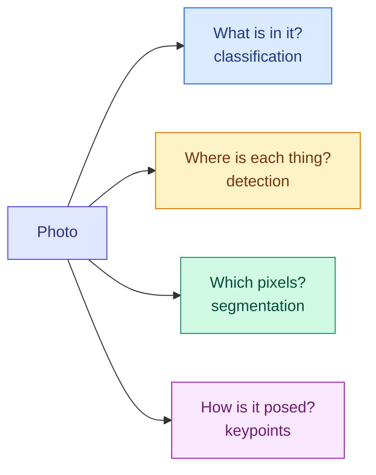

# Vision Tasks: Classification, Detection, Segmentation and Pose

**Level:** 🟡 Intermediate &nbsp;|&nbsp; **Effort:** Detailed module &nbsp;|&nbsp; **Module:** [09 Computer Vision](README.md)

---

## 🎯 Learning Objectives

By the end of this topic you will be able to:

- Say what each core vision task outputs, how it is labelled, and how it is scored
- Compute **intersection over union (IoU)** by hand, and avoid the box-format bug
- Explain **non-maximum suppression (NMS)** and choose its threshold
- Compute **average precision (AP)** for a detector, and explain why the IoU threshold changes it
- Tell semantic, instance and panoptic segmentation apart, and explain why pixel accuracy misleads
- Decode keypoints from heatmaps for pose estimation

## 📚 Prerequisites

- [Topic 2: Convolution, Pooling and Augmentation](02-convolution-pooling-and-augmentation.md)
- [Classification Metrics](../07-model-evaluation/06-classification-metrics.md) — precision, recall and the
  precision–recall curve
- [Loss Functions](../08-deep-learning/02-loss-functions-computational-graphs-and-autograd.md) — cross-entropy for
  single-label and multi-label outputs

```bash
pip install -r requirements.txt
pip install -r requirements-dl.txt --index-url https://download.pytorch.org/whl/cpu    # macOS: omit --index-url
```

---

## 🍰 1. The simple version

Four questions you can ask about a photo, each more detailed than the last:

1. **What is in it?** "A dog." — **classification**
2. **Where is each thing?** "A dog *here*, a ball *there*" — a box around each one. — **object detection**
3. **Exactly which pixels belong to what?** An outline, pixel by pixel. — **segmentation**
4. **How is it posed?** Where each joint is — nose, elbows, knees. — **pose estimation**

Each extra level of detail makes the model's output richer, the labels far more expensive to collect, and the
scoring more subtle.

## 🏠 2. Real-life analogy

> Describing a holiday photo to a friend over the phone. "It's a beach" is classification. "There are two people on
> the left and a boat on the right" is detection. Telling them to colour in the exact outline of each person is
> segmentation. Describing how each person is standing — arms raised, one knee bent — is pose estimation.

**Where the analogy breaks down:** a friend would stop at the level of detail they need. A model must be designed and
labelled for one level from the start, and moving to a finer one usually means relabelling every image.



---

## ⚙️ 3. The task zoo at a glance

| Task | Output | Label per image | Typical metric |
| --- | --- | --- | --- |
| **Classification** | One class, or a score per class | One word | Accuracy, top-5 accuracy, F1 |
| **Multi-label classification** | An independent yes/no per class | A list of words | Per-class precision and recall, mean AP |
| **Object detection** | A box, class and confidence per object | A box per object | Mean average precision (mAP) |
| **Semantic segmentation** | A class for every pixel | A painted mask | Mean IoU, Dice |
| **Instance segmentation** | A separate mask for each object | A mask per object | Mask AP |
| **Panoptic segmentation** | Every pixel gets a class, and object pixels also get an instance ID | Both | Panoptic quality (PQ) |
| **Pose estimation** | A position for each body keypoint | Clicked points per person | PCK, OKS-based AP |

**Classification** is covered by what you already know: a softmax output with cross-entropy for one label per image, a
sigmoid per class with binary cross-entropy for several
([module 08](../08-deep-learning/02-loss-functions-computational-graphs-and-autograd.md)), and the metrics of
[module 07](../07-model-evaluation/06-classification-metrics.md). The rest of this topic is about the tasks that add
**location**.

---

## 📦 4. Detection: boxes and intersection over union

A box is four numbers, but **there are three common ways to write them**, and mixing them up is the most common
detection bug:

| Format | Numbers | Used by |
| --- | --- | --- |
| `xyxy` | Top-left x, y and bottom-right x, y | torchvision, Pascal VOC (Visual Object Classes) |
| `xywh` | Top-left x, y, then width, height | The COCO (Common Objects in Context) dataset's annotation files |
| `cxcywh` | Centre x, y, then width, height | YOLO (You Only Look Once) detectors, DETR (Detection Transformer) |

A predicted box is never exactly right, so detection needs a measure of *how* right. **Intersection over union** is
the area where two boxes overlap, divided by the area they cover together:

$$
\text{IoU}(A, B) = \frac{|A \cap B|}{|A \cup B|} = \frac{|A \cap B|}{|A| + |B| - |A \cap B|}
$$

**In words:** 1 for a perfect match, 0 for no overlap. A prediction usually counts as correct above 0.5.

```python
"""Intersection over union, by hand and with torchvision, plus the box-format bug."""

import torch
from torchvision.ops import box_convert, box_iou


def iou(a, b):
    """Boxes as (x1, y1, x2, y2): top-left and bottom-right corners."""
    width = max(0, min(a[2], b[2]) - max(a[0], b[0]))
    height = max(0, min(a[3], b[3]) - max(a[1], b[1]))
    overlap = width * height
    union = (a[2] - a[0]) * (a[3] - a[1]) + (b[2] - b[0]) * (b[3] - b[1]) - overlap
    return overlap / union


truth = (50, 50, 150, 150)                   # a 100 x 100 object
predictions = {"exact": (50, 50, 150, 150), "shifted 10 px": (60, 50, 160, 150),
               "shifted 30 px": (80, 50, 180, 150), "twice as large": (25, 25, 175, 175),
               "no overlap": (200, 200, 300, 300)}
print(f"{'prediction':<16}{'IoU by hand':>12}{'torchvision':>12}{'counted at 0.5':>15}{'at 0.75':>9}")
for name, box in predictions.items():
    by_hand = iou(truth, box)
    library = box_iou(torch.tensor([truth], dtype=torch.float64), torch.tensor([box], dtype=torch.float64)).item()
    print(f"{name:<16}{by_hand:>12.3f}{library:>12.3f}{str(by_hand >= 0.5):>15}{str(by_hand >= 0.75):>9}")

as_xywh = torch.tensor([[50.0, 50.0, 100.0, 100.0]])        # the SAME box, stored as (x, y, width, height)
print("\nxywh box read as if it were xyxy, IoU with the truth:",
      round(box_iou(torch.tensor([truth], dtype=torch.float32), as_xywh).item(), 3))
print("after converting the format:",
      round(box_iou(torch.tensor([truth], dtype=torch.float32), box_convert(as_xywh, "xywh", "xyxy")).item(), 3))
```

**Output:**
```
prediction       IoU by hand torchvision counted at 0.5  at 0.75
exact                  1.000       1.000           True     True
shifted 10 px          0.818       0.818           True     True
shifted 30 px          0.538       0.538           True    False
twice as large         0.444       0.444          False    False
no overlap             0.000       0.000          False    False

xywh box read as if it were xyxy, IoU with the truth: 0.25
after converting the format: 1.0
```

**Worked example, "shifted 10 px":** the overlap is 90 × 100 = 9,000; the union is 10,000 + 10,000 − 9,000 = 11,000;
IoU = 9,000 / 11,000 = 0.818.

**Note "twice as large":** it contains the whole object, yet scores only 0.444 — IoU penalises boxes that are too big
as well as boxes that are misplaced. And a box shifted by 30% of the object's width still passes at 0.5 but fails at
0.75: **the threshold decides what "found it" means.**

**The box-format bug scored a perfect box at 0.25**, with no error raised, because `(50, 50, 100, 100)` in `xywh`
means a box to (150, 150), while in `xyxy` it means a box to (100, 100). A model trained on misread boxes still trains
— just badly. **Convert formats once, at data loading, and assert the format in tests.**

---

## ✂️ 5. Non-maximum suppression

A detector proposes many overlapping boxes around each object. **Non-maximum suppression** keeps the
highest-scoring box, deletes every remaining box that overlaps it by more than a threshold, and repeats.

```python
"""Non-maximum suppression: from many overlapping guesses to one box per object."""

import torch
from torchvision.ops import box_iou, nms

boxes = torch.tensor([[10, 10, 60, 60], [12, 8, 62, 58], [8, 12, 58, 64],     # three guesses at person A
                      [30, 10, 80, 60],                                        # person B, standing close to A
                      [150, 150, 200, 200], [152, 148, 204, 198]],             # one object far away, two guesses
                     dtype=torch.float64)
scores = torch.tensor([0.95, 0.90, 0.60, 0.85, 0.80, 0.30], dtype=torch.float64)


def greedy_nms(boxes, scores, threshold):
    order = scores.argsort(descending=True).tolist()
    keep = []
    while order:
        best = order.pop(0)                    # the highest-scoring box left always survives
        keep.append(best)
        order = [i for i in order if box_iou(boxes[best:best + 1], boxes[i:i + 1]).item() <= threshold]
    return keep


print("IoU of person B's box with person A's best box:", round(box_iou(boxes[0:1], boxes[3:4]).item(), 3))
print(f"{'IoU threshold':>13}{'by hand':>20}{'torchvision':>20}{'boxes kept':>12}")
for threshold in (0.3, 0.5, 0.9):
    mine, theirs = greedy_nms(boxes, scores, threshold), nms(boxes, scores, threshold).tolist()
    print(f"{threshold:>13}{str(mine):>20}{str(theirs):>20}{len(mine):>12}")
```

**Output:**
```
IoU of person B's box with person A's best box: 0.429
IoU threshold             by hand         torchvision  boxes kept
          0.3              [0, 4]              [0, 4]           2
          0.5           [0, 3, 4]           [0, 3, 4]           3
          0.9  [0, 1, 3, 4, 2, 5]  [0, 1, 3, 4, 2, 5]           6
```

**The same detections give 2, 3 or 6 objects depending on one number.**

- At **0.3**, person B's box overlapped person A's by 0.429 and was deleted as a duplicate: **two people standing
  close together became one.** Crowds, shelves of products and parked cars all suffer from a threshold set too low.
- At **0.9**, almost nothing overlaps enough to be removed: every duplicate guess survived.
- At **0.5**, the answer was right *for this scene*.

**NMS is a hand-set post-processing step, not something the model learns**, so it must be tuned on validation data
like any other threshold. Run it separately for each class, so a person box never suppresses a bicycle box. Detectors
such as DETR ([Topic 6](06-detectors-vit-sam-and-clip.md)) were designed to make it unnecessary.

---

## 📈 6. Scoring a detector: average precision

A detector's output is a ranked list of boxes with confidences. To score it:

1. Sort every detection by confidence, highest first.
2. Mark each one a **hit** if it overlaps a not-yet-found true object by at least the IoU threshold, otherwise a
   **miss** — including a second box on an object already found.
3. Walking down the list, compute precision and recall after each detection.
4. **Average precision** is the area under that precision–recall curve.

```python
"""Average precision for one class: match detections to objects, then walk down the ranking."""

import numpy as np
import torch
from torchvision.ops import box_iou

truth = {"image 1": [[10, 10, 50, 50], [60, 60, 100, 100]],
         "image 2": [[20, 20, 70, 70]],
         "image 3": [[0, 0, 40, 40], [50, 0, 90, 40]]}
detections = [("image 1", 0.95, [12, 12, 52, 50]), ("image 2", 0.90, [22, 18, 72, 70]),
              ("image 1", 0.85, [62, 64, 104, 100]), ("image 3", 0.80, [5, 5, 45, 45]),
              ("image 1", 0.70, [10, 10, 48, 52]),                   # a duplicate of the first object
              ("image 3", 0.60, [40, 0, 80, 40]), ("image 2", 0.40, [80, 80, 120, 120]),
              ("image 3", 0.30, [52, 2, 90, 40])]


def average_precision(iou_threshold):
    matched, hits = set(), []
    for image, _, box in sorted(detections, key=lambda d: -d[1]):     # highest confidence first
        ious = box_iou(torch.tensor([box], dtype=torch.float64), torch.tensor(truth[image], dtype=torch.float64))[0]
        best = int(ious.argmax())
        hit = ious[best] >= iou_threshold and (image, best) not in matched   # each object may be found once
        if hit:
            matched.add((image, best))
        hits.append(bool(hit))
    hits = np.array(hits)
    total = sum(len(boxes) for boxes in truth.values())
    precision = np.cumsum(hits) / np.arange(1, len(hits) + 1)
    recall = np.cumsum(hits) / total
    precision = np.maximum.accumulate(precision[::-1])[::-1]              # best precision at this recall or beyond
    area = np.sum(np.diff(np.concatenate([[0], recall])) * precision)     # area under the precision-recall curve
    return hits, recall[-1], area


for threshold in (0.5, 0.75):
    hits, recall, ap = average_precision(threshold)
    print(f"IoU {threshold}: hits {''.join('✓' if h else '✗' for h in hits)}  recall {recall:.2f}  AP {ap:.3f}")
coco_style = np.mean([average_precision(t)[2] for t in np.arange(0.5, 0.96, 0.05)])
print(f"averaged over IoU 0.50, 0.55, ..., 0.95 (the COCO headline style): {coco_style:.3f}")
```

**Output:**
```
IoU 0.5: hits ✓✓✓✓✗✓✗✗  recall 1.00  AP 0.967
IoU 0.75: hits ✓✓✓✗✗✗✗✓  recall 0.80  AP 0.700
averaged over IoU 0.50, 0.55, ..., 0.95 (the COCO headline style): 0.601
```

**The same eight detections scored 0.967, 0.700 or 0.601.** Read the hits string at IoU 0.5: the fifth detection was
a *second* box on an object already found, so it counted as a miss — duplicates are false positives. The last
detection is more interesting: at 0.5 a sloppier box had already claimed that object, so the tight box counted as a
duplicate; **at 0.75 the sloppy box failed and the tight one became the hit.**

**Vocabulary that confuses everyone:** **mean average precision (mAP)** averages AP over classes. The COCO benchmark
also averages over ten IoU thresholds from 0.5 to 0.95 — and calls the result "AP". **"AP50"** means IoU 0.5 only, the
older Pascal VOC style. A detector's "37 AP" and another's "56 AP50" cannot be compared. Always check which one a paper
or vendor reports.

(The step "best precision at this recall or beyond" is the standard interpolation; COCO additionally samples recall at
101 fixed points. The numbers differ slightly between implementations, which is one more reason to compare models
only with the same evaluation code.)

---

## 🎨 7. Segmentation

| Kind | Question it answers | Two touching cars become |
| --- | --- | --- |
| **Semantic** | Which class is each pixel? | One "car" region |
| **Instance** | Which *object* does each pixel belong to? | Car 1 and car 2, each with its own mask |
| **Panoptic** | Both, for every pixel: countable things get instances, background "stuff" such as road and sky gets a class | Car 1, car 2, road, sky |

The metrics compare the predicted mask $P$ with the true mask $T$:

$$
\text{IoU} = \frac{|P \cap T|}{|P \cup T|} \qquad\qquad \text{Dice} = \frac{2\,|P \cap T|}{|P| + |T|}
$$

**In words:** both are 1 for a perfect mask and 0 for no overlap. Dice is always at least as large as IoU; medical
imaging tends to report Dice, and general benchmarks mean IoU.

A segmentation network outputs a score for every pixel, so it has no flattening layer at all — it is **fully
convolutional**. Below, a three-layer one learns to find small squares in noise.

```python
"""Segment small objects on a noisy background; three metrics, one of them misleading."""

import torch
from scipy import ndimage
from torch import nn

torch.set_default_dtype(torch.float64)


def make_images(count, seed):
    """16 x 16 noisy images, each with one or two bright squares of side 2 to 4 pixels."""
    generator = torch.Generator().manual_seed(seed)
    images = 0.35 * torch.randn(count, 1, 16, 16, generator=generator)
    masks, placed = torch.zeros(count, 1, 16, 16), 0
    for i in range(count):
        for _ in range(int(torch.randint(1, 3, (1,), generator=generator))):
            size = int(torch.randint(2, 5, (1,), generator=generator))
            row, col = torch.randint(0, 16 - size, (2,), generator=generator).tolist()
            masks[i, 0, row:row + size, col:col + size] = 1.0
            placed += 1
    return images + masks, masks, placed


def scores(predicted, truth):
    predicted, truth = predicted.bool(), truth.bool()
    overlap, union = (predicted & truth).sum().item(), (predicted | truth).sum().item()
    return ((predicted == truth).double().mean().item(), overlap / union if union else 1.0,
            2 * overlap / (predicted.sum().item() + truth.sum().item()))


train_images, train_masks, _ = make_images(250, seed=0)
test_images, test_masks, placed = make_images(200, seed=1)
print(f"object pixels in the test set: {test_masks.mean().item():.1%}")

torch.manual_seed(0)
model = nn.Sequential(nn.Conv2d(1, 8, 3, padding=1), nn.ReLU(), nn.Conv2d(8, 8, 3, padding=1), nn.ReLU(),
                      nn.Conv2d(8, 1, 1))                            # one logit per pixel: fully convolutional
optimiser = torch.optim.Adam(model.parameters(), lr=1e-2)
for step in range(120):
    loss = nn.functional.binary_cross_entropy_with_logits(model(train_images), train_masks)
    optimiser.zero_grad()
    loss.backward()
    optimiser.step()

with torch.no_grad():
    predicted = model(test_images) > 0
print(f"\n{'segmenter':<22}{'pixel accuracy':>15}{'IoU':>7}{'Dice':>7}")
for name, prediction in [("all background", torch.zeros_like(test_masks)),
                         ("threshold at 0.5", test_images > 0.5), ("small CNN", predicted)]:
    accuracy, iou, dice = scores(prediction, test_masks)
    print(f"{name:<22}{accuracy:>15.3f}{iou:>7.3f}{dice:>7.3f}")

blobs = sum(ndimage.label(mask[0].numpy())[1] for mask in test_masks)     # connected regions of "object" pixels
print(f"\nsquares placed: {placed}; separate regions in the perfect mask: {blobs}")
```

**Output:**
```
object pixels in the test set: 5.7%

segmenter              pixel accuracy    IoU   Dice
all background                  0.943  0.000  0.000
threshold at 0.5                0.924  0.412  0.584
small CNN                       0.995  0.917  0.956

squares placed: 310; separate regions in the perfect mask: 282
```

**A segmenter that finds nothing scored 94.3% pixel accuracy** — higher than the simple threshold, which at least found
some of the objects. Objects cover only 5.7% of the pixels, so pixel accuracy is dominated by the background. **IoU and
Dice ignore the easy background and are 0 for the empty prediction.** This is the class-imbalance trap of
[module 07](../07-model-evaluation/06-classification-metrics.md), one pixel at a time. The small convolutional neural network (CNN), which uses each
pixel's neighbourhood instead of its value alone, reached an IoU of 0.917.

**The last line is why instance segmentation exists.** 310 squares were placed, but even a *perfect* semantic mask has
only 282 separate regions: where squares touched or overlapped, their pixels merged into one blob. Counting objects
from a semantic mask undercounts exactly where objects are crowded — cells on a microscope slide, fruit on a tree,
people in a queue. Instance segmentation predicts each object's mask separately.

---

## 🕺 8. Pose estimation: keypoints from heatmaps

A pose model predicts one **heatmap** per keypoint — nose, left wrist, right knee — whose peak marks the position.
Heatmaps are smaller than the image, so decoding the peak is where precision is lost.

```python
"""Pose estimation predicts a heatmap per keypoint; decoding it is where precision is lost."""

import torch

torch.set_default_dtype(torch.float64)

true_row, true_col = 5.3, 9.6                  # the wrist, in heatmap cells
rows, cols = torch.meshgrid(torch.arange(16.0), torch.arange(16.0), indexing="ij")
heatmap = torch.exp(-((rows - true_row) ** 2 + (cols - true_col) ** 2) / (2 * 1.5 ** 2))   # what a network outputs

flat = int(heatmap.argmax())
arg_row, arg_col = divmod(flat, 16)
weights = torch.softmax(heatmap.flatten() * 20, dim=0).reshape(16, 16)        # soft-argmax: a weighted average
soft_row, soft_col = (weights * rows).sum().item(), (weights * cols).sum().item()

scale = 8                                      # a 16 x 16 heatmap for a 128 x 128 image
for name, (r, c) in [("argmax", (arg_row, arg_col)), ("soft-argmax", (soft_row, soft_col))]:
    error = ((r - true_row) ** 2 + (c - true_col) ** 2) ** 0.5
    print(f"{name:<12} row {r:5.2f} col {c:5.2f}   error {error:.2f} cells = {error * scale:.1f} image pixels")
```

**Output:**
```
argmax       row  5.00 col 10.00   error 0.50 cells = 4.0 image pixels
soft-argmax  row  5.17 col  9.69   error 0.16 cells = 1.3 image pixels
```

**Taking the brightest cell rounds the answer to the heatmap's grid**, and every cell is 8 image pixels wide. A
**soft-argmax** — a probability-weighted average of all cell positions — recovers most of the lost precision and is
differentiable, so it can be trained end-to-end. Production systems also refine the peak using its neighbours.

**Two ways to handle several people:** **top-down** systems detect each person first, then estimate one pose per box
(accurate, but slower as crowds grow); **bottom-up** systems find every keypoint in the image, then group them into
people (constant cost, harder grouping). Pose is scored with **PCK** (percentage of correct keypoints, within a
distance scaled by body size) or, on COCO, with an AP built on **object keypoint similarity (OKS)** — IoU's equivalent
for keypoints.

---

## 🏭 9. Production notes

- **Labelling cost decides the task.** A class label takes seconds per image; boxes take far longer; a precise mask
  longer still. Ask whether the business question needs "which pixels" or only "is there one, roughly where".
- **Small objects are hard.** A 10-pixel object in a 1,000-pixel image may vanish after a few downsampling layers.
  Higher input resolution, feature pyramids ([Topic 6](06-detectors-vit-sam-and-clip.md)) or cutting the image into
  tiles help, at a cost.
- **Every threshold is a product decision**: the confidence threshold, the NMS threshold, the IoU used in evaluation.
  Choose them from the cost of a miss versus a false alarm, per class, and document them.
- **Monitor the output distribution**: objects per image, average box size, confidence distribution, and the share of
  images with no detections. They move before accuracy does when cameras, lighting or scenes change.
- **Evaluate on slices** — small versus large objects, crowded versus sparse scenes, day versus night. A single mAP
  hides the slice that matters.

## 🔐 10. Security and responsible use

- **Detectors can be fooled physically.** Printed *adversarial patches* have been shown to hide people or stop signs
  from detectors. Safety-critical systems need redundancy, not one model; attacks and defences are covered in
  [28 AI Security](../28-ai-security/README.md).
- **Person detection and pose estimation are surveillance technology.** Tracking, re-identifying or profiling people in
  public or at work is regulated in many jurisdictions and is restricted or prohibited for some uses. Check the
  current rules where you deploy (see [Topic 4](04-faces-text-captions-and-restoration.md)) and consult qualified
  counsel.
- **Performance differs across people.** Evaluate person-related tasks on slices by skin tone, age, body type and
  clothing, as far as you lawfully can — a detector that misses some groups more often is a safety problem in a
  vehicle and a fairness problem everywhere ([26 Responsible AI](../26-responsible-ai/README.md)).

## ⚠️ 11. Common mistakes

| Mistake | Why it happens | Fix |
| --- | --- | --- |
| Boxes in the wrong format | COCO files use `xywh`, torchvision `xyxy` | Convert once at loading; assert in tests. A perfect box scored 0.25 |
| One NMS threshold for all scenes | Default values | Tune on validation data; watch crowded scenes |
| NMS across classes | Forgetting to group by class | Use `batched_nms`, which suppresses within each class only |
| Comparing COCO AP with AP50 | Both called "AP" | Check which thresholds were averaged |
| Pixel accuracy for segmentation | It is the obvious number | Report IoU or Dice; "all background" scored 94.3% |
| Counting objects from a semantic mask | It looks like it has objects | Touching objects merge; use instance segmentation |
| Flipping an image without swapping left and right keypoints | Generic augmentation code | A flipped left wrist is now a right wrist; swap the labels |

---

## 🎤 12. Interview questions

<details>
<summary><b>Q1: Compute the IoU of boxes (0, 0, 10, 10) and (5, 0, 15, 10).</b></summary>

The overlap is 5 × 10 = 50. Each box has area 100, so the union is 100 + 100 − 50 = 150. IoU = 50 / 150 = 0.333. With
the usual 0.5 threshold, this prediction would count as a miss even though it covers half the object.
</details>

<details>
<summary><b>Q2: What does non-maximum suppression do, and what goes wrong with a threshold that is too low or too high?</b></summary>

It keeps the highest-scoring box, removes remaining boxes that overlap it above the IoU threshold, and repeats. Too low
and separate but nearby objects are merged — in the example two people became one at 0.3. Too high and duplicate boxes
survive — six boxes for three objects at 0.9. Apply it per class and tune the threshold on validation data.
</details>

<details>
<summary><b>Q3: Explain mAP, and why a detector can have 0.97 AP50 but 0.60 COCO AP.</b></summary>

AP is the area under the precision–recall curve for one class, where a detection is a hit if it overlaps an unmatched
true object by at least an IoU threshold; mAP averages AP over classes. AP50 uses IoU 0.5 only; COCO AP averages over
thresholds 0.5 to 0.95, so it rewards precise localisation. In the example the same detections scored 0.967 at 0.5,
0.700 at 0.75 and 0.601 averaged.
</details>

<details>
<summary><b>Q4: Semantic, instance and panoptic segmentation — what is the difference, and when would you need instance?</b></summary>

Semantic labels each pixel with a class; instance separates each object's pixels; panoptic does both for every pixel,
with instances for countable things and classes for background such as road or sky. You need instance segmentation
whenever you count, track or measure individual objects that can touch: in the example a perfect semantic mask had
only 282 regions for 310 objects.
</details>

<details>
<summary><b>Q5: Your segmentation model reports 97% pixel accuracy but users say it misses most defects. Why?</b></summary>

Defects are a tiny fraction of pixels, so predicting "no defect" everywhere already scores highly — in the example an
empty prediction scored 94.3% pixel accuracy with an IoU of 0. Evaluate with IoU or Dice for the defect class, and with
per-object recall, and train with a loss that counters the imbalance, such as Dice loss or a weighted cross-entropy.
</details>

---

## ✅ Key takeaways

- Tasks add location step by step: **what → where → which pixels → which pose**, and labels get more expensive at
  each step.
- **IoU** measures box overlap; the threshold defines "found it". **Mixed box formats** scored a perfect box at 0.25.
- **NMS** turned the same detections into 2, 3 or 6 objects depending on its threshold.
- **AP depends on the IoU threshold**: 0.967, 0.700 or 0.601 for identical detections. Check which AP is reported.
- **Pixel accuracy misleads** on segmentation — an empty mask scored 94.3%. Use IoU or Dice.
- **Semantic masks merge touching objects**; instance segmentation keeps them apart.
- Keypoint **heatmaps lose precision** when decoded by argmax; soft-argmax recovered most of it.

---

## 📚 Official References

- [Operators: box_iou, nms, batched_nms, box_convert — torchvision, PyTorch Foundation](https://pytorch.org/vision/stable/ops.html) — verified 2026-09-19
- [COCO detection evaluation — COCO Consortium](https://cocodataset.org/#detection-eval) — verified 2026-09-19; defines AP, AP50 and the size slices
- [Mask R-CNN — He, Gkioxari, Dollár and Girshick, arXiv](https://arxiv.org/abs/1703.06870) — verified 2026-09-19; instance segmentation and keypoints on top of a detector
- [Panoptic Segmentation — Kirillov, He, Girshick, Rother and Dollár, arXiv](https://arxiv.org/abs/1801.00868) — verified 2026-09-19; defines panoptic quality
- [Dive into Deep Learning, computer vision — Zhang, Lipton, Li and Smola](https://d2l.ai/chapter_computer-vision/index.html) — verified 2026-09-19; community-maintained open textbook

---

## 🔗 Navigation

[← Topic 2: Convolution, Pooling and Augmentation](02-convolution-pooling-and-augmentation.md) &nbsp;|&nbsp;
[🏠 Module Home](README.md) &nbsp;|&nbsp;
[Topic 4: Faces, Text, Captions and Restoration →](04-faces-text-captions-and-restoration.md)
