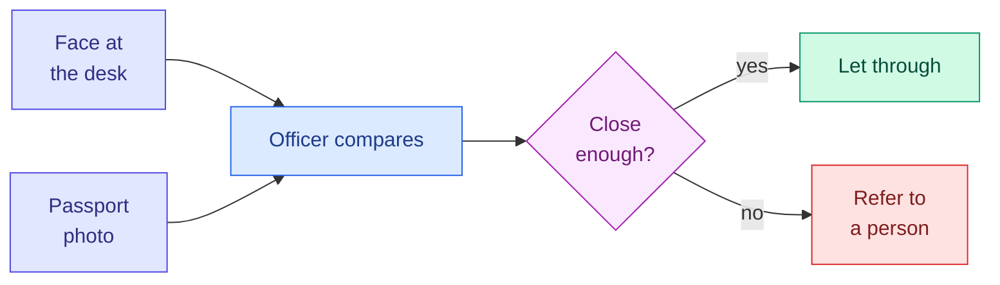
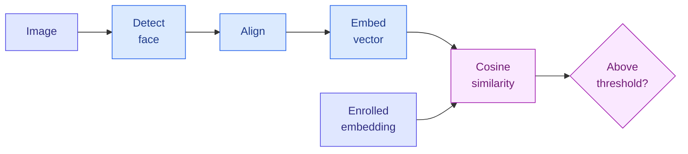
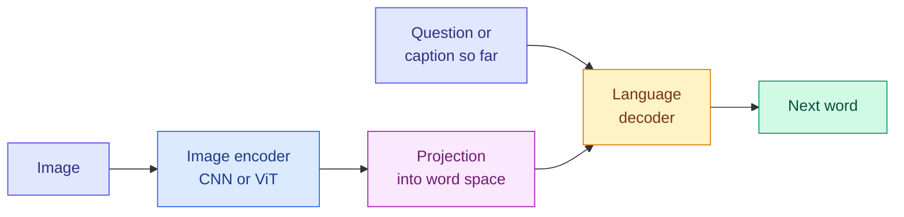

# Vision Tasks: Faces, Text, Captions, Generation and Restoration

**Level:** 🟡 Intermediate → 🔴 Advanced &nbsp;|&nbsp; **Effort:** Detailed module &nbsp;|&nbsp; **Module:** [09 Computer Vision](README.md)

---

## 🎯 Learning Objectives

By the end of this topic you will be able to:

- Explain face **verification** and **identification** as embedding comparisons, and set a threshold from error rates
- Show why a threshold chosen on known identities fails on new ones — and what metric learning does about it
- Describe the stages of **optical character recognition (OCR)**, and why modern systems read whole lines at once
- Describe how **image captioning** and **visual question answering (VQA)** connect an image encoder to a language model
- Measure restoration with **peak signal-to-noise ratio (PSNR)**, and explain what that metric rewards and hides
- Name the legal, privacy and fairness constraints on face technology, and where to check them

## 📚 Prerequisites

- [Topic 3: Classification, Detection, Segmentation and Pose](03-classification-detection-segmentation-and-pose.md)
- [Siamese networks](../08-deep-learning/08-other-architectures.md) — learning a similarity instead of a class
- [Choosing the threshold from costs](../07-model-evaluation/06-classification-metrics.md) — picking an operating point

```bash
pip install -r requirements.txt
pip install -r requirements-dl.txt --index-url https://download.pytorch.org/whl/cpu    # macOS: omit --index-url
```

---

## 🍰 1. The simple version

Some vision tasks answer questions that a single class label cannot:

- **Is this the same person?** Face recognition compares two faces rather than naming one.
- **What does it say?** OCR turns pictures of text into text.
- **What is happening?** Captioning describes an image in a sentence; VQA answers a question about it.
- **Can you fix it?** Restoration removes noise and blur; super-resolution adds pixels.
- **Can you make one?** Generation creates new images.

Most of them work the same way underneath: **turn the image into a list of numbers — an embedding — then compare it,
decode it into words, or decode it back into pixels.**

## 🏠 2. Real-life analogy

> A passport officer does not memorise every traveller in the world. They compare *two* things: the face in front of
> them and the photo in the passport, and decide whether they are close enough. How strict they are is a policy
> choice — too strict and genuine travellers are turned away, too lenient and impostors walk through.

**Where the analogy breaks down:** a person can explain *why* two faces match. An embedding model gives only a
similarity score, and its errors are not evenly spread across people — section 3 shows why that matters.



---

## 👤 3. Face recognition: comparing embeddings

A face recognition pipeline has four steps:

1. **Detect** the face (Topic 3).
2. **Align** it: rotate and scale so the eyes and mouth sit in standard positions.
3. **Embed** it: a network maps the aligned face to a vector, typically a few hundred numbers.
4. **Compare**: cosine similarity between two embeddings, against a threshold.

| Mode | Question | Comparisons |
| --- | --- | --- |
| **Verification (1:1)** | Is this person who they claim to be? | One — phone unlock, passport gates |
| **Identification (1:N)** | Who is this, among N enrolled people? | N — and false matches grow with N |

Face recognition is **open-set**: the system must handle people it never saw in training, and people who are not
enrolled at all. That is why it cannot simply be a classifier with one output per person.



### 💻 Code example — a threshold meets people it has never seen

**Digits stand in for faces here**, so the example uses no personal data. Each digit class plays one "identity". A
convolutional network (CNN) is trained as an ordinary classifier on identities 0–6, and its second-to-last layer is
used as the embedding. The threshold is chosen so that at most 1% of impostor pairs *among known identities* are
accepted. Then identities 7, 8 and 9, never seen in training, arrive.

```python
"""Verification with embeddings: set a threshold on known identities, then meet new ones."""

import torch
from sklearn.datasets import load_digits
from torch import nn

torch.set_default_dtype(torch.float64)

X, y = load_digits(return_X_y=True)
X, y = torch.tensor(X / 16.0).reshape(-1, 1, 8, 8), torch.tensor(y)
generator = torch.Generator().manual_seed(0)
order = torch.randperm(len(y), generator=generator)
X, y = X[order], y[order]
known = y < 7                                  # "enrolled identities" 0-6; 7, 8 and 9 are never seen in training
train = known & (torch.arange(len(y)) < 900)
X_train, y_train = X[train], y[train]

torch.manual_seed(0)
encoder = nn.Sequential(nn.Conv2d(1, 16, 3, padding=1), nn.ReLU(), nn.Conv2d(16, 32, 3, padding=1), nn.ReLU(),
                        nn.AdaptiveMaxPool2d(1), nn.Flatten(), nn.Linear(32, 16))
head = nn.Linear(16, 7)
optimiser = torch.optim.Adam([*encoder.parameters(), *head.parameters()], lr=1e-2)
for _ in range(20):
    permutation = torch.randperm(len(X_train), generator=generator)
    for start in range(0, len(X_train), 64):
        batch = permutation[start:start + 64]
        loss = nn.functional.cross_entropy(head(encoder(X_train[batch])), y_train[batch])
        optimiser.zero_grad()
        loss.backward()
        optimiser.step()


def pairs(images, labels):
    """Cosine similarity for every pair; True where both images show the same identity."""
    with torch.no_grad():
        embeddings = nn.functional.normalize(encoder(images), dim=1)
    similarity = embeddings @ embeddings.T
    same = labels[:, None] == labels[None, :]
    upper = torch.triu(torch.ones_like(same), diagonal=1)          # each pair once, no self-pairs
    return similarity[upper], same[upper]


held_out = torch.arange(len(y)) >= 900
seen_similarity, seen_same = pairs(X[held_out & known], y[held_out & known])
new_similarity, new_same = pairs(X[held_out & ~known], y[held_out & ~known])

impostors = seen_similarity[~seen_same].sort().values
threshold = impostors[int(0.99 * len(impostors))].item()      # accept at most 1% of impostor pairs we can see
print(f"threshold chosen on known identities: {threshold:.3f}")
print(f"{'people':<22}{'false accepts':>14}{'false rejects':>15}")
for name, similarity, same in [("known identities", seen_similarity, seen_same),
                               ("never-seen identities", new_similarity, new_same)]:
    false_accept = (similarity[~same] > threshold).double().mean().item()
    false_reject = (similarity[same] <= threshold).double().mean().item()
    print(f"{name:<22}{false_accept:>14.1%}{false_reject:>15.1%}")
```

**Output:**
```
threshold chosen on known identities: 0.771
people                 false accepts  false rejects
known identities                1.0%           9.7%
never-seen identities          36.3%          39.6%
```

**On the identities it was trained on, the system met its target: 1% false accepts.** On identities it had never seen,
**more than a third of impostor pairs were accepted** — and genuine pairs were rejected four times as often. The
threshold was not wrong; the embedding was. A classifier learns whatever features separate *its* classes. It has no
reason to separate classes it was never shown, so the new identities landed in the same region of the embedding space.

**This is why face recognition models are trained differently:**

- **Metric learning** trains the embedding directly for distances: a **triplet loss** pulls an anchor towards another
  image of the same person and pushes it away from a different person (FaceNet); **angular-margin losses** such as
  ArcFace force a margin between identities on the unit sphere.
- **Training on a very large number of identities**, so that the embedding learns what distinguishes faces in general
  rather than a fixed list of people.
- **Setting the threshold on identities disjoint from training**, from populations that match deployment.

**The two error rates trade off.** Raising the threshold lowers false accepts and raises false rejects. The balance is
a **policy decision**: a phone unlock tolerates occasional false rejects; a system that can lead to someone being
stopped or accused must treat false accepts as serious harm.

### 🔐 Face technology: fairness, privacy and law

- **Error rates differ between demographic groups.** An evaluation of face recognition algorithms by the US National
  Institute of Standards and Technology (NIST) found that false positive rates varied across groups by age, sex and
  ethnicity, by large factors for many algorithms, and that the size of the differences varied widely between
  algorithms. A threshold tuned on one population can behave very differently on another, as the example showed in
  miniature. Measure error rates **per group, on your own deployment population**.
- **Face data is biometric data.** In many jurisdictions it is a special category of personal data with strict
  conditions on collection, consent, storage and retention. Store embeddings as carefully as the images: they identify
  the person too.
- **Some uses are restricted or prohibited.** The European Union's Artificial Intelligence Act (Regulation (EU)
  2024/1689), for example, prohibits building facial recognition databases through untargeted scraping of images from
  the internet or CCTV (closed-circuit television) footage, and restricts real-time remote biometric identification in
  publicly accessible spaces for law enforcement. Rules differ by country, state and sector and change over time.
  **This is not legal advice** — check the current regulations where you deploy, and involve qualified counsel before
  building any face system.
- **Keep a person in the loop** wherever a match has consequences, and give people a way to contest a decision.

---

## 🔤 4. Optical character recognition

Classic OCR is a pipeline: **find the text, cut it into characters, recognise each one.** The weak link is the
cutting. Here digits play the part of characters.

```python
"""Classic optical character recognition: cut a line into characters, then classify each one."""

import numpy as np
from sklearn.datasets import load_digits
from sklearn.linear_model import LogisticRegression

X, y = load_digits(return_X_y=True)
images = X.reshape(-1, 8, 8)


def crop(digit):
    """Keep only the columns that contain ink."""
    inked = np.flatnonzero(digit.sum(axis=0))
    return digit[:, inked[0]:inked[-1] + 1]


def centre(piece):
    """Put a piece back in the middle of an 8 x 8 box - the SAME step for training and reading."""
    box = np.zeros((8, 8))
    offset = (8 - piece.shape[1]) // 2
    box[:, offset:offset + piece.shape[1]] = piece
    return box.ravel()


reader = LogisticRegression(max_iter=3000).fit([centre(crop(d)) for d in images[:1500]], y[:1500])


def write_line(indices, gap):
    parts = []
    for i in indices:
        parts += [crop(images[i]), np.zeros((8, gap))]
    return np.hstack(parts[:-1])


def read_line(line):
    """Split at blank columns; a piece too wide to be one character cannot be read."""
    inked, pieces, start = line.sum(axis=0) > 0, [], None
    for col, ink in enumerate([*inked, False]):
        if ink and start is None:
            start = col
        elif not ink and start is not None:
            pieces.append(line[:, start:col])
            start = None
    return "".join(str(reader.predict([centre(p)])[0]) if p.shape[1] <= 8 else "?" for p in pieces)


rng = np.random.default_rng(0)
correct, characters = {1: 0, 0: 0}, 0
for trial in range(200):
    indices = rng.choice(np.arange(1500, len(y)), size=4, replace=False)     # digits the reader never saw
    truth = "".join(str(y[i]) for i in indices)
    readings = {gap: read_line(write_line(indices, gap)) for gap in (1, 0)}
    for gap, text in readings.items():
        correct[gap] += text == truth
    characters += sum(a == b for a, b in zip(readings[1], truth)) if len(readings[1]) == 4 else 0
    if trial < 4:
        print(f"truth {truth}   one blank column apart: {readings[1]:<6}   touching: {readings[0]}")
print(f"\ncharacters correct, one blank column apart: {characters / 800:.0%}")
print(f"whole line correct - one blank column apart: {correct[1] / 200:.0%}   touching: {correct[0] / 200:.0%}")
```

**Output:**
```
truth 9430   one blank column apart: 9470     touching: ?
truth 3965   one blank column apart: 3965     touching: ?
truth 0740   one blank column apart: 0740     touching: ?
truth 1005   one blank column apart: 1005     touching: ?

characters correct, one blank column apart: 91%
whole line correct - one blank column apart: 68%   touching: 0%
```

**Two lessons.** First, **errors compound**: 91% per character becomes $0.91^4 \approx 68\%$ per four-character line.
An account number of twelve digits at 99% per character is read completely correctly only $0.99^{12} \approx 89\%$ of
the time — which is why production OCR is paired with checksums, dictionaries and validation rules.

Second, **when characters touch, segmentation fails completely** — not one line was read. Handwriting, cursive scripts
and many languages are written with joined characters, so no rule can find the cuts. Modern OCR does not cut: a
convolutional network turns the whole line into a sequence of feature columns, a sequence model reads along it, and
the **connectionist temporal classification (CTC)** loss lets the network learn the alignment between columns and
characters without any character positions in the labels. Transformer-based readers go further and generate the text
the way a language model does.

**A modern document pipeline** has three stages: **text detection** (find text regions, usually as rotated boxes or
polygons), **recognition** (read each line), and **layout understanding** (tables, form fields, reading order).
Measure it with **character error rate** and **word error rate** — edit distances, not accuracy.

**🔐 OCR output is untrusted text.** When recognised text is passed to a language model, words printed in an image
become instructions the model may follow — a *prompt injection* hidden in a photo or a scanned document. Treat
extracted text as data, never as commands ([28 AI Security](../28-ai-security/README.md)).

---

## 💬 5. Captioning and visual question answering

**Image captioning** generates a sentence describing an image. **Visual question answering** answers a
natural-language question about an image: "How many people are wearing helmets?"

Both connect two models: an **image encoder** — a CNN or a vision transformer ([Topic 6](06-detectors-vit-sam-and-clip.md))
— turns the image into a set of feature vectors, and a **language decoder** generates text one token at a time,
attending to those features. Modern vision–language models connect a pretrained image encoder to a pretrained large
language model through a small trained "projection" layer, so the language model reads image features as if they were
extra words.



**Their characteristic failure is object hallucination:** describing things that are typical of the scene but not in
the image — a fork on a dining table that has none. A fluent caption is not evidence that the model looked. Evaluate
with questions whose answers you can check, including questions about things that are *absent*, and count errors
rather than judging how natural the text sounds.

The attention mechanism is taught in [11 Transformers](../11-transformers/README.md), language models in
[13 Large Language Models](../13-large-language-models/README.md), and vision–language systems in depth in
[23 Multimodal AI](../23-multimodal-ai/README.md).

---

## 🎨 6. Image generation

Generating images is the subject of [12 Generative AI](../12-generative-ai/README.md). The mechanisms are introduced
in module 08: [autoencoders, variational autoencoders (VAEs) and generative adversarial networks
(GANs)](../08-deep-learning/07-autoencoders-vaes-and-gans.md), and [diffusion
models](../08-deep-learning/08-other-architectures.md), which power most current text-to-image systems. Two links to
this module: the denoising networks inside diffusion models are usually **U-Nets** ([Topic
5](05-classic-cnn-architectures.md)) or vision transformers, and text-to-image models are steered by text embeddings
from models such as **CLIP** (Contrastive Language–Image Pre-training) ([Topic 6](06-detectors-vit-sam-and-clip.md)).

---

## 🩹 7. Restoration and super-resolution

**Restoration** recovers a clean image from a degraded one — removing noise, blur or compression artefacts.
**Super-resolution** produces a higher-resolution image from a lower-resolution one. Both are usually scored against
the true clean image with **peak signal-to-noise ratio**:

$$
\text{PSNR} = 10 \log_{10} \frac{\text{MAX}^2}{\text{MSE}}
$$

| Symbol | Means |
| --- | --- |
| MAX | The largest possible pixel value: 1 for images scaled to [0, 1], 255 for 8-bit |
| MSE | Mean squared error between the restored and the true image |
| PSNR | In decibels (dB). Higher is better; every +3 dB halves the squared error |

Below, a small network learns to predict a **correction** to its input — **residual learning**, the same idea as
ResNet ([Topic 5](05-classic-cnn-architectures.md)) — for denoising and for 2× super-resolution of digits.

```python
"""Restoration: denoise and upscale digits, scored by peak signal-to-noise ratio."""

import torch
from sklearn.datasets import load_digits
from torch import nn
from torch.nn import functional as F

torch.set_default_dtype(torch.float64)

X, _ = load_digits(return_X_y=True)
clean = torch.tensor(X / 16.0).reshape(-1, 1, 8, 8)
train, test = clean[:1400], clean[1400:]
generator = torch.Generator().manual_seed(0)


def psnr(estimate, truth):
    """10 log10(peak^2 / mean squared error), with pixel values in [0, 1] so the peak is 1."""
    mse = ((estimate.clamp(0, 1) - truth) ** 2).mean(dim=(1, 2, 3))
    return (10 * torch.log10(1 / mse)).mean().item()


def blur(images):
    kernel = torch.tensor([[1.0, 2.0, 1.0], [2.0, 4.0, 2.0], [1.0, 2.0, 1.0]])[None, None] / 16
    return F.conv2d(F.pad(images, (1, 1, 1, 1), mode="replicate"), kernel)


def fit(make_input, steps=300):
    """A small network that predicts a CORRECTION to its input: residual learning."""
    torch.manual_seed(0)
    net = nn.Sequential(nn.Conv2d(1, 16, 3, padding=1), nn.ReLU(), nn.Conv2d(16, 16, 3, padding=1), nn.ReLU(),
                        nn.Conv2d(16, 1, 3, padding=1))
    optimiser = torch.optim.Adam(net.parameters(), lr=3e-3)
    for _ in range(steps):
        batch = train[torch.randint(len(train), (128,), generator=generator)]
        degraded = make_input(batch)
        loss = F.mse_loss(degraded + net(degraded), batch)
        optimiser.zero_grad()
        loss.backward()
        optimiser.step()
    return lambda images: (images + net(images)).detach()


def add_noise(images):
    return images + 0.3 * torch.randn(images.shape, generator=generator)


noisy_test = add_noise(test)
denoiser = fit(add_noise)
print(f"{'denoising (noise sd 0.3)':<30}{'PSNR, dB':>9}")
for name, output in [("noisy input", noisy_test), ("3 x 3 blur", blur(noisy_test)), ("small CNN", denoiser(noisy_test))]:
    print(f"{name:<30}{psnr(output, test):>9.1f}")


def upscale(images):
    """Shrink 8 x 8 to 4 x 4, then bilinear back up: the network's input for super-resolution."""
    return F.interpolate(F.avg_pool2d(images, 2), scale_factor=2, mode="bilinear", align_corners=False)


small_test = F.avg_pool2d(test, 2)
upscaler = fit(upscale)
print(f"\n{'super-resolution 4x4 -> 8x8':<30}{'PSNR, dB':>9}")
for name, output in [("nearest neighbour", F.interpolate(small_test, scale_factor=2, mode="nearest")),
                     ("bilinear", upscale(test)), ("small CNN", upscaler(upscale(test)))]:
    print(f"{name:<30}{psnr(output, test):>9.1f}")
```

**Output:**
```
denoising (noise sd 0.3)       PSNR, dB
noisy input                        13.0
3 x 3 blur                         13.7
small CNN                          16.4

super-resolution 4x4 -> 8x8    PSNR, dB
nearest neighbour                  13.3
bilinear                           12.9
small CNN                          17.2
```

**A blur barely helped (+0.7 dB): it removed noise and digit strokes alike.** The trained network gained +3.4 dB —
less than half the squared error — because it learned what digits look like and removed only what did not fit. For
super-resolution, the trained network gained about 4 dB over simple interpolation for the same reason: it has
**learned a prior** about the images it restores.

**That prior is also the danger.** A restoration network fills in detail that is *typical* of its training data, not
detail that was in the scene:

- **PSNR rewards caution.** Averaging over possible answers gives a low squared error and a blurry image. Networks
  trained adversarially or with perceptual losses produce sharper images with *lower* PSNR — there is a proven
  trade-off between distortion and realism. Report a perceptual measure such as SSIM (structural similarity) or
  LPIPS (learned perceptual similarity) alongside PSNR, and look at the images.
- **Invented detail is not evidence.** A super-resolved face, licence plate or medical scan can look convincing and be
  wrong. Never use generative enhancement for identification, forensics or diagnosis without saying so, and never
  treat enhanced detail as observed.

---

## 🏭 8. Production notes

- **Face systems:** evaluate on identities and demographics disjoint from training and matched to deployment; log
  similarity scores, not only decisions; re-evaluate after every model or camera change; protect embeddings as
  biometric data; offer a non-biometric alternative where the law or fairness requires it.
- **OCR:** validate the output against what the field must look like (dates, check digits, known vocabularies); route
  low-confidence fields to people; monitor character error rate on a regularly labelled sample.
- **Captioning and VQA:** attach the source image to every answer shown to a user, and measure hallucination on
  held-out questions with known answers.
- **Restoration:** store the original next to the enhanced version, label enhanced images as such, and never overwrite
  evidence.

## ⚠️ 9. Common mistakes

| Mistake | Why it happens | Fix |
| --- | --- | --- |
| Face recognition as a closed-set classifier | It works in the demo | Embeddings plus a threshold; the example accepted 36% of new impostors |
| Threshold set on training identities | They are the data you have | Set it on disjoint identities from the deployment population |
| One error rate reported for everyone | Aggregate metrics | Report false accept and false reject rates per demographic group |
| Per-character accuracy quoted for OCR | It is the flattering number | Report line- or field-level accuracy, and error rates by edit distance |
| Feeding OCR text straight into a language model | Convenience | Treat extracted text as untrusted data |
| Trusting a fluent caption | Fluency looks like understanding | Test with checkable and "absent object" questions |
| PSNR as the only restoration metric | It is easy to compute | Add a perceptual measure and inspect results |

---

## 🎤 10. Interview questions

<details>
<summary><b>Q1: What is the difference between face verification and identification, and why do false matches grow with identification?</b></summary>

Verification is a 1:1 comparison — is this the claimed person? Identification is 1:N — who among N enrolled people is
this? Each comparison carries a small chance of a false match, and identification makes N of them, so with a large
gallery the chance that *some* impostor exceeds the threshold grows with N. Identification needs stricter thresholds,
and usually a person reviewing candidate matches.
</details>

<details>
<summary><b>Q2: Why not train face recognition as a classifier with one output per person?</b></summary>

Because the problem is open-set: new people must be recognised without retraining, and unknown people must be
rejected. A classifier's features only need to separate its training classes. In the example, a threshold that
accepted 1% of impostors among known identities accepted 36% among new ones. Metric-learning losses such as triplet
or ArcFace train the embedding for distances, on very many identities, so that it generalises to new faces.
</details>

<details>
<summary><b>Q3: Why do modern OCR systems avoid segmenting characters?</b></summary>

Segmentation needs a gap between characters, which handwriting and joined scripts do not have — in the example,
touching digits were read correctly 0% of the time. Modern recognisers read the whole line: a CNN produces a sequence
of feature columns, a sequence model reads it, and the CTC loss learns the alignment between columns and characters
from line-level labels. Also, per-character errors compound: 91% per character gave 68% per four-character line.
</details>

<details>
<summary><b>Q4: A super-resolution model has the best PSNR on your benchmark. Is it the best model to deploy?</b></summary>

Not necessarily. PSNR rewards low squared error, which favours cautious, blurry outputs; sharper, more realistic
outputs can score lower. Add a perceptual measure such as SSIM or LPIPS and look at the images. More importantly, any
learned restoration invents plausible detail from its training data, so for forensic, medical or identification uses
enhanced images must be labelled as such and never treated as observations.
</details>

<details>
<summary><b>Q5: What would you need to check before deploying face recognition at a building entrance?</b></summary>

Legality and consent under the current regulations where it will run, with qualified counsel; data protection for
biometric data, including retention and embedding storage; error rates per demographic group on a population like the
building's users; the threshold chosen from the cost of false accepts versus false rejects; a non-biometric
alternative and a human fallback; liveness detection against photos and screens; and monitoring after launch.
</details>

---

## ✅ Key takeaways

- Most of these tasks **embed, then compare or decode**.
- **Face recognition is open-set**: a classifier's embedding accepted 36% of impostors among new identities. Metric
  learning, many identities and disjoint thresholds fix that.
- **Face technology is regulated and error rates differ by group.** Check current law with counsel; measure per group.
- **OCR errors compound**, and cutting characters fails on touching text; modern OCR reads whole lines.
- **Captioning and VQA** join an image encoder to a language model; watch for object hallucination.
- **Learned restoration beats simple filters by learning a prior** — which also means it invents detail. PSNR alone
  rewards blur.

---

## 📚 Official References

- [FaceNet: A Unified Embedding for Face Recognition and Clustering — Schroff, Kalenichenko and Philbin, arXiv](https://arxiv.org/abs/1503.03832) — verified 2026-09-19
- [ArcFace: Additive Angular Margin Loss for Deep Face Recognition — Deng, Guo, Xue and Zafeiriou, arXiv](https://arxiv.org/abs/1801.07698) — verified 2026-09-19
- [Face Technology Evaluations, FRTE and FATE — NIST](https://www.nist.gov/programs-projects/face-technology-evaluations-frtefate) — verified 2026-09-19; volatile, evaluation results are updated regularly
- [Face Recognition Vendor Test Part 3: Demographic Effects, NISTIR 8280 — NIST](https://doi.org/10.6028/NIST.IR.8280) — verified 2026-09-19
- [Regulation (EU) 2024/1689, the Artificial Intelligence Act — EUR-Lex, European Union](https://eur-lex.europa.eu/eli/reg/2024/1689/oj) — verified 2026-09-19; not legal advice
- [An End-to-End Trainable Neural Network for Image-based Sequence Recognition — Shi, Bai and Yao, arXiv](https://arxiv.org/abs/1507.05717) — verified 2026-09-19; CNN plus recurrent network plus CTC for text lines
- [Image Super-Resolution Using Deep Convolutional Networks — Dong, Loy, He and Tang, arXiv](https://arxiv.org/abs/1501.00092) — verified 2026-09-19
- [The Perception-Distortion Tradeoff — Blau and Michaeli, arXiv](https://arxiv.org/abs/1711.06077) — verified 2026-09-19; the proof that distortion and realism trade off

---

## 🔗 Navigation

[← Topic 3: Classification, Detection, Segmentation and Pose](03-classification-detection-segmentation-and-pose.md) &nbsp;|&nbsp;
[🏠 Module Home](README.md) &nbsp;|&nbsp;
[Topic 5: Classic CNN Architectures →](05-classic-cnn-architectures.md)
