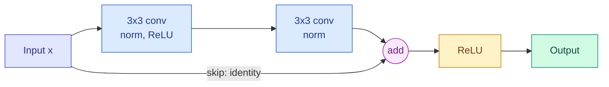
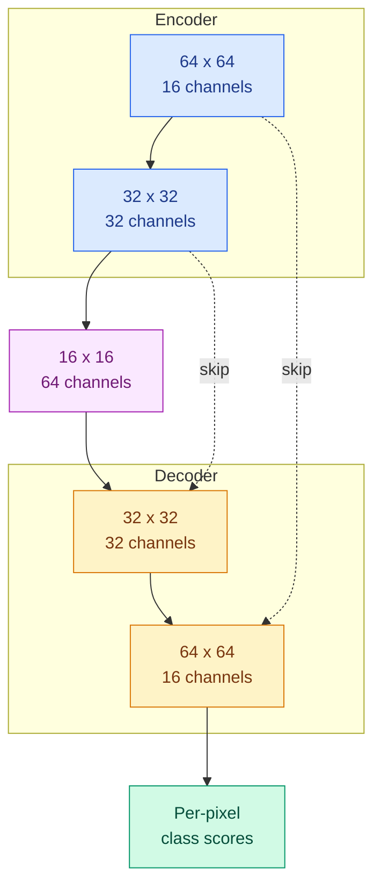

# Classic CNN Architectures: LeNet to EfficientNet, and U-Net

**Level:** 🟡 Intermediate → 🔴 Advanced &nbsp;|&nbsp; **Effort:** Detailed module &nbsp;|&nbsp; **Module:** [09 Computer Vision](README.md)

---

## 🎯 Learning Objectives

By the end of this topic you will be able to:

- Name the one idea each landmark architecture contributed: LeNet, AlexNet, VGG, Inception, ResNet, MobileNet,
  EfficientNet and U-Net
- Count an architecture's parameters and **multiply-accumulate operations (MACs)** without downloading it
- Explain 1×1 bottlenecks and depthwise separable convolutions, and compute what they save
- Trace the shapes through a U-Net and explain its skip connections
- Choose a backbone for a task and a latency budget, and reuse it through transfer learning

## 📚 Prerequisites

- [Topic 2: Convolution, Pooling and Augmentation](02-convolution-pooling-and-augmentation.md) — output sizes and
  receptive fields
- [Vanishing Gradients, Normalisation, Dropout and Residuals](../08-deep-learning/04-vanishing-gradients-normalisation-dropout-and-residuals.md)
  — why residual connections let deep networks train

```bash
pip install -r requirements.txt
pip install -r requirements-dl.txt --index-url https://download.pytorch.org/whl/cpu    # macOS: omit --index-url
```

---

## 🍰 1. The simple version

Every famous vision network — every classic convolutional neural network (CNN) — is a **recipe for stacking
convolutional layers**. Each one became famous by fixing the
biggest problem of the previous recipe: too few layers, too many parameters, too hard to train, too slow for a phone.

You will almost never design one yourself. You will **choose** one — and choosing well means knowing what each is good
at and what it costs.

## 🏠 2. Real-life analogy

> The history of the car. The first cars proved the idea worked. Later ones got bigger engines, then learned to
> use them efficiently, then got cheap enough for everyone, then small enough for city streets. A buyer today does not
> need to know how to build an engine — but must know the difference between a lorry and a scooter.

**Where the analogy breaks down:** an old car stays as good as it was. An old architecture trained with a modern
recipe can become much better — section 3 shows ResNet-50 gaining almost five points of accuracy from training alone.


---

## 🏛️ 3. The landmarks, measured

| Architecture | Year | The idea it added |
| --- | --- | --- |
| **LeNet-5** | 1998 | Convolution, pooling and fully connected layers, trained end to end by backpropagation; read handwritten digits on cheques |
| **AlexNet** | 2012 | The same idea, much larger, trained on GPUs (graphics processing units), with ReLU, dropout and augmentation. Won the ImageNet challenge by a wide margin and started the deep-learning era |
| **VGG** (Visual Geometry Group, Oxford) | 2014 | Only 3×3 convolutions, stacked deep ([Topic 2](02-convolution-pooling-and-augmentation.md)). Simple and uniform — and very heavy |
| **GoogLeNet / Inception** | 2014 | Parallel 1×1, 3×3 and 5×5 branches in each block, with cheap **1×1 bottlenecks** in front of the expensive ones |
| **ResNet** | 2015 | **Residual connections**, $y = x + F(x)$, so gradients flow through 50, 101 or 152 layers |
| **MobileNet** | 2017–2019 | **Depthwise separable convolutions**; V2 added inverted residuals, V3 an automated architecture search |
| **EfficientNet** | 2019 | **Compound scaling**: grow depth, width and resolution together, in fixed proportions, from a searched base network |
| **U-Net** | 2015 | An encoder–decoder for segmentation, with **skip connections** carrying fine detail across (section 6) |

### 💻 Code example — counting cost without downloading anything

A **multiply-accumulate** (one multiplication added into a running sum) is the basic unit of work in a convolution. The
count below builds each architecture on PyTorch's **meta device**, which tracks shapes but allocates no memory and does
no arithmetic, and hooks every layer to count its MACs from its output shape. The accuracy figures are the ones
torchvision publishes for its own pretrained weights, read from the library's metadata — nothing is downloaded.

```python
"""Thirty years of CNNs: size, compute and published ImageNet accuracy - without downloading a single weight."""

import torch
from torch import nn
from torchvision import models


def count_macs(model, size):
    """Multiply-accumulates in convolution and linear layers for one image, counted from output shapes."""
    total = 0

    def conv(module, inputs, output):
        nonlocal total
        per_output = (module.in_channels // module.groups) * module.kernel_size[0] * module.kernel_size[1]
        total += output[0].numel() * per_output

    def linear(module, inputs, output):
        nonlocal total
        total += output[0].numel() * module.in_features

    hooks = [m.register_forward_hook(conv) for m in model.modules() if isinstance(m, nn.Conv2d)]
    hooks += [m.register_forward_hook(linear) for m in model.modules() if isinstance(m, nn.Linear)]
    channels = next(m for m in model.modules() if isinstance(m, nn.Conv2d)).in_channels
    with torch.no_grad():
        model.eval()(torch.zeros(1, channels, size, size, device="meta"))
    for hook in hooks:
        hook.remove()
    return total


def lenet5():
    """LeNet-5 (1998), in modern layers: two 5x5 convolutions and three fully connected layers."""
    return nn.Sequential(nn.Conv2d(1, 6, 5), nn.Tanh(), nn.AvgPool2d(2), nn.Conv2d(6, 16, 5), nn.Tanh(),
                         nn.AvgPool2d(2), nn.Flatten(), nn.Linear(400, 120), nn.Tanh(), nn.Linear(120, 84), nn.Tanh(),
                         nn.Linear(84, 10))


with torch.device("meta"):                              # shapes only: no memory, no computation, no download
    lenet = lenet5()
print(f"LeNet-5 (1998, 32 x 32 grayscale): {sum(p.numel() for p in lenet.parameters()):,} parameters, "
      f"{count_macs(lenet, 32) / 1e6:.2f} million MACs\n")

catalogue = [
    ("AlexNet", 2012, models.alexnet, models.AlexNet_Weights.IMAGENET1K_V1),
    ("VGG-16", 2014, models.vgg16, models.VGG16_Weights.IMAGENET1K_V1),
    ("GoogLeNet (Inception v1)", 2014, models.googlenet, models.GoogLeNet_Weights.IMAGENET1K_V1),
    ("ResNet-18", 2015, models.resnet18, models.ResNet18_Weights.IMAGENET1K_V1),
    ("ResNet-50", 2015, models.resnet50, models.ResNet50_Weights.IMAGENET1K_V1),
    ("MobileNetV2", 2018, models.mobilenet_v2, models.MobileNet_V2_Weights.IMAGENET1K_V1),
    ("MobileNetV3-Small", 2019, models.mobilenet_v3_small, models.MobileNet_V3_Small_Weights.IMAGENET1K_V1),
    ("EfficientNet-B0", 2019, models.efficientnet_b0, models.EfficientNet_B0_Weights.IMAGENET1K_V1),
]
print(f"{'architecture':<26}{'year':>5}{'parameters':>13}{'GMACs':>7}{'torchvision':>12}{'top-1 %':>9}")
for name, year, build, weights in catalogue:
    extra = {"init_weights": False, "aux_logits": False} if name.startswith("GoogLeNet") else {}   # no training-only heads
    with torch.device("meta"):
        model = build(weights=None, **extra)
    parameters = sum(p.numel() for p in model.parameters())
    accuracy = weights.meta["_metrics"]["ImageNet-1K"]["acc@1"]
    print(f"{name:<26}{year:>5}{parameters:>13,}{count_macs(model, 224) / 1e9:>7.2f}{weights.meta['_ops']:>12.2f}"
          f"{accuracy:>9.1f}")

v2 = models.ResNet50_Weights.IMAGENET1K_V2.meta["_metrics"]["ImageNet-1K"]["acc@1"]
print(f"\nResNet-50, identical architecture, torchvision's newer training recipe: {v2:.1f}% top-1")
```

**Output:**
```
LeNet-5 (1998, 32 x 32 grayscale): 61,706 parameters, 0.42 million MACs

architecture               year   parameters  GMACs torchvision  top-1 %
AlexNet                    2012   61,100,840   0.71        0.71     56.5
VGG-16                     2014  138,357,544  15.47       15.47     71.6
GoogLeNet (Inception v1)   2014    6,624,904   1.50        1.50     69.8
ResNet-18                  2015   11,689,512   1.81        1.81     69.8
ResNet-50                  2015   25,557,032   4.09        4.09     76.1
MobileNetV2                2018    3,504,872   0.30        0.30     71.9
MobileNetV3-Small          2019    2,542,856   0.06        0.06     67.7
EfficientNet-B0            2019    5,288,548   0.39        0.39     77.7

ResNet-50, identical architecture, torchvision's newer training recipe: 80.9% top-1
```

**The MAC count matches torchvision's published figure for every architecture.** (torchvision labels its column
"GFLOPS"; it counts one multiply-accumulate as one operation. Other sources count it as two floating-point operations
(FLOPs), so "FLOPs" in papers can differ by a factor of 2 — check which is meant.)

**What the table says:**

- **Parameters and compute are different things.** AlexNet and VGG-16 have most of their parameters in the fully
  connected layers at the end; most of their *compute* is in the convolutions. GoogLeNet has a twentieth of VGG's
  parameters and a tenth of its compute, for 1.8 points less accuracy.
- **Efficiency improved faster than accuracy.** EfficientNet-B0 is more accurate than ResNet-50 with less than a tenth
  of the MACs and a fifth of the parameters.
- **The training recipe matters as much as the architecture.** The *same* ResNet-50 went from 76.1% to 80.9% with
  torchvision's improved recipe — longer training, stronger augmentation, better regularisation. When a paper's new
  architecture beats an old one, check that both were trained the same way.

---

## 🧮 4. The two tricks that made CNNs cheap

Mapping 256 channels to 256 channels with a 3×3 convolution costs $3 \times 3 \times 256 \times 256 = 589{,}824$
weights. Two ideas cut that down by about 90%:

- **1×1 bottleneck** (Inception, ResNet-50): squeeze to fewer channels with a 1×1 convolution, do the expensive 3×3 on
  the thin version, expand back with another 1×1.
- **Depthwise separable convolution** (MobileNet): split the layer in two. A **depthwise** 3×3 convolution filters each
  channel on its own; a **pointwise** 1×1 convolution then mixes channels.

```python
"""Three ways to map 256 channels to 256 channels at 56 x 56, and what each costs."""

from torch import nn

channels, size = 256, 56
designs = {
    "standard 3x3": nn.Conv2d(channels, channels, 3, padding=1, bias=False),
    "bottleneck 1x1 -> 3x3 -> 1x1": nn.Sequential(                    # ResNet-50 style: squeeze to 64, then expand
        nn.Conv2d(channels, 64, 1, bias=False), nn.Conv2d(64, 64, 3, padding=1, bias=False),
        nn.Conv2d(64, channels, 1, bias=False)),
    "depthwise 3x3 + pointwise 1x1": nn.Sequential(                   # MobileNet style
        nn.Conv2d(channels, channels, 3, padding=1, groups=channels, bias=False),   # one 3x3 filter per channel
        nn.Conv2d(channels, channels, 1, bias=False)),                              # then mix channels
}
baseline = None
print(f"{'design':<32}{'weights':>9}{'MACs at 56x56':>15}{'vs standard':>13}")
for name, block in designs.items():
    weights = sum(p.numel() for p in block.parameters())
    macs = weights * size * size          # stride 1, same padding: every weight is used once per output position
    baseline = baseline or macs
    print(f"{name:<32}{weights:>9,}{macs:>15,}{macs / baseline:>12.0%}")
```

**Output:**
```
design                            weights  MACs at 56x56  vs standard
standard 3x3                      589,824  1,849,688,064        100%
bottleneck 1x1 -> 3x3 -> 1x1       69,632    218,365,952         12%
depthwise 3x3 + pointwise 1x1      67,840    212,746,240         12%
```

### 📐 Why depthwise separable saves so much

$$
\frac{\text{separable}}{\text{standard}} = \frac{k^2 C + C \cdot C'}{k^2 C \cdot C'} = \frac{1}{C'} + \frac{1}{k^2}
$$

| Symbol | Means |
| --- | --- |
| $k$ | Kernel size, 3 |
| $C$, $C'$ | Input and output channels, 256 each |

With $k = 3$ and $C' = 256$: $1/256 + 1/9 \approx 0.115$ — the 12% in the table. **The saving is almost exactly a
factor of $k^2 = 9$**, because the expensive part — mixing every channel with every other — is now done with a 1×1
kernel instead of a 3×3 one.

**The catch: fewer MACs is not the same as faster.** Depthwise convolutions do very little arithmetic per value read
from memory, so on many GPUs they are limited by memory speed and run far slower than their MAC count suggests.
Section 7 comes back to this.

---

## ➕ 5. ResNet: the residual block

A ResNet block computes $y = x + F(x)$: the block's input is **added** to its output. If a block is not useful it can
learn $F(x) \approx 0$ and pass its input through untouched, and during training the gradient has a direct path back
through every addition. [Module 08](../08-deep-learning/04-vanishing-gradients-normalisation-dropout-and-residuals.md)
measured the effect: at 30 layers, only the residual networks learned.



ResNet-18 and -34 stack blocks like this one; ResNet-50 and deeper use the 1×1 bottleneck version from section 4. When
the block changes the number of channels or halves the resolution, the skip path uses a 1×1 convolution with stride 2
so the shapes still match for the addition. **Residual connections are now everywhere** — in transformers, diffusion
models and U-Nets alike.

---

## 🅤 6. U-Net: an encoder, a decoder and skip connections

Segmentation needs two things at once: **context** — "this region is a tumour", which needs a large receptive field —
and **precise boundaries**, which need full resolution. A U-Net gets both:

- The **encoder** downsamples, like a classifier, to gain context.
- The **decoder** upsamples back to full resolution, with **transposed convolutions** — learned upsampling.
- **Skip connections** copy each encoder level's feature maps across and join them to the decoder at the same
  resolution, so the fine detail lost in downsampling is available again.

```python
"""A small U-Net: shrink to see context, grow back to full size, and copy detail across."""

import torch
from torch import nn


def block(c_in, c_out):
    return nn.Sequential(nn.Conv2d(c_in, c_out, 3, padding=1), nn.ReLU(), nn.Conv2d(c_out, c_out, 3, padding=1), nn.ReLU())


class TinyUNet(nn.Module):
    def __init__(self, classes=3):
        super().__init__()
        self.down1, self.down2, self.bottom = block(3, 16), block(16, 32), block(32, 64)
        self.pool = nn.MaxPool2d(2)
        self.up2, self.dec2 = nn.ConvTranspose2d(64, 32, 2, stride=2), block(64, 32)   # 64 = 32 upsampled + 32 copied
        self.up1, self.dec1 = nn.ConvTranspose2d(32, 16, 2, stride=2), block(32, 16)
        self.head = nn.Conv2d(16, classes, 1)                                           # a score per class per pixel

    def forward(self, x):
        skip1 = self.down1(x)                                   # full resolution: fine detail
        skip2 = self.down2(self.pool(skip1))                    # half resolution
        bottom = self.bottom(self.pool(skip2))                  # quarter resolution: widest context
        up2 = self.dec2(torch.cat([self.up2(bottom), skip2], dim=1))   # upsample, then join the copied detail
        up1 = self.dec1(torch.cat([self.up1(up2), skip1], dim=1))
        self.trace = [("input", x), ("encoder 1", skip1), ("encoder 2", skip2), ("bottleneck", bottom),
                      ("decoder 2, with skip from encoder 2", up2), ("decoder 1, with skip from encoder 1", up1)]
        return self.head(up1)


model = TinyUNet()
scores = model(torch.zeros(1, 3, 64, 64))
for name, tensor in [*model.trace, ("output: class scores", scores)]:
    print(f"{name:<37}{str(tuple(tensor.shape)):>17}")
print(f"\nparameters: {sum(p.numel() for p in model.parameters()):,}")
```

**Output:**
```
input                                   (1, 3, 64, 64)
encoder 1                              (1, 16, 64, 64)
encoder 2                              (1, 32, 32, 32)
bottleneck                             (1, 64, 16, 16)
decoder 2, with skip from encoder 2    (1, 32, 32, 32)
decoder 1, with skip from encoder 1    (1, 16, 64, 64)
output: class scores                    (1, 3, 64, 64)

parameters: 117,075
```

**The output has the same height and width as the input** — one score per class for every pixel. Read the shapes as a
U: down to 16×16 with 64 channels, then back up, and at each level the decoder's input has *twice* the channels because
the encoder's copy is joined on. Because it is fully convolutional, the same network accepts any input whose sides are
divisible by 4.



U-Net was designed for biomedical images, where labelled data is scarce, and it remains the standard starting point
for segmentation in medicine, satellite imagery and industry. It is also the denoising network inside many diffusion
image generators ([12 Generative AI](../12-generative-ai/README.md)).

---

## 🧭 7. Choosing a backbone, and reusing it

The network that turns an image into features is called the **backbone**; the task-specific layers on top are the
**head**. Detection and segmentation models are built on the same backbones as classifiers.

### Transfer learning is the default

Training a backbone from scratch needs a very large labelled dataset. Starting from weights pretrained on a large
dataset such as ImageNet, and training only a new head — or fine-tuning the whole network at a low learning rate —
works far better with the hundreds or thousands of images most projects have.

```python
"""Transfer learning: keep a pretrained backbone, replace and train only the head."""

from torch import nn
from torchvision.models import ResNet18_Weights, resnet18

weights = ResNet18_Weights.IMAGENET1K_V1
print("the preprocessing these weights expect:")
print(weights.transforms())
print("classes it was trained on:", len(weights.meta["categories"]), " e.g.", weights.meta["categories"][:3])

model = resnet18(weights=None)        # real use: resnet18(weights=weights) downloads the pretrained parameters
for parameter in model.parameters():
    parameter.requires_grad = False    # freeze the backbone
model.fc = nn.Linear(model.fc.in_features, 5)      # new head for 5 classes of your own; trainable by default

trainable = sum(p.numel() for p in model.parameters() if p.requires_grad)
total = sum(p.numel() for p in model.parameters())
print(f"\ntrainable: {trainable:,} of {total:,} parameters ({trainable / total:.3%})")
```

**Output:**
```
the preprocessing these weights expect:
ImageClassification(
    crop_size=[224]
    resize_size=[256]
    mean=[0.485, 0.456, 0.406]
    std=[0.229, 0.224, 0.225]
    interpolation=InterpolationMode.BILINEAR
)
classes it was trained on: 1000  e.g. ['tench', 'goldfish', 'great white shark']

trainable: 2,565 of 11,179,077 parameters (0.023%)
```

**The pretrained weights come with their preprocessing**: resize to 256, centre-crop 224, and normalise each channel
with ImageNet's mean and standard deviation. Use `weights.transforms()` exactly —
[Topic 1](01-images-as-tensors-and-preprocessing.md) showed what a mismatch costs. With the backbone frozen, only
2,565 parameters are trained, which is fast and hard to overfit; unfreeze the later blocks when you have more data.
Fine-tuning strategies in general are the subject of [17 Fine-Tuning](../17-fine-tuning/README.md).

**Pretrained weights carry their training data with them.** Check the licence of both the weights and the dataset
they were trained on before commercial use, and remember that biases in that dataset transfer too.

### A starting point for choosing

| Situation | Start with | Why |
| --- | --- | --- |
| Phone, browser or microcontroller | MobileNetV3, EfficientNet-B0 | Lowest MACs for the accuracy |
| Server with a GPU, general purpose | ResNet-50, or a modern CNN or vision transformer (ViT) ([Topic 6](06-detectors-vit-sam-and-clip.md)) | Well-supported, fast on GPUs, easy to fine-tune |
| Small dataset, no GPU budget | A pretrained ResNet-18 with a new head | Cheap to train, hard to overfit |
| Per-pixel output | A U-Net, or a pretrained backbone with a segmentation head | Needs full-resolution output |
| Very large dataset and compute | Vision transformers | They overtake CNNs at scale ([Topic 6](06-detectors-vit-sam-and-clip.md)) |

**Always measure latency on the target hardware**, with the real batch size and input resolution. MACs predict
latency only roughly: depthwise convolutions, memory bandwidth, the number of separate layers and the runtime's
optimisations all change the ranking. Quantisation, pruning and export for inference are covered in
[32 Model Optimization](../32-model-optimization/README.md).

---

## 🏭 8. Production notes

- **Input resolution is a cost dial for every architecture.** MACs scale with the number of pixels, so dropping from
  224 to 160 pixels a side roughly halves them. Measure the accuracy you lose.
- **Pin and record the weights version.** "ResNet-50" is not a model; ResNet-50 with `IMAGENET1K_V2` weights and its
  transforms is.
- **Loading weights runs code.** Older PyTorch checkpoint files use Python's `pickle`, which can execute arbitrary code
  when loaded. Load third-party checkpoints only from sources you trust, with `torch.load(..., weights_only=True)`, or
  prefer the safetensors format.
- **Batch normalisation and small batches do not mix** when fine-tuning: with a batch of 2–4 images, freeze the
  batch-norm statistics or replace them with group normalisation.

## ⚠️ 9. Common mistakes

| Mistake | Why it happens | Fix |
| --- | --- | --- |
| Choosing by accuracy alone | Leaderboards | Weigh accuracy against MACs, memory and measured latency |
| Comparing an old architecture's old recipe with a new one's new recipe | Papers do it | Same recipe for both; ResNet-50 gained 4.8 points from the recipe alone |
| Assuming fewer MACs means faster | It usually does on paper | Measure on target hardware; depthwise layers are memory-bound |
| Training a backbone from scratch on a few thousand images | "Our data is different" | Start from pretrained weights; they still help on very different images |
| Ignoring the weights' preprocessing | Custom transform code | Use `weights.transforms()` |
| Mixing up FLOPs and MACs | Both appear as "FLOPs" | Check the convention; they differ by a factor of 2 |

---

## 🎤 10. Interview questions

<details>
<summary><b>Q1: What problem did ResNet solve, and how?</b></summary>

Plain networks got *worse* as they got deeper — even on the training set — because gradients had to pass through
every layer and optimisation struggled. ResNet adds each block's input to its output, $y = x + F(x)$, so a block can
default to the identity and the gradient has a direct path to early layers. That allowed 50 to 152 layers, and
residual connections are now used in almost every deep architecture.
</details>

<details>
<summary><b>Q2: How much does a depthwise separable convolution save, and what is the catch?</b></summary>

The cost ratio to a standard convolution is $1/C' + 1/k^2$ — about $1/9$ for a 3×3 kernel with many output channels:
12% of the MACs in the example. The catch is that depthwise layers do little arithmetic per byte of memory, so on GPUs
they are often memory-bound and less than proportionally faster. Measure latency on the target device.
</details>

<details>
<summary><b>Q3: Why does a U-Net have skip connections?</b></summary>

The encoder downsamples to gain context but loses fine spatial detail. The decoder must produce a full-resolution
mask. Skip connections copy each encoder level's feature maps to the decoder level of the same resolution and join
them, so the decoder has both the context from the bottleneck and the precise detail from early layers — sharp
boundaries with correct labels.
</details>

<details>
<summary><b>Q4: You have 2,000 labelled images and no large compute budget. How do you build a classifier?</b></summary>

Transfer learning: take a backbone pretrained on a large dataset, replace its classification head, and train the head
with the backbone frozen — in the example only 2,565 of 11 million parameters. Use the weights' own preprocessing and
reasonable augmentation. If validation accuracy plateaus, unfreeze the later blocks and fine-tune with a lower learning
rate. Compare against a simple baseline first.
</details>

<details>
<summary><b>Q5: What did EfficientNet contribute?</b></summary>

Compound scaling: instead of making a network only deeper, only wider or only higher-resolution, scale all three
together in fixed proportions found by a small search, starting from an efficient base network found by architecture
search. EfficientNet-B0 beats ResNet-50's original top-1 accuracy with less than a tenth of the MACs.
</details>

---

## ✅ Key takeaways

- Each landmark fixed one problem: **AlexNet** scale, **VGG** depth with 3×3 layers, **Inception** 1×1 bottlenecks,
  **ResNet** trainability, **MobileNet** and **EfficientNet** efficiency, **U-Net** per-pixel output.
- **Count before you choose**: parameters and MACs can be counted on the meta device, with no download.
- **Bottlenecks and depthwise separable convolutions** cut a layer's cost to about 12% — but fewer MACs is not always
  faster.
- **The training recipe matters**: the same ResNet-50 gained 4.8 points of accuracy from training alone.
- **Transfer learning is the default**, with the pretrained weights' own preprocessing.

---

## 📚 Official References

- [Models and pre-trained weights — torchvision, PyTorch Foundation](https://pytorch.org/vision/stable/models.html) — verified 2026-09-19; the source of the published accuracy and compute figures
- [Meta device — PyTorch Foundation](https://pytorch.org/docs/stable/meta.html) — verified 2026-09-19
- [Gradient-Based Learning Applied to Document Recognition — LeCun, Bottou, Bengio and Haffner](http://yann.lecun.com/exdb/publis/pdf/lecun-01a.pdf) — verified 2026-09-19; LeNet-5
- [ImageNet Classification with Deep Convolutional Neural Networks — Krizhevsky, Sutskever and Hinton, NeurIPS](https://papers.nips.cc/paper_files/paper/2012/hash/c399862d3b9d6b76c8436e924a68c45b-Abstract.html) — verified 2026-09-19; AlexNet
- [Going Deeper with Convolutions — Szegedy et al., arXiv](https://arxiv.org/abs/1409.4842) — verified 2026-09-19; GoogLeNet and the Inception module
- [Deep Residual Learning for Image Recognition — He, Zhang, Ren and Sun, arXiv](https://arxiv.org/abs/1512.03385) — verified 2026-09-19; ResNet
- [MobileNets: Efficient Convolutional Neural Networks for Mobile Vision Applications — Howard et al., arXiv](https://arxiv.org/abs/1704.04861) — verified 2026-09-19
- [EfficientNet: Rethinking Model Scaling for Convolutional Neural Networks — Tan and Le, arXiv](https://arxiv.org/abs/1905.11946) — verified 2026-09-19
- [U-Net: Convolutional Networks for Biomedical Image Segmentation — Ronneberger, Fischer and Brox, arXiv](https://arxiv.org/abs/1505.04597) — verified 2026-09-19

---

## 🔗 Navigation

[← Topic 4: Faces, Text, Captions and Restoration](04-faces-text-captions-and-restoration.md) &nbsp;|&nbsp;
[🏠 Module Home](README.md) &nbsp;|&nbsp;
[Topic 6: Detectors, Vision Transformers, SAM and CLIP →](06-detectors-vit-sam-and-clip.md)
