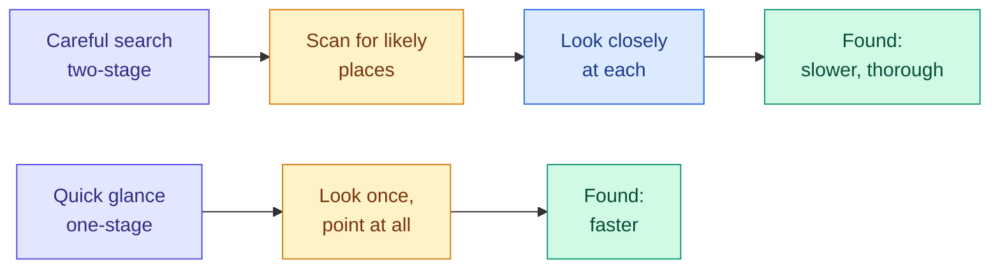
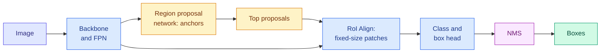
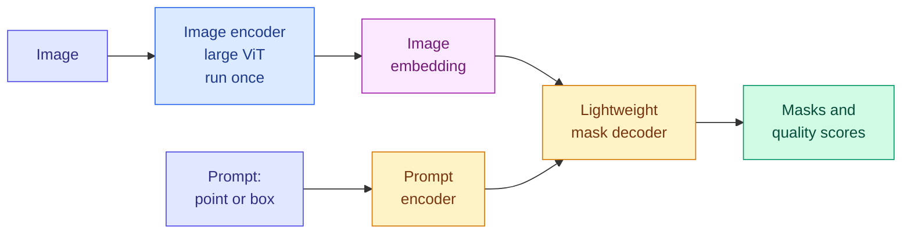
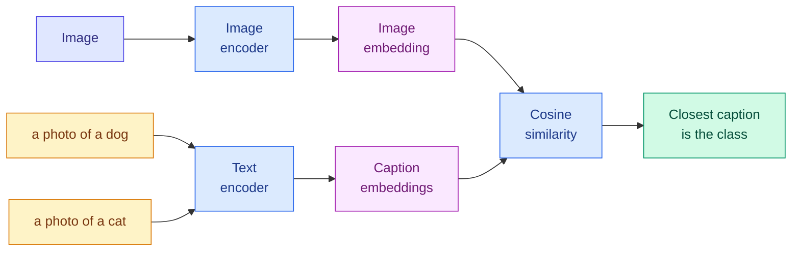

# Modern Vision: Detectors, Vision Transformers, Segment Anything and CLIP

**Level:** 🔴 Advanced &nbsp;|&nbsp; **Effort:** Detailed module &nbsp;|&nbsp; **Module:** [09 Computer Vision](README.md)

---

## 🎯 Learning Objectives

By the end of this topic you will be able to:

- Explain how two-stage detectors (Faster R-CNN), one-stage detectors (YOLO, SSD, RetinaNet) and transformer
  detectors (DETR) differ, and choose one for an accuracy and latency budget
- Turn an image into **vision transformer (ViT)** tokens, and compute how its cost grows with resolution
- Explain why a ViT needs more data than a convolutional neural network (CNN) — and demonstrate it
- Describe how the **Segment Anything Model (SAM)** segments from a prompt, and what it does not do
- Explain **Contrastive Language–Image Pre-training (CLIP)**, zero-shot classification by text prompts, and its known
  failure modes

## 📚 Prerequisites

- [Topic 3: Classification, Detection, Segmentation and Pose](03-classification-detection-segmentation-and-pose.md) —
  intersection over union (IoU), non-maximum suppression (NMS) and average precision (AP)
- [Topic 5: Classic CNN Architectures](05-classic-cnn-architectures.md) — backbones and MAC counting
- [Transformers, Diffusion, GNNs and Other Architectures](../08-deep-learning/08-other-architectures.md) — the
  transformer in outline; attention itself is taught in [11 Transformers](../11-transformers/README.md)

```bash
pip install -r requirements.txt
pip install -r requirements-dl.txt --index-url https://download.pytorch.org/whl/cpu    # macOS: omit --index-url
```

---

## 🍰 1. The simple version

Four ideas shape how vision is done today:

- **Detectors** find every object and draw a box around it — either by first picking likely spots and then examining
  each one, or by looking once at the whole image and predicting all boxes together.
- **Vision transformers** cut an image into small squares and treat them like words in a sentence, letting every
  square look at every other.
- **Segment Anything** outlines whatever you point at — any object, even one it was never taught to name.
- **CLIP** learns from pictures and their captions together, so you can classify images by *writing down* the classes
  instead of training a classifier.

## 🏠 2. Real-life analogy

> Searching a room for your keys. A careful searcher first scans the room for "places keys might be" — the table, the
> coat pocket, the sofa — and then looks closely at each one: a **two-stage** detector. A quick searcher takes one
> glance and points at everything that looks like keys at once: a **one-stage** detector. The careful search finds
> more; the glance is faster.

**Where the analogy breaks down:** a person's glance and careful look use the same eyes. The two detector families
differ in architecture, and modern one-stage detectors have closed most of the accuracy gap.



---

## 📦 3. Object detectors

### Two-stage: Faster R-CNN

**Faster R-CNN** (region-based convolutional neural network) runs in two stages over a shared backbone:

1. The **backbone** (Topic 5) turns the image into feature maps. A **feature pyramid network (FPN)** combines maps from
   several depths, so small objects are found on high-resolution maps and large ones on coarse maps.
2. A **region proposal network (RPN)** slides over the feature maps and, at every position, scores a set of **anchor
   boxes** — preset boxes of several sizes and shapes — for "is there an object here?", adjusting each one. The best
   few hundred become **proposals**.
3. For each proposal, **RoI Align** (region of interest) cuts a fixed-size feature patch from the feature map, and a
   small head classifies it and refines its box.
4. **Non-maximum suppression** removes duplicates.



Adding a third head that predicts a mask for each proposal gives **Mask R-CNN**, the classic instance segmentation
model (Topic 3).

### One-stage: YOLO, SSD and RetinaNet

One-stage detectors skip the proposal step and predict class scores and box adjustments **densely**, at every
position of the feature maps, in one pass.

- **YOLO** (You Only Look Once) divides the image into a grid and has each cell predict boxes and classes directly.
  Its many later versions, from several different groups, are the most widely used real-time detectors.
- **SSD** (Single Shot MultiBox Detector) predicts from feature maps at several scales, so objects of different sizes
  are handled by different layers.
- **RetinaNet** solved the problem that held one-stage detectors back: among tens of thousands of candidate positions,
  almost all are easy background, and they swamp the loss. Its **focal loss** down-weights examples the model already
  gets right, so training concentrates on the hard ones.
- **Anchor-free** detectors such as FCOS (Fully Convolutional One-Stage) predict, for each position, the distances to
  the four sides of the box, removing anchor boxes and their hand-set sizes.

### Transformer detectors: DETR

**DETR** (Detection Transformer) treats detection as predicting a *set*. A fixed number of learned "object queries"
each attend to the image and output one box or "no object". During training, predictions are matched one-to-one to
true objects, so the model learns not to predict duplicates — **no anchors and no NMS**. Early versions trained slowly
and struggled with small objects; later variants addressed both.

### 💻 Code example — the accuracy and cost trade-off, in published numbers

torchvision ships these detectors and publishes their parameters, compute and COCO (Common Objects in Context)
accuracy in its weight metadata. Reading it downloads nothing.

```python
"""Published figures for torchvision's detectors, read from its weight metadata (nothing is downloaded)."""

from torchvision.models import detection

detectors = [
    ("Faster R-CNN, ResNet-50 FPN v2", "two-stage", detection.FasterRCNN_ResNet50_FPN_V2_Weights.COCO_V1),
    ("Faster R-CNN, ResNet-50 FPN", "two-stage", detection.FasterRCNN_ResNet50_FPN_Weights.COCO_V1),
    ("Faster R-CNN, MobileNetV3 FPN", "two-stage", detection.FasterRCNN_MobileNet_V3_Large_FPN_Weights.COCO_V1),
    ("RetinaNet, ResNet-50 FPN", "one-stage", detection.RetinaNet_ResNet50_FPN_Weights.COCO_V1),
    ("FCOS, ResNet-50 FPN", "one-stage", detection.FCOS_ResNet50_FPN_Weights.COCO_V1),
    ("SSD300, VGG-16", "one-stage", detection.SSD300_VGG16_Weights.COCO_V1),
    ("SSDlite320, MobileNetV3", "one-stage", detection.SSDLite320_MobileNet_V3_Large_Weights.COCO_V1),
]
print(f"{'detector':<32}{'kind':<11}{'parameters':>12}{'GMACs':>8}{'COCO box AP':>13}")
for name, kind, weights in detectors:
    meta = weights.meta
    print(f"{name:<32}{kind:<11}{meta['num_params'] / 1e6:>11.1f}M{meta['_ops']:>8.1f}"
          f"{meta['_metrics']['COCO-val2017']['box_map']:>13.1f}")
```

**Output:**
```
detector                        kind         parameters   GMACs  COCO box AP
Faster R-CNN, ResNet-50 FPN v2  two-stage         43.7M   280.4         46.7
Faster R-CNN, ResNet-50 FPN     two-stage         41.8M   134.4         37.0
Faster R-CNN, MobileNetV3 FPN   two-stage         19.4M     4.5         32.8
RetinaNet, ResNet-50 FPN        one-stage         34.0M   151.5         36.4
FCOS, ResNet-50 FPN             one-stage         32.3M   128.2         39.2
SSD300, VGG-16                  one-stage         35.6M    34.9         25.1
SSDlite320, MobileNetV3         one-stage          3.4M     0.6         21.3
```

The AP here is COCO's headline average over IoU 0.5 to 0.95 (Topic 3). The compute column is torchvision's "GFLOPS",
which counts multiply-accumulates (MACs; a GMAC is a billion of them), as Topic 5 showed.

**Three lessons from one table:**

- **The spread in cost is enormous.** The most accurate model needs over 400 times the compute of the smallest one,
  for about twice the AP. On a phone the small one may be the only option; on a server running offline analysis, the
  large one may be worth it.
- **The backbone dominates the cost.** Swapping ResNet-50 for MobileNetV3 in the *same* Faster R-CNN design cut the
  compute by a factor of 30 and lost 4.2 AP.
- **Training improvements matter again.** The "v2" Faster R-CNN — an updated design and training recipe — gained 9.7
  AP over the original at twice the compute. The COCO leaderboard has moved far beyond these figures since; they are
  shown to teach the trade-off, not as the current best.

**Before adopting a detector, check its licence.** Detection code and pretrained weights come under many licences,
including copyleft ones — the Ultralytics YOLO releases, for example, are distributed under the GNU Affero General
Public License (AGPL-3.0) with a separate commercial licence. The licence of the training data can also matter.

---

## 🧩 4. Vision transformers

A **vision transformer** applies the transformer — the architecture of language models — to images:

1. Cut the image into fixed-size **patches**, typically 16×16 pixels.
2. Flatten each patch and project it with a linear layer into a vector: a **token**, like a word embedding.
3. Add a learned **position embedding** to each token, because attention by itself has no idea where a patch came from.
4. Prepend a learned **class token**, run everything through a standard transformer encoder, and classify from the
   class token's final state.

```python
"""A vision transformer's first step: cut the image into patches and turn each into a token."""

import torch
from torch import nn

torch.set_default_dtype(torch.float64)
torch.manual_seed(0)

image = torch.randn(1, 3, 224, 224)
patch, width = 16, 768                                         # ViT-Base/16

as_conv = nn.Conv2d(3, width, kernel_size=patch, stride=patch)   # how torchvision implements it
tokens_conv = as_conv(image).flatten(2).transpose(1, 2)          # (batch, tokens, width)

patches = image.unfold(2, patch, patch).unfold(3, patch, patch)  # cut into 14 x 14 patches of 16 x 16
patches = patches.permute(0, 2, 3, 1, 4, 5).reshape(1, 196, 3 * patch * patch)   # flatten each patch: 768 numbers
as_linear = nn.Linear(3 * patch * patch, width)
with torch.no_grad():
    as_linear.weight.copy_(as_conv.weight.reshape(width, -1))
    as_linear.bias.copy_(as_conv.bias)
tokens_linear = as_linear(patches)

print("tokens:", tuple(tokens_conv.shape), " conv and flatten-then-linear agree:",
      torch.allclose(tokens_conv, tokens_linear))

print(f"\n{'image side':>10}{'patch':>6}{'tokens':>8}{'attention scores per head per layer':>37}")
for side, p in [(224, 16), (224, 32), (384, 16), (512, 16), (1024, 16)]:
    n = (side // p) ** 2 + 1                                   # +1 for the class token
    print(f"{side:>10}{p:>6}{n:>8,}{n * n:>37,}")
```

**Output:**
```
tokens: (1, 196, 768)  conv and flatten-then-linear agree: True

image side patch  tokens  attention scores per head per layer
       224    16     197                               38,809
       224    32      50                                2,500
       384    16     577                              332,929
       512    16   1,025                            1,050,625
      1024    16   4,097                           16,785,409
```

**The "patch embedding" is simply a convolution whose kernel size equals its stride** — each 16×16 patch is seen
exactly once. The two computations agree.

**The cost grows with the square of the token count.** Every token attends to every other, so doubling the image's
side quadruples the tokens and multiplies the attention matrix by 16. At 1,024 pixels a side, each head in each layer
computes almost 17 million scores. That is why ViTs work at modest resolutions, why detection and segmentation
versions restrict attention to local windows, and why the patch size is a cost dial: 32-pixel patches mean four times
fewer tokens and much coarser detail.

### 💻 Code example — where a vision transformer's compute goes

Topic 5 counted CNN compute by hooking every layer. For a ViT that undercounts, because much of attention's work is
done by matrix products *inside* the attention function, which are not separate layers.

```python
"""Counting a vision transformer's work with layer hooks misses the attention itself."""

import torch
from torch import nn
from torchvision.models import ViT_B_16_Weights, vit_b_16

with torch.device("meta"):
    model = vit_b_16(weights=None).eval()
counted = 0


def hook(module, inputs, output):
    global counted
    if isinstance(module, nn.Linear):
        counted += output.numel() * module.in_features
    else:                                                     # the patch-embedding convolution
        counted += output.numel() * module.in_channels * module.kernel_size[0] * module.kernel_size[1]


for module in model.modules():
    if isinstance(module, (nn.Linear, nn.Conv2d)):
        module.register_forward_hook(hook)
with torch.no_grad():
    model(torch.zeros(1, 3, 224, 224, device="meta"))

tokens, width, layers = 197, 768, 12
projections = layers * 4 * tokens * width * width           # query, key, value and output projections
scores = layers * 2 * tokens * tokens * width                # query x key, then attention x value
print(f"parameters: {sum(p.numel() for p in model.parameters()):,}")
print(f"counted by layer hooks:           {counted / 1e9:.2f} GMACs")
print(f"attention projections (missed):  +{projections / 1e9:.2f}")
print(f"attention score products (missed): +{scores / 1e9:.2f}")
print(f"total:                            {(counted + projections + scores) / 1e9:.2f}   "
      f"torchvision publishes {ViT_B_16_Weights.IMAGENET1K_V1.meta['_ops']:.2f}")
```

**Output:**
```
parameters: 86,567,656
counted by layer hooks:           11.27 GMACs
attention projections (missed):  +5.58
attention score products (missed): +0.72
total:                            17.56   torchvision publishes 17.56
```

**The hooks saw only the feed-forward layers, the patch embedding and the head: 11.27 of 17.56 GMACs.** Adding the
attention projections and score products by hand matches torchvision's figure exactly. At 224 pixels the score
products are small; at higher resolution they grow quadratically and dominate. **A profiling tool can be wrong in the
same way** — know what it counts before trusting it.

### ⚖️ CNN or ViT? The data decides

A CNN has built-in assumptions — local patterns, the same detector everywhere — that a ViT must *learn* from data.
Its attention can relate any two patches from the first layer, which is more flexible, but flexibility needs examples.
Here a tiny ViT and a tiny CNN are trained for the same number of steps on growing slices of the digits data.

```python
"""A tiny vision transformer against a tiny CNN, as the training set grows."""

import torch
from sklearn.datasets import load_digits
from sklearn.model_selection import train_test_split
from torch import nn

torch.set_default_dtype(torch.float64)

X, y = load_digits(return_X_y=True)
X_pool, X_test, y_pool, y_test = train_test_split(X / 16.0, y, test_size=0.3, random_state=0, stratify=y)
X_pool, X_test = torch.tensor(X_pool).reshape(-1, 1, 8, 8), torch.tensor(X_test).reshape(-1, 1, 8, 8)
y_pool, y_test = torch.tensor(y_pool), torch.tensor(y_test)


class TinyViT(nn.Module):
    """2 x 2 patches -> 16 tokens, plus a class token, through two transformer layers."""

    def __init__(self, width=32):
        super().__init__()
        self.embed = nn.Conv2d(1, width, kernel_size=2, stride=2)
        self.cls = nn.Parameter(torch.zeros(1, 1, width))
        self.position = nn.Parameter(torch.randn(1, 17, width) * 0.02)   # position must be LEARNED
        layer = nn.TransformerEncoderLayer(width, nhead=4, dim_feedforward=64, dropout=0.0, batch_first=True)
        self.encoder = nn.TransformerEncoder(layer, num_layers=2, enable_nested_tensor=False)
        self.head = nn.Linear(width, 10)

    def forward(self, x):
        tokens = self.embed(x).flatten(2).transpose(1, 2)
        tokens = torch.cat([self.cls.expand(len(x), -1, -1), tokens], dim=1) + self.position
        return self.head(self.encoder(tokens)[:, 0])


def small_cnn():
    return nn.Sequential(nn.Conv2d(1, 16, 3, padding=1), nn.ReLU(), nn.Conv2d(16, 32, 3, padding=1), nn.ReLU(),
                         nn.AdaptiveMaxPool2d(1), nn.Flatten(), nn.Linear(32, 10))


def train_and_test(build, n_train):
    torch.manual_seed(0)
    model = build()
    optimiser = torch.optim.Adam(model.parameters(), lr=3e-3)
    order = torch.Generator().manual_seed(0)
    steps = 0
    while steps < 300:                                          # same number of updates for every size
        permutation = torch.randperm(n_train, generator=order)
        for start in range(0, n_train, 32):
            batch = permutation[start:start + 32]
            loss = nn.functional.cross_entropy(model(X_pool[batch]), y_pool[batch])
            optimiser.zero_grad()
            loss.backward()
            optimiser.step()
            steps += 1
    with torch.no_grad():
        return (model(X_test).argmax(1) == y_test).double().mean().item(), sum(p.numel() for p in model.parameters())


print(f"{'training images':>15}{'CNN':>8}{'tiny ViT':>10}")
for n in (100, 300, 1257):
    cnn, cnn_params = train_and_test(small_cnn, n)
    vit, vit_params = train_and_test(TinyViT, n)
    print(f"{n:>15}{cnn:>8.3f}{vit:>10.3f}")
print(f"parameters: CNN {cnn_params:,}, tiny ViT {vit_params:,}")
```

**Output:**
```
training images     CNN  tiny ViT
            100   0.939     0.648
            300   0.959     0.820
           1257   0.974     0.911
parameters: CNN 5,130, tiny ViT 18,154
```

**With 100 images the CNN was far ahead; as data grew, the gap closed from 29 points to 6.** The ViT had to learn from
examples what the CNN was given by design — that nearby pixels belong together and a pattern means the same thing
anywhere. The original ViT paper found the same at full scale: trained on ImageNet alone, ViTs trailed comparable
ResNets, and they only overtook them after pretraining on far larger datasets. **In practice, the question is rarely
"train a ViT from scratch"** — it is which *pretrained* backbone to fine-tune, and large pretrained ViTs are now among
the strongest.

(A caution on reading this experiment: a tiny transformer on 8×8 images is a teaching model. It shows the direction of
the effect, not its size at real scale.)

---

## ✂️ 5. Segment Anything

The **Segment Anything Model (SAM)** is a *promptable* segmenter. Instead of being trained on a fixed list of classes,
it takes a prompt — a point, several points, or a box — and returns a mask for the object at that spot.



- **The expensive part runs once per image.** A large ViT encodes the image; the small decoder then answers each new
  prompt quickly, which makes interactive clicking practical.
- **It returns several candidate masks** for an ambiguous click — a shirt, the person wearing it, or the whole group —
  each with a predicted quality score.
- **It was trained on a dataset of over a billion masks**, built largely by the model itself in a loop with human
  annotators.
- **SAM 2** extends the idea to video, following a prompted object across frames.

**What SAM does not do: it does not say what the object is.** Its masks have no class labels. To get "all the cars",
pair it with a detector or an open-vocabulary model that supplies boxes (for example, one built on CLIP), then prompt
SAM with those boxes. Its most immediate practical value is **labelling**: turning a click into a mask cuts the cost of
building segmentation datasets.

SAM's image encoder is a large model; the examples here do not download it. Its code and weights are published in the
official repository listed below.

---

## 🔗 6. CLIP: images and text in one space

**CLIP** trains two encoders together — one for images, one for text — on hundreds of millions of image–caption pairs
collected from the internet. The goal: **an image and its caption should have similar embeddings, and an image and
someone else's caption should not.**

For a batch of $N$ pairs, compute all $N \times N$ similarities between image embeddings $u_i$ and text embeddings
$v_j$ (both normalised to length 1):

$$
\mathcal{L} = \frac{1}{2}\left[\text{CE}\left(\frac{u v^\top}{\tau},\, \text{diagonal}\right) + \text{CE}\left(\frac{v u^\top}{\tau},\, \text{diagonal}\right)\right]
$$

| Symbol | Means |
| --- | --- |
| $u v^\top$ | The $N \times N$ matrix of cosine similarities: row $i$ compares image $i$ with every caption |
| $\tau$ | A temperature that sharpens the similarities (learned in CLIP) |
| CE(…, diagonal) | Cross-entropy where the correct "class" for image $i$ is caption $i$ — the diagonal |
| The two terms | Match each image to its caption, *and* each caption to its image |

**In words:** every batch is a multiple-choice quiz — "which of these $N$ captions belongs to this image?" — and the
other captions in the batch are the wrong answers. This is **contrastive learning**.

**Zero-shot classification** follows directly: to classify an image into classes the model was never trained to
classify, write one caption per class ("a photo of a dog", "a photo of a cat"), embed them, and pick the caption
closest to the image. No classifier head is trained.



### 💻 Code example — a toy CLIP

**A teaching model, not CLIP.** Digits play the images; short captions such as "a handwritten seven" play the text.
The text encoder simply averages word vectors — which, as it turns out, is part of the lesson.

```python
"""A toy CLIP: pull matching image and caption embeddings together, push the rest apart."""

import torch
from sklearn.datasets import load_digits
from sklearn.model_selection import train_test_split
from torch import nn
from torch.nn import functional as F

torch.set_default_dtype(torch.float64)

NAMES = ["zero", "one", "two", "three", "four", "five", "six", "seven", "eight", "nine"]
TRAIN_TEMPLATES = ["a handwritten {}", "the digit {}", "a scan of the number {}"]
VOCABULARY = sorted({w for t in TRAIN_TEMPLATES for w in t.split()} - {"{}"} | set(NAMES) | {"<unknown>"})
INDEX = {word: i for i, word in enumerate(VOCABULARY)}


def tokenise(caption):
    return torch.tensor([INDEX.get(word, INDEX["<unknown>"]) for word in caption.split()])


X, y = load_digits(return_X_y=True)
X_train, X_test, y_train, y_test = train_test_split(X / 16.0, y, test_size=0.3, random_state=0, stratify=y)
X_train, X_test = torch.tensor(X_train).reshape(-1, 1, 8, 8), torch.tensor(X_test).reshape(-1, 1, 8, 8)
y_test = torch.tensor(y_test)

torch.manual_seed(0)
image_encoder = nn.Sequential(nn.Conv2d(1, 16, 3, padding=1), nn.ReLU(), nn.Conv2d(16, 32, 3, padding=1), nn.ReLU(),
                              nn.AdaptiveMaxPool2d(1), nn.Flatten(), nn.Linear(32, 16))
text_encoder = nn.EmbeddingBag(len(VOCABULARY), 16, mode="mean")        # average of word vectors
optimiser = torch.optim.Adam([*image_encoder.parameters(), *text_encoder.parameters()], lr=5e-3)
generator = torch.Generator().manual_seed(0)


def embed_text(captions):
    tokens = [tokenise(c) for c in captions]
    offsets = torch.tensor([0] + [len(t) for t in tokens[:-1]]).cumsum(0)
    return F.normalize(text_encoder(torch.cat(tokens), offsets), dim=1)


for step in range(300):
    batch = torch.randint(len(X_train), (64,), generator=generator)
    templates = torch.randint(len(TRAIN_TEMPLATES), (64,), generator=generator)
    captions = [TRAIN_TEMPLATES[t].format(NAMES[y_train[i]]) for i, t in zip(batch.tolist(), templates.tolist())]
    images = F.normalize(image_encoder(X_train[batch]), dim=1)
    logits = images @ embed_text(captions).T / 0.1           # every image against every caption in the batch
    targets = torch.arange(64)                                # the matching caption is on the diagonal
    loss = (F.cross_entropy(logits, targets) + F.cross_entropy(logits.T, targets)) / 2
    optimiser.zero_grad()
    loss.backward()
    optimiser.step()


def zero_shot(templates):
    """Classify by the nearest caption embedding - no classifier head was ever trained."""
    with torch.no_grad():
        prompts = torch.stack([embed_text([t.format(n) for n in NAMES]) for t in templates]).mean(0)
        images = F.normalize(image_encoder(X_test), dim=1)
        return ((images @ F.normalize(prompts, dim=1).T).argmax(1) == y_test).double().mean().item()


print(f"{'prompt':<42}{'accuracy':>9}")
for label, templates in [('"the digit {}" (seen in training)', ["the digit {}"]),
                         ('"a photo of {}" (new words)', ["a photo of {}"]),
                         ('"{}" alone', ["{}"]),
                         ("average of the three training templates", TRAIN_TEMPLATES)]:
    print(f"{label:<42}{zero_shot(templates):>9.3f}")

with torch.no_grad():
    images = F.normalize(image_encoder(X_test), dim=1)
    for query in ["a handwritten seven", "not a seven", "anything except a seven"]:
        top = (images @ embed_text([query])[0]).topk(20).indices
        print(f'search "{query}": sevens among the top 20 results: {(y_test[top] == 7).sum().item()}')
```

**Output:**
```
prompt                                     accuracy
"the digit {}" (seen in training)             0.985
"a photo of {}" (new words)                   0.972
"{}" alone                                    0.985
average of the three training templates       0.985
search "a handwritten seven": sevens among the top 20 results: 20
search "not a seven": sevens among the top 20 results: 20
search "anything except a seven": sevens among the top 20 results: 20
```

**Classification by writing captions works**: 98.5% with no classifier head, and still 97.2% with a template of words
it had never seen. Averaging embeddings over several templates — **prompt ensembling** — is a standard trick with the
real CLIP, where the wording of the prompt changes accuracy noticeably.

**The last three lines are the real lesson.** Asked for "not a seven", the search returned twenty sevens. The toy's
text encoder averages words, so "not a seven" is mostly "seven". **Real CLIP-style models have been shown to behave
surprisingly like bags of words too**, struggling with negation, word order and relations such as "the cup on the
book" versus "the book on the cup". Do not build a filter that depends on them understanding "not".

**Where CLIP-style models are used:** zero-shot classification and image search by text; filtering and labelling
large image collections; guiding text-to-image generators ([12 Generative AI](../12-generative-ai/README.md)); as the
image encoder inside vision–language models ([Topic 4](04-faces-text-captions-and-restoration.md)); and
**open-vocabulary detection**, where a detector's box features are compared with text embeddings so it can find classes
named at query time.

---

## 🏭 7. Production notes

- **Choose a detector from measured latency and slice-level accuracy** on your own images, not from a leaderboard.
  The table in section 3 spans a factor of 400 in compute.
- **ViT cost is quadratic in tokens.** Resolution and patch size are the dials; windowed or hierarchical variants
  exist for high-resolution tasks.
- **Cache SAM's image embedding** per image and run only the decoder per click; the encoder is the expensive part.
- **Zero-shot is a starting point, not a finished classifier.** Measure it on labelled examples of *your* classes, set
  a similarity threshold for "none of these", and fine-tune or train a small head on CLIP embeddings when you have
  data. Web-trained models inherit the associations and biases of web data; the CLIP paper includes its own analysis
  of such biases.
- **Version the prompts** used for zero-shot classification, like code: changing the wording changes the model's
  behaviour.

## 🔐 8. Security note

- **Typographic attacks.** Because CLIP-style models also learned to read, text *in* an image can override what the
  image shows: a handwritten label stuck on an object can change the prediction. OpenAI's own analysis of CLIP
  documented this. Never let an image-text model's decision depend on content an adversary can write into the scene.
- **Adversarial examples and patches** affect detectors and transformers as well as CNNs; defences and evaluation are
  covered in [28 AI Security](../28-ai-security/README.md).
- **Open-vocabulary search is a search engine over people too.** Text search over a photo archive or a camera feed
  ("person in a red jacket") is a surveillance capability; apply the privacy and legal checks of
  [Topic 4](04-faces-text-captions-and-restoration.md) before offering it.
- **Load third-party weights safely** (`torch.load(..., weights_only=True)` or safetensors), and check their licence.

## ⚠️ 9. Common mistakes

| Mistake | Why it happens | Fix |
| --- | --- | --- |
| Picking the detector with the best COCO AP | Leaderboards | Measure latency and per-slice accuracy on your data; the spread is 400× in compute |
| Training a ViT from scratch on a small dataset | "Transformers are better" | CNNs win on small data; fine-tune a pretrained backbone instead |
| Trusting a FLOP counter on a transformer | Hooks count layers | Know what it counts; hooks missed 36% of ViT-B/16's compute |
| Expecting class labels from SAM | "Segment anything" sounds like "recognise anything" | Pair it with a detector or a CLIP-style model |
| Zero-shot results reported without a labelled check | It feels like it works | Evaluate on labelled examples of your classes |
| Relying on CLIP to understand "not" | It reads like language understanding | Test negation and relations; the toy returned sevens for "not a seven" |

---

## 🎤 10. Interview questions

<details>
<summary><b>Q1: Compare two-stage and one-stage detectors.</b></summary>

Two-stage detectors such as Faster R-CNN first propose candidate regions with a region proposal network, then
classify and refine each region; historically more accurate, slower. One-stage detectors such as YOLO, SSD and
RetinaNet predict classes and boxes densely at every feature-map position in one pass; faster, and — since focal loss
tackled the imbalance between object and background positions — competitive in accuracy. DETR removes anchors and NMS
by predicting a set with one-to-one matching. In the torchvision table, compute ranged from 0.6 to 280 GMACs for 21 to
47 AP.
</details>

<details>
<summary><b>Q2: How does a ViT turn an image into tokens, and how does its cost scale with resolution?</b></summary>

It cuts the image into patches, typically 16×16, flattens and linearly projects each one — equivalent to a convolution
with kernel size equal to stride — adds learned position embeddings, and prepends a class token. A 224×224 image gives
196 patch tokens. Attention compares every token with every other, so its cost grows with the square of the token
count: doubling the image side quadruples the tokens and multiplies the attention matrix by 16.
</details>

<details>
<summary><b>Q3: Why do ViTs need more data than CNNs?</b></summary>

CNNs build in locality and translation equivariance; a ViT must learn them from data, because attention can connect
any patches and position is only a learned embedding. With little data the built-in assumptions win: in the example a
tiny CNN beat a tiny ViT by 29 points with 100 images and by 6 with 1,257. At large pretraining scale the ViT's
flexibility pays off, which is why pretrained ViTs are strong backbones for fine-tuning.
</details>

<details>
<summary><b>Q4: What is SAM, and how would you use it to label a segmentation dataset?</b></summary>

A promptable segmentation model: a heavy image encoder runs once per image, and a light decoder turns a point or box
prompt into candidate masks with quality scores. It does not assign classes. For labelling, an annotator clicks the
object (or a detector proposes boxes), SAM proposes masks, and the annotator accepts, corrects or adds points — much
faster than drawing polygons. The labels still need review, especially for thin structures and unusual domains.
</details>

<details>
<summary><b>Q5: Explain how CLIP is trained and how it classifies without a classifier head. What are its limits?</b></summary>

Two encoders are trained on image–caption pairs with a symmetric contrastive loss: in each batch, every image must pick
out its own caption from all the captions, and vice versa. To classify, embed one caption per class and choose the
closest to the image embedding; prompt ensembling averages several templates. Limits: it behaves partly like a bag of
words (negation, word order and relations are weak), it can be fooled by text written in the image, and it inherits
the biases of web data. Always evaluate zero-shot performance on labelled data from the target domain.
</details>

---

## ✅ Key takeaways

- **Detectors** trade accuracy for speed across a range of 400× in compute; the backbone dominates the cost. Check
  the licence.
- **ViTs** turn patches into tokens with a stride-16 convolution; attention cost grows **quadratically** with tokens,
  and layer hooks missed 36% of it.
- **ViTs need data**: a tiny CNN beat a tiny ViT by 29 points on 100 images and by 6 on 1,257.
- **SAM** segments whatever you prompt, without naming it — a labelling accelerator and a building block.
- **CLIP** classifies by comparing images with written captions; it partly reads like a bag of words — "not a seven"
  returned sevens.

---

## 📚 Official References

- [Models and pre-trained weights, object detection — torchvision, PyTorch Foundation](https://pytorch.org/vision/stable/models.html) — verified 2026-09-19
- [Faster R-CNN: Towards Real-Time Object Detection with Region Proposal Networks — Ren, He, Girshick and Sun, arXiv](https://arxiv.org/abs/1506.01497) — verified 2026-09-19
- [Feature Pyramid Networks for Object Detection — Lin et al., arXiv](https://arxiv.org/abs/1612.03144) — verified 2026-09-19
- [You Only Look Once: Unified, Real-Time Object Detection — Redmon, Divvala, Girshick and Farhadi, arXiv](https://arxiv.org/abs/1506.02640) — verified 2026-09-19
- [SSD: Single Shot MultiBox Detector — Liu et al., arXiv](https://arxiv.org/abs/1512.02325) — verified 2026-09-19
- [Focal Loss for Dense Object Detection — Lin, Goyal, Girshick, He and Dollár, arXiv](https://arxiv.org/abs/1708.02002) — verified 2026-09-19; RetinaNet
- [FCOS: Fully Convolutional One-Stage Object Detection — Tian, Shen, Chen and He, arXiv](https://arxiv.org/abs/1904.01355) — verified 2026-09-19
- [End-to-End Object Detection with Transformers — Carion et al., arXiv](https://arxiv.org/abs/2005.12872) — verified 2026-09-19; DETR
- [Ultralytics License — Ultralytics](https://www.ultralytics.com/license) — verified 2026-09-19; vendor page, volatile
- [An Image is Worth 16x16 Words: Transformers for Image Recognition at Scale — Dosovitskiy et al., arXiv](https://arxiv.org/abs/2010.11929) — verified 2026-09-19; ViT
- [Segment Anything — Kirillov et al., arXiv](https://arxiv.org/abs/2304.02643) — verified 2026-09-19
- [segment-anything, code and model weights — Meta AI Research, GitHub](https://github.com/facebookresearch/segment-anything) — verified 2026-09-19
- [SAM 2: Segment Anything in Images and Videos — Ravi et al., arXiv](https://arxiv.org/abs/2408.00714) — verified 2026-09-19
- [Learning Transferable Visual Models From Natural Language Supervision — Radford et al., arXiv](https://arxiv.org/abs/2103.00020) — verified 2026-09-19; CLIP
- [CLIP, code and model weights — OpenAI, GitHub](https://github.com/openai/CLIP) — verified 2026-09-19
- [When and why vision-language models behave like bags-of-words — Yuksekgonul et al., arXiv](https://arxiv.org/abs/2210.01936) — verified 2026-09-19
- [Multimodal Neurons in Artificial Neural Networks — Goh et al., Distill](https://distill.pub/2021/multimodal-neurons/) — verified 2026-09-19; documents typographic attacks on CLIP

---

## 🔗 Navigation

[← Topic 5: Classic CNN Architectures](05-classic-cnn-architectures.md) &nbsp;|&nbsp;
[🏠 Module Home](README.md) &nbsp;|&nbsp;
[Next module: 10 Natural Language Processing →](../10-natural-language-processing/README.md)
