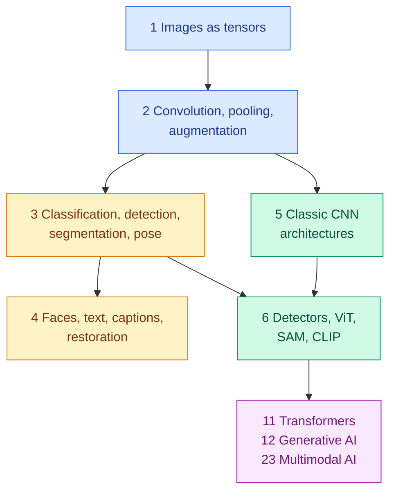

<!-- status: authored -->

# 09. Computer Vision

**Level:** 🟡 Intermediate → 🔴 Advanced &nbsp;|&nbsp; **Effort:** Detailed module &nbsp;|&nbsp; **Status:** ✅ Complete

How machines turn pixels into decisions: image representation, convolution, the task zoo from classification to
restoration, and the architectures from LeNet to vision transformers, Segment Anything and CLIP.

> **Most computer vision failures happen outside the model.** This module measures them: the same trained network
> scoring 0.985 or 0.131 depending only on how its input was prepared; a perfect bounding box scored 0.25 because of
> a box-format mix-up; a segmenter that finds nothing reaching 94% pixel accuracy; a face-verification threshold that
> accepted 1% of impostors among known people and 36% among new ones. Every result is real output from code that
> runs on a laptop CPU in seconds, with no downloads.

---

## 🎯 Learning Objectives

By the end of this module you will be able to:

- Explain an image as a tensor, reason about shapes through a CNN, and keep preprocessing identical from training to
  serving
- **Compute convolution output sizes** from stride, padding, dilation and kernel size, and compute receptive fields
- Say what each vision task outputs and how it is scored — IoU, NMS, average precision, IoU and Dice for masks, PSNR —
  and when each score misleads
- **Pick an architecture appropriate to a vision task and a latency budget**, from counted parameters and MACs and
  measured latency
- Explain detectors, vision transformers, Segment Anything and CLIP, and their characteristic failure modes
- Handle images of people responsibly: privacy, fairness across groups, and the legal limits on face technology

## 📚 Prerequisites

- [08 Deep Learning](../08-deep-learning/README.md) — especially
  [MLPs, CNNs and Recurrent Networks](../08-deep-learning/06-cnns-rnns-and-sequence-models.md), which introduces
  convolution, weight sharing and pooling
- [07 Model Evaluation](../07-model-evaluation/README.md) — precision, recall and thresholds

### Installing the deep-learning stack

This module uses PyTorch and **torchvision**, both pinned in `requirements-dl.txt`:

```bash
pip install -r requirements.txt
pip install -r requirements-dl.txt --index-url https://download.pytorch.org/whl/cpu    # Linux and Windows
pip install -r requirements-dl.txt                                                      # macOS
```

`torchvision==0.29.0` is the release built for `torch==2.14.0`. It is used for the reference implementations of box
IoU and non-maximum suppression, and for the standard architectures — **built without pretrained weights, so nothing
is downloaded**. Parameter and compute counts use PyTorch's *meta device*, which tracks shapes without doing any
arithmetic. Published accuracy figures are read from torchvision's weight metadata.

**No image dataset is downloaded either.** The examples use the 8×8 digits and the two sample photographs that ship
with scikit-learn, and synthetic images generated in the code. As in module 08, training examples use `float64` so the
printed numbers match on any CPU.

---

## 📑 Topics

| # | Topic | Covers | Level |
| --- | --- | --- | --- |
| 1 | [Images as Tensors](01-images-as-tensors-and-preprocessing.md) | Pixels, channels, layouts, memory, uint8 overflow, colour spaces, aliasing, train/serve preprocessing, safe image uploads | 🟢 → 🟡 |
| 2 | [Convolution, Pooling and Augmentation](02-convolution-pooling-and-augmentation.md) | Convolution by hand, output-size formula, receptive fields, pooling, augmentation that helps and hurts | 🟡 |
| 3 | [Classification, Detection, Segmentation and Pose](03-classification-detection-segmentation-and-pose.md) | IoU, box formats, NMS, average precision, semantic/instance/panoptic segmentation, keypoints | 🟡 |
| 4 | [Faces, Text, Captions and Restoration](04-faces-text-captions-and-restoration.md) | Face verification and its law, OCR, captioning and VQA, generation, denoising and super-resolution | 🟡 → 🔴 |
| 5 | [Classic CNN Architectures](05-classic-cnn-architectures.md) | LeNet, AlexNet, VGG, Inception, ResNet, MobileNet, EfficientNet, U-Net, transfer learning | 🟡 → 🔴 |
| 6 | [Detectors, Vision Transformers, SAM and CLIP](06-detectors-vit-sam-and-clip.md) | Faster R-CNN, YOLO, SSD, RetinaNet, DETR, ViT, Segment Anything, CLIP | 🔴 |

---

## 🗺️ How the pieces fit



**Topics 1–2 are the machinery**: what an image is and what a convolution does to it. **Topics 3–4 are the tasks**, and
how each is scored. **Topics 5–6 are the architectures** that solve them, from 1998 to today.

**What this module deliberately does not repeat:** convolution's weight sharing, parameter count and the shift test
are in [module 08](../08-deep-learning/06-cnns-rnns-and-sequence-models.md); residual connections are measured in
[module 08, topic 4](../08-deep-learning/04-vanishing-gradients-normalisation-dropout-and-residuals.md); GANs, VAEs and
diffusion are in [module 08, topics 7–8](../08-deep-learning/07-autoencoders-vaes-and-gans.md); label-destroying
augmentation is in [module 03](../03-data-foundations/07-synthetic-data-augmentation-and-feature-stores.md); attention
is taught once, in [11 Transformers](../11-transformers/README.md).

---

## 🧭 Which topics do you actually need?

| If you are | Read |
| --- | --- |
| New to computer vision | All six, in order |
| Deploying an image model | 1, then 5's transfer-learning section — most production bugs are preprocessing bugs |
| Building a detector or segmenter | 2, 3, 6 |
| Working with faces or people | 3, 4 — including the legal and fairness sections, before writing code |
| Choosing a backbone under a latency budget | 5, 6 |
| Heading for multimodal and generative AI | 4, 6, then [12 Generative AI](../12-generative-ai/README.md) and [23 Multimodal AI](../23-multimodal-ai/README.md) |
| Preparing for interviews | 2, 3, 5 — output sizes, IoU, NMS, mAP and ResNet come up constantly |

---

## 🧪 Every example is verified

Each code block was executed and shows its **real** output, enforced in continuous integration:

```bash
python scripts/check_examples.py --strict 09-computer-vision/
```

Every example was also checked to produce identical output under three different CPU arithmetic kernels. Some results
contradict common assumptions:

- **The same trained CNN scored 0.985 with matching preprocessing and 0.131 on inverted images** — no error raised.
- **Shift augmentation took a CNN from 0.387 to 0.898 on shifted digits; adding horizontal flips made it worse.**
- **A segmenter that predicts nothing scored 94.3% pixel accuracy** — and an IoU of 0.
- **The same eight detections scored 0.967, 0.700 or 0.601 average precision**, depending on the IoU threshold.
- **A face-verification threshold accepted 1% of impostors among known identities and 36% among new ones.**
- **The same ResNet-50 gained 4.8 points of ImageNet accuracy from a better training recipe alone.**
- **A tiny CNN beat a tiny vision transformer by 29 points on 100 images**, and by 6 on 1,257.
- **A toy CLIP asked for "not a seven" returned twenty sevens.**

## 📝 Practice

- Quiz: [`quizzes/09-computer-vision.md`](../quizzes/09-computer-vision.md)
- Answers: [`quizzes/answers/09-computer-vision.md`](../quizzes/answers/09-computer-vision.md)
- Assignments: [`assignments/09-computer-vision.md`](../assignments/09-computer-vision.md)
- Image-generation prompts for these concepts: [`40-visual-learning/image-prompts/`](../40-visual-learning/image-prompts/README.md)

---

## ⚠️ The five mistakes this module exists to prevent

1. **Preprocessing that differs between training and serving.** Resize method, channel order, value range,
   normalisation and orientation must be one shared, versioned function.
2. **Reporting the flattering metric.** Pixel accuracy on imbalanced masks, AP50 compared with COCO AP, per-character
   OCR accuracy — each hid a failure in this module.
3. **Augmentation that changes the label.** Every augmentation claims the label is unchanged; check the claim.
4. **Choosing a model by leaderboard accuracy.** Count MACs, measure latency on the target device, and evaluate on
   slices of your own data.
5. **Treating face and person analysis as an ordinary feature.** It is regulated, its errors differ across groups,
   and it needs legal review before any code is written.

---

## 📚 Official References

- [torchvision documentation — PyTorch Foundation](https://pytorch.org/vision/stable/models.html) — verified 2026-09-19
- [CS231n: Deep Learning for Computer Vision, course notes — Stanford University](https://cs231n.github.io/convolutional-networks/) — verified 2026-09-19
- [Dive into Deep Learning, computer vision — Zhang, Lipton, Li and Smola](https://d2l.ai/chapter_computer-vision/index.html) — verified 2026-09-19; community-maintained open textbook
- [COCO detection evaluation — COCO Consortium](https://cocodataset.org/#detection-eval) — verified 2026-09-19

---

## 🔗 Navigation

[← 08 Deep Learning](../08-deep-learning/README.md) &nbsp;|&nbsp;
[🏠 Repository Home](../README.md) &nbsp;|&nbsp;
[Topic 1: Images as Tensors →](01-images-as-tensors-and-preprocessing.md)

**Next module:** [10 Natural Language Processing](../10-natural-language-processing/README.md)
