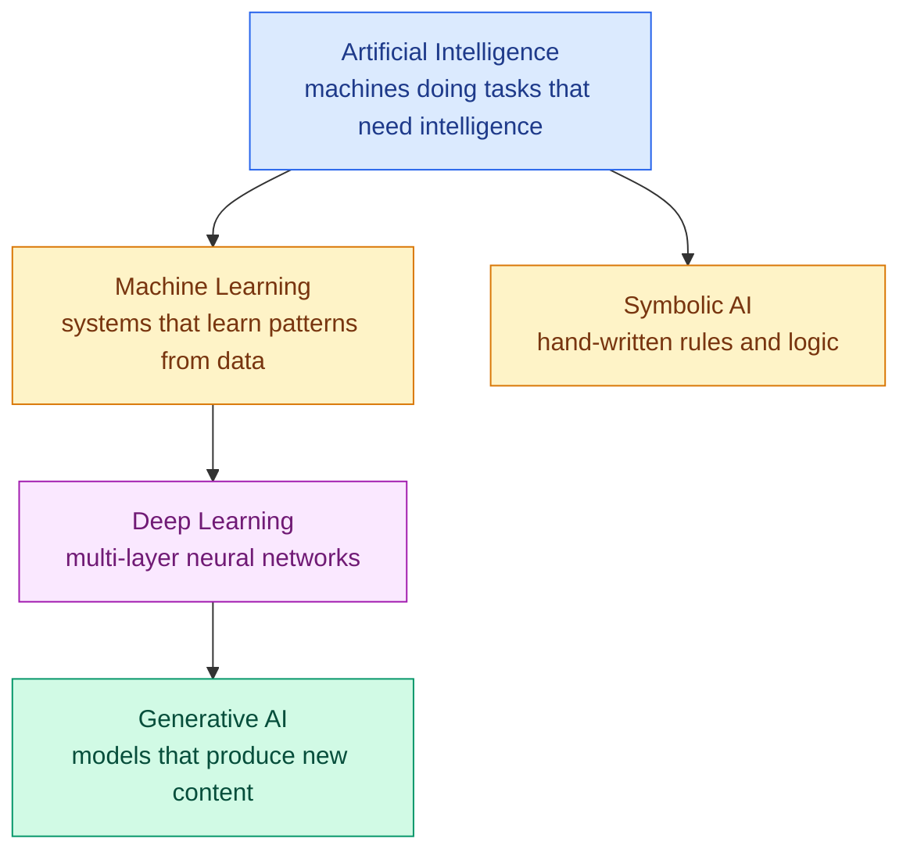
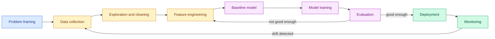

# Bank 1 — AI & ML Fundamentals

**Level:** 🟢 Beginner &nbsp;|&nbsp; **Effort:** Short module &nbsp;|&nbsp; **Questions:** 20

The questions that open almost every AI or Machine Learning (ML) interview. They look easy, which
is precisely why they are diagnostic — a definition-only answer marks you as a course graduate, and
a mechanism-plus-trade-off answer marks you as someone who has shipped.

Attempt each question out loud before opening the answer.

---

## The landscape, in one diagram

Draw this if you are asked "how do AI, ML, deep learning and Generative AI relate?" — it answers
the question faster than three sentences.

The point most candidates miss: **Symbolic AI is AI but not ML.** Mentioning it proves you
understand the containment relationship rather than reciting a nested-circles picture.

---

## Basics

<b>Q1. What is the difference between AI, Machine Learning, Deep Learning and Generative AI?</b>

**Artificial Intelligence (AI)** is the broad goal: machines performing tasks we associate with
human intelligence. It includes approaches that do no learning at all — a chess engine using tree
search, or an expert system built from hand-written rules.

**Machine Learning (ML)** is the subset where the system learns the rules from data instead of being
given them. You supply examples; the algorithm infers the mapping.

**Deep Learning (DL)** is the subset of ML using neural networks with many layers. What it buys you
is automatic feature learning: instead of hand-engineering "edge detector" features for images, the
network learns them.

**Generative AI** is the subset of deep learning that produces new content — text, images, audio,
code — rather than a label or a number.

**The trade-off that matters:** as you move inward you gain capability and lose interpretability
and data efficiency. A logistic regression on 500 rows can be audited line by line. A large
language model cannot be, and needed a corpus you could not assemble yourself.

**Interview tip:** name Symbolic AI. It proves you know AI ⊃ ML rather than AI = ML.

→ [04 AI Foundations](../04-ai-foundations/README.md)

<b>Q2. What are the main types of machine learning?</b>

**Supervised** — labelled data; learn the input-to-output mapping. Spam detection, house-price
prediction, medical image classification. Most production ML is this, because labels are what make
the business value measurable.

**Unsupervised** — no labels; find structure. Customer segmentation, anomaly detection,
dimensionality reduction.

**Semi-supervised** — a small labelled set plus a large unlabelled one. Common in practice, because
labelling is the expensive part.

**Self-supervised** — labels generated from the data itself: predict a masked word, predict the next
token. This is how large language models are pretrained, and it is the reason they can use the
entire internet as training data without a single human annotator.

**Reinforcement learning** — learn from reward signals through interaction. Robotics, game playing,
and the alignment stage of language models.

**The distinction people get wrong:** self-supervised is often called unsupervised in older
material. It is not — there *are* labels, the data just generates them. Saying this correctly is a
small but reliable signal.

→ [05 Machine Learning](../05-machine-learning/README.md)

<b>Q3. Explain overfitting and underfitting.</b>

**Overfitting** — the model memorised the training data including its noise. Training error is
excellent, validation error is poor, and the gap between them is the symptom.

**Underfitting** — the model is too simple to represent the pattern. Both training and validation
error are poor.

**How I diagnose it:** plot training and validation loss against epochs or training-set size.

- Both high, converged → underfitting. Add capacity or better features.
- Training low, validation high and diverging → overfitting. Add data, add regularisation, reduce
  capacity, or stop earlier.
- Both low and close → you are done, unless the validation set is leaking.

**The subtlety worth mentioning:** a big train-validation gap is not automatically overfitting. It
can be distribution shift between the splits — for example a random split on time-series data,
where the model has effectively seen the future.

→ [07 Model Evaluation](../07-model-evaluation/README.md)

<b>Q4. What is the bias-variance trade-off?</b>

Total error decomposes into bias, variance and irreducible noise.

**Bias** is error from wrong assumptions — the model is too rigid to capture the truth. Fitting a
straight line to a curve.

**Variance** is error from sensitivity to the particular training sample — retrain on a different
sample and you get a substantially different model.

Classically these trade off: increasing model complexity lowers bias and raises variance.

**Where I'd add nuance:** the classical U-shaped curve is not the whole story for modern
overparameterised networks, where test error can *decrease again* past the interpolation point —
the double-descent phenomenon. You do not need to explain it in depth, but knowing the classical
picture has limits distinguishes you from someone reciting a textbook figure.

**Practically:** ensembles like random forests attack variance (averaging many high-variance trees);
boosting attacks bias (sequentially correcting a weak learner's errors). Knowing which lever a
technique pulls is the useful form of this knowledge.

→ [07 Model Evaluation](../07-model-evaluation/README.md)

<b>Q5. Why split data into training, validation and test sets?</b>

**Training** — the model learns from it.
**Validation** — you make decisions with it: hyperparameters, architecture, when to stop.
**Test** — touched once, at the end, to estimate real-world performance.

The reason for three rather than two: every decision you make using the validation set leaks a
little information into the model. Tune fifty hyperparameter combinations against validation and
your validation score is now optimistic — you have selected for what fits that particular sample.
The test set is the only honest number left.

**The discipline point:** if you look at the test set and then change anything, it is no longer a
test set. In practice this is violated constantly, which is one reason published benchmark
improvements often do not transfer.

**For time-series data**, random splits are wrong entirely — you must split chronologically, or the
model trains on the future and predicts the past.

→ [03 Data Foundations](../03-data-foundations/README.md)

<b>Q6. What is data leakage, and why is it the most expensive beginner mistake?</b>

Leakage is information reaching the model at training time that will not be available at prediction
time. The result is excellent offline metrics and a model that collapses in production.

**The four ways it usually happens:**

1. **Target leakage** — a feature is a proxy for the label. Predicting customer churn using
   `account_closed_date`. You will get near-perfect scores and a useless model.
2. **Train-test contamination** — fitting a scaler, imputer or encoder on the full dataset before
   splitting, so test statistics bleed into training. Fix: fit transformers inside the pipeline, on
   training folds only.
3. **Temporal leakage** — a random split on time-ordered data.
4. **Group leakage** — the same patient, user or device appearing in both train and test. Use
   grouped splitting.

**How I catch it:** if a model performs suspiciously well, I treat that as a bug report, not a
success. I check feature importances first — a single feature dominating is the classic signature.

→ [03 Data Foundations](../03-data-foundations/README.md)

<b>Q7. Walk me through the machine-learning lifecycle.</b>

Two things to say out loud that most candidates omit:

**It is a loop, not a line.** Monitoring feeds back into data collection. A model that is never
retrained degrades, because the world moves.

**Problem framing is the highest-leverage step and gets the least time.** Deciding whether churn
means "cancelled subscription" or "no login in 30 days" changes the entire project. I have seen
more projects fail on a bad target definition than on a bad algorithm choice.

→ [05 Machine Learning](../05-machine-learning/README.md)

<b>Q8. What is the difference between a parameter and a hyperparameter?</b>

A **parameter** is learned from data during training — the weights in a neural network, the
coefficients in a linear regression, the split thresholds in a decision tree.

A **hyperparameter** is set by you before training — learning rate, number of trees, network depth,
regularisation strength, number of clusters in k-means.

**The practical distinction:** parameters are optimised by gradient descent or an equivalent;
hyperparameters are optimised by search (grid, random or Bayesian) evaluated on the validation set.

**The follow-up they usually ask:** "which hyperparameter matters most?" For neural networks,
learning rate, by a wide margin — it can be the difference between converging and diverging. For
gradient-boosted trees, the interaction between learning rate and number of estimators. Saying
"learning rate" confidently and explaining why is a strong signal.

<b>Q9. What is regularisation and when do you use it?</b>

Any technique that discourages the model from fitting noise, usually by penalising complexity.

**L2 (ridge)** adds a penalty on squared weights. Shrinks all weights toward zero without
eliminating them. Use when you believe most features contribute a little.

**L1 (lasso)** penalises absolute weights, which drives some to exactly zero — so it performs
feature selection. Use when you believe most features are irrelevant and you want a sparse,
interpretable model.

**Elastic Net** combines both, which handles correlated feature groups better than L1 alone.

**In deep learning:** dropout, weight decay, early stopping, data augmentation, and batch
normalisation as a side-effect.

**The trade-off:** every regulariser increases bias to reduce variance. Over-regularise and you have
turned an overfitting problem into an underfitting one. The validation curve tells you which side
of the trade you are on.

→ [07 Model Evaluation](../07-model-evaluation/README.md)

<b>Q10. How do you handle missing data?</b>

First, ask **why** it is missing — the mechanism determines the correct treatment:

- **Missing completely at random** — no relationship to anything. Safe to impute or drop.
- **Missing at random** — explained by other observed variables. Impute conditionally.
- **Missing not at random** — the missingness itself carries information. High earners declining to
  state income is a signal, not noise.

**Options, in rough order of sophistication:**

1. Drop rows — only if the loss is small and the missingness is random.
2. Drop the column — if most values are missing and it is not important.
3. Simple imputation — mean, median, mode. Median resists outliers.
4. Model-based imputation — k-nearest neighbours or iterative imputation.
5. **Add a missingness indicator column** — often the highest-value step, because it lets the model
   use the fact of absence.
6. Use a model that handles missingness natively — LightGBM and XGBoost do.

⚠️ **The mistake interviewers watch for:** imputing before splitting. Compute imputation statistics
on the training fold only, inside a pipeline. Otherwise you have leaked test information.

→ [06 Feature Engineering](../06-feature-engineering/README.md)

---

## Conceptual

<b>Q11. When should you NOT use machine learning?</b>

An underrated question, and answering it well signals judgement.

**Do not use ML when:**

- **Rules work.** If the logic is "flag transactions over £10,000 from a new country", write the
  rule. It is auditable, instant, free and correct.
- **You have no data**, or no labels, and cannot get them affordably.
- **Errors are unacceptable and unexplainable.** Some regulated decisions need deterministic,
  auditable logic.
- **The relationship is not stable.** If the pattern changes faster than you can retrain, you are
  building a treadmill.
- **The cost of being wrong exceeds the value of being right.** Run the arithmetic before the model.
- **A human does it fine at current volume.** Automating ten decisions a day is rarely worth an ML
  pipeline plus its maintenance.

**The framing to use:** ML is appropriate when the pattern is real, learnable, stable enough,
economically valuable, and too complex to write by hand. Miss any one and you should reconsider.

<b>Q12. What is the curse of dimensionality?</b>

As dimensions increase, the volume of the space grows exponentially, so any fixed number of data
points becomes increasingly sparse within it.

**Three consequences that matter practically:**

1. **Distance loses meaning.** In high dimensions, the distance to your nearest and furthest
   neighbours converges. This breaks k-nearest neighbours and clustering — and is why raw
   high-dimensional distance-based methods disappoint.
2. **Data requirements explode.** To maintain the same density you need exponentially more samples.
3. **Overfitting becomes trivially easy.** With enough dimensions you can separate any training set
   perfectly and learn nothing.

**Mitigations:** dimensionality reduction (Principal Component Analysis, Uniform Manifold
Approximation and Projection), feature selection, regularisation, and embeddings that map to a
lower-dimensional space where distance is meaningful again.

**The interesting caveat to raise:** embeddings from a language model may be 768 or 1536
dimensional, and cosine similarity works fine on them. That is because real data lies on a
much lower-dimensional manifold within that space — the *effective* dimensionality is far lower
than the nominal one.

→ [02 Mathematics for AI](../02-mathematics-for-ai/README.md)

<b>Q13. Explain the difference between correlation and causation, and why it matters in ML.</b>

Correlation means two variables move together. Causation means intervening on one changes the other.

**Why it matters for ML specifically:** a predictive model learns correlations, and that is fine as
long as you only ever *predict*. The moment someone uses your model to decide an *action*, you have
silently switched to a causal question that the model was never trained to answer.

**The canonical failure:** a hospital model learns that asthma patients with pneumonia have lower
mortality risk. Correct, in the data. The cause is that asthma patients get admitted to intensive
care immediately. Using that model to decide who *needs* intensive care would kill people.

**How to say it in an interview:** "Prediction and intervention are different questions. If the
stakeholder wants to know 'what will happen', a predictive model is right. If they want 'what should
we do', I need an experiment, or causal inference on observational data with the confounders
explicitly modelled."

→ [25 Causal AI](../25-causal-ai/README.md)

<b>Q14. What is transfer learning and why did it change the field?</b>

Taking a model trained on one task and reusing it for another, either as a fixed feature extractor
or by fine-tuning some layers.

**Why it works:** early layers learn general features. In vision, the first layers learn edges and
textures — useful for any image task. In language, early layers learn syntax and general semantics.
Only the later layers are task-specific.

**Why it changed the field:** it collapsed the data requirement. Training an image classifier from
scratch might need a million labelled images. Fine-tuning a pretrained backbone can work with a few
thousand, sometimes a few hundred. That put deep learning within reach of organisations without
internet-scale data — which is nearly all of them.

**The modern form** is the entire foundation-model paradigm: pretrain once at enormous cost, adapt
cheaply many times. Every time you fine-tune with Low-Rank Adaptation (LoRA), you are doing transfer
learning.

**Trade-off:** you inherit the base model's biases and blind spots along with its capability, and
domain mismatch can make it worse than training from scratch — a model pretrained on natural photos
transfers poorly to medical scans.

→ [17 Fine-Tuning](../17-fine-tuning/README.md)

<b>Q15. What is the difference between batch, mini-batch and stochastic gradient descent?</b>

They differ only in how many samples you use to estimate the gradient before each update.

| Variant | Samples per step | Gradient quality | Speed | Memory |
| --- | --- | --- | --- | --- |
| Batch | All | Exact | Slow per step | High |
| Stochastic | 1 | Very noisy | Fast per step | Low |
| Mini-batch | 32–512 typically | Good estimate | Best throughput | Moderate |

**Mini-batch wins in practice** for two reasons. First, it uses hardware properly — GPUs are built
for parallel matrix operations, and a batch of 1 wastes them. Second, the noise is genuinely useful:
it helps escape sharp local minima and acts as a mild regulariser.

**The trade-off to name:** larger batches give more stable gradients but generalise slightly worse
in many settings, and they need a proportionally scaled learning rate. That relationship — batch
size and learning rate move together — is the kind of detail that signals hands-on experience.

→ [08 Deep Learning](../08-deep-learning/README.md)

---

## Practical & scenario

<b>Q16. Your model gets 99% accuracy. Your manager is delighted. What do you say?</b>

"Let me verify that before we celebrate" — and then check three things, in order:

**1. Class balance.** If 99% of transactions are legitimate, a model predicting "legitimate" always
scores 99% and catches zero fraud. Check the confusion matrix, and report precision and recall per
class rather than accuracy.

**2. Data leakage.** Look for a feature that encodes the answer. Feature importance dominated by one
column is the signature. Check whether any feature could only be known *after* the event you are
predicting.

**3. Evaluation error.** Are you scoring on training data? Did preprocessing run before splitting?
Do the same entities appear on both sides of the split?

**The framing that lands well:** "Unusually good results are a bug report until proven otherwise.
In my experience, 99% on a first attempt is leakage roughly nine times out of ten."

Then propose the honest metric: for imbalanced problems, precision at a fixed recall tied to what
the business can actually action — if the review team can handle 100 cases a day, that is the
operating point that matters.

→ [07 Model Evaluation](../07-model-evaluation/README.md)

<b>Q17. A stakeholder asks for "an AI that predicts customer churn". What do you ask before writing any code?</b>

**Definition questions:**
- What counts as churn? Cancelled subscription, or no activity for 30 days? These are different
  problems with different label distributions.
- Over what horizon — will they churn in the next 30 days, 90 days, ever?

**Action questions (the most important ones):**
- What will you *do* with a prediction? If there is no intervention, the model has no value.
- How many customers can you actually contact per week? This sets the operating point far more than
  any metric optimisation does.
- What does a retention offer cost, and what is a retained customer worth? This turns the
  precision-recall trade-off into arithmetic instead of taste.

**Data questions:**
- What history exists, and is it labelled?
- Which features will be available at prediction time? (Leakage prevention, asked early.)

**Success questions:**
- How will we know this worked? If nobody can answer, propose a holdout group so retention lift is
  measurable rather than assumed.

**Why this scores well:** it shows you understand that the metric follows from the business
constraint, not the other way round. A model optimised for the wrong operating point is a very
expensive way to be precise about nothing.

<b>Q18. How would you explain a model's prediction to a non-technical stakeholder?</b>

**Start with the decision, not the model.** "We flagged this customer as high-risk for churn."

**Give the top drivers in their language.** "Three things drove that: they've contacted support four
times this month, their usage dropped 60% since the price change, and they're on a monthly rather
than annual plan." Feature importance methods such as SHapley Additive exPlanations (SHAP) give you
this per-prediction.

**Give the confidence honestly.** "Of customers we flag this strongly, about 70% do churn within 90
days. That means roughly three in ten of these are false alarms."

**State the limitation.** "This model can't see anything happening outside our platform — if they're
leaving because a competitor called them, we won't know."

**What to avoid:** the words "the algorithm decided", any mention of architecture, and false
certainty. Stakeholders make better decisions with an honest probability than with a confident
label.

→ [27 Explainable AI](../27-explainable-ai/README.md)

<b>Q19. Your model worked well for six months and is now performing badly. Walk me through your diagnosis.</b>

I would check in this order, because it goes cheapest-to-diagnose first:

**1. Is it actually the model?** Check upstream first. A changed schema, a broken ETL job, a renamed
category, or a unit change (cents to pounds) will look exactly like model degradation and is far
more common. Compare feature distributions today against training.

**2. Data drift.** The inputs have shifted — new customer demographics, a new product line, a
seasonal pattern the model never saw. Detectable by comparing input distributions; a
population-stability index or Kolmogorov-Smirnov test per feature is standard.

**3. Concept drift.** The inputs look the same but the relationship changed. Harder — you only see
it in the label-dependent metrics, which means you need ground truth, which usually arrives late.
This is where a delayed-feedback monitoring design earns its keep.

**4. Feedback loops.** The model changed the world it predicts. A recommender that only shows
popular items generates data proving popular items get clicked. This is self-inflicted and easy to
miss.

**5. Adversarial adaptation.** In fraud and spam, the adversary adapts specifically because your
model works.

**The answer they want at the end:** "and that's why I'd have drift monitoring and a scheduled
retraining trigger from day one, rather than discovering this six months later from a stakeholder
complaint."

→ [29 MLOps](../29-mlops/README.md)

<b>Q20. How do you decide between a simple model and a complex one?</b>

**Always start simple.** Logistic regression or gradient-boosted trees as a baseline, always. Not
because simple is virtuous, but because you cannot know whether complexity helped without a number
to beat.

**Then ask what complexity would buy:**

- If the baseline is already at the business threshold, stop. Ship it.
- If the gap is large and the data is structured/tabular, gradient boosting is usually the ceiling —
  deep learning rarely beats it on tabular data, which is a fact worth stating because many
  candidates assume the opposite.
- If the data is unstructured (images, text, audio), deep learning is not optional.

**The costs of complexity to name explicitly:**

| Cost | Why it bites |
| --- | --- |
| Inference latency | May not fit the latency budget |
| Infrastructure | GPUs, serving complexity, more failure modes |
| Interpretability | May be a regulatory blocker, not a preference |
| Debugging | Harder to diagnose when it goes wrong at 3am |
| Retraining cost | Affects how often you *can* refresh it |

**The line that lands:** "A 2% accuracy improvement that turns a 20-millisecond CPU model into a
200-millisecond GPU model is usually a bad trade — unless someone can show me the 2% is worth more
than the latency and the running cost. That's a business question, and I'd want it answered before
I build it."

---

## ✅ Key takeaways

- Every fundamentals answer should contain a trade-off. Definitions alone read as coursework.
- Suspiciously good results are a bug report. Say so before someone else does.
- Name the mechanism *and* what it costs *and* when it breaks *and* how you would measure it.
- Business framing beats technical depth in the early rounds — "what will you do with the
  prediction" is a stronger question than any algorithm choice.
- Knowing when *not* to use ML signals more seniority than knowing one more algorithm.

## 📚 Official References

- [Google Machine Learning Glossary — Google](https://developers.google.com/machine-learning/glossary) — verified 2026-07-27
- [scikit-learn: Underfitting vs Overfitting — scikit-learn developers](https://scikit-learn.org/stable/auto_examples/model_selection/plot_underfitting_overfitting.html) — verified 2026-07-27
- [scikit-learn: Cross-validation — scikit-learn developers](https://scikit-learn.org/stable/modules/cross_validation.html) — verified 2026-07-27
- [scikit-learn: Imputation of missing values — scikit-learn developers](https://scikit-learn.org/stable/modules/impute.html) — verified 2026-07-27
- [NumPy Documentation — NumPy developers](https://numpy.org/doc/stable/) — verified 2026-07-27

---

[← Module home](README.md) &nbsp;|&nbsp; [Bank 2: Classical ML & Evaluation →](02-classical-ml-and-evaluation.md)
