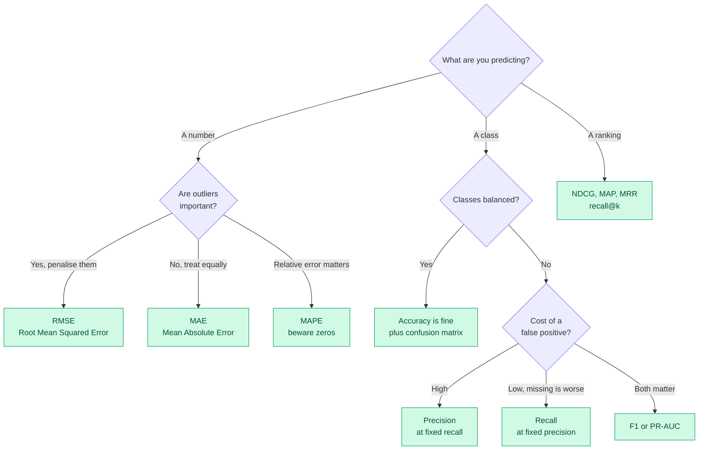

# Bank 2 — Classical Machine Learning & Evaluation

**Level:** 🟡 Intermediate &nbsp;|&nbsp; **Effort:** Detailed module &nbsp;|&nbsp; **Questions:** 20

Algorithms, metrics and validation. This is the bank that separates people who ran
`model.fit()` from people who know why the number came out that way.

Metric questions dominate real interviews because metric mistakes are the most expensive mistakes,
and they are invisible until production.

---

## Choosing a metric — the decision you will be asked to defend

**The sentence that wins this question:** *"The metric follows from the cost of each error type,
which is a business question — so before I choose one, what does a false positive cost you compared
to a false negative?"*

---

## Metrics

<b>Q1. Explain precision and recall, and when each matters more.</b>

From a confusion matrix of True Positives (TP), False Positives (FP), True Negatives (TN) and False
Negatives (FN):

- **Precision** = TP / (TP + FP) — of everything I flagged, how much was right?
- **Recall** = TP / (TP + FN) — of everything that was actually positive, how much did I catch?

**Precision matters more when acting on a positive is costly.** Spam filtering: a false positive
sends a real invoice to the junk folder, and users lose trust in the product permanently. You would
rather let some spam through.

**Recall matters more when missing a positive is costly.** Cancer screening: a false negative
means a missed diagnosis. You accept extra false positives because the follow-up test is cheap
relative to a missed tumour.

**The trade-off is a dial, not a property of the model.** Both come from a threshold on a score.
Lower the threshold and recall rises while precision falls. This is why "what's your model's
precision?" is an incomplete question — precision *at what recall?*

**How to demonstrate seniority:** tie the threshold to capacity. "The fraud team can review 200
cases a day, so I'd set the threshold to produce roughly 200 alerts and then maximise precision at
that volume. Optimising F1 in the abstract would give a threshold nobody can staff."

→ [07 Model Evaluation](../07-model-evaluation/README.md)

<b>Q2. When is accuracy a misleading metric?</b>

**Class imbalance** — the headline case. With 0.1% fraud, predicting "not fraud" always gives
99.9% accuracy and zero business value. Accuracy is dominated by the majority class.

**Unequal error costs** — accuracy weights a false positive and a false negative identically, which
is almost never true in reality. Approving a fraudulent loan and declining a good customer have
wildly different costs.

**Multi-class with unequal support** — high overall accuracy can hide total failure on a small but
important class.

**Threshold dependence** — accuracy is measured at one threshold, usually 0.5 by default, which is
rarely the right operating point.

**What to report instead:** the confusion matrix always, plus precision, recall and F1 per class,
plus Precision-Recall Area Under the Curve (PR-AUC) for imbalanced problems. And where possible, a
cost-weighted metric using the actual business costs — that converts an argument about metrics into
arithmetic.

→ [07 Model Evaluation](../07-model-evaluation/README.md)

<b>Q3. ROC-AUC versus PR-AUC — which and when?</b>

**Receiver Operating Characteristic Area Under the Curve (ROC-AUC)** plots true-positive rate
against false-positive rate. It equals the probability that a random positive scores above a random
negative. It is threshold-independent and insensitive to class balance.

**Precision-Recall AUC (PR-AUC)** plots precision against recall.

**The key difference:** the false-positive rate has the number of true negatives in its denominator.
When negatives massively outnumber positives, a large absolute number of false positives barely
moves the false-positive rate — so ROC-AUC looks flattering. PR-AUC has no such cushion.

**Concretely:** 1,000 positives and 1,000,000 negatives. Your model returns 1,000 true positives and
10,000 false positives. False-positive rate is 1%, so ROC-AUC looks excellent. Precision is 9%, so
91% of your alerts are wrong and the review team hates you. PR-AUC tells that story; ROC-AUC hides it.

**Rule I'd state:** balanced classes and both classes equally interesting → ROC-AUC. Heavy imbalance
and you care about the positive class → PR-AUC.

→ [07 Model Evaluation](../07-model-evaluation/README.md)

<b>Q4. Explain cross-validation and when the standard k-fold is wrong.</b>

**k-fold cross-validation** splits data into k parts, trains on k−1 and validates on the remaining
one, rotating k times and averaging. It gives a more stable performance estimate than a single split
and uses all data for both roles.

**When plain k-fold is wrong:**

| Situation | Use instead | Why |
| --- | --- | --- |
| Imbalanced classes | Stratified k-fold | Otherwise a fold may contain almost no positives |
| Time series | `TimeSeriesSplit` / rolling origin | Random folds train on the future |
| Grouped data (patients, users, devices) | `GroupKFold` | The same entity in train and test leaks |
| Very large datasets | A single large holdout | k-fold cost is not worth the variance reduction |
| Very small datasets | Leave-one-out | Maximises training data, at high variance and cost |

**The nested-CV point worth raising:** if you tune hyperparameters using cross-validation and then
report that same cross-validation score, it is optimistic — you selected for that split. Nested
cross-validation (an inner loop for tuning, an outer loop for estimation) fixes it. It is expensive
and often skipped, and knowing *why* it exists is a good signal.

→ [07 Model Evaluation](../07-model-evaluation/README.md)

<b>Q5. What is stratified sampling and why does it matter?</b>

Sampling that preserves the class proportions of the full dataset in every split.

**Why it matters:** with 2% positives and a random 80/20 split, chance alone can give one fold
0.5% positives and another 4%. Your cross-validation scores then vary because of split luck rather
than model quality, and on small datasets a fold can contain zero positives, which makes some
metrics undefined.

**Where else it applies:** stratify by any variable whose distribution you need preserved — region,
time period, device type. If your test set is 90% desktop and production traffic is 60% mobile,
your evaluation is measuring the wrong population.

**One line to add:** "I'd also check that the split is stratified on anything the business cares
about segmenting by, because an aggregate metric can hide a segment where the model is useless."

<b>Q6. Your regression model has R-squared of 0.95. Is it good?</b>

Not necessarily, and there are five ways it can mislead.

**1. R-squared always rises when you add features**, even random ones. Use adjusted R-squared to
penalise parameter count.

**2. It says nothing about error magnitude in useful units.** R-squared of 0.95 predicting house
prices could mean a mean absolute error of £5,000 or £50,000 depending on price variance. Always
report an absolute error metric alongside it.

**3. It can be high with structured residuals.** Plot residuals against predictions. A pattern means
the model is systematically wrong somewhere — often at the extremes, which is often where the
business cares most.

**4. On time series, it is frequently an illusion.** A model predicting "tomorrow ≈ today" scores a
superb R-squared and adds no information. Compare against a naive persistence baseline.

**5. It may be leakage.** Same diagnosis as any suspiciously good result.

**The answer that lands:** "R-squared of 0.95 tells me the model explains most of the variance. It
doesn't tell me whether the remaining error is affordable. I'd want the mean absolute error in
pounds, a residual plot, and the score of the dumbest possible baseline for comparison."

---

## Algorithms

<b>Q7. Explain the difference between bagging and boosting.</b>

Both are ensembles; they attack different halves of the error decomposition.

**Bagging (Bootstrap Aggregating)** trains many models **in parallel** on bootstrap samples and
averages them. Each model is high-variance, low-bias; averaging cancels the variance. Random forest
adds random feature subsetting per split to decorrelate the trees further.

**Boosting** trains models **sequentially**, each correcting its predecessor's errors. Each model is
weak (a shallow tree); the ensemble reduces bias. AdaBoost reweights misclassified samples; gradient
boosting fits the next tree to the residual gradient.

| | Bagging | Boosting |
| --- | --- | --- |
| Attacks | Variance | Bias |
| Training | Parallel | Sequential |
| Base learners | Deep, high-variance | Shallow, weak |
| Overfitting risk | Low, robust | Higher, needs early stopping |
| Tuning sensitivity | Forgiving | Sensitive to learning rate |
| Wins on tabular data | Rarely | Usually |

**What to say if pushed:** "Random forest is my safe default when I want something that works
without much tuning. Gradient boosting — XGBoost, LightGBM or CatBoost — is my default when I want
the best tabular result and can afford to tune. Boosting will overfit if I let it, which is why
early stopping on a validation set is not optional."

→ [05 Machine Learning](../05-machine-learning/README.md)

<b>Q8. How does a decision tree decide where to split?</b>

At each node it evaluates candidate splits and picks the one that most reduces impurity in the
resulting children.

**For classification**, impurity is Gini impurity or entropy. Both are minimised when a node
contains a single class. Gini is slightly cheaper to compute and is the common default; the choice
rarely changes results materially.

**For regression**, it minimises variance (equivalently, mean squared error) within the children.

The process is greedy and recursive: it takes the locally best split without lookahead, which is why
a tree is not guaranteed to be globally optimal.

**Why they overfit:** left unconstrained, a tree grows until every leaf is pure — memorising the
training set. Controlled by max depth, minimum samples per leaf, minimum impurity decrease, or
post-pruning.

**A detail worth mentioning:** impurity-based feature importance is biased towards high-cardinality
features, because they offer more split points and can look informative by chance. Permutation
importance avoids this bias, and knowing that distinction is a strong signal.

→ [05 Machine Learning](../05-machine-learning/README.md)

<b>Q9. When would you use logistic regression over gradient boosting?</b>

Gradient boosting usually wins on raw predictive performance for tabular data. Logistic regression
wins when other things matter more:

- **Interpretability is a requirement, not a preference.** Regulated lending and clinical decisions
  often need a model whose coefficients can be explained and audited. A monotonic, additive model is
  defensible in a way a 500-tree ensemble is not.
- **Very small data.** With a few hundred rows, boosting overfits and the simple model generalises.
- **Extreme latency or memory constraints.** A logistic regression is a dot product — microseconds,
  trivially deployable to the edge.
- **Well-calibrated probabilities matter.** Logistic regression optimises log loss directly and
  produces calibrated outputs by construction. Tree ensembles typically need Platt scaling or
  isotonic regression to be trustworthy as probabilities.
- **You need a baseline.** Always. It tells you what the complexity of boosting actually bought.

**The strong version of this answer:** "If logistic regression gets 0.82 area under the curve and
boosting gets 0.84, I'd want someone to tell me that 0.02 is worth the interpretability loss and the
extra operational surface before I ship the ensemble."

<b>Q10. Explain how k-means works and its main limitations.</b>

**Mechanism:** choose k, initialise k centroids, then alternate — assign each point to its nearest
centroid, recompute each centroid as the mean of its members — until assignments stop changing.

**Limitations, and this is the part they are testing:**

1. **You must choose k in advance.** The elbow method and silhouette score help, but neither is
   decisive, and the "right" k is often a business question rather than a mathematical one.
2. **It assumes spherical, similarly sized clusters.** Elongated or nested structures break it —
   DBSCAN or spectral clustering handle those.
3. **It is sensitive to initialisation.** k-means++ initialisation mitigates this substantially;
   plain random initialisation can converge somewhere poor.
4. **It is sensitive to scale.** A feature measured in thousands dominates the distance. Always
   standardise first — this is the mistake most often made in practice.
5. **Outliers pull centroids** because the mean is not robust. k-medoids is more resistant.
6. **Every point gets assigned**, whether it belongs anywhere or not. There is no "none of these"
   option, unlike DBSCAN's noise label.

**Practical framing:** "k-means is fast and a fine first pass. If the clusters don't look sensible
to a domain expert, that's usually a sign the geometry assumption is wrong, not that I need a bigger
k."

→ [05 Machine Learning](../05-machine-learning/README.md)

<b>Q11. What is Principal Component Analysis, and when should you not use it?</b>

Principal Component Analysis (PCA) finds orthogonal directions of maximum variance and projects data
onto the top few, reducing dimensionality while retaining as much variance as possible.

**Uses:** compression, noise reduction, visualisation, and decorrelating features for models that
struggle with multicollinearity.

**When not to use it:**

- **When you need interpretability.** "Component 1" is a weighted mixture of every original feature.
  You have traded meaning for compactness.
- **When variance is not the signal.** PCA maximises variance, which is not the same as maximising
  usefulness for your target. A low-variance feature can be the most predictive one. Partial least
  squares or supervised selection is the right tool if the target should guide the projection.
- **When relationships are non-linear.** PCA is a linear projection. Uniform Manifold Approximation
  and Projection (UMAP) or t-distributed Stochastic Neighbour Embedding (t-SNE) capture non-linear
  structure — though those two are for visualisation, not as a preprocessing step for a downstream
  model.
- **When you have not standardised.** PCA on unscaled data is dominated by whichever feature happens
  to have the largest units.

**The trap question that follows:** "Can you use t-SNE output as model features?" No. t-SNE does not
preserve global structure or distances, and it has no consistent transform for new points. It is a
visualisation, and treating a t-SNE plot's apparent cluster sizes or distances as meaningful is a
common misreading.

→ [02 Mathematics for AI](../02-mathematics-for-ai/README.md)

---

## Data & features

<b>Q12. How do you handle class imbalance?</b>

Work through the options in this order, cheapest first:

**1. Do nothing yet — change the metric.** Much apparent "imbalance trouble" is really "wrong
metric". Switch to precision/recall and PR-AUC and the problem may disappear.

**2. Adjust the decision threshold.** Do not use 0.5 by default. Choose the threshold from the
precision-recall curve at the operating point the business can staff. This is free and usually the
highest-value step.

**3. Class weights.** Most scikit-learn estimators accept `class_weight='balanced'`, which reweights
the loss. No data is invented or discarded.

**4. Resampling.** Undersample the majority (loses information, but fine when you have plenty) or
oversample the minority. Synthetic Minority Over-sampling Technique (SMOTE) interpolates new
minority examples.

⚠️ **The critical detail interviewers listen for: resample the training fold only, never the
validation or test set.** Resampling before splitting is leakage, and SMOTE applied before splitting
creates synthetic points from test data. Your metrics will be meaningless and beautiful.

**5. Reframe as anomaly detection.** With extreme imbalance — below roughly 0.1% — one-class methods
or isolation forests can beat supervised classification.

**6. Collect more minority data**, if you can. Usually the best answer and usually unavailable.

→ [06 Feature Engineering](../06-feature-engineering/README.md)

<b>Q13. Walk me through encoding categorical variables.</b>

| Method | Best for | Watch out for |
| --- | --- | --- |
| **One-hot** | Low cardinality, no order, linear models | Dimension explosion at high cardinality |
| **Ordinal** | Genuine order (small/medium/large) | Implying order where none exists |
| **Target/mean** | High cardinality with tree models | **Leakage** — must be fit within CV folds |
| **Frequency** | High cardinality, when count is informative | Collisions between equally frequent categories |
| **Hashing** | Very high cardinality, streaming | Collisions, and loss of interpretability |
| **Embeddings** | Very high cardinality with neural networks | Needs enough data to learn them |

**Two details that separate answers:**

**Target encoding leakage.** Encoding a category by its mean target value uses the label — so it
must be computed inside each cross-validation fold, with smoothing for rare categories, or you have
leaked the target into a feature. This is one of the most common invisible leakage sources in
practice.

**Unseen categories at inference.** Production will send you a category that was not in training.
Decide the behaviour deliberately: map to an "unknown" bucket, fall back to the global mean, or
reject the request. Discovering this at 3am is worse.

**Model-dependence:** tree models handle high-cardinality ordinal encoding far better than linear
models, which read the integers as magnitudes. The right encoding depends on the model, not just
the data.

→ [06 Feature Engineering](../06-feature-engineering/README.md)

<b>Q14. When does feature scaling matter and when does it not?</b>

**It matters for:**

- **Distance-based methods** — k-nearest neighbours, k-means, Support Vector Machines. An unscaled
  feature with a large range dominates the distance calculation entirely.
- **Gradient-descent-trained models** — neural networks, logistic regression. Unscaled features
  produce an elongated loss surface and slow, unstable convergence.
- **Regularised models** — ridge and lasso penalise coefficient magnitude, so the penalty is applied
  unfairly across differently-scaled features.
- **PCA** — variance is scale-dependent by definition.

**It does not matter for:**

- **Tree-based models.** A tree splits on thresholds; monotonic rescaling changes the threshold
  value and nothing else. This is a genuinely useful practical fact — no scaling step needed for
  gradient-boosted trees.

**Which scaler:**

- **StandardScaler** (zero mean, unit variance) — the default; assumes roughly Gaussian.
- **MinMaxScaler** (to [0,1]) — when you need bounded output; sensitive to outliers.
- **RobustScaler** (median and interquartile range) — when outliers are present.

⚠️ **Always fit the scaler on the training fold only** and apply it to validation and test.
Fitting on the full dataset leaks the test distribution. Use a `Pipeline` and this becomes
structurally impossible to get wrong.

<b>Q15. What is a learning curve and how do you read it?</b>

Model performance plotted against training-set size, showing both training and validation scores.

**How to read it — this is the diagnostic value:**

- **Both scores converged and poor** → high bias / underfitting. More data will not help. Add model
  capacity or better features.
- **Large gap, validation still improving with more data** → high variance / overfitting. More data
  *will* help, as will regularisation.
- **Large gap, validation flat** → more data will not help. Regularise or simplify.
- **Validation above training** → check for a bug, or a regulariser like dropout active only during
  training.

**Why it matters commercially:** it answers "should we pay for more labelled data?" — often a
five-figure question. A learning curve turns that into evidence rather than opinion, and being the
person who brings evidence to a budget conversation is a good position.

→ [07 Model Evaluation](../07-model-evaluation/README.md)

<b>Q16. Explain hyperparameter tuning strategies.</b>

**Grid search** — exhaustive over a specified grid. Complete but exponential in the number of
parameters, and it wastes effort on parameters that do not matter.

**Random search** — sample randomly from distributions. Usually better than grid for the same
budget, because typically only a few hyperparameters matter and random search explores more distinct
values of those.

**Bayesian optimisation** — build a probabilistic model of the objective and pick the next
evaluation where improvement is most likely. Most efficient per evaluation; worth it when each
training run is expensive.

**Successive halving / Hyperband** — start many configurations cheaply, kill the poor performers
early, give survivors more budget. Excellent when a partial training run predicts final performance.

**What to say about practice:** "In most projects I random-search a wide range first to find the
promising region, then narrow. And I'd note that the default hyperparameters of a modern library are
usually decent — I've seen far more value in better features and a cleaner target definition than in
the last 1% of tuning."

⚠️ **Always tune against validation, never test**, and remember that heavy tuning makes the
validation score itself optimistic.

---

## Practical scenarios

<b>Q17. You have 500 labelled examples and need a classifier. What do you do?</b>

**First, question the constraint:** can we get more labels? Weak supervision, programmatic labelling
or a few days of annotation may be cheaper than any modelling cleverness.

**Given 500 rows, the plan:**

1. **Simple models only.** Logistic regression or a small, heavily-regularised tree ensemble. A deep
   network will memorise 500 rows instantly.
2. **Cross-validation, not a single holdout.** A 20% test set is 100 rows — the confidence interval
   on that estimate is wide enough to be nearly useless. Repeated stratified k-fold gives a more
   stable picture, and I would report the variance across folds, not just the mean.
3. **Transfer learning if the data is unstructured.** For text, use pretrained sentence embeddings
   as features and fit a simple classifier on top — this routinely works with hundreds of examples
   where training from scratch would not.
4. **Aggressive regularisation** and strong feature selection using domain knowledge.
5. **Data augmentation** where valid for the modality.
6. **Consider whether an LLM with few-shot prompting beats training anything at all.** At 500
   examples, that is a serious option and a modern answer.

**The framing that impresses:** "With 500 examples my biggest risk isn't the model, it's that I
can't measure it reliably. I'd report a confidence interval on every metric and be explicit that
differences under a few points are noise."

<b>Q18. Your fraud model has 95% precision and 30% recall. The business is unhappy. What are the options?</b>

First, clarify **which** they are unhappy about — it changes everything.

**If they want to catch more fraud (raise recall):**
- Lower the decision threshold. Immediate, free, and precision will fall — quantify by how much
  from the precision-recall curve before promising anything.
- Compute the actual trade: at 90% precision, what recall do we get, and what is the extra review
  cost versus the extra fraud caught? This turns the argument into arithmetic.
- Longer-term: better features (velocity features, device fingerprints, graph features linking
  accounts) usually move the whole curve rather than sliding along it.

**If the alert volume is the problem:** the model is not the issue, capacity is. Consider tiering —
auto-block above a high score, review the middle band, auto-approve below.

**The structural point to raise:** 30% recall may be fine. If those 30% are the highest-value 30%
of fraud attempts, the model is capturing most of the *money* even at low case recall. I would want
recall weighted by transaction value, not by case count — and that reframing is often the whole
answer.

**And the uncomfortable question worth asking:** how do we even know our recall? Fraud we never
caught is unlabelled. The true denominator is unknown, so measured recall is optimistic. Naming that
measurement limitation is a strong senior signal.

<b>Q19. How would you evaluate a model when labels arrive months later?</b>

This is the credit-risk, insurance-claims and long-horizon-churn problem, and it is common.

**Proxy metrics in the meantime:**
- **Input drift monitoring** — no labels needed. If the input distribution moved, trust drops even
  without ground truth.
- **Prediction distribution monitoring** — if the score distribution shifts, something changed.
- **Early proxy labels** — a 30-day delinquency signal correlates with 12-month default. Imperfect,
  but actionable now.

**Structural approaches:**
- **A holdout control group** that receives no model-driven decision, so eventual ground truth is
  unbiased. This is essential, because a model that declines applicants creates a dataset where you
  never learn whether they would have repaid — the rejection-inference problem.
- **Vintage analysis** — track each cohort's performance as it matures, comparing like-for-like
  cohort ages rather than calendar dates.
- **Backtesting on historical data** with the maturity period already elapsed.

**The senior point:** "The feedback loop length dictates the retraining cadence. If labels take 12
months, I cannot retrain monthly on outcomes — so I need drift monitoring as the primary early
warning and I need to be conservative about how fast I let the model's decisions change."

<b>Q20. Explain a project where your first approach failed and what you did.</b>

This is a behavioural question wearing a technical costume. They want to see honest diagnosis, not
a triumph story.

**Structure that works:**

1. **The problem and what I expected** — one sentence each.
2. **What actually happened**, with a number. "The model scored 0.91 in validation and 0.62 in the
   first week of production."
3. **How I diagnosed it** — the specific steps, in order. This is the part they are grading.
4. **The root cause** — and if it was your mistake, say so plainly.
5. **The fix, with the resulting number.**
6. **What changed in how I work.** "I now put a leakage check into the pipeline template, and I
   review feature availability-at-inference-time in the design review rather than after."

**Failures that make good stories:** leakage discovered late; a metric that did not match the
business cost; a model nobody used because it did not fit the workflow; drift that went undetected
because there was no monitoring.

**Failures that make bad stories:** anything where the cause was entirely someone else's fault, or
where you did not learn a transferable lesson. Owning the mistake is the point of the question —
candidates who cannot name one read as either inexperienced or unreflective.

---

## ✅ Key takeaways

- The metric follows from the cost of each error type. Ask about costs before naming a metric.
- Precision without a stated recall is meaningless — thresholds are a dial you choose.
- ROC-AUC flatters imbalanced problems; PR-AUC does not.
- Scaling matters for distance-based, gradient-based and regularised models — not for trees.
- Any transform fitted before splitting is leakage. Use pipelines so it cannot happen.
- Tie your operating point to what the business can actually staff.

## 📚 Official References

- [scikit-learn: Metrics and scoring — scikit-learn developers](https://scikit-learn.org/stable/modules/model_evaluation.html) — verified 2026-07-27
- [scikit-learn: Cross-validation — scikit-learn developers](https://scikit-learn.org/stable/modules/cross_validation.html) — verified 2026-07-27
- [scikit-learn: Ensemble methods — scikit-learn developers](https://scikit-learn.org/stable/modules/ensemble.html) — verified 2026-07-27
- [scikit-learn: Preprocessing data — scikit-learn developers](https://scikit-learn.org/stable/modules/preprocessing.html) — verified 2026-07-27
- [scikit-learn: Decomposition (PCA) — scikit-learn developers](https://scikit-learn.org/stable/modules/decomposition.html) — verified 2026-07-27
- [XGBoost Documentation — XGBoost developers](https://xgboost.readthedocs.io/en/stable/) — verified 2026-07-27
- [LightGBM Documentation — Microsoft](https://lightgbm.readthedocs.io/en/stable/) — verified 2026-07-27

---

[← Bank 1: Fundamentals](01-ai-ml-fundamentals.md) &nbsp;|&nbsp; [Module home](README.md) &nbsp;|&nbsp; [Bank 3: Deep Learning & Transformers →](03-deep-learning-and-transformers.md)
