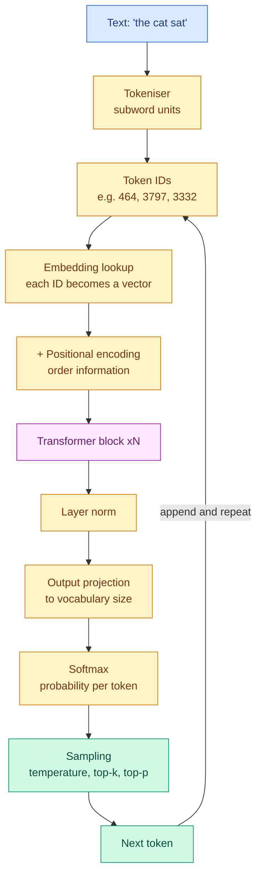
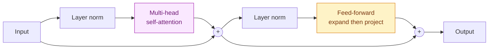

# Bank 3 — Deep Learning & Transformers

**Level:** 🔴 Advanced &nbsp;|&nbsp; **Effort:** Detailed module &nbsp;|&nbsp; **Questions:** 20

Neural networks, convolution, and the attention mechanism that everything modern is built on.

The transformer questions here are the highest-frequency questions in Generative AI and Large
Language Model (LLM) interviews. Being able to compute attention on a small matrix by hand is a
reliable differentiator — most candidates can describe it and cannot do it.

---

## The transformer forward pass



Inside one transformer block:



The two skip connections (`+`) are the reason very deep transformers train at all — they give
gradients a direct path back through every layer.

---

## Neural network fundamentals

<details>
<summary><b>Q1. Explain backpropagation as if to someone who knows calculus but not ML.</b></summary>

It is the chain rule applied systematically and efficiently.

**Forward pass:** input flows through layers, each applying a weighted sum and a non-linearity,
producing a prediction and then a loss.

**Backward pass:** we want ∂Loss/∂w for every weight w. The chain rule gives us this by multiplying
local derivatives backwards from the loss to each parameter. Backpropagation is the observation that
you can compute these in one reverse sweep, reusing shared sub-expressions, instead of recomputing
the chain for every weight independently.

**Why the efficiency matters:** naively, computing gradients for N parameters would cost roughly N
forward passes. Backpropagation costs about one forward plus one backward pass — roughly twice a
forward pass, regardless of parameter count. That is what makes training billion-parameter models
arithmetically possible at all.

**The trap in the follow-up:** "is backpropagation the same as gradient descent?" No. Backpropagation
*computes* the gradients; gradient descent (or Adam, or another optimiser) *uses* them to update
weights. Conflating them is a common tell.

→ [08 Deep Learning](../08-deep-learning/README.md)
</details>

<details>
<summary><b>Q2. What causes vanishing and exploding gradients, and how are they fixed?</b></summary>

Gradients are products of many terms — one per layer. Multiply many numbers below 1 and the product
approaches zero (vanishing); multiply many above 1 and it diverges (exploding).

**Vanishing gradients** starve early layers of learning signal, so a deep network trains only its
final layers. Classic with sigmoid and tanh, whose derivatives saturate near zero for large inputs.

Fixes: ReLU-family activations (derivative of exactly 1 in the positive region), careful
initialisation (He for ReLU, Xavier/Glorot for tanh), batch or layer normalisation, and above all
**residual connections** — a skip path gives the gradient a route of derivative 1 straight through.

**Exploding gradients** produce NaN losses and wildly oscillating training. Common in recurrent
networks.

Fixes: **gradient clipping** (cap the global norm — the standard, near-universal fix), lower learning
rate, and normalisation layers.

**The historically interesting point to make:** residual connections are the single change that made
networks hundreds of layers deep trainable. Before them, deeper networks performed *worse* than
shallower ones — not from overfitting but from optimisation failure, which is a genuinely
counterintuitive result worth being able to explain.

→ [08 Deep Learning](../08-deep-learning/README.md)
</details>

<details>
<summary><b>Q3. Compare batch normalisation and layer normalisation. Why do transformers use layer norm?</b></summary>

Both normalise activations to stabilise training. They differ in **what they normalise across**.

**Batch normalisation** normalises each feature across the batch dimension — for feature j, compute
mean and variance over all samples in the batch.

**Layer normalisation** normalises across the feature dimension within each sample independently.

**Why transformers use layer norm:**

1. **Independence from batch size.** Batch norm's statistics degrade with small batches and become
   meaningless at batch size 1 — which is exactly the situation during autoregressive inference.
2. **Variable sequence lengths.** Batch statistics across padded sequences of different lengths are
   incoherent.
3. **No train/inference discrepancy.** Batch norm uses batch statistics when training and running
   averages when serving — two different computations, and a known source of subtle bugs. Layer norm
   does the same thing in both modes.
4. **Autoregressive generation processes one token at a time.** There is no batch to normalise over.

**A detail that signals current knowledge:** modern transformers generally use *pre-norm*
(normalising before the sublayer) rather than the original *post-norm*, because pre-norm trains more
stably at depth without a learning-rate warmup. Many also use RMSNorm, a cheaper variant that skips
the mean-centring step.

→ [11 Transformers](../11-transformers/README.md)
</details>

<details>
<summary><b>Q4. Why do we need activation functions at all?</b></summary>

Without them, a network of any depth collapses to a single linear transformation. Composing linear
maps gives you a linear map — W₂(W₁x) = (W₂W₁)x — so a hundred layers would have exactly the
expressive power of one. Non-linearity is what makes depth mean anything.

**The common ones and their trade-offs:**

| Activation | Property | Weakness |
| --- | --- | --- |
| Sigmoid | Output in (0,1) | Saturates, kills gradients, not zero-centred |
| Tanh | Zero-centred | Still saturates |
| ReLU | Cheap, no positive saturation | "Dying ReLU" — a unit stuck at zero never recovers |
| Leaky ReLU | Small negative slope prevents death | One more hyperparameter |
| GELU | Smooth, probabilistic motivation | Slightly more expensive |
| Swish/SiLU | Smooth, often marginally better | More expensive |
| Softmax | Produces a probability distribution | Output layer only |

**What to say about choice:** ReLU is the safe default for convolutional networks; GELU is
effectively standard in transformers. The differences between modern activations are small compared
with getting normalisation, initialisation and learning rate right — and saying that shows
proportion.
</details>

<details>
<summary><b>Q5. How would you debug a neural network that will not learn?</b></summary>

In this order, because it goes fastest-to-check first:

**1. Can it overfit a tiny sample?** Take 10 examples and train until the loss is near zero. If it
cannot memorise 10 examples, there is a bug — not a tuning problem. This is the single most useful
diagnostic and most candidates do not mention it.

**2. Check the loss at initialisation.** For n-class classification with random weights, cross-entropy
should start near ln(n) — about 2.30 for 10 classes. A wildly different starting loss means a
labelling, shape or reduction bug.

**3. Learning rate.** The most common single cause. Loss flat → too low. Loss oscillating or NaN →
too high. Sweep it across orders of magnitude before touching anything else.

**4. Data pipeline.** Actually look at a batch. Are images normalised? Are labels aligned with
inputs after shuffling? Is augmentation destroying the signal? Print shapes and value ranges.

**5. Gradient flow.** Log gradient norms per layer. All near zero → vanishing gradients or a
detached graph. Exploding → clip them.

**6. Did you forget `optimizer.zero_grad()`?** In PyTorch, gradients accumulate by default. Omitting
this is a classic and produces exactly "it won't learn".

**7. Model capacity and target.** Only after all of the above would I consider that the architecture
is wrong or the target is unlearnable from these features.

**The framing:** "I treat 'won't learn' as a bug hunt, not a hyperparameter search. Overfitting ten
samples separates 'broken' from 'badly tuned' in about two minutes."

→ [08 Deep Learning](../08-deep-learning/README.md)
</details>

<details>
<summary><b>Q6. Explain convolution and why it works so well for images.</b></summary>

A convolution slides a small learnable filter across the input, computing a dot product at each
position to produce a feature map. Each filter detects one pattern — an edge at some orientation, a
texture — wherever it appears.

**Three properties that make it right for images:**

1. **Parameter sharing.** The same filter applies everywhere. A 3×3 filter has 9 weights regardless
   of image size, where a fully-connected layer on a 224×224×3 image would need ~150,000 weights per
   neuron. This is the difference between trainable and untrainable.
2. **Translation equivariance.** A cat in the corner activates the same filters as a cat in the
   centre. A fully-connected layer would have to learn "cat" separately at every position.
3. **Locality and hierarchy.** Early layers see small regions and learn edges; stacking expands the
   receptive field so later layers compose edges into textures, parts, then objects.

**Output size** for input W, kernel K, padding P, stride S:

```
out = floor((W - K + 2P) / S) + 1
```

Be ready to compute it: a 32×32 input, 3×3 kernel, padding 1, stride 1 → (32−3+2)/1 + 1 = 32.
"Same" padding, which is why P=1 with K=3 is so common.

→ [09 Computer Vision](../09-computer-vision/README.md)
</details>

---

## Attention & transformers

<details>
<summary><b>Q7. Explain self-attention. Then compute it on a small example.</b></summary>

**The intuition:** each token asks "which other tokens should I pay attention to?" and builds its
new representation as a weighted mixture of their values.

**The mechanism.** Each token's embedding is projected into three vectors:

- **Query (Q)** — what this token is looking for
- **Key (K)** — what this token offers
- **Value (V)** — the information this token contributes

Attention weight between tokens i and j is the similarity of Qᵢ and Kⱼ:

$$\text{Attention}(Q,K,V) = \text{softmax}\!\left(\frac{QK^{\top}}{\sqrt{d_k}}\right)V$$

**Worked example.** Take three tokens with 2-dimensional queries and keys, dₖ = 2:

```
Q = [[1, 0],     K = [[1, 0],     V = [[1, 0],
     [0, 1],          [0, 1],          [0, 1],
     [1, 1]]          [1, 1]]          [1, 1]]
```

Scores QKᵀ for the **first** token, Q₁ = [1,0]:

```
Q1·K1 = 1     Q1·K2 = 0     Q1·K3 = 1
```

Scale by √dₖ = 1.414:

```
[0.707, 0.0, 0.707]
```

Softmax: exponentials are [2.028, 1.000, 2.028], summing to 5.056, giving weights

```
[0.401, 0.198, 0.401]
```

Output = 0.401·[1,0] + 0.198·[0,1] + 0.401·[1,1] = **[0.802, 0.599]**

Token 1 attended mostly to tokens 1 and 3, whose keys align with its query.

**Why divide by √dₖ:** dot products grow with dimension. Without scaling, large values push softmax
into a near-one-hot regime where gradients vanish. The √dₖ keeps the variance of the scores roughly
constant as dimension grows. This is the most commonly asked follow-up in the whole bank — have the
answer ready.

→ [11 Transformers](../11-transformers/README.md)
</details>

<details>
<summary><b>Q8. Why multi-head attention instead of one big attention?</b></summary>

A single attention head produces one weighted average, and averaging is lossy — one distribution
over tokens has to serve every kind of relationship at once.

Multi-head attention splits the representation into h subspaces, runs attention independently in
each, and concatenates. Different heads can specialise: one tracks syntactic dependencies, another
tracks coreference, another attends to the previous token positionally.

**The cost point that matters:** with h heads each of dimension d/h, total computation is roughly
the same as one head of dimension d. You get the diversity essentially free — it is a
reparameterisation, not extra capacity.

**Nuance worth adding if pushed:** interpretability research shows heads are less cleanly specialised
than the tidy story suggests, and many can be pruned with little loss. Saying "the intuition is
specialisation, though in practice head roles are messier and many are redundant" is a more honest
and more impressive answer than the textbook version.

**Modern variants** — Multi-Query Attention and Grouped-Query Attention share key and value
projections across heads specifically to shrink the KV cache at inference. Knowing *why* they exist
(memory at serving time, not quality) is a strong LLM-engineering signal.

→ [11 Transformers](../11-transformers/README.md)
</details>

<details>
<summary><b>Q9. Why do transformers need positional encoding?</b></summary>

Self-attention is permutation-equivariant: it computes weighted sums over a *set*. Shuffle the input
tokens and the outputs shuffle identically. "Dog bites man" and "man bites dog" would be
indistinguishable — which is unacceptable for language.

Positional encoding injects order information into the representations.

**The approaches:**

- **Sinusoidal (original transformer)** — fixed sine and cosine functions at different frequencies.
  No parameters, and in principle extrapolates to unseen lengths.
- **Learned absolute** — a trained embedding per position. Simple; cannot exceed the trained maximum
  length.
- **Rotary Position Embedding (RoPE)** — rotates query and key vectors by an angle proportional to
  position, so the attention score depends on *relative* distance. Dominant in current open models
  because it extends to longer contexts more gracefully.
- **ALiBi** — adds a distance-proportional penalty to attention scores. Extrapolates well.

**The connection to make:** context-length extension techniques largely work by manipulating
positional encoding — RoPE scaling and interpolation methods let a model trained at 4k tokens operate
at much longer contexts. Linking positional encoding to the practical context-window question shows
you understand why anyone cares.

→ [11 Transformers](../11-transformers/README.md)
</details>

<details>
<summary><b>Q10. What is the KV cache and why does it dominate inference memory?</b></summary>

**The problem it solves:** generating autoregressively, at each step the model attends over all
previous tokens. Without caching, generating token 1000 would recompute keys and values for tokens
1–999 that have not changed — quadratic wasted work.

**The KV cache** stores the key and value tensors for every previous token, at every layer, for every
head. Each new token computes only its own K and V and appends them.

**Why it dominates memory:** cache size grows with batch size × sequence length × layers × heads ×
head dimension × 2 (K and V) × bytes per element. It is *linear in context length and batch size*,
whereas model weights are fixed. Serving many concurrent long-context requests, the cache can exceed
the weights.

**Consequences to name:**

- It caps how many concurrent requests fit on a GPU — the real limit on serving throughput.
- It is why long context is expensive: doubling context roughly doubles cache memory per request.
- Mitigations: Grouped-Query Attention and Multi-Query Attention (share K/V across heads), PagedAttention
  (allocate cache in pages to eliminate fragmentation), cache quantisation, and eviction of distant
  tokens.

**The interview framing:** "Prefill is compute-bound; decode is memory-bandwidth-bound and
cache-limited. That distinction drives almost every serving optimisation decision."

→ [13 Large Language Models](../13-large-language-models/README.md)
</details>

<details>
<summary><b>Q11. Explain temperature, top-k and top-p sampling.</b></summary>

The model outputs a probability distribution over the vocabulary. These control how you draw from it.

**Temperature** divides the logits before softmax. T → 0 approaches greedy (always the top token,
deterministic, repetitive). T = 1 is the raw distribution. T > 1 flattens it, raising the chance of
unlikely tokens — more creative, more incoherent.

**Top-k** keeps only the k highest-probability tokens and renormalises. Simple, but k is fixed
regardless of how peaked the distribution is: when the model is nearly certain, k=50 still admits 49
poor candidates.

**Top-p (nucleus)** keeps the smallest set of tokens whose cumulative probability reaches p. The
candidate set shrinks when the model is confident and expands when it is uncertain — which is why it
is usually preferred.

**Practical guidance to offer:**

| Task | Setting | Why |
| --- | --- | --- |
| Factual extraction, classification | T ≈ 0 | You want determinism and reproducibility |
| Code generation | T ≈ 0.2 | Mostly deterministic, slight flexibility |
| General assistant | T ≈ 0.7, top-p 0.9 | Balanced |
| Creative writing, brainstorming | T ≈ 1.0+ | Diversity is the goal |

⚠️ **The caveat worth stating:** temperature 0 is not fully deterministic in practice on GPU —
floating-point non-associativity under varying batch composition can change results. If an
interviewer is testing production experience, mentioning this lands well.

→ [11 Transformers](../11-transformers/README.md)
</details>

<details>
<summary><b>Q12. Compare encoder-only, decoder-only and encoder-decoder architectures.</b></summary>

| | Encoder-only | Decoder-only | Encoder-decoder |
| --- | --- | --- | --- |
| Attention | Bidirectional | Causal (masked) | Bidirectional encoder, causal decoder + cross-attention |
| Sees | Full context both ways | Only leftward | Full input, causal output |
| Trained by | Masked token prediction | Next-token prediction | Denoising / sequence-to-sequence |
| Example family | BERT, RoBERTa | GPT, LLaMA, Mistral | T5, BART |
| Best at | Understanding: classification, NER, retrieval embeddings | Generation | Transformation: translation, summarisation |

**Why decoder-only came to dominate generation:** the training objective (predict the next token)
needs no labels and scales to any text on the internet. It also unifies every task as text
continuation, so one model serves many purposes without task-specific heads.

**Why encoders are still used:** for embeddings and classification, bidirectional context is
genuinely better — understanding a word benefits from seeing what follows it. Most retrieval
embedding models are encoder-based, which is why a Retrieval-Augmented Generation (RAG) system
typically runs an encoder for retrieval and a decoder for generation.

**Good closing line:** "In a production RAG stack I'm usually running both architectures — an
encoder to embed and a decoder to generate. They are not competitors."

→ [11 Transformers](../11-transformers/README.md)
</details>

<details>
<summary><b>Q13. What is tokenisation, and why does it cause so many strange model behaviours?</b></summary>

Tokenisation splits text into the units the model actually processes — subwords, via Byte-Pair
Encoding, WordPiece or SentencePiece. A token averages roughly 4 characters in English.

**Why subwords rather than words or characters:** words give an unbounded vocabulary and no way to
handle unseen words; characters give sequences too long to attend over efficiently. Subwords balance
vocabulary size against sequence length, and compose unseen words from known pieces.

**Strange behaviours it explains — this is what the question is really after:**

- **Poor character-level tasks.** "How many r's in strawberry?" is hard because the model never sees
  characters, only subword chunks. It is a representation limitation, not a reasoning failure.
- **Arithmetic weakness.** Numbers tokenise inconsistently — "1234" may be one token or three,
  depending on the tokeniser. Digit-level structure is obscured.
- **Non-English cost.** Tokenisers trained mostly on English fragment other scripts into many more
  tokens, so the same sentence costs more and consumes more context. A real fairness and cost issue.
- **Trailing-whitespace sensitivity.** "The cat " and "The cat" tokenise differently and can produce
  noticeably different continuations.
- **Glitch tokens.** Rare tokens present in the vocabulary but barely seen in training produce
  erratic output.

**The practical point:** cost, latency and context limits are all counted in tokens, not words, and
the ratio varies by language and content type. Estimating in words will mislead your capacity plan.

→ [11 Transformers](../11-transformers/README.md)
</details>

<details>
<summary><b>Q14. Why did transformers replace recurrent networks?</b></summary>

**Parallelism, mostly.** A recurrent network processes tokens sequentially — step t needs step t−1's
hidden state — so training cannot parallelise across sequence positions. A transformer computes
attention over all positions simultaneously, so a sequence of length 1000 uses the GPU fully instead
of running 1000 dependent steps. This is what made internet-scale training economically feasible.

**Path length.** In an RNN, information from token 1 reaching token 1000 traverses 999 steps,
degrading through repeated transformations even with LSTM gating. In a transformer, any two tokens
are one attention operation apart — constant path length.

**Gradient behaviour.** Long recurrent chains vanish or explode; attention plus residuals gives
short, well-behaved gradient paths.

**The honest trade-off to name:** attention is O(n²) in sequence length for both compute and memory,
where an RNN is O(n). For very long sequences that is a real cost, which is exactly why efficient
attention variants, and recurrent-flavoured architectures such as state-space models, remain an
active research direction. Giving up something to gain parallelism is the accurate framing.

→ [11 Transformers](../11-transformers/README.md)
</details>

---

## Training & practical

<details>
<summary><b>Q15. How do you choose a batch size?</b></summary>

**Constraints first:** it must fit in GPU memory alongside weights, gradients, optimiser states and
activations. Activation memory scales with batch size, and for transformers with sequence length
too.

**Then the trade-offs:**

- **Larger batches** give lower-variance gradient estimates, better hardware utilisation and
  throughput — but often slightly worse generalisation, and diminishing returns past a point.
- **Smaller batches** add gradient noise that acts as a mild regulariser, and allow more update
  steps per epoch.

**The coupling to state explicitly:** batch size and learning rate move together. Increase batch
size k-fold and you generally need to raise the learning rate (linear or √k scaling are the common
heuristics) plus a warmup period. Changing batch size without adjusting learning rate is a frequent
cause of "it trained worse on the bigger GPU".

**Gradient accumulation** decouples the two: run micro-batches of 4, accumulate gradients over 8
steps, update as if the batch were 32. This gives large-batch behaviour on small hardware at the
cost of wall-clock time, and it is the standard trick in constrained fine-tuning.

→ [08 Deep Learning](../08-deep-learning/README.md)
</details>

<details>
<summary><b>Q16. Explain learning-rate scheduling and warmup.</b></summary>

**Why schedule at all:** early in training you want large steps to move quickly across the loss
landscape; later you want small steps to settle into a minimum rather than bouncing around it.

**Common schedules:** step decay, cosine annealing (smooth decay to near zero — the default for
transformer training), and reduce-on-plateau (drop when validation stops improving).

**Warmup** starts at a very small learning rate and ramps up over the first few hundred or thousand
steps. It matters because at initialisation the model's outputs are near-random and gradients are
large and poorly-conditioned; a full learning rate immediately can push the model somewhere it never
recovers from. This is especially true for adaptive optimisers such as Adam, whose second-moment
estimates are unreliable in the first steps.

**A modern note:** pre-norm transformer architectures are substantially more tolerant of skipped
warmup than the original post-norm design. Connecting these two facts — normalisation placement and
warmup requirement — signals real training experience rather than recited best practice.
</details>

<details>
<summary><b>Q17. What is mixed-precision training and what can go wrong?</b></summary>

Perform most operations in 16-bit floating point while keeping a 32-bit copy of the weights for
updates. Roughly halves memory and gives large speedups on tensor-core hardware.

**What goes wrong, and how it is handled:**

- **Underflow in gradients.** FP16 has a narrow range; small gradients round to zero and learning
  stops. Fixed by **loss scaling** — multiply the loss by a large factor before the backward pass,
  then divide the gradients back. Modern frameworks scale dynamically.
- **Overflow to infinity or NaN.** Dynamic loss scaling detects this and backs the scale off.
- **Accumulated precision loss** in reductions such as layer-norm statistics and softmax. Frameworks
  keep these operations in FP32 for exactly this reason.

**BF16 versus FP16 — the modern answer:** BFloat16 has the same exponent range as FP32 with fewer
mantissa bits. It trades precision for range, which removes the underflow problem entirely and means
loss scaling is generally unnecessary. On hardware that supports it, BF16 is the easier and now more
common choice. Knowing *why* BF16 simplified mixed precision is a good differentiator.

→ [35 Distributed Training](../35-distributed-training-and-infrastructure/README.md)
</details>

<details>
<summary><b>Q18. Your training loss is decreasing but validation loss is increasing. What now?</b></summary>

Textbook overfitting. Interventions, in order of what I would try first:

1. **Early stopping.** Stop at the validation minimum and keep that checkpoint. Free, immediate,
   and it should already be running.
2. **More data**, if obtainable — the most effective fix and usually the least available.
3. **Data augmentation.** Effectively more data. Flips, crops and colour jitter for images;
   back-translation or synonym substitution for text.
4. **Regularisation.** Increase weight decay, add or increase dropout.
5. **Reduce capacity.** Fewer layers or narrower ones.
6. **Transfer learning.** Start from pretrained weights instead of scratch — often turns an
   impossible small-data problem into a solved one.

**But first, rule out three impostors:**

- **Distribution mismatch between splits.** A random split on time-series or grouped data makes
  normal generalisation look like overfitting.
- **A validation set too small to be stable.** Rising validation loss on 200 samples may be noise.
- **Validation loss up but the metric you care about still improving.** This genuinely happens with
  cross-entropy versus accuracy — the model grows overconfident on the ones it already gets right,
  raising loss, while classification quality holds. Check the actual business metric before acting.

That last point is the one that distinguishes a strong answer.
</details>

<details>
<summary><b>Q19. How would you reduce inference latency for a deployed deep-learning model?</b></summary>

Measure first — establish where the time actually goes before optimising.

**Model-level:**
- **Quantisation** — INT8 or 4-bit. Often the largest single win; measure the accuracy cost.
- **Distillation** — train a smaller student on the larger model's outputs.
- **Pruning** — remove low-importance weights; needs structured sparsity to give real speedups.
- **Use a smaller model.** Frequently the right answer, and frequently skipped because it feels like
  giving up.

**Runtime-level:**
- **Compilation and operator fusion** — ONNX Runtime, TensorRT, `torch.compile`. Fusing operations
  cuts memory traffic, which is usually the actual bottleneck.
- **Batching.** Raises throughput but raises per-request latency — a genuine trade-off to state.
  Continuous batching for LLMs gets much of the throughput without the queueing penalty.

**System-level:**
- **Caching** — including semantic caching for LLM applications, where near-duplicate queries are
  common.
- **Speculative decoding** — a small draft model proposes tokens, the large model verifies several at
  once.
- **Keep instances warm** — cold starts often dominate p99 latency far more than the model does.

**The framing that lands:** "I'd separate p50 from p99. They usually have different causes — p50 is
the model, p99 is queueing, cold starts or garbage collection. Optimising the model when your p99
problem is autoscaling wastes weeks."

→ [32 Model Optimization](../32-model-optimization/README.md)
</details>

<details>
<summary><b>Q20. Estimate the GPU memory needed to fine-tune a 7-billion-parameter model.</b></summary>

They want to see the arithmetic, not a number you memorised.

**Full fine-tuning with Adam in mixed precision, per parameter:**

| Component | Bytes per parameter |
| --- | --- |
| Weights (FP16) | 2 |
| Gradients (FP16) | 2 |
| Adam momentum (FP32) | 4 |
| Adam variance (FP32) | 4 |
| FP32 master weights | 4 |
| **Total** | **~16** |

7B × 16 bytes ≈ **112 GB**, before activations. That does not fit on a single 80 GB accelerator —
so full fine-tuning needs multiple GPUs with sharding (Fully Sharded Data Parallel, or ZeRO stage 3).

**With LoRA (Low-Rank Adaptation):** the base model is frozen, so no gradients or optimiser states
for it — just 2 bytes per parameter for the frozen weights, roughly **14 GB**, plus a tiny amount for
the adapters. Now it fits on a single 24 GB card with headroom.

**With QLoRA:** quantise the frozen base to 4 bits — roughly **3.5 GB** — plus adapters. This fits on
a free cloud notebook GPU, which is why it made fine-tuning broadly accessible.

**Do not forget activations**, which scale with batch size and sequence length and can be
substantial. Gradient checkpointing trades compute for memory here — recompute activations in the
backward pass instead of storing them, typically ~30% slower for a large memory saving.

**The closing line:** "So the honest answer is: full fine-tuning needs a multi-GPU node, LoRA needs
one good GPU, QLoRA needs a laptop-class GPU or Colab. Which one I'd choose depends on how much the
task actually needs to change the model."

→ [17 Fine-Tuning](../17-fine-tuning/README.md)
</details>

---

## ✅ Key takeaways

- Be able to *compute* attention on a 3×3 example, not just describe it. Know why √dₖ is there.
- Residual connections are why depth works — the historically important answer.
- The KV cache, not the weights, usually limits how many concurrent requests a GPU can serve.
- "Can it overfit ten examples?" is the fastest way to separate a bug from a tuning problem.
- Batch size and learning rate move together. Say so unprompted.
- Memory arithmetic (16 bytes/parameter for Adam mixed precision) is worth memorising — it turns
  vague answers into concrete ones.

## 📚 Official References

- [PyTorch Documentation — PyTorch Foundation](https://pytorch.org/docs/stable/index.html) — verified 2026-07-27
- [PyTorch: Automatic Mixed Precision — PyTorch Foundation](https://pytorch.org/docs/stable/amp.html) — verified 2026-07-27
- [PyTorch: torch.nn.MultiheadAttention — PyTorch Foundation](https://pytorch.org/docs/stable/generated/torch.nn.MultiheadAttention.html) — verified 2026-07-27
- [Hugging Face Transformers Documentation — Hugging Face](https://huggingface.co/docs/transformers/index) — verified 2026-07-27
- [Hugging Face Tokenizers Documentation — Hugging Face](https://huggingface.co/docs/tokenizers/main/en/index) — verified 2026-07-27
- [NVIDIA Deep Learning Performance Documentation — NVIDIA](https://docs.nvidia.com/deeplearning/performance/index.html) — verified 2026-07-27
- ["Attention Is All You Need" — Vaswani et al., arXiv](https://arxiv.org/abs/1706.03762) — verified 2026-07-27

---

[← Bank 2: Classical ML](02-classical-ml-and-evaluation.md) &nbsp;|&nbsp; [Module home](README.md) &nbsp;|&nbsp; [Bank 4: GenAI, RAG & Fine-Tuning →](04-genai-rag-finetuning.md)
