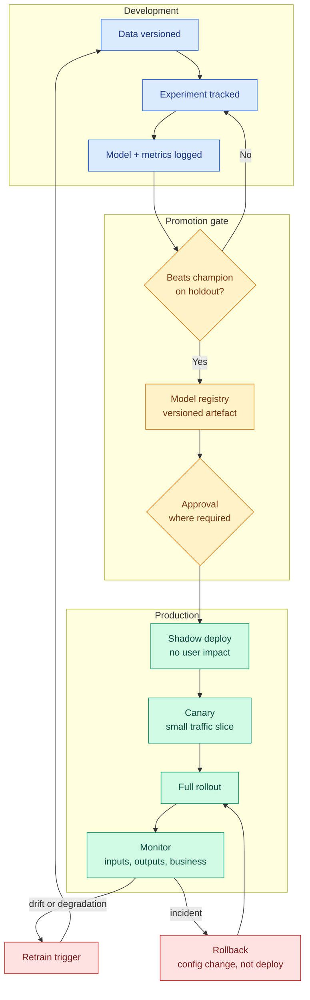

# Bank 5 — MLOps & Production

**Level:** 🟣 Production &nbsp;|&nbsp; **Effort:** Detailed module &nbsp;|&nbsp; **Questions:** 20

Deployment, monitoring, drift, rollback, cost and security. The round where "I trained a model in a
notebook" candidates get separated from "I have been paged at 3am about a model" candidates.

The recurring theme: **training is a small part of the lifecycle.** Almost every strong answer here
mentions what happens after the model ships.

---

## The production lifecycle

Two things to say when you draw this: **it is a loop**, and **rollback is a configuration change,
not a redeploy**. If rolling back requires a build, your incident is 20 minutes longer than it
needed to be.

---

## Deployment

<b>Q1. Walk me through deploying a model to production.</b>

**Before any deployment:**
- The model is a **versioned artefact in a registry**, tied to the exact code commit, data version
  and hyperparameters that produced it. If I cannot reproduce it, I will not ship it.
- It passed an **evaluation gate** against the current champion on a held-out set, not on the
  validation set used for tuning.
- Input and output **schemas are defined and validated**.

**Serving:**
- Wrap in an API with request validation (Pydantic or equivalent), health and readiness probes, and
  structured logging including a request ID.
- Containerise, pinning the exact dependency versions — a silent library upgrade can change
  numerical output without erroring.
- Load the model once at startup, not per request. Add a warm-up call so the first real request does
  not pay the initialisation cost.

**Rollout, in stages:**
1. **Shadow** — receives real traffic, responses discarded. Validates it does not crash, and lets
   you compare predictions against the incumbent on real data at zero risk.
2. **Canary** — 1–5% of traffic, watching technical and business metrics.
3. **Progressive rollout** with automatic rollback on metric regression.

**After:** monitor input distributions, prediction distributions, latency percentiles, error rates
and the business metric. Keep the previous version deployable by config flip.

**The line that matters:** "The deployment isn't finished when traffic reaches 100%. It's finished
when I have alerting that would tell me this model has degraded before a stakeholder does."

→ [31 Model Deployment](../31-model-deployment/README.md)

<b>Q2. Compare shadow, canary and blue-green deployment.</b>

| Strategy | Traffic | User risk | Detects | Cost |
| --- | --- | --- | --- | --- |
| **Shadow** | 100% duplicated, responses discarded | **Zero** | Crashes, latency, prediction differences | 2× inference |
| **Canary** | Small slice, real responses | Limited to the slice | Everything, including business impact | Two versions running |
| **Blue-green** | All-or-nothing switch | High until switched, instant rollback | Little before the switch | 2× infrastructure |
| **A/B test** | Split, measured statistically | Limited | **Causal** business impact | Two versions + duration |

**The distinction people blur:** canary is a *risk-management* technique — go slowly, watch for
breakage. A/B test is a *measurement* technique — is version B actually better, with statistical
confidence? They look similar and answer different questions. A canary at 5% for an hour cannot tell
you whether conversion improved; it can tell you nothing exploded.

**What I would actually do for a model:** shadow first (free signal, no risk), then canary, then a
proper A/B test if the business impact needs to be *proven* rather than assumed. For ML
specifically, shadow deployment is disproportionately valuable because you can compare old and new
predictions on identical inputs — you cannot do that with a regular service.

→ [29 MLOps](../29-mlops/README.md)

<b>Q3. Batch versus real-time inference — how do you choose?</b>

**Ask when the prediction is consumed relative to when it can be computed.**

**Batch fits when** the inputs are known ahead of the need. Nightly churn scores, weekly demand
forecasts, precomputed recommendations for known users. It is dramatically cheaper — no idle
capacity, full hardware utilisation, no latency budget, trivially retryable.

**Real-time is required when** the input is only known at request time: fraud scoring on a
transaction happening now, search ranking for a query just typed, any user-facing generation.

**The hybrid that most systems actually use, and that candidates rarely mention:** precompute the
expensive part offline, combine cheaply online. A recommender computes user and item embeddings
nightly, then does a fast nearest-neighbour lookup plus a light re-rank at request time. You get
real-time responsiveness at close to batch cost.

**Streaming** sits between: continuous processing as events arrive, for near-real-time aggregation
of features.

**The cost point:** "Real-time serving means paying for capacity sized to peak load, sitting idle
most of the time. I would push everything I can to batch and only serve online what genuinely cannot
be precomputed — that single decision often halves the infrastructure bill."

<b>Q4. How do you version models, data and code together?</b>

All three, or reproducibility is fiction.

- **Code** — Git. Every training run records its commit hash.
- **Data** — content-addressed versioning (DVC, LakeFS, or dataset snapshots with checksums in
  object storage). The dataset identifier goes into the run metadata.
- **Model** — a registry entry with a version, the training run ID, metrics, and a stage (staging,
  production, archived).
- **Environment** — pinned dependencies, and ideally the container image digest.
- **Configuration** — hyperparameters and feature definitions, versioned as files, not passed as
  ad-hoc command-line arguments.

**The joining key is the experiment run.** Given a production model version, I need to answer in one
lookup: which commit, which data, which parameters, which metrics, who approved it. If that takes
archaeology, the system is broken.

**Where it usually falls apart in practice:** feature engineering code. The model artefact is
versioned, but the transformation applied at serving time drifts from the one applied at training
time — the classic training-serving skew. Fixes: serialise the whole pipeline including transformers
as a single artefact, or use a feature store that serves the same computation to both paths.

→ [29 MLOps](../29-mlops/README.md)

<b>Q5. What is training-serving skew and how do you prevent it?</b>

The model receives differently-processed inputs in production than it did in training, so it behaves
differently — usually worse, and usually silently.

**How it happens:**
- **Two implementations.** Feature logic written in pandas for training and reimplemented in Java or
  SQL for serving. They diverge on an edge case — a null, a timezone, a rounding rule.
- **Different data sources.** Training on a warehouse table that has been cleaned and backfilled;
  serving from a raw event stream that has not.
- **Time-travel differences.** A training feature computed with a full day of data, but at serving
  time only partial-day data exists.
- **Silent upstream changes.** A field changes units or encoding, and nobody tells the ML team.

**Prevention:**
1. **One implementation, shared.** Serialise the entire preprocessing pipeline with the model, so
   the same code runs in both paths. This is the single most effective control.
2. **A feature store** that computes features once and serves them to both training and inference,
   with point-in-time correctness for historical lookups.
3. **Log production inputs and compare distributions** against training. This catches skew you did
   not anticipate.
4. **Shadow deployment** — feed production traffic through the training-time pipeline and diff the
   outputs.
5. **Contract tests on upstream data** so a schema or unit change fails loudly rather than silently.

**The framing:** "Training-serving skew is my default hypothesis when a model performs worse in
production than in evaluation, and it is right more often than 'the model was overfit'."

---

## Monitoring & drift

<b>Q6. What would you monitor for a deployed model?</b>

Four layers, and candidates who only name the first are the ones who have not operated a model.

**1. Infrastructure** — latency p50/p95/p99, throughput, error rate, CPU/GPU/memory, queue depth.
Standard service monitoring; necessary and insufficient.

**2. Data quality** — null rates, schema conformance, value ranges, cardinality of categoricals,
unseen categories. Most "model degradation" incidents are actually broken upstream data, and this
layer catches them fastest.

**3. Model behaviour** — input feature distributions versus training (drift), prediction
distribution, confidence distribution, and for classification the rate of predictions near the
decision threshold.

**4. Business outcome** — the metric the model exists to move. Fraud caught and losses avoided,
conversion, retention, review-queue volume. This is what actually matters and it is usually the
laggiest signal.

**Also, for ML specifically:** prediction-serving skew (are production inputs shaped like training
inputs?), and segment-level performance — an aggregate metric can hold steady while the model
becomes useless for one customer segment.

**The alerting discipline point:** "I'd be careful what I page on. Drift alerts fire constantly and
most are benign, so paging on drift trains people to ignore alerts. I'd page on business-metric
regression and data-quality breakage, and put drift on a dashboard with a weekly review."

→ [29 MLOps](../29-mlops/README.md)

<b>Q7. Explain data drift versus concept drift.</b>

**Data drift (covariate shift):** the input distribution P(X) changes; the relationship P(Y|X) does
not. New customer demographics, a new product line, a marketing campaign bringing different traffic.
The model may still be correct — it is just being asked about a region it saw less of.

**Concept drift:** P(Y|X) itself changes. The same inputs now imply a different answer. Consumer
behaviour shifts, fraudsters change tactics, a competitor changes pricing. The model is now wrong.

**Why the distinction matters operationally:**

| | Data drift | Concept drift |
| --- | --- | --- |
| Detectable without labels? | **Yes** — compare input distributions | **No** — needs ground truth |
| Detection latency | Immediate | As slow as your label feedback loop |
| Model still valid? | Possibly | No |
| Response | Monitor; retrain if performance drops | Retrain, urgently |

**Detection methods:** population stability index or Kolmogorov-Smirnov per feature for data drift;
performance monitoring against delayed labels for concept drift.

**The practical warning:** with enough features, some will always show statistically significant
drift. Significance is not importance. I would weight drift alerts by feature importance and set
thresholds from historical baseline variation, not from a p-value — otherwise the alert is noise
within a week.

→ [29 MLOps](../29-mlops/README.md)

<b>Q8. When and how do you retrain a model?</b>

**Triggers, in increasing sophistication:**
- **Scheduled** — weekly, monthly. Simple, predictable, sometimes wasteful, sometimes too slow.
- **Performance-triggered** — retrain when the monitored metric crosses a threshold. Requires
  ground truth, so it is limited by feedback delay.
- **Drift-triggered** — retrain when input distributions shift materially. Available immediately, but
  drift does not always mean degradation.
- **Data-volume-triggered** — retrain after N new labelled examples.

**Most systems should use a schedule as a floor plus a performance trigger for urgency.**

**How, and this is the part that matters:**

Retraining must be a **pipeline, not a person**. Same code path, automated, with an evaluation gate
that compares the challenger against the current champion on a fixed holdout. If it does not win, it
does not promote — automatically. Then shadow, canary, roll out.

**Things that go wrong, worth naming:**
- **Retraining on model-influenced data.** If the model's decisions shaped which outcomes you
  observe, retraining on that data amplifies its own biases. A small randomised holdout that
  bypasses the model preserves unbiased training data — expensive, and the correct thing to do.
- **Silent quality decay across many small retrains.** Each one passes the gate marginally; over
  six months you have drifted somewhere bad. Keep a fixed, never-changing regression set.
- **Retraining on corrupted data.** The gate protects you here, which is why it is not optional.

**The line:** "The goal is that retraining is boring — automated, gated, and reversible. If
retraining requires a senior engineer's afternoon, it will not happen often enough."

<b>Q9. Your model's business metric dropped 20% overnight. Walk me through the incident.</b>

**First: mitigate, then diagnose.** If it is severe, roll back to the previous model version — a
config change, not a redeploy — and investigate from a safe position. Restoring service beats
understanding it.

**Then diagnose, cheapest checks first:**

1. **Did anything deploy?** Model, code, prompt, config, feature pipeline. Check the deploy log
   against the timestamp. An overnight 20% cliff strongly suggests a discrete change, not gradual
   drift.
2. **Is the data broken?** Null rates, schema, an upstream job that failed or ran twice, a units
   change, a renamed category defaulting to "unknown". This is the most common cause of a sudden
   cliff.
3. **Is it the model or the measurement?** A broken analytics pipeline looks exactly like a broken
   model. Verify the metric itself is being computed correctly before assuming the model failed.
4. **Is it external?** A traffic-source change, a competitor action, an outage upstream, a public
   holiday. Segment the metric — if the drop is confined to one channel or region, it is probably
   not the model.
5. **Model behaviour** — has the prediction distribution shifted? Compare production inputs against
   training.

**After stabilising:** blameless post-mortem, and the important output is not the root cause but the
detection gap — *why did we learn about this from a dashboard rather than an alert?* Add the
monitor that would have caught it.

**The framing that reads as experienced:** "A 20% overnight cliff is almost never model drift. Drift
is gradual. Sudden means something changed, and usually the something is upstream of me."

<b>Q10. How do you monitor an LLM application, where there is no accuracy metric?</b>

This is where LLMOps genuinely differs from MLOps, and the question tests whether you know that.

**Deterministic signals — cheap, always on:**
- Latency (p50/p95, and time-to-first-token for streaming — the number users actually feel)
- Token usage and cost per request, per feature, per tenant
- Error rates: provider failures, timeouts, rate limits, schema-validation failures
- Refusal rate and fallback rate

**Quality signals:**
- **Groundedness / faithfulness** — are claims supported by retrieved context? The hallucination
  proxy, computable automatically with an LLM judge or an entailment model.
- **Schema conformance** — for structured output, a hard measurable.
- **Retrieval quality** — recall@k against a golden set, run continuously.
- **LLM-as-a-judge** on a sample of live traffic, calibrated against human labels.

**Human signals:**
- Explicit thumbs up/down, and implicit ones — regeneration rate, copy rate, escalation to a human,
  conversation abandonment. Implicit signals have far more volume and are usually more honest.

**Tracing** is the piece people forget: full traces spanning retrieval, tool calls and generation.
When quality drops you need to see *which stage* failed, and without tracing you are guessing.

**The point that lands:** "The hard part is that there is no ground truth arriving. So I'd run a
fixed golden set continuously as a regression signal, sample live traffic for judged evaluation, and
lean heavily on implicit user behaviour — a rising regeneration rate tells me something is wrong
before any thumbs-down does."

→ [30 LLMOps](../30-llmops/README.md)

---

## Scale, cost & reliability

<b>Q11. How do you scale model inference to handle 10× traffic?</b>

**Measure the bottleneck first.** Scaling the wrong layer is expensive and common.

**If it is throughput-bound:**
- Horizontal scaling with autoscaling on the right signal — queue depth or concurrency, not CPU,
  which is a poor proxy for GPU-bound work
- **Dynamic batching** — group concurrent requests. Big throughput gains, small latency cost, and
  usually the highest-leverage change.
- Load balancing with proper health checks

**If it is latency-bound:**
- Model optimisation — quantisation, distillation, compilation (see [32](../32-model-optimization/README.md))
- Caching, including semantic caching for LLM workloads
- Move work offline — precompute anything that does not need the live request

**If it is cost-bound:**
- Right-size the model per request class; route easy cases to a smaller model
- Spot or preemptible capacity for batch work, with checkpointing
- Scale to zero for spiky low-volume endpoints, accepting cold-start latency

**Architectural moves:**
- **Queue-based async** for anything tolerating delay — decouples arrival rate from processing rate
  and stops a spike becoming an outage
- **Multi-region** if latency or availability requires it
- **Graceful degradation** — a cached or simpler response beats a 503

**The point to raise unprompted:** "I'd also check whether 10× traffic means 10× *inference*. Often
a cache, or precomputing for the head of the distribution, absorbs most of it. Scaling the fleet is
the expensive answer and I'd want to have ruled out the cheap ones."

<b>Q12. What drives cost in a production ML system, and how do you control it?</b>

**The drivers, roughly in order of how often they dominate:**

1. **Inference compute** — usually the largest line. Driven by model size, request volume, hardware
   choice and utilisation. Idle GPU capacity is pure waste and extremely common.
2. **Training and retraining** — spiky. Matters most if you retrain frequently or train large models.
3. **Data storage and movement** — cross-region and cross-cloud egress surprises people.
4. **Vector index memory** — for RAG at scale, an in-memory HNSW index over tens of millions of
   vectors is a real, permanent cost.
5. **Third-party API calls** — per-token model pricing, scaling linearly with usage.
6. **Human labelling** — often the largest cost in the first year and rarely in the infrastructure
   budget.

**Controls:**
- **Attribute cost per feature and per tenant first.** You cannot optimise what you cannot see, and
  in most systems a small number of endpoints drive most of the spend.
- Right-size models; route by difficulty
- Batch everything that can be batched
- Cache aggressively — exact and semantic
- Spot instances for interruptible work
- Autoscale down, and scale to zero where cold starts are tolerable
- Set hard budget caps and alerts, especially on anything agentic

⚠️ **The one to raise unprompted:** an agent with tool access and no cost cap can spend an
extraordinary amount overnight through a loop. Per-run step limits and spend caps are a reliability
control, not just a finance one.

**Do not quote prices in an interview** — say which levers you would pull and that you would price
them against the current calculator. Quoted figures date badly and knowing that is itself a signal.

<b>Q13. How do you handle a model that must be explainable for regulatory reasons?</b>

**Start by clarifying what "explainable" means to the regulator**, because it is usually narrower
and stricter than the ML sense:
- Must you give the applicant a reason for the decision? (Adverse action notices.)
- Must the model be inherently interpretable, or is post-hoc explanation acceptable?
- Must you demonstrate the absence of prohibited discrimination?
- Must a human make the final decision?

**Approaches, in order of regulatory safety:**

1. **Inherently interpretable models** — logistic regression with monotonic constraints, scorecards,
   shallow decision trees, generalised additive models. Slightly lower accuracy, dramatically easier
   to defend. In lending this is often not merely preferred but effectively required.
2. **A complex model with post-hoc explanations** — SHapley Additive exPlanations for per-decision
   reasons. State the caveat: SHAP explains the model, not the world, and explanations of a complex
   model can be unstable across similar inputs, which is awkward when two similar applicants get
   different stated reasons.
3. **A two-model design** — the complex model for ranking and prioritisation, a simple auditable
   model for the decision that must be defended.

**What I would build regardless:** decision logging with the inputs, the model version and the
contributing factors for every decision; a fairness evaluation across protected groups with the
metric agreed in advance; model cards and datasheets; and a documented human review and appeal path.

**And the boundary to state explicitly:** "I'd want legal and compliance to define the requirement,
not me. I can build to a standard, but I should not be the person deciding what the standard is."
Interviewers value candidates who know where their authority ends.

→ [26 Responsible AI](../26-responsible-ai/README.md) · [27 Explainable AI](../27-explainable-ai/README.md)

<b>Q14. Design the security controls for a multi-tenant AI application.</b>

**Isolation is the whole game.** Assume a bug will attempt to cross the boundary; make it fail.

**Data layer:**
- Tenant ID on every record, enforced at the database level (row-level security), not only in
  application code — application-layer-only filtering fails open when someone forgets a `WHERE`.
- **Separate vector namespaces or collections per tenant.** A missing metadata filter leaking one
  tenant's documents into another's retrieval context is the signature failure of multi-tenant RAG,
  and it is silent.
- Encryption at rest and in transit; per-tenant keys if the requirement justifies the key-management
  cost.

**Request layer:**
- Authenticate, then authorise per tenant on every request. The tenant comes from the verified
  token, never from a request parameter.
- Per-tenant rate limits and spend caps, so one tenant cannot exhaust shared capacity or budget.

**Model layer:**
- Never fine-tune one shared model on multiple tenants' private data — the model becomes an
  exfiltration path. Per-tenant adapters or retrieval-based personalisation instead.
- Never let one tenant's data reach another's context window. Test this explicitly, with an
  automated test that would fail if the filter is dropped.

**Application layer:**
- Treat model output as untrusted: no `eval`, no raw HTML rendering, no unvalidated SQL or shell.
- Tool permissions scoped to the requesting tenant.
- Caching keyed by tenant — a shared semantic cache is a cross-tenant leak waiting to happen, and
  this one is easy to miss.

**Observability:**
- Audit logs with tenant attribution, retained per policy
- Alerts on cross-tenant access attempts
- Per-tenant cost and usage visibility

**The framing:** "I'd write an automated test that asserts tenant A can never retrieve tenant B's
document, and run it on every deploy. Isolation you have not tested is isolation you do not have."

→ [28 AI Security](../28-ai-security/README.md)

<b>Q15. What is a feature store and when is it worth the complexity?</b>

A system that computes, stores and serves features to both training and inference, with consistent
definitions.

**What it solves:**
- **Training-serving skew** — one definition, one implementation, both paths.
- **Point-in-time correctness** — when building training data, retrieve feature values *as they were*
  at the event time, not as they are now. Doing this correctly by hand is genuinely difficult and a
  frequent source of silent leakage.
- **Reuse** — teams stop reimplementing "customer 30-day transaction count" five slightly different
  ways.
- **Serving latency** — precomputed features in a low-latency store instead of computing at request
  time.

**When it is NOT worth it — say this, because the honest answer scores better:**
- One or two models, one team. The overhead exceeds the benefit.
- Features are simple and computed in a single pipeline.
- You are early and requirements are still moving.

**When it becomes worth it:** several teams, many models, shared entities, real-time features needing
low-latency serving, and enough history that point-in-time correctness has already bitten someone.

**The framing:** "A feature store is an organisational solution to an organisational problem. If one
team owns everything end to end, a well-structured shared library gets most of the benefit at a
fraction of the cost. I'd introduce one when duplicate feature definitions start causing real
incidents, not before."

---

## Practical scenarios

<b>Q16. You inherit an undocumented model in production. What do you do first?</b>

**Do not touch it.** It is working. Establish understanding before change.

**Week one — observe:**
1. **What does it do, and what decision depends on it?** Find the consumer. A model nobody uses can
   be deprecated; a model in a payment path cannot be experimented on.
2. **Is it monitored?** Usually the answer is "latency only". Add input-distribution and
   prediction-distribution logging immediately — that is non-invasive and gives you a baseline you
   will need.
3. **Can I reproduce a prediction?** Take a production input, run it through the artefact, confirm
   the output matches. If it does not, that alone is the finding.
4. **What is the rollback path?** If there is none, that is the first thing I build.

**Then — reconstruct:**
5. Find the training code, the data and the metrics. Version whatever exists, however
   ad-hoc, so the state is at least captured.
6. Build a **holdout evaluation set** from recent production data with known outcomes. This gives a
   current performance number, which is often the first one anyone has had in a year.
7. Write the model card: purpose, inputs, outputs, training data, known limitations, owner.

**Then — improve:**
8. A baseline I can retrain and reproduce, even if it is initially worse. A model I can rebuild
   beats a slightly better one I cannot.

**The judgement to show:** "The risk isn't that the model is bad. It's that nobody would know if it
became bad. Observability first, reproducibility second, improvement third."

<b>Q17. How do you decide whether to buy a model API or self-host?</b>

| Factor | Favours API | Favours self-hosting |
| --- | --- | --- |
| Volume | Low or spiky | High and steady |
| Latency | Tolerant | Tight, or edge deployment |
| Data sensitivity | Acceptable to send out | Must not leave your boundary |
| Team capacity | Small, no ML infrastructure | Has GPU and serving expertise |
| Model quality needed | Frontier capability | Task-specific is sufficient |
| Cost profile | Variable, pay-per-use | Fixed, amortised over volume |
| Control | Vendor manages it | You control versions and behaviour |

**The economics:** APIs are variable cost, self-hosting is largely fixed. Below the crossover volume
the API is cheaper *and* less work. Above it, self-hosting wins — but only if utilisation is high.
A GPU running at 15% utilisation is worse than the API on every axis.

**The costs people forget when arguing for self-hosting:** engineer time to build and operate
serving, on-call burden, capacity planning, model upgrades, and the opportunity cost of that team
not building product.

**A pragmatic path to describe:** "Start on an API to validate the product and learn the real usage
distribution. Instrument cost per request. When volume and stability justify it, migrate the
high-volume, well-defined workloads to a self-hosted small model and keep the API for the long tail
that needs frontier capability. And I'd abstract the provider behind an internal interface from day
one, so that migration is a config change rather than a rewrite."

**The compliance override:** if data residency or contractual terms forbid sending data to a third
party, the economics do not matter. Establish that constraint first.

<b>Q18. Your team ships models slowly. How do you speed it up?</b>

**Diagnose where time actually goes** before proposing tooling. In most teams it is not training.

**Common bottlenecks and their fixes:**

| Bottleneck | Fix |
| --- | --- |
| Data access takes weeks | Get access sorted once, properly; a curated dataset layer |
| Environment setup differs per person | Containerised, reproducible dev environment |
| Manual evaluation | Automated evaluation gate in CI, run on every candidate |
| Manual deployment | Pipeline from registry to canary, triggered by promotion |
| Fear of breaking production | Shadow deployment and one-config rollback — fear is usually rational and the fix is a safety net, not encouragement |
| Ambiguous requirements | Force a written success metric before work starts |
| Review bottlenecks | Define what actually needs approval; not everything does |

**The highest-leverage single change in most teams:** an automated evaluation gate. It removes the
manual review step, makes promotion decisions objective, and — most importantly — makes people less
afraid to ship, because the gate catches regressions rather than a person having to.

**The organisational answer:** "I'd also check whether we're slow because we're building the wrong
things. Shipping three models nobody uses faster is not an improvement. Sometimes the fix is a
clearer intake process, not a faster pipeline."

That reframing — questioning whether speed is the actual problem — is what distinguishes a senior
answer from a tooling list.

<b>Q19. What does a good ML system post-mortem contain?</b>

Same discipline as any software post-mortem, plus ML-specific sections.

**Standard:** timeline, impact quantified, root cause, contributing factors, resolution, action items
with owners. **Blameless** — the goal is a system that fails less, not a person to point at.

**ML-specific additions:**
- **Was it the model, the data, or the infrastructure?** Establish this explicitly; teams
  systematically over-attribute incidents to the model.
- **Detection gap** — how long between the problem starting and anyone noticing? For ML this is
  often days or weeks, and shortening it is usually more valuable than preventing the specific cause.
- **Was the training data affected?** If corrupted data reached a retraining run, the incident has a
  second, delayed blast radius.
- **Did the evaluation gate pass this?** If a bad model was promoted, the gate has a gap, and that
  gap will pass the next bad model too.
- **Silent-failure analysis** — would we have caught this if it had degraded 5% instead of 50%?
  Usually not, and that is the finding worth acting on.

**The best action items are detection improvements**, not "be more careful". "Add an alert on
null-rate for feature X" is actionable; "review data more thoroughly" is not.

**The line:** "For ML systems I care more about the detection gap than the root cause. Causes are
varied and unpredictable; detection is systematic and improvable."

<b>Q20. How would you introduce MLOps practices to a team that has none?</b>

**Not all at once, and not by mandate.** Pick the change that removes the most current pain, ship
it, and let the demonstrated benefit sell the next one.

**A sensible order, because each step enables the next:**

1. **Version control for everything**, including notebooks. Cheap, uncontroversial.
2. **Experiment tracking.** Immediately useful to individuals — they stop losing results — so
   adoption is voluntary rather than enforced. This is the best first step for that reason.
3. **Reproducible environments.** Containers or pinned dependencies. Kills "works on my machine".
4. **A model registry.** Now there is one answer to "what's in production?"
5. **Automated evaluation.** The turning point: promotion becomes objective, and shipping becomes
   less frightening.
6. **Automated deployment with rollback.** Reduces the cost of being wrong, which increases how
   often people are willing to try.
7. **Monitoring and drift detection.** Now you learn about problems before stakeholders do.
8. **Automated retraining.** Last, because it is only safe once the gate and rollback exist.

**How I would actually drive it:** find the incident everyone remembers, and implement the practice
that would have prevented it. That gives the change a concrete justification instead of "best
practice", which is the argument that never wins.

**What to avoid:** buying a platform first. Tools chosen before the workflow is understood become
shelfware, and the team ends up working around them. Concepts before tools —
[29 MLOps](../29-mlops/README.md) is organised that way deliberately.

---

## ✅ Key takeaways

- Training is a small part of the lifecycle. Almost every strong answer here is about what happens
  afterwards.
- **Rollback should be a config change, not a redeploy.** Say this unprompted.
- A sudden metric cliff is almost never drift — drift is gradual. Sudden means something changed
  upstream.
- Shadow deployment is disproportionately valuable for ML: you can compare old and new predictions
  on identical real inputs.
- Most "model degradation" incidents are broken data. Monitor data quality as hard as model quality.
- In post-mortems, the **detection gap** matters more than the root cause.
- Cost work starts with per-feature attribution; agents without spend caps are a reliability risk.

## 📚 Official References

- [MLflow Documentation — LF AI & Data](https://mlflow.org/docs/latest/index.html) — verified 2026-07-27
- [DVC Documentation — Iterative](https://dvc.org/doc) — verified 2026-07-27
- [Kubernetes: Configure Liveness, Readiness and Startup Probes — CNCF](https://kubernetes.io/docs/tasks/configure-pod-container/configure-liveness-readiness-startup-probes/) — verified 2026-07-27
- [Kubernetes: Horizontal Pod Autoscaling — CNCF](https://kubernetes.io/docs/tasks/run-application/horizontal-pod-autoscale/) — verified 2026-07-27
- [Prometheus Documentation — CNCF](https://prometheus.io/docs/) — verified 2026-07-27
- [OpenTelemetry Documentation — CNCF](https://opentelemetry.io/docs/) — verified 2026-07-27
- [Feast Documentation — Feast community](https://docs.feast.dev/) — verified 2026-07-27
- [Docker Documentation — Docker Inc.](https://docs.docker.com/) — verified 2026-07-27

---

[← Bank 4: GenAI & RAG](04-genai-rag-finetuning.md) &nbsp;|&nbsp; [Module home](README.md) &nbsp;|&nbsp; [Bank 6: Scenario-Based Questions →](06-scenario-based-questions.md)
