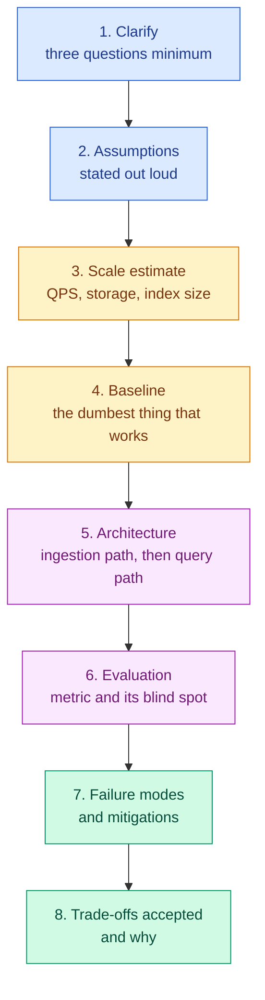
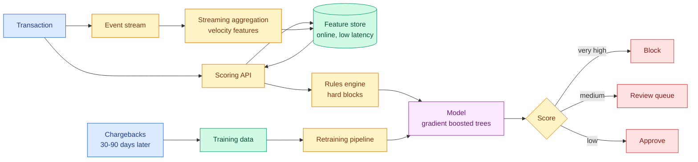
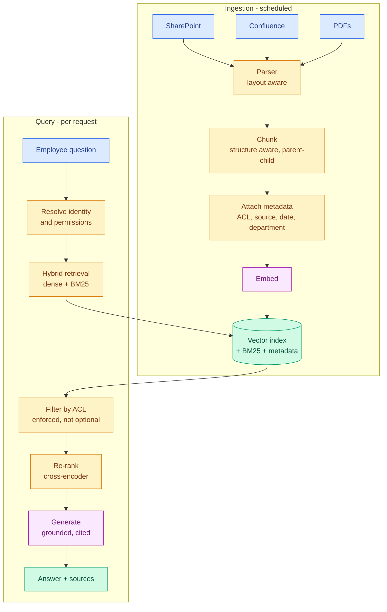
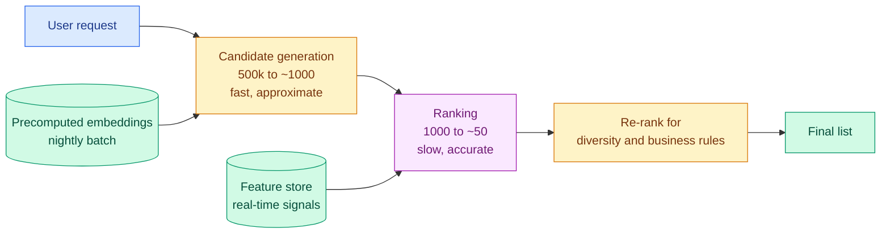
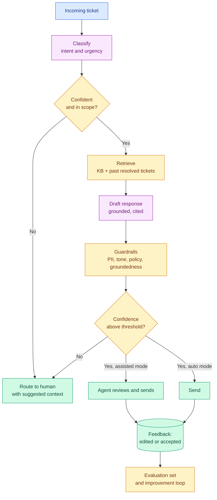
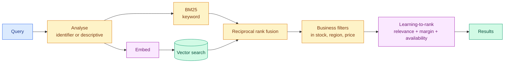
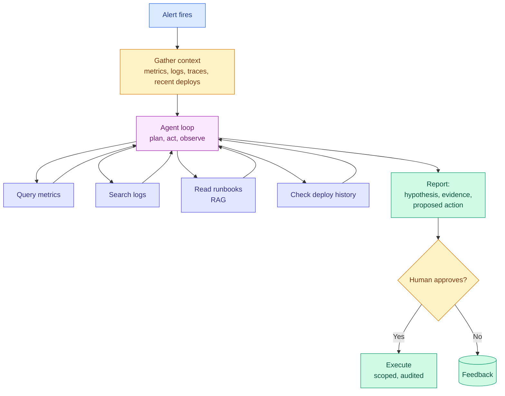
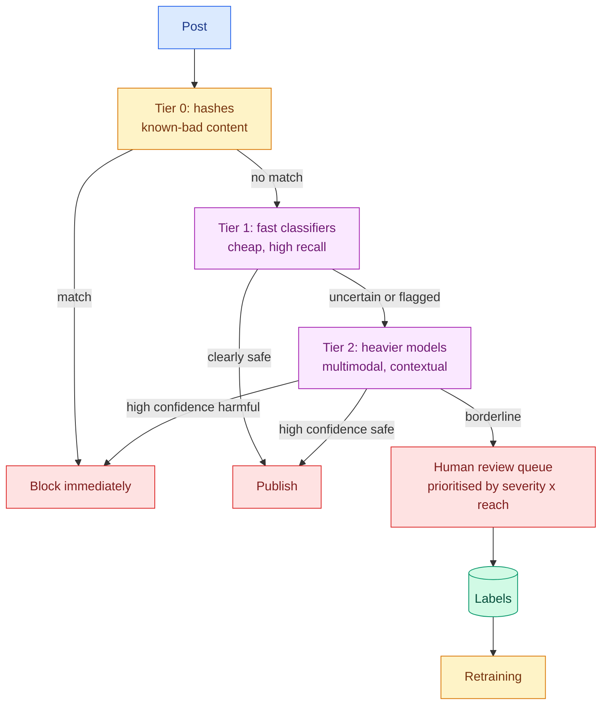

# Bank 6 — Scenario-Based Questions

**Level:** 🔴 Advanced &nbsp;|&nbsp; **Effort:** Multi-session &nbsp;|&nbsp; **Scenarios:** 12

Twelve full design and diagnosis scenarios, each with the clarifying questions to ask, a worked
architecture, the trade-offs to name, and the follow-up grilling you should expect.

These are 15–45 minute conversations, not 90-second answers. Work through one at a time, out loud,
before reading the model answer.

---

## The structure that carries every scenario

⚠️ **The single most common failure:** naming technologies in step 1. "I'd use Kafka and a vector
database" before you know the latency budget tells the interviewer you design by habit.

---

## Scenario 1 — Real-time fraud detection

> *"Design a fraud-detection system for a payments company. 50,000 transactions per second at peak."*

<b>Model answer</b>

### Clarify first

- **Latency budget?** Assume we must decide before authorising — so roughly 100 ms end to end,
  including feature lookup.
- **What action follows a positive?** Block outright, or send to human review? This sets the
  precision requirement entirely.
- **Review capacity?** Say 500 cases/hour. That, not an F1 score, defines the operating point.
- **Label latency?** Chargebacks arrive 30–90 days later. So supervised feedback is very delayed.

### Scale estimate

50,000 transactions/second at peak. If fraud is 0.1%, that is ~50 fraudulent/second — but review
capacity is ~0.14/second. **We can only escalate a tiny fraction, so precision at very low alert
volume is the whole problem.**

### Architecture

**Model choice:** gradient-boosted trees, not deep learning. Tabular data, sub-100 ms latency,
partial interpretability needed for disputes and regulators. This is a case where the boring answer
is correct and saying so confidently is a positive signal.

**Features that matter:** velocity (transactions per card per hour, per device, per merchant),
deviation from the customer's own baseline, graph features linking accounts through shared devices
or addresses. Graph features are usually the biggest lift and the most expensive to compute — I would
precompute them.

**Tiering:** deterministic rules for known-bad patterns (instant, auditable, no model risk), model
scoring for the rest, three-way outcome rather than binary.

### Evaluation

- Precision at the alert volume the review team can staff — **not** F1.
- **Recall weighted by transaction value**, not by case count. Catching 30% of cases but 80% of the
  money is a good system.
- Honest caveat to raise: **we cannot measure true recall.** Fraud we blocked never generates a
  chargeback, and fraud we missed and was never disputed is invisible. Our measured recall is
  optimistic. A small randomised holdout that bypasses the model gives unbiased estimates — expensive,
  and the right thing to do.

### Failure modes

| Failure | Mitigation |
| --- | --- |
| Adversarial adaptation | Frequent retraining; monitor score distribution shifts |
| Feature store outage | Fail to rules-only mode, not fail-open |
| Model blocks legitimate customers | Cap block rate; monitor false-positive complaints |
| Feedback loop — blocked transactions never labelled | Randomised holdout |
| Latency spike at peak | Precompute features; degrade to rules under load |

### Trade-offs accepted

Trees over deep learning (latency and interpretability over marginal accuracy); three-way tiering
over binary (added complexity for better use of scarce review capacity); precomputed graph features
(staleness for latency).

### Expect these follow-ups

- *"Fraudsters adapt within days. How do you keep up?"* → Retrain frequently on recent data with
  time-weighted sampling; monitor score-distribution drift as an early warning; keep rules as the
  fast-response layer since a rule ships in minutes and a model in days.
- *"The block rate doubled overnight. What do you do?"* → Roll back first. Then check for a deploy,
  an upstream feature break, or a genuine attack. Segment by merchant and geography.

---

## Scenario 2 — Enterprise RAG over internal documents

> *"Build a system so 5,000 employees can ask questions about internal policies, with citations.
> Documents are in SharePoint, Confluence and PDFs. Permissions vary by department."*

<b>Model answer</b>

### Clarify first

- **Permissions:** must answers respect per-document access control? (Assume yes — this dominates
  the design.)
- **Corpus size and change rate?** Assume 200,000 documents, ~1% changing weekly.
- **Acceptable latency?** A few seconds is fine for an internal tool.
- **What happens when it does not know?** Must refuse rather than guess. Non-negotiable for policy
  questions.

### Scale estimate

200,000 documents × ~20 chunks = **4 million chunks**. At 768 dimensions × 4 bytes ≈ 12 GB of raw
vectors, meaningfully more with an HNSW index. Fits comfortably on one machine — this does **not**
need a distributed vector database, and saying so demonstrates judgement.

### Architecture

### The three decisions that make or break this

**1. Permission filtering must be at retrieval, and it must be pre-filter.** Retrieving then
filtering can return zero results after filtering; filtering during search is correct but harder.
Store the access-control list as chunk metadata and filter within the approximate-nearest-neighbour
search. **Test this with an automated test asserting user A never retrieves user B's restricted
document.** Permission leakage here is a data breach delivered as a helpful answer.

**2. Document parsing quality dominates everything downstream.** PDFs with tables, multi-column
layouts and scanned pages are where these projects actually fail. I would use layout-aware parsing,
handle tables as units, and be explicit that Optical Character Recognition on scans is lossy —
flagging low-confidence extractions rather than silently indexing garbage.

**3. Freshness.** Policy documents change and stale answers are worse than no answer. Incremental
reindexing on change events, plus recency metadata so retrieval can prefer current versions, plus
displaying the document date in the citation so the human can judge.

### Evaluation

- **Retrieval:** recall@10 against 100 real questions with known source passages.
- **Generation:** faithfulness (claims supported by context), citation correctness (do cited
  documents actually contain the claim).
- **Refusal rate** — a system that never says "I don't know" is hallucinating instead.
- **Permission correctness** — automated, on every deploy.

### Trade-offs accepted

Single-node vector index (simplicity over headroom we do not need); hybrid search (latency and
complexity for recall on policy codes and acronyms); parent-child chunking (storage for precision
plus context).

### Expect these follow-ups

- *"An employee's permissions change. How fast does that take effect?"* → ACLs resolved at query
  time from the identity provider, not baked into the index at ingestion. Otherwise revocation
  requires reindexing.
- *"How do you stop it answering from an outdated policy?"* → Recency metadata, prefer-current
  filtering, superseded-document marking at ingestion, and always showing the date.

---

## Scenario 3 — Recommendations at scale

> *"Design a recommendation system for a streaming service. 100 million users, 500,000 titles."*

<b>Model answer</b>

### Clarify

- **Where does it appear?** Homepage rows, "because you watched", search ranking? Different problems.
- **Optimise for what?** Clicks, watch time, retention? These conflict, and it matters enormously.
- **Latency budget?** Homepage load, so ~100 ms.
- **Cold start** for new users and new titles?

### The retrieve-then-rank pattern

You cannot score 500,000 titles per request in 100 ms. Two stages:

**Candidate generation** — multiple cheap sources unioned: approximate nearest neighbour over user
and item embeddings (computed nightly), recent popularity, continue-watching, same-genre. Optimise
for **recall**; a title not retrieved can never be recommended.

**Ranking** — a heavier model with rich features: user history, item metadata, context (time of day,
device), and cross features. Optimise for **precision at the top**.

**Re-ranking** — diversity (do not fill a row with one genre), business rules (promote originals),
and freshness.

### The three problems they will probe

**1. Cold start.** New users: popularity by region, onboarding preference selection, demographic
priors. New titles: content-based features from metadata and artwork; deliberately explore by
showing them to a small random slice, accepting short-term cost for long-term catalogue learning.

**2. Feedback loops.** Recommending popular titles generates data proving popular titles get
watched. The catalogue collapses toward a head. Counter with explicit exploration (bandits), a
diversity term in the objective, and monitoring **catalogue coverage** as a first-class metric
alongside engagement.

**3. Objective mismatch.** Optimising clicks gives clickbait thumbnails. Optimising watch time gives
long content regardless of quality. What the business wants is retention, which is measurable only
over months. The practical answer: a weighted combination of proximal signals, validated
periodically against a long-horizon retention A/B test.

### Evaluation

Offline: recall@k for candidates, NDCG for ranking — necessary but weakly correlated with online
outcomes. Online: A/B test on engagement *and* retention *and* catalogue coverage. **Say explicitly
that offline metrics are a filter, not a decision** — an offline win that does not replicate online
is routine.

### Expect these follow-ups

- *"Offline NDCG improved 5% but the A/B test was flat. Why?"* → Offline evaluation uses logged data
  the old model generated, so it is biased toward the old model's choices. Position bias,
  presentation bias, and the fact that you cannot observe counterfactual outcomes.
- *"How do you handle a user who watched one thing six months ago?"* → Fall back up the hierarchy:
  weak personal signal → segment → popularity. And decay old signals rather than treating them as
  current preference.

---

## Scenario 4 — The model that got worse

> *"Your churn model has been in production for eight months. AUC in the weekly report has slid from
> 0.84 to 0.71. Diagnose."*

<b>Model answer</b>

**Mitigate first if the impact is material** — but a gradual slide is not an outage, so here I would
diagnose before acting.

**Step 1 — is the metric real?** Verify the evaluation pipeline itself. A changed label definition,
a broken join, or a shifted evaluation window looks exactly like model decay. Check whether the
*population* being evaluated changed — if marketing brought in a different customer segment, you are
scoring a different problem.

**Step 2 — gradual or stepped?** Plot AUC weekly. A gradual slide suggests drift. A step change on a
specific date means something *changed* on that date: a deploy, a schema change, an upstream job.
This one distinction cuts the search space in half and most candidates skip it.

**Step 3 — data quality.** Null rates, cardinality, value ranges per feature versus training.
Look for a feature that silently became mostly-null or mostly-default — the single most common cause.

**Step 4 — data drift.** Per-feature distribution comparison weighted by feature importance. If the
top features have shifted, the model is extrapolating.

**Step 5 — concept drift.** Inputs look similar but the relationship changed. Detectable only
against labels. Test by training a fresh model on recent data: if it substantially beats the
incumbent on recent data, the relationship moved.

**Step 6 — feedback loop.** This is the one specific to churn and worth raising unprompted: **the
model triggered retention interventions.** Customers it flagged got offers and did not churn. So the
model's own success destroyed its apparent accuracy — the labels no longer reflect what would have
happened without intervention.

That reframing is the strongest thing you can say here. The fix is a randomised control holdout that
receives no intervention, giving unbiased labels to train and evaluate on.

**Step 7 — sample size and segment analysis.** Is the drop uniform, or concentrated in one segment
or region? Aggregate metrics hide segment collapse.

**The remediation:** retrain on recent data, establish a holdout, add drift monitoring with
importance weighting, and set up a scheduled retrain with an evaluation gate so this is caught in
week two rather than month eight.

**The line that lands:** "The finding I'd care most about isn't the cause — it's that this took
eight months to surface. That's a monitoring gap, and fixing it prevents the next five incidents,
not just this one."

---

## Scenario 5 — Customer-support assistant

> *"Build an AI assistant to handle tier-1 support tickets. 10,000 tickets/day, 40% are repetitive."*

<b>Model answer</b>

### Clarify

- **Fully autonomous or assisted?** Start assisted — draft for the agent to approve. Far lower risk,
  and the approvals generate training and evaluation data. Recommending this shows product judgement.
- **What can it act on?** Answering is one thing; issuing a refund is another. Actions need approval
  gates.
- **What is the cost of a wrong answer?** Determines the confidence threshold for escalation.
- **Languages, channels, existing knowledge base quality?**

### Architecture

### The decisions that matter

**Scope narrowly, then expand.** Do not launch across all intents. Pick the three highest-volume,
lowest-risk intents ("where is my order", "how do I reset my password"), get those to high accuracy,
then expand. A broad launch at 70% accuracy destroys trust permanently and you do not get a second
chance with the support team.

**Escalation is a feature, not a failure.** Explicit "I'm not sure, connecting you to a person" beats
a confident wrong answer by a wide margin in support. Tune the threshold from the cost asymmetry.

**Past resolved tickets are your best retrieval corpus** — often better than the official knowledge
base, because they contain how issues were *actually* resolved rather than how the documentation says
they should be. Worth saying; it is a non-obvious, experience-derived point.

**Agent edits are free training data.** If an agent rewrites a draft, that pair is a preference
signal. Capture it deliberately.

### Evaluation

- **Deflection rate** — tickets resolved without a human. The headline business metric.
- **Customer satisfaction on handled tickets, compared with human-handled** — deflection at the cost
  of satisfaction is not a win.
- **Escalation accuracy** — of the ones it escalated, how many genuinely needed a human? And more
  importantly, of the ones it handled, how many *should* have been escalated?
- **Groundedness** and **edit rate** in assisted mode.
- **Time to resolution**, not just volume.

### Failure modes

Confident wrong answers on policy questions (mitigate: grounding requirement, refusal training);
prompt injection through ticket content (mitigate: treat ticket text as untrusted data, never as
instruction); PII leakage from retrieved tickets (mitigate: redaction at ingestion, per-customer
filtering); tone failures on angry customers (mitigate: sentiment-based routing to humans).

---

## Scenario 6 — Medical imaging classifier

> *"Build a model to detect a condition from chest X-rays. You have 50,000 labelled images."*

<b>Model answer</b>

### Clarify — and here the clarifications are the answer

- **Screening or diagnosis?** Screening tolerates false positives (a follow-up test is cheap);
  diagnosis does not. This sets the entire operating point.
- **Is a clinician in the loop?** Almost certainly yes, and should be. The model prioritises and
  flags; it does not decide.
- **Where did the 50,000 images come from?** One hospital, one scanner model, one population? This
  is the generalisation question and it is where these projects fail.
- **Regulatory pathway?** Medical devices are regulated. This constrains everything and I would want
  regulatory input before designing, not after.

### Technical approach

**Transfer learning, not from scratch.** 50,000 images is a lot for a hospital and small for vision.
Start from a pretrained backbone and fine-tune.

**Splitting is where this goes wrong.** Split **by patient**, never by image. The same patient with
multiple images across train and test leaks, and produces a beautiful, meaningless number. If you
have multiple hospitals, hold out an entire hospital as an external validation set — that is the only
honest test of generalisation.

**Augmentation** that respects the physics: small rotations, brightness and contrast within
realistic ranges. **Do not horizontally flip chest X-rays** — it mirrors the heart to the wrong side
and teaches anatomically impossible images. Domain-inappropriate augmentation is a classic and
mentioning it signals you have thought past the tutorial.

**Class imbalance** is likely severe. Class weighting, threshold tuning at the clinically-relevant
operating point, and PR-AUC rather than accuracy.

### Evaluation

- **Sensitivity at a fixed specificity** agreed with clinicians — not F1, not accuracy. The
  clinicians define the operating point; you do not.
- **Per-subgroup performance**: age, sex, scanner manufacturer, hospital. A model that works on
  average and fails for one group is not deployable, and this is both a safety and a fairness
  requirement.
- **External validation** on a different hospital's data. Expect a drop; report it honestly. Models
  that do not generalise across sites are the norm, not the exception.
- **Comparison against clinician performance**, and ideally clinician-with-model versus
  clinician-alone — the deployed configuration is the one to measure.

### The risks to raise unprompted

**Shortcut learning.** Models learn spurious correlates — a scanner watermark, a portable-scanner
marker (which correlates with sicker patients), a laterality token. The model appears excellent and
has learned the hospital's workflow rather than the pathology. Mitigate with saliency inspection on
a sample, and external validation.

**Distribution shift over time** as equipment and protocols change.

**Automation bias** — clinicians may over-trust the output. Presentation matters: show uncertainty,
show the evidence region, do not present a bare confident label.

**Deployment discipline:** clinician-in-the-loop always, extensive prospective validation before
autonomous use, monitoring per site, and a documented model card with the population it was
validated on and where it should not be used.

**The framing:** "The technical work here is the easy part. The hard parts are patient-level
splitting, subgroup validation, external generalisation and the regulatory pathway — and getting
those wrong is how these systems harm people."

---

## Scenario 7 — Semantic search over a product catalogue

> *"E-commerce site, 5 million products. Current keyword search has poor conversion on
> natural-language queries."*

<b>Model answer</b>

### Clarify

- **What does the query distribution look like?** Typically bimodal: exact identifiers ("iPhone 15
  Pro 256GB") and descriptive ("warm jacket for hiking in winter"). This shapes everything.
- **Is the problem retrieval or ranking?** Are the right products not returned, or returned and
  ranked badly? Different fix entirely, and worth measuring before designing.
- **Latency budget?** Search demands sub-200 ms.

### The key insight

**Do not replace keyword search — augment it.** Semantic search alone is *worse* for identifier
queries, and those are usually the highest-converting traffic. Anyone proposing a pure vector-search
replacement has not looked at the query distribution.

### What to embed — a genuinely non-obvious decision

Not just the product title. Compose a text representation: title, category path, key attributes,
brand, and a distilled portion of the description. Raw marketing copy adds noise. For fashion and
homeware, image embeddings add real signal — multimodal retrieval matters where appearance is the
purchase driver.

### Ranking

Relevance is not the objective — **conversion** is. The ranker should combine semantic relevance,
historical conversion rate, margin, availability and freshness. State the tension explicitly:
optimising purely for margin degrades trust and long-term retention. That trade-off is a business
decision to surface, not one to make silently.

### Evaluation

- **Offline:** recall@k and NDCG on a judged query set, with identifier and descriptive queries
  reported separately — the aggregate will hide a regression in one class.
- **Online:** A/B test on conversion, revenue per session and null-result rate.
- **Zero-result rate** is the metric to watch on launch; semantic search should crush it, and that
  alone often justifies the project.

### Failure modes

Semantic search returning plausible-but-wrong items for identifier queries (mitigate: hybrid, and
boost exact matches); embedding staleness as the catalogue changes (mitigate: incremental
reindexing on product updates); out-of-stock items ranking highly (mitigate: filter, do not just
downrank); and the migration cost when the embedding model is upgraded — 5 million products is a
real re-embedding job, so store raw text separately from vectors.

---

## Scenario 8 — LLM cost blowout

> *"Your LLM feature launched last month. The bill is 5× the forecast. Fix it without degrading
> quality."*

<b>Model answer</b>

**Instrument before optimising.** Break the spend down by feature, by endpoint, by tenant, and split
input versus output tokens. In most systems a small number of call sites dominate, and optimising
the others returns nothing.

**The usual culprits, in the order I would check:**

1. **A long system prompt paid on every call.** Few-shot examples that were needed during
   development and are not needed now. Measure quality with them removed — often no regression.
2. **Retrieving too much context.** Passing 10 chunks where 3 suffice triples input cost and often
   *reduces* quality through dilution. Measure recall@3 versus recall@10.
3. **Using a large model for easy requests.** The biggest single lever. Classify difficulty and
   route: a small model handles the routine majority, escalating only hard cases. Requires an
   evaluation proving the small model is adequate for its share — do this before shipping the router.
4. **No caching.** Exact-match caching on repeated queries is free and effective. Semantic caching
   catches near-duplicates — with the caveat that a loose threshold returns an answer to a *similar
   but different* question, which is worse than a miss.
5. **Unbounded output length.** Output tokens usually cost more than input.
6. **Retry storms.** A failed call retried three times triples cost for the worst requests. Check the
   retry policy and whether failures are being retried on non-retryable errors.
7. **Interactive path used for batch work.** Anything not user-facing should be on the batch path.

**Then structural options:** prompt caching if the provider supports shared-prefix discounts, and
fine-tuning a small model for the highest-volume narrow task — often dramatically cheaper per call
once volume justifies the upfront investment.

**Guardrails so it does not recur:** per-tenant and per-feature spend caps with alerts, cost per
request as a monitored metric with a regression alert, and cost included in the pre-launch checklist
alongside latency.

**The framing that lands:** "I'd resist across-the-board cuts. I'd find the 20% of call sites
driving 80% of spend, fix those with measured quality checks, and leave the rest alone. And I'd want
cost-per-request in the dashboard permanently — this was a monitoring gap as much as a design one."

---

## Scenario 9 — Demand forecasting

> *"A retailer wants weekly demand forecasts per product per store. 2,000 stores, 30,000 products."*

<b>Model answer</b>

### Clarify

- **What decision does the forecast drive?** Replenishment ordering. So the error that matters is
  asymmetric — stockouts and overstock cost differently, and that should shape the loss function.
- **Lead time?** If ordering takes two weeks, we forecast two weeks ahead, not one.
- **How much history?** Assume three years.

### Scale reality

2,000 × 30,000 = **60 million series**. Most are sparse — many products sell zero units in most
stores in most weeks. Fitting 60 million individual ARIMA models is neither feasible nor sensible.

**The right answer: a single global model** over all series, with store and product as features.
It shares statistical strength across series, handles sparsity, and handles new products via their
attributes. Gradient-boosted trees on engineered features is a strong, boring, and usually winning
choice — deep forecasting models rarely justify their operational cost at this scale.

### Features

Lags (1, 2, 4, 52 weeks), rolling statistics, product hierarchy aggregates, store attributes, price
and promotion flags, calendar effects (holidays, paydays), and weather where relevant.

⚠️ **The leakage trap specific to forecasting:** every feature must be computable at prediction time
using only data available then. A rolling mean that includes the target week is leakage and will
produce a spectacular backtest and a useless model.

### Validation

**Rolling-origin (walk-forward) backtesting.** Train on data up to time t, predict t+1 to t+lead,
roll forward, repeat. Random k-fold is simply wrong here.

**Metrics:** the business asymmetry matters more than the statistic. Weighted MAPE hides errors on
low-volume products and breaks on zeros. I would use a **pinball loss at the relevant quantile**,
because inventory decisions need a distribution, not a point estimate — you order to a service level,
not to the mean. Proposing quantile forecasting rather than point forecasting is the strongest
technical move in this scenario.

**And always report the naive baseline:** last week's sales, or the same week last year. A
surprising share of forecasting projects fail to beat it, and knowing that number keeps everyone
honest.

### Failure modes

Promotions and price changes not in the feature set (huge, non-stationary effects); new products
with no history (fall back to attribute-based similar-product models); demand censored by stockouts
— you observe *sales*, not *demand*, so a stockout looks like low demand and teaches the model to
under-order, creating a self-reinforcing loop. That last one is the subtle, high-value observation
here.

---

## Scenario 10 — Agentic DevOps assistant

> *"Build an agent that can investigate production alerts and propose remediations."*

<b>Model answer</b>

### Clarify first — and here, scope is safety

- **Can it act, or only propose?** Start read-only. This is not conservatism, it is how you get
  permission to exist.
- **What is the blast radius of a wrong action?** Restarting a pod is recoverable; scaling a database
  down is not.
- **Who is accountable when it is wrong?** There must be a named human.

### Architecture

### Non-negotiable controls

| Control | Why |
| --- | --- |
| **Read-only tools by default** | Investigation needs no write access at all |
| **Hard step limit** | A loop at 3am costs money and produces noise |
| **Per-run cost cap** | Same reason, enforced independently |
| **Per-tool timeouts** | A hanging query must not hang the incident |
| **Approval gate on every mutation** | The human is the safety boundary, not the prompt |
| **Scoped credentials per run** | Least privilege; no shared admin token |
| **Full trace logging** | You must be able to reconstruct what it did and why |
| **Kill switch** | Disable without a deploy |

**The security point to raise unprompted:** log content is attacker-influenceable. Someone can put
text in a log line that reads as an instruction. **This is indirect prompt injection with production
credentials attached** — which is exactly why the agent's *permissions*, not its prompt, are the real
control. Assume injection succeeds eventually; make the outcome survivable.

### Evaluation

Replay historical incidents with known root causes and measure: did it identify the correct cause,
how many steps did it take, did it propose a safe action, did it ever attempt something outside its
authority. Run each incident multiple times — agents are non-deterministic, so report a success
*rate* with variance, not a pass/fail.

**The metric that matters commercially:** time-to-hypothesis for the on-call engineer. Even at 60%
accuracy, an agent that gathers all the context and proposes a starting point saves real minutes at
3am — and that is a defensible value proposition without claiming autonomy.

### Trade-offs accepted

Read-only start (slower value delivery for safety and trust); approval gates (latency for
accountability); replay-based evaluation (limited to incidents we have seen).

---

## Scenario 11 — Content moderation at scale

> *"Moderate user-generated content: 10 million posts/day, text and images."*

<b>Model answer</b>

### Clarify

- **What categories?** Each has different prevalence, different severity and different legal
  standing. They should not share one threshold.
- **Legal obligations?** Some categories require removal within defined timeframes in some
  jurisdictions.
- **Human review capacity?** This caps how much can be escalated, exactly as in fraud.
- **Appeals process?** Required, and it changes the design.

### Tiered architecture

**Why tiering:** 10 million/day is ~115/second sustained, far higher at peak. Running a heavy
multimodal model on everything is unaffordable. Cheap high-recall filters handle the vast majority;
expensive models see only the uncertain slice.

### The decisions that define this system

**Different thresholds per category, set from harm asymmetry.** For severe categories, high recall
even at heavy false-positive cost. For ambiguous categories like spam, precision matters more —
wrongly removing legitimate content has its own serious cost.

**Prioritise the review queue by severity × reach**, not by arrival time. A borderline post from an
account with a million followers matters more than one from a new account with none.

**Context changes everything.** The same words can be an attack or a quotation reporting an attack.
Purely text-classifier approaches over-remove counter-speech and reclaimed language — a well-documented
fairness failure. Mention this; it demonstrates you know the literature's hard problems.

### Evaluation

Per-category precision and recall — never aggregate. **Per-language and per-dialect performance**,
because moderation models systematically underperform on lower-resourced languages and on dialects,
which is a real and measurable fairness harm. Appeal-overturn rate as a direct false-positive signal.
And prevalence — what fraction of *viewed* content is violating — which is the metric that reflects
user experience rather than internal throughput.

### Failure modes and responsibilities

Adversarial evasion (deliberate misspellings, image manipulation) requiring continuous retraining;
false positives on marginalised communities' speech; reviewer wellbeing, which is a genuine
operational responsibility and worth naming; and coordinated brigading that looks like organic
volume.

**The line:** "I'd design assuming both error types are harmful. Over-removal silences people;
under-removal harms people. There's no threshold that eliminates both, so the honest deliverable is
a measured, per-category, per-language trade-off that a policy team owns — not an engineering
decision made silently."

---

## Scenario 12 — Migrating a monolithic model to multi-tenant SaaS

> *"You have one model serving one large customer. Sales sold it to 50 more. Design the migration."*

<b>Model answer</b>

### Clarify

- **Do tenants need different model behaviour**, or the same model on different data? This is the
  fork in the road.
- **Data isolation requirements?** Contractual, regulatory, or best-effort?
- **Scale distribution?** Usually heavily skewed — a few large tenants, a long tail of small ones.

### The three architectures

| Approach | Isolation | Cost | Personalisation | Operations |
| --- | --- | --- | --- | --- |
| **Shared model, shared infra, filtered data** | Logical only | Lowest | None | Simplest |
| **Shared base + per-tenant adapters/retrieval** | Good | Moderate | Good | Moderate |
| **Fully separate deployment per tenant** | Strongest | Highest | Full | 50× the operational burden |

**My recommendation for most cases: the middle one.** A shared base model with per-tenant retrieval
namespaces and, where behaviour genuinely differs, per-tenant LoRA adapters. Adapters are megabytes,
so you can hold many against one loaded base — this is exactly the property that makes LoRA valuable
operationally, not just for training economics.

**Reserve full isolation** for tenants whose contracts require it, and price it accordingly. Do not
give every tenant the most expensive architecture because one demanded it.

### Isolation controls — the part they are really testing

- Tenant ID on every record, enforced at the **database** level, not only in application code
- **Separate vector namespaces per tenant**, with the filter enforced in the retrieval layer
- Tenant derived from the verified auth token, never from a request parameter
- **Cache keyed by tenant** — a shared semantic cache is a cross-tenant leak, and it is the one
  people miss
- **Never fine-tune one shared model on multiple tenants' private data** — the weights become an
  exfiltration path
- An automated test asserting tenant A cannot retrieve tenant B's data, running on every deploy

### Operational changes the migration forces

- **Per-tenant rate limits and spend caps**, so one tenant cannot exhaust shared capacity
- **Per-tenant cost attribution** — otherwise you cannot tell which customers are unprofitable, and
  with a skewed distribution some will be
- **Per-tenant metrics**, because aggregate quality can look fine while the model is useless for a
  specific customer's data
- **Noisy-neighbour handling** — queueing and fair scheduling
- **Onboarding automation** — 50 tenants means provisioning must not be manual
- **Per-tenant rollout capability**, so a change can be canaried on one customer

### Migration sequence

1. Add tenancy to the data model *before* onboarding anyone — retrofitting isolation is far worse.
2. Migrate the existing customer to the multi-tenant path, still alone. Validate isolation
   machinery with a single tenant where mistakes are cheap.
3. Onboard one new tenant. Fix what breaks.
4. Onboard in waves, monitoring per-tenant metrics.

**The framing:** "The technical work is manageable. The risk is that isolation bugs are silent —
nobody notices tenant A seeing tenant B's data until someone reports it, and by then it is a breach.
So I'd build the isolation test first and treat it as a release blocker."

---

## ✅ Key takeaways

- **Clarify before designing.** Three questions minimum. Naming technologies first is the standard
  way to fail these.
- **Scale estimates make designs concrete.** "4 million chunks, ~12 GB, fits on one node" is worth
  more than any architecture diagram.
- **Name your baseline.** The dumbest thing that works tells the interviewer you measure.
- **Retrieve-then-rank** appears in search, recommendations and RAG. Know the pattern.
- **Feedback loops** appear in fraud, churn, recommendations and moderation — the model changes the
  world it measures. Raising this unprompted is the single strongest move in most scenarios.
- **Finish with the trade-offs you accepted.** Interviewers hire people who say "the trade-off I'm
  accepting is…".

## 📚 Official References

- [scikit-learn: Time-related feature engineering — scikit-learn developers](https://scikit-learn.org/stable/auto_examples/applications/plot_cyclical_feature_engineering.html) — verified 2026-07-27
- [scikit-learn: Cross-validation for time series — scikit-learn developers](https://scikit-learn.org/stable/modules/cross_validation.html#time-series-split) — verified 2026-07-27
- [Kubernetes Documentation — CNCF](https://kubernetes.io/docs/home/) — verified 2026-07-27
- [Apache Kafka Documentation — Apache Software Foundation](https://kafka.apache.org/documentation/) — verified 2026-07-27
- [OWASP Top 10 for Large Language Model Applications — OWASP](https://owasp.org/www-project-top-10-for-large-language-model-applications/) — verified 2026-07-27
- [NIST AI Risk Management Framework — NIST](https://www.nist.gov/itl/ai-risk-management-framework) — verified 2026-07-27

---

[← Bank 5: MLOps & Production](05-mlops-and-production.md) &nbsp;|&nbsp; [Module home](README.md) &nbsp;|&nbsp; [Bank 7: Real-World Use Cases →](07-real-world-use-cases.md)
