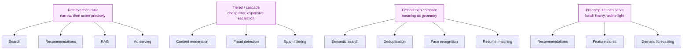

# Bank 7 — Real-World Use Cases

**Level:** 🟡 Intermediate &nbsp;|&nbsp; **Effort:** Detailed module &nbsp;|&nbsp; **Use cases:** 14

Fourteen AI systems you already use, explained in terms of the techniques behind them — and what to
say about each in an interview.

**Why this bank exists:** "spam filtering is a classic imbalanced-classification problem, which is
why precision at a fixed recall matters more than accuracy" beats any textbook definition. Attaching
a real system to every concept is the cheapest way to sound like someone who has built things.

> ⚠️ **Read this honestly.** These are *illustrative* architectures based on publicly documented
> patterns and published research, not descriptions of any specific company's internal system. In
> an interview, say "a system like this typically works by…" rather than claiming inside knowledge
> you do not have. Interviewers notice, and overclaiming costs more than it gains.

---

## The technique map

Most production AI reduces to a handful of patterns applied repeatedly:

Recognising which pattern a new problem fits is most of system design. When an interviewer describes
an unfamiliar system, naming the pattern first buys you a structure to fill in.

---

## 1. Streaming recommendations

**The problem:** 500,000 titles, 100 million users, and a homepage that must load in under a second.

**How it works:** a two-stage retrieve-then-rank pipeline. Candidate generation narrows the catalogue
to roughly a thousand items using cheap approximate nearest-neighbour search over precomputed user
and item embeddings, unioned with popularity and continue-watching sources. A heavier ranking model
then scores those candidates with rich contextual features. Finally a re-ranking pass enforces
diversity and business rules.

**Techniques:** collaborative filtering, matrix factorisation, two-tower neural retrieval,
learning-to-rank, multi-armed bandits for exploration.

**What to say in an interview:**
> "The interesting constraint isn't accuracy, it's that you can't score half a million items in
> 100 ms. That's why every large recommender is retrieve-then-rank — cheap and high-recall first,
> expensive and high-precision second."

**The nuance that impresses:** feedback loops. Recommending popular items generates evidence that
popular items get watched, and the catalogue collapses toward a head. Serious systems monitor
**catalogue coverage** as a first-class metric alongside engagement, and deliberately explore.

→ [21 Recommender Systems](../21-recommender-systems/README.md)

---

## 2. E-commerce search

**The problem:** queries range from "iPhone 15 Pro 256GB" to "something warm for hiking in winter".

**How it works:** hybrid retrieval. BM25 keyword matching handles identifiers, model numbers and
brand names. Dense embedding search handles descriptive and paraphrased intent. The two ranked lists
are fused (usually by reciprocal rank fusion), filtered by business constraints such as stock and
region, then ranked by a model optimising for conversion rather than pure relevance.

**Techniques:** BM25, sentence embeddings, approximate nearest-neighbour indexes, learning-to-rank,
query understanding and spell correction.

**What to say:**
> "The mistake is replacing keyword search with vector search. Semantic search is *worse* for
> identifier queries, and those usually convert best. Hybrid is not a refinement, it's the design."

**The tension worth naming:** the ranker optimises conversion, which pulls in margin and
availability. Push that too far and you degrade trust and long-term retention. That is a business
trade-off to surface explicitly, not one to make silently in a loss function.

→ [15 Embeddings and Vector Search](../15-embeddings-and-vector-search/README.md)

---

## 3. Payment fraud detection

**The problem:** decide in under 100 ms, on a heavily imbalanced problem, where labels arrive
30–90 days later as chargebacks.

**How it works:** a rules layer catches known-bad patterns instantly and auditably. A gradient-boosted
tree model scores the rest using velocity features (transactions per card per hour, per device),
deviation from the customer's own baseline, and graph features linking accounts through shared
devices or addresses. Outcomes are three-way: block, review, approve.

**Techniques:** gradient-boosted trees, streaming feature aggregation, graph features, cost-sensitive
thresholds.

**What to say:**
> "Deep learning usually loses here. It's tabular data with a hard latency budget and an
> interpretability requirement for disputes — gradient-boosted trees win on all three axes."

**The measurement point that separates candidates:** you cannot measure true recall. Fraud you
blocked never produces a chargeback; fraud you missed and nobody disputed is invisible. A small
randomised holdout that bypasses the model is the only way to get unbiased estimates — expensive,
and correct.

→ [Scenario 1](06-scenario-based-questions.md#scenario-1--real-time-fraud-detection)

---

## 4. Email spam filtering

**The problem:** the oldest production ML use case, and still instructive.

**How it works:** a cascade. Cheap signals first — sender reputation, authentication records, IP
blocklists, known-bad content hashes. Then content classification over text and headers. Then
per-user personalisation, because one person's newsletter is another's spam.

**Techniques:** naive Bayes historically, now gradient boosting and transformer classifiers;
per-user threshold adaptation; continuous retraining against adversarial adaptation.

**What to say:**
> "It's the canonical asymmetric-cost problem. A false negative is an annoying email. A false
> positive sends someone's invoice to junk and they lose trust in the product permanently. So you
> tune for very high precision on the spam class and accept letting some through."

**The adversarial angle:** spammers actively adapt to your classifier. Static models decay in weeks,
not months. Continuous retraining is a security requirement, not an optimisation.

---

## 5. Customer-support assistant

**How it works:** classify the incoming ticket's intent and urgency, retrieve from the knowledge base
*and past resolved tickets*, generate a grounded response with citations, and escalate to a human
when confidence is low or the intent is out of scope. Most successful deployments start assisted —
drafting for an agent to approve — rather than autonomous.

**Techniques:** intent classification, RAG, grounding constraints, confidence-based routing,
preference data from agent edits.

**What to say:**
> "Past resolved tickets are usually a better retrieval corpus than the official knowledge base,
> because they contain how issues were *actually* resolved rather than how the docs say they should
> be."

**The product judgement point:** escalation is a feature, not a failure. "I'm not sure, connecting
you to someone" beats a confident wrong answer decisively in support, and the threshold should be
set from that cost asymmetry.

→ [Scenario 5](06-scenario-based-questions.md#scenario-5--customer-support-assistant)

---

## 6. Enterprise document search

**The problem:** employees asking questions across SharePoint, Confluence, PDFs and wikis, with
permissions varying by person.

**How it works:** layout-aware parsing, structure-aware chunking with parent-child retrieval,
embeddings plus BM25 with access-control-list metadata attached to every chunk. At query time the
user's permissions are resolved live and enforced as a pre-filter within the search, then results
are re-ranked and passed to a grounded, citing generator.

**Techniques:** document parsing, chunking strategy, hybrid retrieval, cross-encoder re-ranking,
metadata filtering.

**What to say:**
> "The two things that decide whether this succeeds are document parsing quality and permission
> filtering. Everyone focuses on the model. The projects that fail, fail on tables in PDFs and on
> leaking one department's documents into another's context."

**The security framing:** permission leakage here is a data breach delivered as a helpful answer.
It needs an automated test asserting user A can never retrieve user B's restricted document, running
on every deploy.

→ [16 RAG](../16-rag/README.md)

---

## 7. Medical image analysis

**How it works:** transfer learning from a pretrained vision backbone, fine-tuned on labelled
studies, with patient-level splitting and external validation on a different site's data. Deployed
as a prioritisation and flagging aid with a clinician always in the loop.

**Techniques:** convolutional networks and vision transformers, transfer learning, domain-appropriate
augmentation, calibration, saliency maps for evidence display.

**What to say:**
> "The technical work is the easy part. The hard parts are splitting by patient rather than by
> image, validating on a different hospital's scanners, and reporting per-subgroup performance. A
> model that works on average and fails for one demographic isn't deployable."

**The failure mode to name:** shortcut learning. Models learn scanner watermarks or
portable-scanner markers — which correlate with sicker patients — rather than pathology. The model
looks excellent and has learned the hospital's workflow. External validation is how you catch it.

→ [Scenario 6](06-scenario-based-questions.md#scenario-6--medical-imaging-classifier)

---

## 8. Predictive maintenance

**The problem:** predict equipment failure before it happens, from sensor telemetry.

**How it works:** streaming sensor aggregation into windowed features (rolling means, variances,
rates of change, threshold crossings), then either a supervised classifier where failure labels
exist, or anomaly detection where they do not — which is common, because failures are rare and
maintenance records are often poor.

**Techniques:** time-series feature engineering, isolation forests, autoencoder reconstruction error,
survival analysis for remaining-useful-life.

**What to say:**
> "The label problem defines the approach. Real failures are rare and maintenance logs are usually
> incomplete, so you often end up in unsupervised anomaly detection rather than classification —
> and then the hard part is that 'anomalous' isn't the same as 'about to fail'."

**The economics point:** the cost asymmetry is enormous and specific. Unplanned downtime on a
production line can cost orders of magnitude more than an unnecessary inspection, which drives the
threshold far toward recall — but alert fatigue is real, and a system technicians ignore has zero
value regardless of its AUC.

→ [20 Time Series](../20-time-series/README.md)

---

## 9. Resume screening and job matching

**How it works:** embed job descriptions and candidate profiles into a shared space, retrieve by
similarity, then rank. Almost always deployed as a shortlisting aid with human decision-making, not
as an autonomous filter.

**Techniques:** sentence embeddings, semantic similarity, learning-to-rank, fairness auditing.

**What to say — and this is a case where the *caution* is the strong answer:**
> "This is the use case where I'd push back hardest on autonomy. Historical hiring data encodes
> historical bias, so a model trained to predict 'who got hired' learns to reproduce it. There are
> well-documented cases of exactly this. I'd want per-group outcome auditing, no protected
> attributes and no close proxies as features, and a human making every decision."

**Why it is worth knowing:** it demonstrates you can identify when a technically-feasible system is
an ethically and legally hazardous one. Interviewers, particularly at larger companies, are
specifically listening for that judgement.

→ [26 Responsible AI](../26-responsible-ai/README.md)

---

## 10. Voice assistants

**How it works:** a pipeline. Wake-word detection runs continuously on-device with a tiny model
(privacy and battery). Automatic speech recognition converts audio to text. Intent classification
and slot filling route the request. A response is generated, then text-to-speech renders it.
Increasingly, end-to-end speech models compress these stages.

**Techniques:** spectrogram features, streaming ASR, intent classification, text-to-speech, on-device
inference and quantisation.

**What to say:**
> "The wake-word model is a great example of extreme constraint-driven design: it runs continuously
> on battery, so it must be tiny, quantised and on-device — which also means the audio never leaves
> the device until it fires. The privacy property falls out of the engineering constraint."

**The latency point:** in conversational systems, time-to-first-audio matters far more than total
latency. Streaming everything — recognition, generation, synthesis — is what makes it feel
responsive.

→ [24 Speech & Audio AI](../24-speech-and-audio-ai/README.md)

---

## 11. Code assistants

**How it works:** retrieve relevant context from the open repository (imports, nearby files, type
definitions, recently edited code), construct a prompt with fill-in-the-middle framing, and generate
with a code-tuned model. Latency is the dominant constraint — a suggestion arriving after the
developer has typed the line is worthless.

**Techniques:** fill-in-the-middle training objectives, repository-level retrieval, speculative
decoding, aggressive caching, small fast models over large slow ones.

**What to say:**
> "Acceptance rate is the metric, and it's brutal. A suggestion that arrives 400 ms late has zero
> value even if it's perfect, so this is a use case where a smaller, faster model genuinely beats a
> better, slower one."

**The security angle worth raising:** code comments and repository content are attacker-influenceable
text flowing into a model that generates code someone will run. Indirect prompt injection through a
poisoned dependency's comments is a real threat model, and sandboxing any execution is essential.

→ [18 AI Agents](../18-ai-agents/README.md)

---

## 12. Content moderation

**How it works:** a tiered cascade. Hash matching against known-bad content first (instant, exact).
Cheap high-recall classifiers next. Expensive multimodal models only on the uncertain slice. Human
reviewers on the borderline cases, with the queue prioritised by severity × reach rather than by
arrival order.

**Techniques:** perceptual hashing, text and image classification, multimodal models, active
learning from reviewer labels.

**What to say:**
> "Both error types are harmful, which is unusual. Over-removal silences people; under-removal harms
> people. There's no threshold that eliminates both, so the deliverable is a measured per-category,
> per-language trade-off that a policy team owns — not an engineering decision made quietly in a
> config file."

**The fairness point:** moderation models systematically underperform on lower-resourced languages
and on dialects, and they over-flag reclaimed language and counter-speech. Per-language performance
reporting is a fairness requirement, not a nice-to-have.

→ [Scenario 11](06-scenario-based-questions.md#scenario-11--content-moderation-at-scale)

---

## 13. Demand forecasting and dynamic pricing

**How it works:** a single global model across millions of series (store × product), using lags,
rolling statistics, hierarchy aggregates, calendar effects and promotion flags — rather than
fitting a separate model per series. Increasingly, quantile forecasting rather than point
forecasting, because inventory decisions need a service level, not a mean.

**Techniques:** global gradient-boosted models, rolling-origin backtesting, pinball loss, hierarchical
reconciliation.

**What to say:**
> "You don't fit 60 million ARIMA models. A single global model with store and product as features
> shares statistical strength across series and handles sparsity and new products, which per-series
> models can't."

**The subtle failure to raise:** demand is censored by stockouts. You observe *sales*, not *demand* —
a stockout looks like low demand, teaching the model to under-order, which causes more stockouts.
That self-reinforcing loop is the kind of observation that ends an interview well.

→ [20 Time Series](../20-time-series/README.md)

---

## 14. Cybersecurity anomaly detection

**How it works:** baseline normal behaviour per user, per host and per service from telemetry, then
flag statistically significant deviations. Almost always unsupervised or semi-supervised, because
labelled attack data is scarce and the next attack does not resemble the last one.

**Techniques:** isolation forests, autoencoder reconstruction error, sequence models over event
logs, graph analysis of lateral movement, peer-group baselining.

**What to say:**
> "The base rate is brutal. With millions of events a day and a handful of genuine incidents, even
> 99.9% specificity buries the security team in false positives. So the design goal isn't detection
> rate — it's alert volume that a team can actually triage, which usually means correlation and
> prioritisation rather than a better classifier."

**The adversarial point:** unlike churn or demand, your adversary actively adapts to your detector,
and may probe it deliberately. Static baselines decay, and a model that is easy to fingerprint is
easy to evade.

→ [28 AI Security](../28-ai-security/README.md)

---

## Using these in an interview

**Do:**
- "A system like this typically works by…" — accurate hedging, and it costs you nothing.
- Name the pattern first (retrieve-then-rank, tiered cascade), then fill in details.
- Cite the *constraint* that shapes the design — latency, base rate, label delay, review capacity.
  This is what makes an answer sound lived rather than read.
- Mention one failure mode per system. It is the fastest way to sound experienced.

**Do not:**
- Claim inside knowledge of a specific company's architecture. If they work there, you will be
  wrong; if they do not, you sound like you are guessing.
- Recite performance numbers you cannot source.
- Present a simplified teaching architecture as what a company actually runs.

**The reusable framing:**
> "The interesting constraint here isn't accuracy — it's {latency / base rate / label delay /
> review capacity}. That's what shapes the architecture, and it's why {pattern} is the standard
> approach."

That sentence works across most of these systems, and it reliably moves a conversation from recall
to reasoning — which is where you want it.

---

## ✅ Key takeaways

- Most production AI is four patterns: retrieve-then-rank, tiered cascade, embed-then-compare,
  precompute-then-serve. Name the pattern before designing.
- The **constraint** shapes the architecture more than the algorithm does.
- Feedback loops recur everywhere — recommendations, fraud, moderation, forecasting. The model
  changes the world it measures.
- The boring answer is often correct: gradient-boosted trees for tabular, hybrid search over pure
  vector search, smaller-and-faster over bigger-and-better.
- Knowing when a system is ethically hazardous (resume screening) signals more seniority than
  knowing one more architecture.
- Hedge honestly. "A system like this typically works by…" costs nothing and protects you.

## 📚 Official References

- [Google Machine Learning Glossary — Google](https://developers.google.com/machine-learning/glossary) — verified 2026-07-27
- [Google: Recommendation Systems course — Google](https://developers.google.com/machine-learning/recommendation) — verified 2026-07-27
- [scikit-learn: Novelty and Outlier Detection — scikit-learn developers](https://scikit-learn.org/stable/modules/outlier_detection.html) — verified 2026-07-27
- [Elasticsearch: Relevance and BM25 — Elastic](https://www.elastic.co/guide/en/elasticsearch/reference/current/index-modules-similarity.html) — verified 2026-07-27
- [OWASP Top 10 for Large Language Model Applications — OWASP](https://owasp.org/www-project-top-10-for-large-language-model-applications/) — verified 2026-07-27
- [NIST AI Risk Management Framework — NIST](https://www.nist.gov/itl/ai-risk-management-framework) — verified 2026-07-27

---

[← Bank 6: Scenario-Based](06-scenario-based-questions.md) &nbsp;|&nbsp; [Module home](README.md) &nbsp;|&nbsp; [🏠 Repository Home](../README.md)
