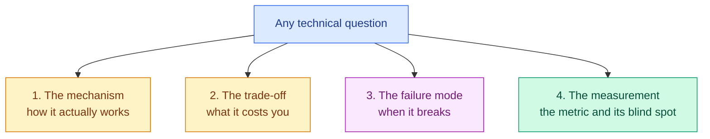
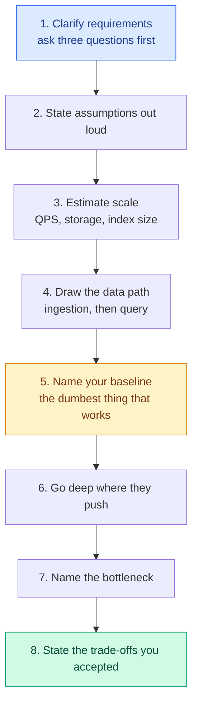

<!-- status: authored -->

# 38. Interview Preparation

**Level:** 🟡 Intermediate &nbsp;|&nbsp; **Effort:** Multi-session project &nbsp;|&nbsp; **Status:** ✅ Core question banks complete

Interview questions for Artificial Intelligence (AI) and Machine Learning (ML) roles, from
"what is overfitting" to "design a fraud-detection system handling 50,000 transactions per second".

Every answer is explained rather than stated. An interviewer can tell within one sentence whether
you memorised a definition or actually built the thing, so this module is written to produce the
second kind of answer.

---

## 🎯 Learning Objectives

By the end of this module you will be able to:

- Answer fundamental AI/ML questions with the trade-off, not just the definition
- Work through a scenario question out loud using a repeatable structure
- Estimate scale, name bottlenecks and defend architectural decisions under questioning
- Connect every technique you mention to a real production system that uses it
- Recognise the four questions hiding behind every technical question you are asked

## 📚 Prerequisites

None strictly — but the answers assume you have read the modules they reference. Use this as a
revision and rehearsal tool, not as a substitute for learning the material.

---

## 📑 Question banks

| # | Bank | Covers | Questions |
| --- | --- | --- | --- |
| 1 | [AI & ML Fundamentals](01-ai-ml-fundamentals.md) | AI vs ML vs DL vs GenAI, learning types, overfitting, bias-variance, data lifecycle | 20 |
| 2 | [Classical ML & Evaluation](02-classical-ml-and-evaluation.md) | Algorithms, metrics, validation, imbalance, leakage, feature engineering | 20 |
| 3 | [Deep Learning & Transformers](03-deep-learning-and-transformers.md) | Backpropagation, CNNs, attention, tokenisation, KV cache, decoding | 20 |
| 4 | [Generative AI, RAG & Fine-Tuning](04-genai-rag-finetuning.md) | Prompting vs RAG vs fine-tuning, chunking, hybrid search, LoRA, agents, evaluation | 20 |
| 5 | [MLOps & Production](05-mlops-and-production.md) | Deployment, drift, rollback, monitoring, cost, security | 20 |
| 6 | [Scenario-Based Questions](06-scenario-based-questions.md) | 12 full scenarios with architecture, trade-offs and follow-up grilling | 12 |
| 7 | [Real-World Use Cases](07-real-world-use-cases.md) | How 14 industry systems work, and what to say about them | 14 |

**Total: 126 questions with explained answers.**

---

## The interview funnel

| Round | What they are really testing | Where candidates lose it |
| --- | --- | --- |
| Recruiter screen | Can you describe your work in plain language? | No metric, no business outcome |
| Technical screen | Do you have the breadth you claimed? | Buzzwords with no mechanism underneath |
| Coding | Correct Python under mild pressure | Silence; coding before clarifying |
| ML depth | Understanding versus memorisation | Definitions without trade-offs |
| System design | Judgement and defensibility | Naming tools instead of solving requirements |
| Behavioural | Would people work with you again? | Vague stories, no measurable result |

---

## The four questions behind every technical question

Whatever they literally ask, they want these four things answered:

A complete answer to "what is dropout?" is not *"it randomly disables neurons"*. It is:

> "During training it zeroes a fraction of activations at random, so the network cannot depend on
> any single path — it behaves like a cheap ensemble. **The cost** is slower convergence and noisier
> training curves. **It breaks** when you forget to disable it at inference time, and it interacts
> badly with batch normalisation if you stack them carelessly. **I'd measure it** by the gap between
> training and validation loss; if that gap is not closing, dropout is not the lever I need."

Four sentences: mechanism, cost, failure mode, measurement. That is a senior answer to a junior
question, and it is what separates candidates.

---

## Answer frameworks

### For a scenario or system-design question

Never open with technology. "I'd use Kafka and a vector database" before you know the latency
budget is the most common way to fail a design round.

### For a behavioural question

**Situation → Task → Action → Result**, with a real number in the Result, then one sentence on what
you would do differently. Naming a mistake reads as seniority, not weakness.

### When you genuinely do not know

> "I haven't run X in production. What I do know is that it solves {problem}, and the closest thing
> I've built is {Y}, where the equivalent trade-off was {Z}. How does X handle that?"

This scores better than bluffing every single time. Interviewers are calibrating your
self-knowledge as much as your knowledge.

---

## Role tracks — which banks to prioritise

| Role | Priority banks | Weighted heaviest |
| --- | --- | --- |
| **Data Analyst** | 1, 2 | SQL, statistics, communication |
| **Data Scientist** | 1, 2, 6 | Experimentation, statistics, modelling |
| **ML Engineer** | 1, 2, 3, 5 | Coding, fundamentals, deployment |
| **AI Engineer** | 1, 3, 4, 6 | LLM applications, RAG, evaluation |
| **Generative AI Engineer** | 3, 4, 6 | Transformers, RAG, fine-tuning, agents |
| **LLM Engineer** | 3, 4, 5 | Serving, optimisation, inference economics |
| **MLOps Engineer** | 2, 5, 6 | Pipelines, monitoring, rollback |
| **Computer Vision Engineer** | 1, 2, 3 | CNNs, detection, augmentation, latency |
| **NLP Engineer** | 1, 3, 4 | Tokenisation, embeddings, transformers |
| **AI Solutions Architect** | 4, 5, 6, 7 | System design, cloud, cost, security |
| **AI Platform Engineer** | 5, 6 | GPUs, multi-tenancy, distributed systems |
| **AI Research Engineer** | 1, 3 | Mathematics, papers, experimental rigour |

Broader strategy — how to prepare, what to ask them, red flags interviewers listen for — is in
[`INTERVIEW_GUIDE.md`](../INTERVIEW_GUIDE.md).

---

## How to use these banks

1. **Attempt out loud before reading the answer.** Recognising a good answer and producing one
   under pressure are different skills, and only one of them gets you hired.
2. **Time yourself.** Fundamentals: 60–90 seconds. Scenarios: 15–20 minutes.
3. **Force the trade-off into every answer.** If you cannot name what a technique costs, you do
   not yet understand it.
4. **Attach a real system to every concept.** [Bank 7](07-real-world-use-cases.md) exists for this.
   "Spam filtering is a classic imbalanced-classification problem, which is why precision at fixed
   recall matters more than accuracy" beats any textbook definition.
5. **Rehearse your own projects hardest.** "Walk me through something you built" is the most likely
   question in any interview and the least-prepared answer.

⚠️ **Common mistake:** memorising these answers verbatim. Interviewers probe with follow-ups, and a
recited answer collapses on the second one. Learn the *shape* — mechanism, trade-off, failure mode,
measurement — and generate your own words.

---

## ✅ Key takeaways

- Every technical question is really four: mechanism, trade-off, failure mode, measurement.
- Design rounds are won by clarifying requirements first and naming trade-offs last.
- "I don't know, but here's the closest thing I've built" outperforms bluffing.
- Attach a real production system to every concept you claim to know.
- Your own projects are the highest-probability question and the least-rehearsed answer.

## 📚 Official References

- [Google Machine Learning Glossary — Google](https://developers.google.com/machine-learning/glossary) — verified 2026-07-27
- [scikit-learn User Guide — scikit-learn developers](https://scikit-learn.org/stable/user_guide.html) — verified 2026-07-27
- [PyTorch Documentation — PyTorch Foundation](https://pytorch.org/docs/stable/index.html) — verified 2026-07-27
- [Hugging Face Documentation — Hugging Face](https://huggingface.co/docs) — verified 2026-07-27
- [OWASP — Open Worldwide Application Security Project](https://owasp.org/) — verified 2026-07-27

---

## 🔗 Navigation

[← 37 Research Paper Learning](../37-research-paper-learning/README.md) &nbsp;|&nbsp;
[🏠 Repository Home](../README.md) &nbsp;|&nbsp;
[Bank 1: AI & ML Fundamentals →](01-ai-ml-fundamentals.md)
