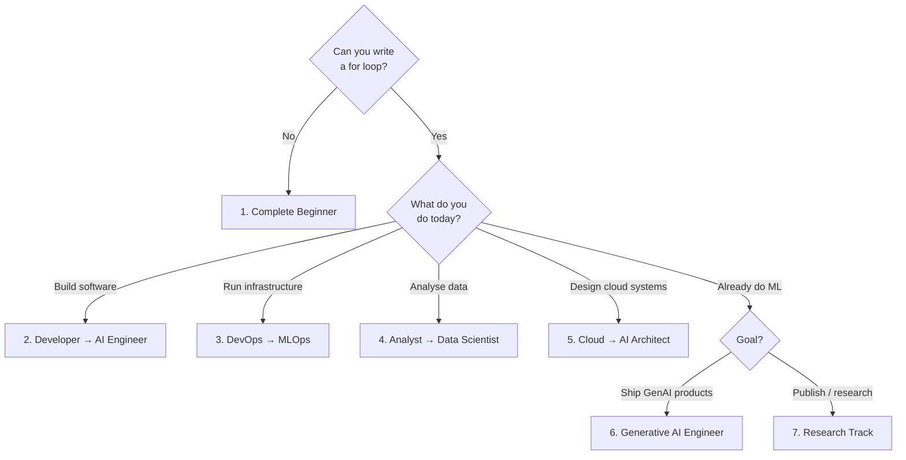

# 🧭 Learning Paths

Seven routes through the same material, each shaped by where you are starting from.
Pick one. Do not try to read the repository front to back.

Every path lists: prerequisites, ordered modules, a suggested weekly rhythm, projects,
milestones and how to assess yourself.

> **On timelines:** the weekly rhythms below are *suggestions for structuring study*, not promises.
> Nobody masters AI engineering in a fixed number of weeks, and any resource that tells you
> otherwise is selling something.

---

## 1. Complete Beginner

**For:** no programming, no mathematics beyond school, no cloud experience.

**Prerequisites:** a computer, an internet connection, and willingness to be confused for a while.

### Ordered modules
1. [00 Getting Started](00-getting-started/README.md)
2. [04 AI Foundations](04-ai-foundations/README.md)
3. [01 Python Foundations](01-python-foundations/README.md)
4. [02 Mathematics for AI](02-mathematics-for-ai/README.md) — sections 8.1–8.2 first, the rest later
5. [03 Data Foundations](03-data-foundations/README.md)
6. [05 Machine Learning](05-machine-learning/README.md)
7. [07 Model Evaluation](07-model-evaluation/README.md)
8. [06 Feature Engineering](06-feature-engineering/README.md)
9. [08 Deep Learning](08-deep-learning/README.md)
10. [14 Prompt Engineering](14-prompt-engineering/README.md)

### Suggested rhythm
| Block | Focus |
| --- | --- |
| Block 1 | Environment + terminal + Git working. Nothing else. |
| Block 2 | Python core: variables → functions → data structures |
| Block 3 | Python for data: NumPy + pandas + a plot |
| Block 4 | Mathematics: vectors, matrices, why they are everywhere |
| Block 5 | First model: house-price prediction, end to end |
| Block 6 | Evaluation: why your 99% accuracy was a lie |
| Block 7 | Two more beginner projects, unaided |
| Block 8 | First neural network |

### Projects
[House-price prediction](projects/beginner/) → [Iris classification](projects/beginner/) →
[Spam-email classifier](projects/beginner/) → [Movie sentiment analysis](projects/beginner/)

### Milestones
- [ ] I can create a virtual environment and install packages without following a guide
- [ ] I can load a CSV, clean it, and plot a column
- [ ] I trained a model and explained why its metric is or is not trustworthy
- [ ] I pushed a project to GitHub with a README someone else could follow

### Assessment
Take a dataset you have never seen. Without copying a tutorial: load it, split it correctly,
train two models, choose a metric, justify the choice in writing, and state one limitation.

---

## 2. Developer → AI Engineer

**For:** you already write software. You do not need "what is a for loop".

**Prerequisites:** comfortable in any programming language, Git, the command line.

### Ordered modules
1. [00 Getting Started](00-getting-started/README.md) — skim, but do read the environments section
2. [01 Python Foundations](01-python-foundations/README.md) — skip to the NumPy/pandas/scikit-learn sections
3. [02 Mathematics for AI](02-mathematics-for-ai/README.md) — linear algebra + calculus + probability
4. [05 Machine Learning](05-machine-learning/README.md) → [07 Model Evaluation](07-model-evaluation/README.md)
5. [08 Deep Learning](08-deep-learning/README.md) → [11 Transformers](11-transformers/README.md)
6. [12 Generative AI](12-generative-ai/README.md) → [13 LLMs](13-large-language-models/README.md)
7. [14 Prompt Engineering](14-prompt-engineering/README.md) → [15 Embeddings](15-embeddings-and-vector-search/README.md) → [16 RAG](16-rag/README.md)
8. [18 AI Agents](18-ai-agents/README.md)
9. [31 Model Deployment](31-model-deployment/README.md) → [30 LLMOps](30-llmops/README.md)
10. [28 AI Security](28-ai-security/README.md) → [36 AI Evaluation](36-ai-evaluation/README.md)

### Projects
[Semantic-search engine](projects/intermediate/) → [Customer-support RAG chatbot](projects/intermediate/) →
[Agentic research assistant](projects/advanced/) → [Secure enterprise AI gateway](projects/production/)

### Milestones
- [ ] I built a RAG pipeline in plain Python without a framework
- [ ] I can explain attention with a worked numerical example
- [ ] My agent has timeouts, retries, cost limits and an audit log
- [ ] I have an evaluation suite that fails the build when quality drops

### Assessment
Ship a RAG service with an evaluation suite, a threat model and a cost estimate per thousand queries.

---

## 3. DevOps Engineer → MLOps Engineer

**For:** you run infrastructure and pipelines. You want to own the model lifecycle.

**Prerequisites:** Docker, CI/CD, one cloud, basic Python.

### Ordered modules
1. [01 Python Foundations](01-python-foundations/README.md) — testing, packaging, logging sections
2. [03 Data Foundations](03-data-foundations/README.md) — versioning, lineage, quality
3. [05 Machine Learning](05-machine-learning/README.md) + [07 Model Evaluation](07-model-evaluation/README.md) — enough to talk to data scientists
4. [31 Model Deployment](31-model-deployment/README.md)
5. [29 MLOps](29-mlops/README.md)
6. [32 Model Optimization](32-model-optimization/README.md)
7. [30 LLMOps](30-llmops/README.md)
8. [35 Distributed Training & Infrastructure](35-distributed-training-and-infrastructure/README.md)
9. [33 Cloud AI Platforms](33-cloud-ai-platforms/README.md)
10. [28 AI Security](28-ai-security/README.md) + [26 Responsible AI](26-responsible-ai/README.md)
11. [34 AI System Design](34-ai-system-design/README.md)

### Projects
[Image-classification API](projects/intermediate/) → [AI observability platform](projects/advanced/) →
[End-to-end MLOps platform](projects/production/) → [GPU-based inference platform](projects/production/)

### Milestones
- [ ] A model retrains, registers and deploys from a merged pull request
- [ ] Drift detection fires an alert I can act on
- [ ] I can roll back a bad model in under five minutes
- [ ] I can attribute inference cost to a team or tenant

### Assessment
Design and build a pipeline where a data change triggers retraining, evaluation gating, canary
rollout and automatic rollback on metric regression.

---

## 4. Data Analyst → Data Scientist

**For:** you already work with data, SQL and dashboards. You want modelling and experimentation.

**Prerequisites:** SQL, spreadsheets, basic statistics intuition.

### Ordered modules
1. [01 Python Foundations](01-python-foundations/README.md) — pandas, NumPy, plotting
2. [02 Mathematics for AI](02-mathematics-for-ai/README.md) — probability + statistics first
3. [03 Data Foundations](03-data-foundations/README.md)
4. [05 Machine Learning](05-machine-learning/README.md)
5. [06 Feature Engineering](06-feature-engineering/README.md) → [07 Model Evaluation](07-model-evaluation/README.md)
6. [25 Causal AI](25-causal-ai/README.md) — the module that separates analysts from decision scientists
7. [27 Explainable AI](27-explainable-ai/README.md)
8. [20 Time Series](20-time-series/README.md)
9. [08 Deep Learning](08-deep-learning/README.md)
10. [26 Responsible AI](26-responsible-ai/README.md)

### Projects
[Customer-churn prediction](projects/beginner/) → [Sales forecasting](projects/beginner/) →
[Time-series anomaly detector](projects/intermediate/) → [Recommendation engine](projects/intermediate/)

### Milestones
- [ ] I designed an A/B test and computed the sample size before running it
- [ ] I can explain a model's prediction to a non-technical stakeholder using SHAP
- [ ] I identified a confounder that would have made a naive analysis wrong

### Assessment
Take a business question, decide whether it is predictive or causal, answer it, and write the
limitations section honestly.

---

## 5. Cloud Engineer → AI Solutions Architect

**For:** you design cloud systems. You need AI-specific architecture, cost and security judgement.

**Prerequisites:** one cloud platform in depth, networking, IAM, containers.

### Ordered modules
1. [04 AI Foundations](04-ai-foundations/README.md) + [05 Machine Learning](05-machine-learning/README.md) (conceptual depth)
2. [12 Generative AI](12-generative-ai/README.md) → [13 LLMs](13-large-language-models/README.md)
3. [15 Embeddings & Vector Search](15-embeddings-and-vector-search/README.md) → [16 RAG](16-rag/README.md)
4. [31 Model Deployment](31-model-deployment/README.md) → [33 Cloud AI Platforms](33-cloud-ai-platforms/README.md)
5. [28 AI Security](28-ai-security/README.md)
6. [30 LLMOps](30-llmops/README.md) + [36 AI Evaluation](36-ai-evaluation/README.md)
7. [34 AI System Design](34-ai-system-design/README.md) — the core of this path
8. [35 Distributed Training & Infrastructure](35-distributed-training-and-infrastructure/README.md)
9. [41 Case Studies](41-case-studies/README.md)
10. [26 Responsible AI](26-responsible-ai/README.md)

### Projects
[Multi-document enterprise RAG](projects/advanced/) → [Multi-tenant AI assistant](projects/production/) →
[Production RAG platform on Kubernetes](projects/production/)

### Milestones
- [ ] I can size a vector index and estimate its monthly infrastructure footprint
- [ ] I can draw a multi-tenant AI architecture with isolation boundaries marked
- [ ] I can name three failure modes of my design and their mitigations

### Assessment
Present a full AI system design: requirements, scale estimation, architecture diagram, security
model, evaluation plan, cost drivers and three trade-offs you deliberately accepted.

---

## 6. Generative AI Engineer

**For:** you know ML. You want to go deep on transformers, LLMs, RAG, fine-tuning and agents.

**Prerequisites:** Python, classical ML, comfort with PyTorch basics.

### Ordered modules
1. [11 Transformers](11-transformers/README.md) — do the numerical attention exercise by hand
2. [12 Generative AI](12-generative-ai/README.md) → [13 LLMs](13-large-language-models/README.md)
3. [14 Prompt Engineering](14-prompt-engineering/README.md)
4. [15 Embeddings & Vector Search](15-embeddings-and-vector-search/README.md) → [16 RAG](16-rag/README.md)
5. [17 Fine-Tuning](17-fine-tuning/README.md)
6. [18 AI Agents](18-ai-agents/README.md)
7. [23 Multimodal AI](23-multimodal-ai/README.md)
8. [36 AI Evaluation](36-ai-evaluation/README.md)
9. [32 Model Optimization](32-model-optimization/README.md)
10. [30 LLMOps](30-llmops/README.md) + [28 AI Security](28-ai-security/README.md)

### Projects
[Fine-tuned domain assistant](projects/advanced/) → [Graph RAG application](projects/advanced/) →
[Multimodal RAG](projects/advanced/) → [LLM evaluation and observability platform](projects/production/)

### Milestones
- [ ] I fine-tuned a small open model with LoRA and measured whether it beat prompting
- [ ] I can explain when RAG beats fine-tuning and vice versa, with evidence
- [ ] My RAG system reports faithfulness and citation correctness, not just "it looks good"

### Assessment
Take one use case. Solve it three ways — prompting, RAG, fine-tuning — measure all three on the
same evaluation set, and write up which won and why.

---

## 7. Research-Oriented Track

**For:** you want to read papers, reimplement architectures and run experiments.

**Prerequisites:** strong mathematics, solid Python, PyTorch.

### Ordered modules
1. [02 Mathematics for AI](02-mathematics-for-ai/README.md) — all of it, including optimisation
2. [08 Deep Learning](08-deep-learning/README.md) — implement backpropagation from scratch
3. [11 Transformers](11-transformers/README.md) — reimplement attention from the equations
4. [37 Research Paper Learning](37-research-paper-learning/README.md)
5. [19 Reinforcement Learning](19-reinforcement-learning/README.md)
6. [22 Graph ML](22-graph-machine-learning/README.md) + [25 Causal AI](25-causal-ai/README.md)
7. [17 Fine-Tuning](17-fine-tuning/README.md) → [35 Distributed Training](35-distributed-training-and-infrastructure/README.md)
8. [36 AI Evaluation](36-ai-evaluation/README.md) — experimental rigour
9. [26 Responsible AI](26-responsible-ai/README.md)

### Projects
Reimplement a paper from [`37-research-paper-learning/`](37-research-paper-learning/README.md),
then run an ablation study that tests one claim.

### Milestones
- [ ] I implemented a transformer block from the equations, not from a tutorial
- [ ] I reproduced a published result within a stated tolerance
- [ ] I designed an ablation that isolates a single variable

### Assessment
Write a short report: the claim you tested, your method, your results, your ablation, and where
your reproduction diverged from the original and why.

---

## Choosing between paths

---

[🏠 Repository Home](README.md) · [← Roadmap](ROADMAP.md) · [Project Catalog →](PROJECT_CATALOG.md)
