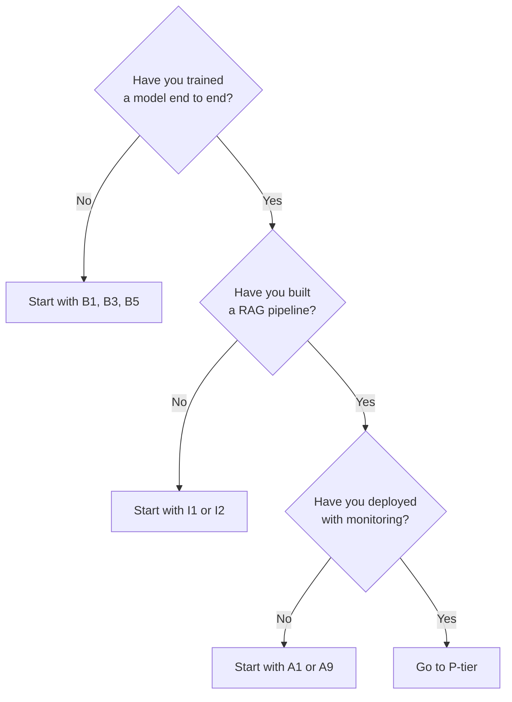

# 🛠️ Project Catalog

Forty projects across four difficulty tiers. Every project follows
[`templates/PROJECT_TEMPLATE.md`](templates/PROJECT_TEMPLATE.md), which means each one ships with a
problem statement, architecture, dataset, runnable code, tests, security notes, monitoring notes,
cost notes, troubleshooting, extension challenges and interview discussion points.

**Status legend:** ✅ built · 🚧 in progress · 📋 backlog

> Nothing in this catalogue is built yet — the first execution of this repository delivered the
> blueprint and the Getting Started module. See [`IMPLEMENTATION_TRACKER.md`](IMPLEMENTATION_TRACKER.md).

---

## 🟢 Beginner — [`projects/beginner/`](projects/beginner/)

Goal: complete an end-to-end ML workflow without a framework doing the thinking for you.

| # | Project | Teaches | Modules needed | Status |
| --- | --- | --- | --- | --- |
| B1 | House-price prediction | Regression, train/test split, RMSE | 01, 05, 07 | 📋 |
| B2 | Student-score prediction | Simple linear regression, correlation vs causation | 01, 02, 05 | 📋 |
| B3 | Spam-email classifier | Text features, TF-IDF, naive Bayes, precision/recall | 05, 07, 10 | 📋 |
| B4 | Customer-churn prediction | Class imbalance, business-cost-aware metrics | 05, 06, 07 | 📋 |
| B5 | Iris flower classification | The classic first classifier, decision boundaries | 01, 05 | 📋 |
| B6 | Movie sentiment analysis | Text preprocessing, bag of words, logistic regression | 10, 05 | 📋 |
| B7 | Simple image classifier | Image tensors, a small CNN, overfitting | 08, 09 | 📋 |
| B8 | Sales forecasting | Trend, seasonality, time-aware validation | 20, 07 | 📋 |
| B9 | Basic recommendation system | Popularity baseline, collaborative filtering | 21 | 📋 |
| B10 | FAQ chatbot | Embeddings, cosine similarity, threshold tuning | 14, 15 | 📋 |

---

## 🟡 Intermediate — [`projects/intermediate/`](projects/intermediate/)

Goal: build systems, not scripts. Everything here has an interface and a test suite.

| # | Project | Teaches | Modules needed | Status |
| --- | --- | --- | --- | --- |
| I1 | Document question-answering system | Chunking, retrieval, prompt augmentation, citations | 14, 15, 16 | 📋 |
| I2 | Semantic-search engine | Embeddings, ANN indexing, hybrid search, recall@k | 15 | 📋 |
| I3 | Image-classification API | Transfer learning, FastAPI, Docker, input validation | 09, 31 | 📋 |
| I4 | News-category classifier | Multi-class metrics, confusion matrix analysis | 10, 07 | 📋 |
| I5 | Customer-support RAG chatbot | Full RAG loop, source attribution, refusal behaviour | 16, 36 | 📋 |
| I6 | Resume-matching system | Semantic similarity, bias risk, fairness checks | 15, 26 | 📋 |
| I7 | Time-series anomaly detector | Seasonality, thresholds, alert fatigue | 20 | 📋 |
| I8 | Recommendation engine | Matrix factorisation, ranking metrics, cold start | 21, 07 | 📋 |
| I9 | Object-detection application | Bounding boxes, IoU, non-max suppression, latency | 09 | 📋 |
| I10 | Speech transcription application | Spectrograms, ASR, word error rate, streaming | 24 | 📋 |

---

## 🔴 Advanced — [`projects/advanced/`](projects/advanced/)

Goal: systems with multiple moving parts, real evaluation and real failure modes.

| # | Project | Teaches | Modules needed | Status |
| --- | --- | --- | --- | --- |
| A1 | Multi-document enterprise RAG | Multi-source ingestion, metadata filtering, permissions | 16, 28 | 📋 |
| A2 | Hybrid-search platform | BM25 + dense retrieval, reciprocal rank fusion, re-ranking | 15, 16 | 📋 |
| A3 | Fine-tuned domain assistant | LoRA/QLoRA, dataset curation, before/after evaluation | 17, 36 | 📋 |
| A4 | Multimodal RAG | Image + text retrieval, cross-modal embeddings | 23, 16 | 📋 |
| A5 | Agentic research assistant | Planning, tool calling, reflection, cost limits | 18 | 📋 |
| A6 | AI coding assistant | Code embeddings, repository context, sandboxed execution | 18, 28 | 📋 |
| A7 | Graph RAG application | Knowledge-graph construction, graph traversal retrieval | 22, 16 | 📋 |
| A8 | Real-time fraud-detection system | Streaming features, low-latency inference, drift | 29, 05 | 📋 |
| A9 | AI observability platform | Tracing, token accounting, quality dashboards | 30 | 📋 |
| A10 | Multi-agent workflow | Supervisor-worker, handoffs, deadlock prevention | 18 | 📋 |

---

## 🟣 Production — [`projects/production/`](projects/production/)

Goal: things you could defend in an architecture review. Infrastructure as code, monitoring,
security and cost are part of the deliverable, not an afterthought.

| # | Project | Teaches | Modules needed | Status |
| --- | --- | --- | --- | --- |
| P1 | Production RAG platform on Kubernetes | Helm, autoscaling, probes, rolling upgrades, reindexing | 16, 31, 34 | 📋 |
| P2 | End-to-end MLOps platform | Tracking, registry, CT pipeline, gated promotion | 29 | 📋 |
| P3 | Multi-tenant AI assistant | Tenant isolation, per-tenant quotas and cost attribution | 28, 34 | 📋 |
| P4 | Secure enterprise AI gateway | Authn/authz, rate limits, guardrails, audit logging | 28, 30 | 📋 |
| P5 | Scalable model-serving platform | Batching, warm pools, cold-start mitigation | 31, 32 | 📋 |
| P6 | LLM evaluation and observability platform | Golden sets, judges, regression gates, dashboards | 36, 30 | 📋 |
| P7 | AI incident-management copilot | Retrieval over runbooks, human-in-the-loop approvals | 18, 34 | 📋 |
| P8 | Model-routing and fallback service | Routing policy, circuit breaking, graceful degradation | 30, 13 | 📋 |
| P9 | GPU-based inference platform | GPU scheduling, fragmentation, utilisation, spot handling | 35, 32 | 📋 |
| P10 | Full AI application deployed through CI/CD | Tests, scans, IaC, staged rollout, rollback | 29, 31, 28 | 📋 |

---

## How to pick a project

**Rules that make projects worth doing:**
1. Write the README before the code. If you cannot state the problem, you do not have one.
2. Establish a baseline first — the dumbest thing that could work. Beat it or explain why you cannot.
3. Never report a metric without stating what it would take for that metric to be misleading.
4. Every project must run from a clean clone using its documented setup steps. Test that.

---

## Per-project required sections

Enforced by [`templates/PROJECT_TEMPLATE.md`](templates/PROJECT_TEMPLATE.md):

Problem statement · Learning objectives · Architecture (Mermaid) · Prerequisites · Dataset ·
Setup · Source code · Code comments · Step-by-step explanation · Testing · Security · Monitoring ·
Troubleshooting · Cost considerations · Local deployment · Docker deployment · Kubernetes
deployment (where relevant) · Cloud deployment (where relevant) · Extension challenges ·
Interview discussion points

---

[🏠 Repository Home](README.md) · [← Learning Paths](LEARNING_PATHS.md) · [Glossary →](GLOSSARY.md)
