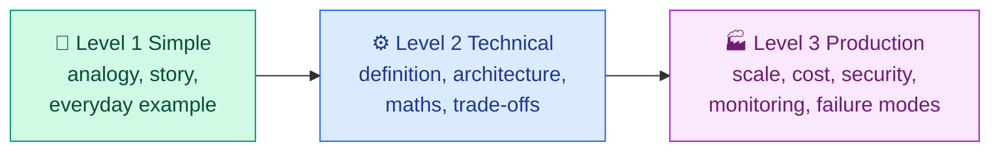
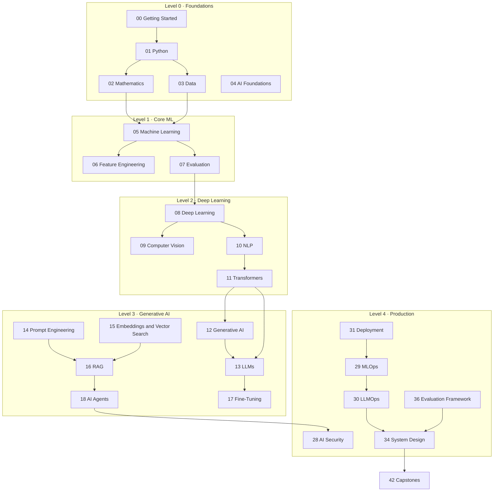

# 🧠 AI/ML Mastery

**A complete, beginner-to-production learning repository for Artificial Intelligence and Machine Learning.**

Start with "what is a variable", finish with "here is my multi-tenant RAG platform on Kubernetes, here is
how I evaluate it, and here is the threat model." Every concept is explained three times — as a story, as
engineering, and as a production system.

> **Repository status:** 🚧 Under active construction. Phase 1 (blueprint), **Getting Started**,
> **Python Foundations**, **Mathematics for AI**, **Data Foundations**, **AI Foundations** — the whole
> Level 0 foundation — plus **Machine Learning**, **Feature Engineering**, **Model Evaluation**, **Deep Learning** and the **Interview Preparation** question banks are complete. Everything else is a defined backlog entry —
> see [`IMPLEMENTATION_TRACKER.md`](IMPLEMENTATION_TRACKER.md) for exactly what exists today.
> We deliberately publish *no* shallow placeholder content.

---

## 🎯 Who this is for

| You are a… | Start here |
| --- | --- |
| Complete beginner (no coding, no maths) | [Complete Beginner path](LEARNING_PATHS.md#1-complete-beginner) |
| Software developer | [Developer → AI Engineer](LEARNING_PATHS.md#2-developer--ai-engineer) |
| DevOps / cloud / platform engineer | [DevOps → MLOps](LEARNING_PATHS.md#3-devops-engineer--mlops-engineer) |
| Data analyst | [Analyst → Data Scientist](LEARNING_PATHS.md#4-data-analyst--data-scientist) |
| Cloud engineer / architect | [Cloud → AI Solutions Architect](LEARNING_PATHS.md#5-cloud-engineer--ai-solutions-architect) |
| Already know ML, want GenAI | [Generative AI Engineer](LEARNING_PATHS.md#6-generative-ai-engineer) |
| Researcher / paper reader | [Research-Oriented track](LEARNING_PATHS.md#7-research-oriented-track) |
| Interview candidate | [`38-interview-preparation/`](38-interview-preparation/README.md) |
| Trainer / instructor | [`CONTRIBUTING.md`](CONTRIBUTING.md) + [`templates/`](templates/) |

---

## 🚀 Quick start

```bash
git clone https://github.com/<your-username>/ai-ml-mastery.git
cd ai-ml-mastery

# Create and activate an isolated environment (Linux/macOS/WSL)
python3 -m venv .venv
source .venv/bin/activate

# Windows PowerShell:  py -m venv .venv ;  .\.venv\Scripts\Activate.ps1

pip install -r requirements.txt
python scripts/verify_setup.py

# From module 08 onwards, also install PyTorch and torchvision (CPU build; on macOS omit --index-url):
# pip install -r requirements-dl.txt --index-url https://download.pytorch.org/whl/cpu
```

Do not run those commands blind — **[`00-getting-started/`](00-getting-started/README.md)** explains
what each one actually does, on Windows, macOS, Linux and WSL, and how to fix it when it breaks.

---

## 🧭 The teaching method

Every topic is explained at three levels, in this order:



**Level 1 — Simple.** A vector embedding is like turning the *meaning* of a sentence into a GPS
coordinate. Sentences that mean similar things get nearby coordinates.

**Level 2 — Technical.** An embedding is a learned mapping from a token sequence to a dense vector,
trained so that semantic similarity corresponds to a distance metric (usually cosine similarity).

**Level 3 — Production.** At fifty million documents your embedding dimension drives index memory;
an HNSW index buys high recall at low latency but costs meaningfully more RAM than the raw vectors,
and re-embedding after a model upgrade is a full reindex that needs a dual-write migration plan.

Abbreviations are expanded the first time they appear. Always.

---

## 🗺️ Curriculum map



Full ordering, dependencies and effort bands: **[`ROADMAP.md`](ROADMAP.md)**.

---

## 📚 All modules

### Level 0 — Foundations 🟢
| # | Module | What it covers |
| --- | --- | --- |
| 00 | **[Getting Started](00-getting-started/README.md)** ✅ | Terminal, Git, Python, environments, Jupyter, Colab, Docker, VS Code |
| 01 | **[Python Foundations](01-python-foundations/README.md)** ✅ | Language core → NumPy, pandas, Matplotlib, scikit-learn — *all 14 topics* |
| 02 | **[Mathematics for AI](02-mathematics-for-ai/README.md)** ✅ | Linear algebra, calculus, probability, statistics, optimisation — *all 9 topics* |
| 03 | **[Data Foundations](03-data-foundations/README.md)** ✅ | Data lifecycle, cleaning, splits, leakage, storage, pipelines — *all 9 topics* |
| 04 | **[AI Foundations](04-ai-foundations/README.md)** ✅ | What AI is, AI vs ML vs DL vs GenAI, narrow vs general, symbolic AI, search, history — *all 6 topics* |

### Level 1 — Core Machine Learning 🟡
| # | Module | What it covers |
| --- | --- | --- |
| 05 | **[Machine Learning](05-machine-learning/README.md)** ✅ | Regression, classification, trees, boosting, clustering, dimensionality reduction, anomalies, semi- and self-supervised — *all 10 topics* |
| 06 | **[Feature Engineering](06-feature-engineering/README.md)** ✅ | Pipelines, transformations, encoding, crosses and time features, text and image features, selection, leakage hunting — *all 7 topics* |
| 07 | **[Model Evaluation](07-model-evaluation/README.md)** ✅ | Cross-validation, hyperparameter search, bias-variance, baselines, regression, classification, probability and ranking metrics — *all 8 topics* |

### Level 2 — Deep Learning 🟡
| # | Module | What it covers |
| --- | --- | --- |
| 08 | **[Deep Learning](08-deep-learning/README.md)** ✅ | Neurons, autograd, training, normalisation, activations, CNNs, RNNs, VAEs, GANs, diffusion, GNNs (PyTorch) — *all 8 topics* |
| 09 | **[Computer Vision](09-computer-vision/README.md)** ✅ | Images as tensors, convolution and augmentation, detection and segmentation metrics, faces and OCR, LeNet to EfficientNet and U-Net, detectors, ViT, SAM, CLIP — *all 6 topics* |
| 10 | [Natural Language Processing](10-natural-language-processing/README.md) | Preprocessing, TF-IDF, word vectors, NLP tasks |
| 11 | [Transformers](11-transformers/README.md) | Attention from first principles, with worked numerical examples |

### Level 3 — Generative AI 🔴
| # | Module | What it covers |
| --- | --- | --- |
| 12 | [Generative AI](12-generative-ai/README.md) | Foundation models, VAEs, GANs, diffusion, flow-based |
| 13 | [Large Language Models](13-large-language-models/README.md) | Pretraining, alignment, MoE, quantisation, serving |
| 14 | [Prompt Engineering](14-prompt-engineering/README.md) | Anatomy, patterns, structured output, injection, prompt ops |
| 15 | [Embeddings & Vector Search](15-embeddings-and-vector-search/README.md) | Similarity, ANN indexes, vector databases |
| 16 | [RAG](16-rag/README.md) | Naive → advanced → agentic RAG, ingestion, evaluation |
| 17 | [Fine-Tuning](17-fine-tuning/README.md) | LoRA, QLoRA, SFT, DPO, memory and cost estimation |
| 18 | [AI Agents](18-ai-agents/README.md) | Tools, memory, planning, patterns, guardrails, evaluation |

### Level 3 — Specialised 🔴
| # | Module | What it covers |
| --- | --- | --- |
| 19 | [Reinforcement Learning](19-reinforcement-learning/README.md) | MDPs, Q-learning, policy gradients, PPO, link to RLHF |
| 20 | [Time Series](20-time-series/README.md) | Stationarity, ARIMA, Prophet, neural forecasting |
| 21 | [Recommender Systems](21-recommender-systems/README.md) | Collaborative filtering, ranking, cold start, feedback loops |
| 22 | [Graph Machine Learning](22-graph-machine-learning/README.md) | GNNs, GCN, GAT, knowledge graphs, link prediction |
| 23 | [Multimodal AI](23-multimodal-ai/README.md) | Vision-language models, cross-attention, multimodal RAG |
| 24 | [Speech & Audio AI](24-speech-and-audio-ai/README.md) | Spectrograms, ASR, TTS, streaming audio |
| 25 | [Causal AI](25-causal-ai/README.md) | Confounders, counterfactuals, uplift modelling |
| 26 | [Responsible AI](26-responsible-ai/README.md) | Bias, fairness metrics, model cards, governance |
| 27 | [Explainable AI](27-explainable-ai/README.md) | SHAP, LIME, Grad-CAM, and their limits |

### Level 4 — Production & Expert 🟣
| # | Module | What it covers |
| --- | --- | --- |
| 28 | [AI Security](28-ai-security/README.md) | Threat modelling, injection, poisoning, defensive checklist |
| 29 | [MLOps](29-mlops/README.md) | Tracking, registries, CI/CD/CT, drift, safe rollouts |
| 30 | [LLMOps](30-llmops/README.md) | Prompt ops, routing, tracing, cost, guardrails |
| 31 | [Model Deployment](31-model-deployment/README.md) | FastAPI, Docker, Kubernetes, serverless, batching |
| 32 | [Model Optimization](32-model-optimization/README.md) | Quantisation, distillation, ONNX, speculative decoding |
| 33 | [Cloud AI Platforms](33-cloud-ai-platforms/README.md) | AWS, Azure, Google Cloud — vendor-neutral first |
| 34 | [AI System Design](34-ai-system-design/README.md) | 14 full production architectures with trade-offs |
| 35 | [Distributed Training & Infrastructure](35-distributed-training-and-infrastructure/README.md) | GPUs, FSDP, ZeRO, NCCL, capacity planning |
| 36 | [AI Evaluation](36-ai-evaluation/README.md) | Golden sets, LLM-as-judge, safety, robustness, cost |

### Reference & practice
| # | Module | What it covers |
| --- | --- | --- |
| 37 | [Research Paper Learning](37-research-paper-learning/README.md) | How to read papers + guides to foundational works |
| 38 | **[Interview Preparation](38-interview-preparation/README.md)** ✅ | 126 questions in 7 banks: fundamentals, ML, transformers, GenAI/RAG, MLOps, 12 scenarios, 14 use cases |
| 39 | [Cheat Sheets](39-cheat-sheets/README.md) | One-page revision sheets |
| 40 | [Visual Learning](40-visual-learning/README.md) | Mermaid library + infographic prompts |
| 41 | [Case Studies](41-case-studies/README.md) | 12 industries, end-to-end designs |
| 42 | [Capstone Projects](42-capstone-projects/README.md) | Large integrative builds |

---

## 🛠️ Hands-on work

- **[`projects/`](projects/)** — 40 projects across [beginner](projects/beginner/), [intermediate](projects/intermediate/), [advanced](projects/advanced/) and [production](projects/production/). Catalogue: [`PROJECT_CATALOG.md`](PROJECT_CATALOG.md)
- **[`labs/`](labs/)** — short guided exercises
- **[`notebooks/`](notebooks/)** — runnable Jupyter notebooks
- **[`quizzes/`](quizzes/)** and **[`assignments/`](assignments/)** — questions with answers stored separately so you can attempt first

---

## 📖 Key documents

| Document | Purpose |
| --- | --- |
| [`ROADMAP.md`](ROADMAP.md) | Ordered curriculum, dependency map, skill matrix, progress checklist |
| [`LEARNING_PATHS.md`](LEARNING_PATHS.md) | Seven role-based routes through the material |
| [`PROJECT_CATALOG.md`](PROJECT_CATALOG.md) | All 40 projects with difficulty and prerequisites |
| [`GLOSSARY.md`](GLOSSARY.md) | Every term and abbreviation, expanded |
| [`INTERVIEW_GUIDE.md`](INTERVIEW_GUIDE.md) | Interview strategy across roles |
| [`RESOURCES.md`](RESOURCES.md) | Verified official documentation links |
| [`FAQ.md`](FAQ.md) | Common questions and blockers |
| [`CONTRIBUTING.md`](CONTRIBUTING.md) | How to add or fix content |
| [`CONTENT_CHECKLIST.md`](CONTENT_CHECKLIST.md) | Quality gate every module must pass |
| [`IMPLEMENTATION_TRACKER.md`](IMPLEMENTATION_TRACKER.md) | What is done, in progress and planned |
| [`SECURITY.md`](SECURITY.md) | Security policy and AI-specific security rules |
| [`CLAUDE.md`](CLAUDE.md) | Entry point for AI coding assistants — points at the two below |
| [`CLAUDE.md`](CLAUDE.md) | Working rules for AI assistants: structure, content, code, diagrams, references, security |
| [`memory.md`](memory.md) | Long-term repository decisions and current build status |

---

## 🏷️ Labels used throughout

**Difficulty:** 🟢 Beginner · 🟡 Intermediate · 🔴 Advanced · 🟣 Production

**Effort:** Quick concept · Short module · Detailed module · Multi-session project

We use effort bands rather than hour estimates. How long a module takes depends on your background,
and pretending otherwise would be dishonest.

**Section markers:** 🎯 Learning Objective · 🍰 Simple Explanation · 🏠 Real-Life Analogy ·
⚙️ How It Works · 📐 Mathematics · 🧪 Hands-On Lab · 💻 Code Example · 🌍 Real-World Use Case ·
⚠️ Common Mistake · 🔐 Security Note · 💰 Cost Note · 🎤 Interview Question · ✅ Key Takeaway ·
📚 Official References

---

## 🤝 Contributing

Contributions are welcome. Read [`CONTRIBUTING.md`](CONTRIBUTING.md) first — every module must pass
[`CONTENT_CHECKLIST.md`](CONTENT_CHECKLIST.md) before it is merged. We would rather have five
excellent modules than forty thin ones.

## ⚖️ License

Content and code are released under the [MIT License](LICENSE). Third-party datasets, papers and
documentation remain under their own licences — we link to them rather than copying them.

## ⚠️ Disclaimer

This repository is educational. Code examples are simplified for teaching and are **not** drop-in
production systems unless a file explicitly says so. Cloud service names and capabilities change;
always confirm against the vendor's current official documentation. Nothing here is legal advice.
