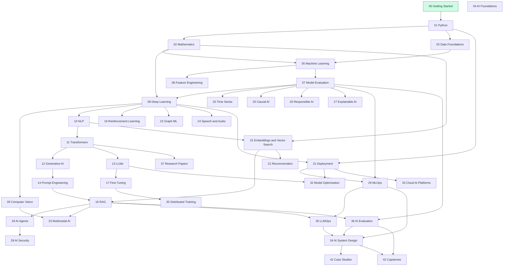

# 🗺️ Roadmap

The ordered curriculum, the dependency graph between modules, a skill matrix and a progress
checklist you can copy into your own fork.

**Related:** [`LEARNING_PATHS.md`](LEARNING_PATHS.md) (role-based routes) ·
[`IMPLEMENTATION_TRACKER.md`](IMPLEMENTATION_TRACKER.md) (what is built so far)

---

## 1. The four learning levels

| Level | Name | You start with | You end able to |
| --- | --- | --- | --- |
| **0** | AI Foundations 🟢 | A computer and curiosity | Run Python, read notation, describe what AI is |
| **1** | Beginner 🟢🟡 | Basic Python | Train, tune and evaluate classical ML models |
| **2** | Intermediate 🟡 | Working ML knowledge | Build deep learning, NLP, CV, GenAI and RAG systems |
| **3** | Advanced 🔴 | Working GenAI knowledge | Fine-tune, build agents, design scalable AI systems |
| **4** | Expert / Production 🟣 | Working AI engineering | Run AI platforms: GPUs, governance, security, cost, observability |

---

## 2. Module dependency map

Modules **04**, **38** (interviews), **39** (cheat sheets) and **40** (visual learning) have no
prerequisites — dip into them at any point.

---

## 3. Recommended order

### Phase A — Get running 🟢
1. [00 Getting Started](00-getting-started/README.md) ✅ *available now*
2. [04 AI Foundations](04-ai-foundations/README.md) — read this while your downloads finish
3. [01 Python Foundations](01-python-foundations/README.md)

### Phase B — Think in data and maths 🟢
4. [02 Mathematics for AI](02-mathematics-for-ai/README.md)
5. [03 Data Foundations](03-data-foundations/README.md)

### Phase C — Classical machine learning 🟡
6. [05 Machine Learning](05-machine-learning/README.md)
7. [07 Model Evaluation](07-model-evaluation/README.md)
8. [06 Feature Engineering](06-feature-engineering/README.md)
9. Build 3 [beginner projects](projects/beginner/)

### Phase D — Deep learning 🟡
10. [08 Deep Learning](08-deep-learning/README.md)
11. [09 Computer Vision](09-computer-vision/README.md) *and/or* [10 NLP](10-natural-language-processing/README.md)
12. [11 Transformers](11-transformers/README.md)

### Phase E — Generative AI 🔴
13. [12 Generative AI](12-generative-ai/README.md)
14. [13 Large Language Models](13-large-language-models/README.md)
15. [14 Prompt Engineering](14-prompt-engineering/README.md)
16. [15 Embeddings & Vector Search](15-embeddings-and-vector-search/README.md)
17. [16 RAG](16-rag/README.md)
18. [17 Fine-Tuning](17-fine-tuning/README.md)
19. [18 AI Agents](18-ai-agents/README.md)
20. Build 2 [intermediate projects](projects/intermediate/)

### Phase F — Production engineering 🟣
21. [31 Model Deployment](31-model-deployment/README.md)
22. [29 MLOps](29-mlops/README.md)
23. [30 LLMOps](30-llmops/README.md)
24. [36 AI Evaluation](36-ai-evaluation/README.md)
25. [28 AI Security](28-ai-security/README.md)
26. [26 Responsible AI](26-responsible-ai/README.md) + [27 Explainable AI](27-explainable-ai/README.md)
27. [32 Model Optimization](32-model-optimization/README.md) + [33 Cloud AI Platforms](33-cloud-ai-platforms/README.md)
28. [34 AI System Design](34-ai-system-design/README.md)
29. [35 Distributed Training](35-distributed-training-and-infrastructure/README.md)

### Phase G — Specialise and prove it 🔴🟣
30. Any of [19](19-reinforcement-learning/README.md), [20](20-time-series/README.md), [21](21-recommender-systems/README.md), [22](22-graph-machine-learning/README.md), [23](23-multimodal-ai/README.md), [24](24-speech-and-audio-ai/README.md), [25](25-causal-ai/README.md)
31. [37 Research Paper Learning](37-research-paper-learning/README.md)
32. [41 Case Studies](41-case-studies/README.md)
33. [42 Capstone Projects](42-capstone-projects/README.md)
34. [38 Interview Preparation](38-interview-preparation/README.md)

---

## 4. Skill matrix

What "competent" means at each level. Use it to decide where to start rather than reading from page one.

| Skill area | 🟢 Beginner | 🟡 Intermediate | 🔴 Advanced | 🟣 Production |
| --- | --- | --- | --- | --- |
| **Python** | Scripts, functions, pandas basics | Packages, tests, type hints | Async, profiling, performance | Library design, packaging, CI |
| **Mathematics** | Reads notation, does vector arithmetic | Derives gradients, applies statistics | Reads paper equations, proves properties | Estimates memory and compute from architecture |
| **Data** | Loads and cleans a CSV | Builds leakage-free pipelines | Designs schemas and feature stores | Runs versioned, monitored data platforms |
| **Modelling** | Trains scikit-learn models | Trains and debugs neural networks | Fine-tunes and adapts foundation models | Trains distributed across nodes |
| **Evaluation** | Reads accuracy and F1 | Chooses metrics by error cost | Designs golden sets and judge protocols | Runs online eval, A/B tests, regression suites |
| **GenAI** | Writes effective prompts | Builds a RAG pipeline | Builds agents with guardrails | Runs LLM platforms with routing and gateways |
| **Deployment** | Runs a script locally | Serves a FastAPI endpoint | Containerises and orchestrates | Autoscaling, GPU scheduling, disaster recovery |
| **Security** | Keeps secrets out of Git | Validates inputs and outputs | Threat-models an LLM application | Runs red teaming, isolation, audit and governance |
| **Cost** | Aware that inference costs money | Tracks tokens per request | Optimises via caching and model sizing | Runs per-tenant cost attribution and budgets |

---

## 5. Progress checklist

Copy this into your fork and tick as you go.

<b>Foundations</b>

- [ ] 00 Getting Started
- [ ] 01 Python Foundations
- [ ] 02 Mathematics for AI
- [ ] 03 Data Foundations
- [ ] 04 AI Foundations

<b>Core machine learning</b>

- [ ] 05 Machine Learning
- [ ] 06 Feature Engineering
- [ ] 07 Model Evaluation
- [ ] 3 beginner projects completed

<b>Deep learning</b>

- [ ] 08 Deep Learning
- [ ] 09 Computer Vision
- [ ] 10 Natural Language Processing
- [ ] 11 Transformers

<b>Generative AI</b>

- [ ] 12 Generative AI
- [ ] 13 Large Language Models
- [ ] 14 Prompt Engineering
- [ ] 15 Embeddings & Vector Search
- [ ] 16 RAG
- [ ] 17 Fine-Tuning
- [ ] 18 AI Agents
- [ ] 2 intermediate projects completed

<b>Production engineering</b>

- [ ] 28 AI Security
- [ ] 29 MLOps
- [ ] 30 LLMOps
- [ ] 31 Model Deployment
- [ ] 32 Model Optimization
- [ ] 33 Cloud AI Platforms
- [ ] 34 AI System Design
- [ ] 35 Distributed Training & Infrastructure
- [ ] 36 AI Evaluation
- [ ] 1 production project completed

<b>Specialised & reference</b>

- [ ] 19 Reinforcement Learning
- [ ] 20 Time Series
- [ ] 21 Recommender Systems
- [ ] 22 Graph Machine Learning
- [ ] 23 Multimodal AI
- [ ] 24 Speech & Audio AI
- [ ] 25 Causal AI
- [ ] 26 Responsible AI
- [ ] 27 Explainable AI
- [ ] 37 Research Paper Learning
- [ ] 41 Case Studies
- [ ] 42 Capstone Project

---

## 6. A note on pace

We give no week counts and no "master AI in 30 days" claims. A working professional studying evenings
will move through Phase A–C at a very different pace than a full-time student, and both are fine.
The only meaningful progress signal is: **can you build the project at the end of the phase without
copying it?**

---

[🏠 Repository Home](README.md) · [Learning Paths →](LEARNING_PATHS.md)
