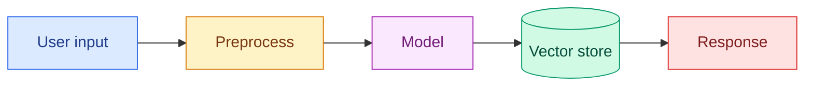
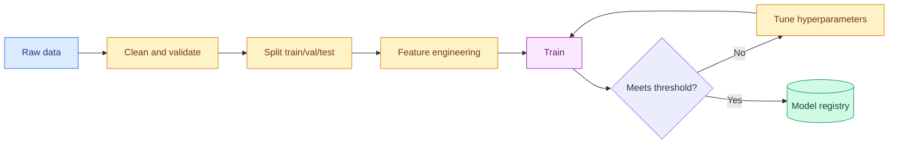
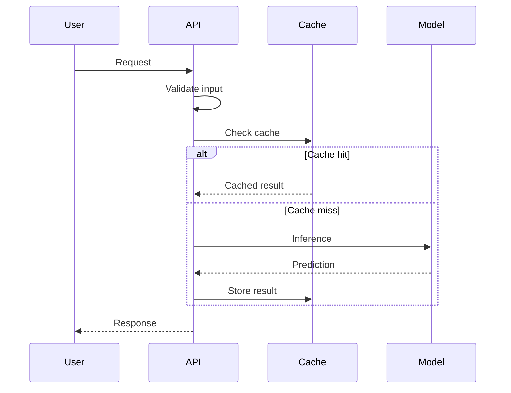
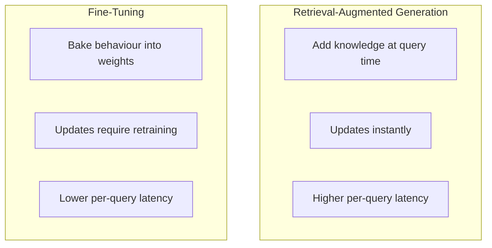
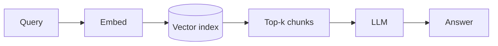
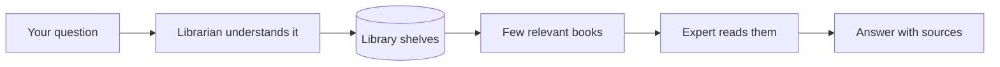

# Diagram Template & Standards

How diagrams are built in this repository, so that every one of them looks like it belongs to the
same book. **Mermaid is the default.** Do not use ASCII art where Mermaid explains it better.

---

## The four deliverables per major concept

For every major concept, produce:

1. **Technical Mermaid diagram** — the accurate structure
2. **Simple analogy diagram** — the same shape, everyday nouns
3. **Infographic-generation prompt** — stored in [`40-visual-learning/image-prompts/`](../40-visual-learning/image-prompts/)
4. **9:16 learning-card layout** — a vertical revision card suggestion

---

## Hard rules

- ✅ Must render on GitHub. Preview it. Do not assume.
- ✅ Short, readable labels.
- ✅ Consistent styling (palette below).
- ❌ No unsupported Mermaid syntax.
- ❌ **No unescaped `(` `)` `&` `"` `:` inside node labels** — the most common cause of a broken
  diagram. Write `M15[15 Embeddings and Vector Search]`, not `M15[15 Embeddings & Vector Search (ANN)]`.
  If you need punctuation, wrap the label in double quotes: `A["Query (user input)"]`.
- ❌ No diagram with more than ~15 nodes. Split it instead.
- ❌ No text so small or dense that it needs zooming.

---

## Standard palette

Consistency matters more than beauty. Use these five roles:

| Role | Fill | Stroke | Text | Used for |
| --- | --- | --- | --- | --- |
| Input / source | `#dbeafe` | `#2563eb` | `#1e3a8a` | user input, raw data |
| Processing | `#fef3c7` | `#d97706` | `#78350f` | transformation, computation |
| Model | `#fae8ff` | `#a21caf` | `#701a75` | any model or inference step |
| Storage | `#d1fae5` | `#059669` | `#064e3b` | databases, indexes, caches |
| Output / risk | `#fee2e2` | `#dc2626` | `#7f1d1d` | results, errors, danger points |



---

## Diagram type by purpose

| You want to show… | Use |
| --- | --- |
| A pipeline or process | `flowchart LR` |
| A hierarchy or dependency | `flowchart TD` |
| Interaction over time between components | `sequenceDiagram` |
| Lifecycle with modes | `stateDiagram-v2` |
| A concept's branches | `mindmap` |
| Two options compared | side-by-side `subgraph` blocks |
| A schedule or phased plan | `gantt` |
| Data relationships | `erDiagram` |

---

## Reference patterns

### Training pipeline



### Inference pipeline



### Comparison



### Analogy diagram (paired with a technical one)

Technical:


Analogy:


---

## Image-prompt template

Save as `40-visual-learning/image-prompts/{concept}.md`:

```markdown
# Image prompt — {Concept}

**Purpose:** {what the picture must teach}
**Audience:** 🟢 beginner
**Aspect ratio:** 16:9 (documentation) / 9:16 (learning card)

## Prompt

A friendly, modern, flat-illustration diagram explaining {concept}.
Style: clean vector, high contrast, generous whitespace, rounded shapes,
soft shadows, educational infographic aesthetic, minimal text.
Palette: blue #2563eb, amber #d97706, purple #a21caf, green #059669 on a light background.
Show: {element 1} on the left flowing to {element 2} in the centre and {element 3} on the right,
connected by clear arrows. Label each element with two or three words maximum.
No photorealism. No clutter. No small print. No fake logos or brand marks.

## Text overlay (keep it this short)
- Title: {4 words max}
- Labels: {2-3 words each}

## Accuracy checks before use
- [ ] Arrows point the correct way
- [ ] No invented or misleading component appears
- [ ] Any text in the image is spelled correctly
- [ ] Nothing implies endorsement by a real company
```

## 9:16 learning-card layout

```
┌─────────────────┐
│  🧠 CONCEPT     │  ← title, 4 words max
├─────────────────┤
│                 │
│    [diagram]    │  ← the analogy version, not the technical one
│                 │
├─────────────────┤
│ 🍰 In one line: │
│ {plain-English  │
│  sentence}      │
├─────────────────┤
│ ⚠️ Gotcha:      │
│ {one mistake}   │
├─────────────────┤
│ ai-ml-mastery   │
└─────────────────┘
```

---

## Pre-commit checklist

- [ ] Renders on GitHub (previewed, not assumed)
- [ ] No unescaped special characters in labels
- [ ] Uses the standard palette
- [ ] Fewer than ~15 nodes
- [ ] Arrows point the right way
- [ ] Labels are short and correct
- [ ] Major concepts also have an analogy diagram and an image prompt
- [ ] Source `.mmd` saved to [`diagrams/`](../diagrams/) if reused across files

---

[🏠 Repository Home](../README.md) · [Visual Learning module →](../40-visual-learning/README.md)
