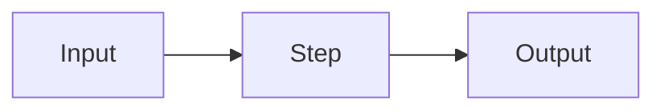
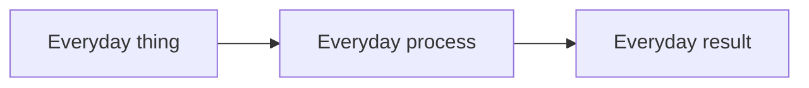

<!-- Copy this file to NN-module-name/topic-name.md and fill it in.
     Delete every section that does not add value for this topic.
     Forcing irrelevant sections in is worse than leaving them out. -->

# {Topic Name}

**Level:** 🟢 Beginner | 🟡 Intermediate | 🔴 Advanced | 🟣 Production
&nbsp;|&nbsp; **Effort:** Quick concept | Short module | Detailed module | Multi-session project
&nbsp;|&nbsp; **Module:** [NN Module Name](README.md)

---

## 🎯 Learning Objectives

By the end of this topic you will be able to:

- {Verb the learner can demonstrate — "compute", "explain", "choose", "build". Not "understand".}
- {…}
- {…}

## 📚 Prerequisites

- [{Prerequisite topic}](../NN-module/topic.md)
- {Any tooling or account needed}

---

## 1. What is it?

{One or two sentences. No jargon. If you cannot say it plainly, you do not understand it yet.}

## 2. Why do we need it?

{The problem that existed before this idea. What was painful. What this fixes.}

## 🏠 3. Simple analogy

> {The analogy. Concrete, everyday, memorable.
>  Good: "A vector embedding is like turning the meaning of a sentence into a GPS coordinate —
>  similar ideas get nearby coordinates."
>  Bad: "It's like a mathematical representation." That is not an analogy, that is a definition.}

**Where the analogy breaks down:** {every analogy leaks — say where, so learners do not
over-generalise it}

## 🍰 4. Fun explanation

{Optional. A short story, a worked absurd example, a "what if" scenario. Use it when the topic is
dry and needs a hook. Skip it when it would be padding.}

## ⚙️ 5. Technical definition

{The formal definition. Expand every abbreviation on first use — this file is an entry point,
a reader may have arrived here from a search engine.}

## 6. How it works

{Step by step. Numbered. Each step should be checkable.}

1. {…}
2. {…}
3. {…}

## 🖼️ 7. Architecture diagram



<!-- Validate that this renders on GitHub before committing.
     Keep node labels short. Avoid unescaped parentheses, quotes and ampersands inside labels. -->

**Analogy diagram** (for major concepts, add a second, simpler diagram):



## 📐 8. Mathematical intuition

**The formula:**

$$
{formula}
$$

**Breaking it down:**

| Symbol | Means | Why it is there |
| --- | --- | --- |
| $x$ | {…} | {…} |
| $\theta$ | {…} | {…} |

**In words:** {read the formula out loud, in English}

**In NumPy:**

```python
import numpy as np

# {what this computes and why}
```

## 9. Step-by-step worked example

{Small numbers. Show every intermediate value. This is where understanding actually lands —
do not skip arithmetic because it is "obvious".}

## 🌍 10. Real-world example

{A specific, named scenario. "A retailer with 2 million SKUs…" not "a company".}

## 11. Industry use cases

- **{Industry}:** {how it is used}
- **{Industry}:** {how it is used}

## 💻 12. Code example

**Dependencies:**

```
numpy==2.1.3
scikit-learn==1.5.2
```

```python
"""{One-line description of what this script demonstrates.}"""

import numpy as np

RANDOM_SEED = 42  # fixed so your output matches the expected output below


def example(values: np.ndarray) -> np.ndarray:
    """{What it does.}

    Args:
        values: {…}

    Returns:
        {…}

    Raises:
        ValueError: {when}
    """
    if values.size == 0:
        raise ValueError("values must not be empty")
    return values


if __name__ == "__main__":
    rng = np.random.default_rng(RANDOM_SEED)
    print(example(rng.normal(size=3)))
```

**Expected output:**

```
[ 0.30471708 -1.03998411  0.7504512 ]
```

<!-- Run the code. Paste the REAL output. Never write "output will look something like…" -->

## 🧪 13. Hands-on exercise

**Task:** {…}

**Starter code:** [`labs/nn-topic-name.py`](../labs/)

**Success criteria:** {how the learner knows they got it right}

<details>
<summary>💡 Hint</summary>

{…}
</details>

## ✅ 14. Advantages

- {…}

## ⚠️ 15. Limitations

- {…}

## ⚖️ 16. Trade-offs

| Choice | You gain | You lose |
| --- | --- | --- |
| {…} | {…} | {…} |

## ⚠️ 17. Common mistakes

| Mistake | Why it happens | Fix |
| --- | --- | --- |
| {…} | {…} | {…} |

## 🔧 18. Troubleshooting

<details>
<summary><b>{Error message or symptom}</b></summary>

**Cause:** {…}

**Fix:**
```bash
{command}
```
</details>

## 🔐 19. Security considerations

{Only where relevant — but it is relevant more often than people assume. Anything touching user
input, retrieved documents, tool calls, model files or deployment needs this section.}

## ⚡ 20. Performance considerations

{Latency, throughput, memory. Where the bottleneck actually is.}

## 💰 21. Cost considerations

{What drives cost. **No pricing figures** — link to the vendor's calculator. Costs change; the
drivers do not.}

## 🎤 22. Interview questions

<details>
<summary><b>Q1: {question}</b></summary>

{A full explanation, not a one-liner. Show the reasoning an interviewer wants to hear, including
the trade-off you would name.}
</details>

<details>
<summary><b>Q2: {question}</b></summary>

{…}
</details>

## 📝 23. Quiz

1. {…}
2. {…}

<details>
<summary>Answers</summary>

1. {answer with reasoning}
2. {answer with reasoning}
</details>

## 📋 24. Assignment

{A larger task. Should take real effort and produce something the learner keeps.}

## ✅ 25. Key takeaways

- {…}
- {…}
- {…}

## 🔗 26. Related topics

- [{Topic}](../NN-module/topic.md) — {why it relates}

## 📚 27. Official references

- [{Page Title} — {Organisation}]({url}) — verified {YYYY-MM-DD}
- [{Page Title} — {Organisation}]({url}) — verified {YYYY-MM-DD}

<!-- Open every link before committing. Never invent a URL.
     Flag volatile sources: "cloud service pages change frequently — reconfirm before relying on this" -->

## 📖 28. Additional learning resources

- [{Title}]({url}) — *community resource*, verified {YYYY-MM-DD}

---

## Navigation

[← {Previous Topic}](previous-topic.md) &nbsp;|&nbsp; [🏠 Module Home](README.md)
&nbsp;|&nbsp; [{Next Topic} →](next-topic.md)
