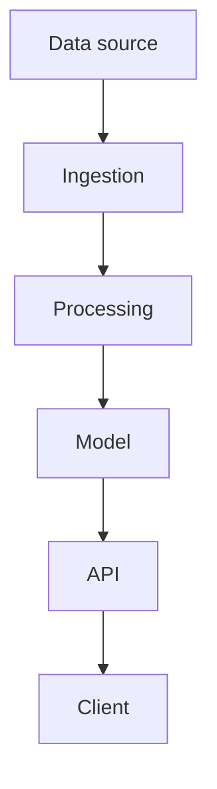

<!-- Copy to projects/{tier}/project-name/README.md and fill in.
     Unlike the module template, most of these sections are mandatory —
     a project without testing, security and cost sections is a script, not a project. -->

# {Project Name}

**Tier:** 🟢 Beginner | 🟡 Intermediate | 🔴 Advanced | 🟣 Production
&nbsp;|&nbsp; **Effort:** Short module | Detailed module | Multi-session project

> ⚠️ **Teaching example.** {Delete this line only if the project genuinely is production-grade.
> Otherwise state clearly what has been simplified — e.g. "authentication is stubbed", "the index
> is in-memory", "no rate limiting". Never let a learner mistake a teaching example for a
> production architecture.}

---

## 1. Problem statement

{What real problem does this solve, for whom? Two or three sentences. Written as if the reader is
a stakeholder, not an engineer.}

## 🎯 2. Learning objectives

By completing this project you will be able to:

- {…}
- {…}
- {…}

## 3. Architecture



**Component decisions:**

| Component | Choice | Why | What we rejected and why |
| --- | --- | --- | --- |
| {…} | {…} | {…} | {…} |

## 4. Prerequisites

**Modules:** [NN Module](../../NN-module/README.md), [NN Module](../../NN-module/README.md)

**Tools:** Python 3.10+, {…}

**Accounts/keys:** {…} — see [`.env.example`](../../.env.example). Never commit real values.

**Hardware:** {CPU-only / 8 GB RAM / GPU required — be explicit, and prefer CPU-only where possible}

## 5. Dataset

| Field | Value |
| --- | --- |
| Source | [{name}]({url}) |
| Licence | {…} |
| Size | {…} |
| Rows / files | {…} |
| Obtained by | `python scripts/download_data.py` |

{If the dataset contains personal data, say so and explain the handling requirements.
If it is synthetic, say so.}

## 6. Setup

```bash
cd projects/{tier}/{project-name}

python3 -m venv .venv
source .venv/bin/activate          # Windows: .\.venv\Scripts\Activate.ps1

pip install -r requirements.txt
cp ../../../.env.example .env      # then fill in your own values
python scripts/download_data.py
```

## 7. Source code

```
{project-name}/
├── README.md
├── requirements.txt
├── src/
│   ├── __init__.py
│   ├── data.py           # loading and validation
│   ├── features.py       # transformations
│   ├── model.py          # training and inference
│   └── api.py            # serving
├── tests/
│   └── test_*.py
├── scripts/
│   └── download_data.py
├── configs/
│   └── config.yaml
└── Dockerfile
```

## 8. Step-by-step explanation

### Step 1 — {name}

{What happens and why. Reference the code.}

```python
# src/data.py
```

**Expected output:**
```
{real output}
```

### Step 2 — {name}

{…}

## 9. Running it

```bash
python -m src.train        # train
python -m src.api          # serve on http://localhost:8000
```

**Expected output:**
```
{real output}
```

## 10. Testing

```bash
pytest -q
```

**Expected output:**
```
{real output}
```

**What is covered:** {…}
**What is deliberately not covered:** {…}

## 🔐 11. Security

- [ ] Secrets read from environment variables, never hardcoded
- [ ] All user input validated before use
- [ ] Model outputs treated as untrusted (never `eval`'d, never rendered as raw HTML)
- [ ] Model files loaded from trusted sources only; no `pickle.load` on untrusted input
- [ ] Dependencies pinned and scanned
- [ ] {Project-specific: prompt injection, retrieval poisoning, tool permissions, tenant isolation}

**Threat model summary:** {who could attack this, how, and what stops them}

## 📈 12. Monitoring

| Signal | Why it matters | Alert when |
| --- | --- | --- |
| {…} | {…} | {…} |

## 🔧 13. Troubleshooting

<details>
<summary><b>{Symptom}</b></summary>

**Cause:** {…}
**Fix:** {…}
</details>

## 💰 14. Cost considerations

**What drives cost here:** {…}

**How to reduce it:** {…}

{No pricing figures. Link to the relevant vendor calculator.}

## 15. Deployment

### Local
```bash
python -m src.api
```

### Docker
```bash
docker build -t {project-name} .
docker run --env-file .env -p 8000:8000 {project-name}
```

### Kubernetes
{Include for 🔴 and 🟣 tiers. Manifests in `kubernetes/`.}

### Cloud
{Include for 🟣 tier. Vendor-neutral description first, then per-cloud notes.
Confirm service names against current official documentation and record the verification date.}

## 16. Extension challenges

1. **{Easier}** — {…}
2. **{Harder}** — {…}
3. **{Hardest}** — {…}

## 🎤 17. Interview discussion points

<details>
<summary><b>"Walk me through this architecture."</b></summary>

{The answer you would want to give, including the trade-offs you deliberately accepted.}
</details>

<details>
<summary><b>"What would break first at 100× scale?"</b></summary>

{…}
</details>

<details>
<summary><b>"How do you know it works?"</b></summary>

{Your evaluation approach, your metric, and what would make that metric misleading.}
</details>

## ✅ 18. Key takeaways

- {…}

## 📚 19. References

- [{Page Title} — {Organisation}]({url}) — verified {YYYY-MM-DD}

---

[🏠 Project Catalog](../../PROJECT_CATALOG.md) · [Repository Home](../../README.md)
